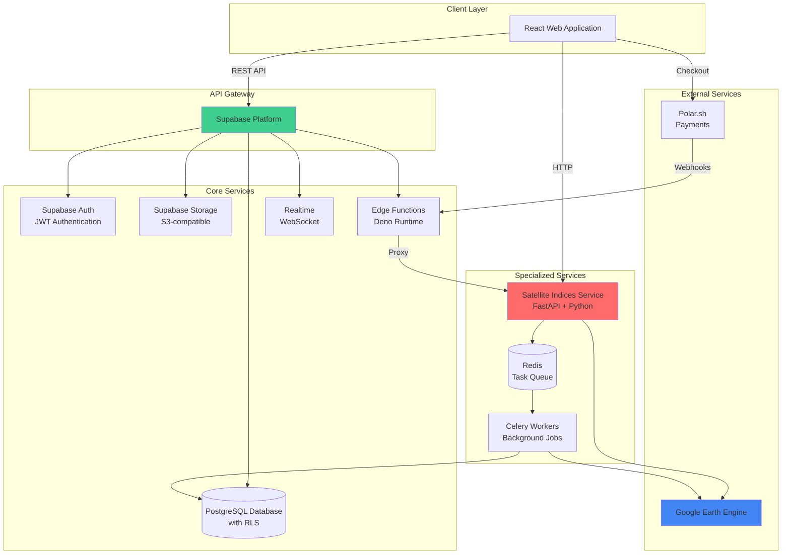
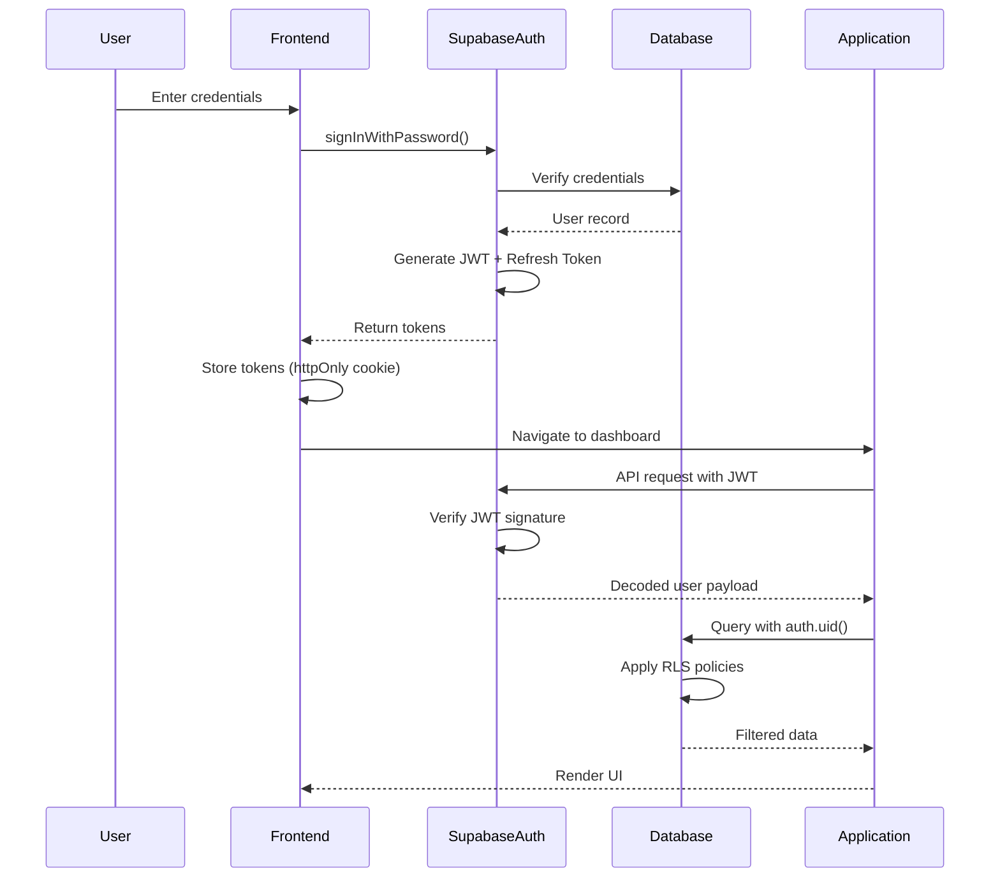
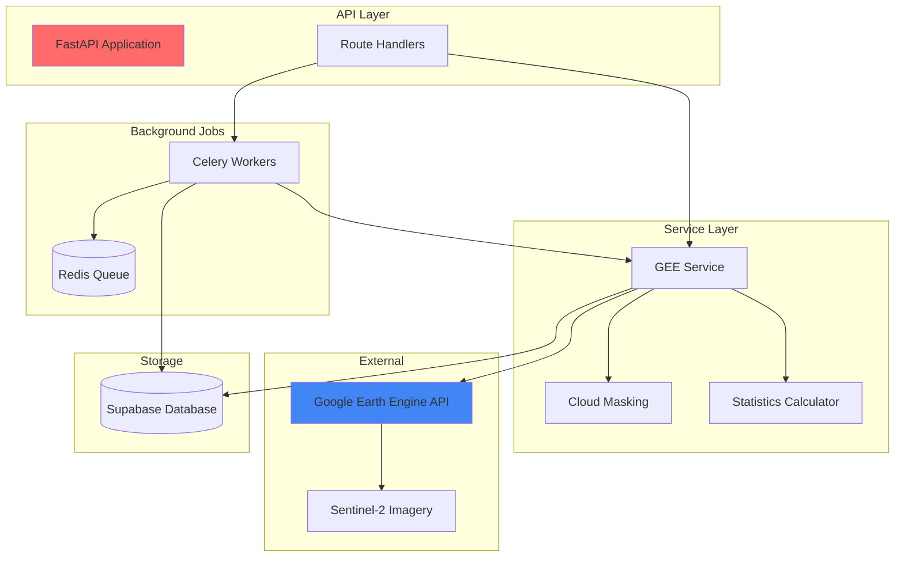

# Backend Architecture

The AgriTech Platform backend is composed of multiple services, each handling specific concerns. This document details the architecture of Supabase (primary backend), the FastAPI satellite service, and their integration patterns.

## Backend Services Overview



## Supabase Backend

Supabase serves as the primary backend, providing database, authentication, storage, and serverless functions.

### Architecture Components

#### 1. PostgreSQL Database

**Connection Management:**
- Connection pooling via PgBouncer
- Max connections: 500 (configurable)
- Idle timeout: 10 minutes
- Prepared statements for query optimization

**Database Structure:**
```
Database: agritech_production
├── public schema (main application data)
│   ├── Tables (users, organizations, farms, parcels, etc.)
│   ├── Views (aggregated data, reports)
│   ├── Functions (RPC endpoints)
│   └── Triggers (auto-updates, validations)
├── auth schema (managed by Supabase Auth)
└── storage schema (managed by Supabase Storage)
```

**Key Features:**
- Row Level Security (RLS) for tenant isolation
- Database functions for complex operations
- Triggers for automatic data updates
- Indexes for query optimization
- Full-text search capabilities

#### 2. Authentication Service

**Location:** Managed by Supabase Auth

**Authentication Flow:**



**JWT Token Structure:**
```json
{
  "sub": "user-uuid",
  "email": "user@example.com",
  "role": "authenticated",
  "app_metadata": {},
  "user_metadata": {
    "full_name": "John Doe"
  },
  "iat": 1609459200,
  "exp": 1609462800
}
```

**Token Management:**
- Access token expires after 1 hour
- Refresh token expires after 7 days
- Automatic token refresh handled by Supabase client
- Tokens stored in httpOnly cookies for security

**Authentication Methods:**
- Email + Password (primary)
- Magic Link (email-based)
- OAuth (Google, GitHub - configurable)
- Phone + OTP (optional)

#### 3. Storage Service

**Buckets:**

| Bucket | Public | Use Case | Max Size |
|--------|--------|----------|----------|
| `invoices` | No | Purchase invoices and receipts | 10 MB/file |
| `documents` | No | General document storage | 50 MB/file |
| `satellite-exports` | No | GeoTIFF exports | 100 MB/file |
| `avatars` | Yes | User profile pictures | 5 MB/file |

**Storage Access Pattern:**
```typescript
// Upload file
const { data, error } = await supabase.storage
  .from('invoices')
  .upload(`${organizationId}/${Date.now()}-invoice.pdf`, file);

// Get signed URL (temporary access)
const { data: signedUrl } = await supabase.storage
  .from('satellite-exports')
  .createSignedUrl(`${parcelId}/ndvi-2024-01-01.tif`, 3600); // 1 hour

// Download file
const { data, error } = await supabase.storage
  .from('documents')
  .download(`${organizationId}/report.pdf`);
```

**Security:**
- RLS policies applied to storage buckets
- Files organized by organization ID
- Signed URLs for temporary access
- Automatic cleanup of expired files (planned)

#### 4. Edge Functions

**Location:** `/Users/boutchaz/Documents/CodeLovers/agritech/supabase/functions/`

Edge functions provide serverless compute for server-side logic.

**Key Functions:**

##### generate-index-image
Proxies satellite service requests with JWT authentication.

```typescript
// supabase/functions/generate-index-image/index.ts
import { serve } from 'https://deno.land/std@0.168.0/http/server.ts';
import { createClient } from 'https://esm.sh/@supabase/supabase-js@2';

serve(async (req) => {
  // Verify JWT
  const authHeader = req.headers.get('Authorization');
  const supabaseClient = createClient(
    Deno.env.get('SUPABASE_URL')!,
    Deno.env.get('SUPABASE_ANON_KEY')!,
    { global: { headers: { Authorization: authHeader! } } }
  );

  const { data: { user } } = await supabaseClient.auth.getUser();
  if (!user) {
    return new Response('Unauthorized', { status: 401 });
  }

  // Forward request to satellite service
  const body = await req.json();
  const response = await fetch(`${SATELLITE_SERVICE_URL}/api/indices/calculate`, {
    method: 'POST',
    headers: { 'Content-Type': 'application/json' },
    body: JSON.stringify({ ...body, userId: user.id }),
  });

  return response;
});
```

**Deployment:**
```bash
# Deploy edge function
supabase functions deploy generate-index-image

# View logs
supabase functions logs generate-index-image
```

#### 5. Realtime Subscriptions

**Use Cases:**
- Live task updates
- Real-time notifications
- Collaborative editing (future)

**Subscription Pattern:**
```typescript
// Subscribe to task updates
const subscription = supabase
  .channel('tasks-channel')
  .on(
    'postgres_changes',
    {
      event: 'UPDATE',
      schema: 'public',
      table: 'tasks',
      filter: `farm_id=eq.${currentFarm.id}`,
    },
    (payload) => {
      console.log('Task updated:', payload.new);
      // Update UI
    }
  )
  .subscribe();

// Cleanup
subscription.unsubscribe();
```

### Supabase API Patterns

#### Client Configuration

**Location:** `/Users/boutchaz/Documents/CodeLovers/agritech/project/src/lib/supabase.ts`

```typescript
import { createClient } from '@supabase/supabase-js';
import type { Database } from '@/types/database.types';

export const supabase = createClient<Database>(
  import.meta.env.VITE_SUPABASE_URL,
  import.meta.env.VITE_SUPABASE_ANON_KEY,
  {
    auth: {
      persistSession: true,
      autoRefreshToken: true,
      detectSessionInUrl: true,
    },
  }
);
```

#### CRUD Operations

**Create:**
```typescript
const { data, error } = await supabase
  .from('farms')
  .insert({
    organization_id: currentOrganization.id,
    name: 'New Farm',
    location: 'California',
  })
  .select()
  .single();
```

**Read:**
```typescript
// Simple query
const { data, error } = await supabase
  .from('farms')
  .select('*')
  .eq('organization_id', organizationId);

// Join with related tables
const { data, error } = await supabase
  .from('parcels')
  .select(`
    *,
    farm:farms(id, name),
    tasks:tasks(count)
  `)
  .eq('farm_id', farmId);

// Pagination
const { data, error } = await supabase
  .from('workers')
  .select('*')
  .range(0, 9) // First 10 records
  .order('created_at', { ascending: false });
```

**Update:**
```typescript
const { data, error } = await supabase
  .from('tasks')
  .update({ status: 'completed' })
  .eq('id', taskId)
  .select();
```

**Delete:**
```typescript
const { error } = await supabase
  .from('parcels')
  .delete()
  .eq('id', parcelId);
```

#### RPC (Remote Procedure Call)

Call database functions for complex operations:

```typescript
// Call RPC function
const { data, error } = await supabase.rpc('get_user_organizations', {
  user_id_param: user.id,
});

// Function definition (in migration):
CREATE OR REPLACE FUNCTION get_user_organizations(user_id_param UUID)
RETURNS TABLE (
  id UUID,
  name TEXT,
  role TEXT
) AS $$
BEGIN
  RETURN QUERY
  SELECT o.id, o.name, ou.role
  FROM organizations o
  INNER JOIN organization_users ou ON o.id = ou.organization_id
  WHERE ou.user_id = user_id_param;
END;
$$ LANGUAGE plpgsql SECURITY DEFINER;
```

## Satellite Indices Service

The satellite service is a FastAPI application that integrates with Google Earth Engine for vegetation analysis.

**Location:** `/Users/boutchaz/Documents/CodeLovers/agritech/satellite-indices-service/`

### Service Architecture



### API Endpoints

**Base URL:** `http://localhost:8001` (development)

#### 1. Available Dates
Get cloud-free satellite image dates for an AOI.

```http
POST /api/indices/available-dates
Content-Type: application/json

{
  "geometry": {
    "type": "Polygon",
    "coordinates": [[[lon, lat], [lon, lat], ...]]
  },
  "start_date": "2024-01-01",
  "end_date": "2024-12-31",
  "cloud_coverage_threshold": 20
}
```

**Response:**
```json
{
  "dates": [
    "2024-01-15",
    "2024-02-10",
    "2024-03-05"
  ],
  "count": 3
}
```

#### 2. Calculate Indices
Calculate vegetation indices for a specific date and AOI.

```http
POST /api/indices/calculate
Content-Type: application/json

{
  "parcel_id": "uuid",
  "geometry": { "type": "Polygon", "coordinates": [...] },
  "date": "2024-01-15",
  "indices": ["NDVI", "NDRE", "NDMI"],
  "use_aoi_cloud_filter": true,
  "cloud_buffer_meters": 300
}
```

**Response:**
```json
{
  "parcel_id": "uuid",
  "date": "2024-01-15",
  "indices": {
    "NDVI": {
      "mean": 0.65,
      "min": 0.20,
      "max": 0.85,
      "std": 0.12,
      "percentiles": {
        "p25": 0.58,
        "p50": 0.65,
        "p75": 0.72
      }
    },
    "NDRE": { "mean": 0.42, ... },
    "NDMI": { "mean": 0.28, ... }
  },
  "cloud_coverage": 5.2,
  "area_hectares": 12.5
}
```

#### 3. Heatmap Data
Get heatmap visualization data for ECharts.

```http
POST /api/indices/heatmap
Content-Type: application/json

{
  "parcel_id": "uuid",
  "geometry": { "type": "Polygon", "coordinates": [...] },
  "date": "2024-01-15",
  "index": "NDVI",
  "resolution": 10
}
```

**Response:**
```json
{
  "data": [
    [lon, lat, value],
    [lon, lat, value],
    ...
  ],
  "bounds": {
    "min": 0.20,
    "max": 0.85
  },
  "resolution": 10
}
```

#### 4. Export GeoTIFF
Export vegetation index as GeoTIFF file.

```http
POST /api/indices/export
Content-Type: application/json

{
  "parcel_id": "uuid",
  "geometry": { "type": "Polygon", "coordinates": [...] },
  "date": "2024-01-15",
  "index": "NDVI"
}
```

**Response:**
```json
{
  "url": "https://storage.supabase.co/.../ndvi-2024-01-15.tif",
  "size_bytes": 2547896,
  "expires_at": "2024-01-16T12:00:00Z"
}
```

#### 5. Batch Processing
Queue multiple parcels for analysis.

```http
POST /api/analysis/batch
Content-Type: application/json

{
  "parcel_ids": ["uuid1", "uuid2", "uuid3"],
  "date": "2024-01-15",
  "indices": ["NDVI", "NDRE"]
}
```

**Response:**
```json
{
  "job_id": "job-uuid",
  "status": "queued",
  "parcels_count": 3,
  "estimated_duration_minutes": 15
}
```

### Service Implementation

**Location:** `/Users/boutchaz/Documents/CodeLovers/agritech/satellite-indices-service/app/services/gee_service.py`

```python
import ee
from typing import Dict, List
from datetime import datetime

class GEEService:
    def __init__(self):
        # Initialize Earth Engine
        credentials = ee.ServiceAccountCredentials(
            email=settings.GEE_SERVICE_ACCOUNT,
            key_data=settings.GEE_PRIVATE_KEY
        )
        ee.Initialize(credentials)

    def get_available_dates(
        self,
        geometry: Dict,
        start_date: str,
        end_date: str,
        cloud_threshold: int = 20
    ) -> List[str]:
        """Get dates with cloud-free Sentinel-2 images."""
        aoi = ee.Geometry(geometry)

        # Filter Sentinel-2 collection
        collection = (
            ee.ImageCollection('COPERNICUS/S2_SR_HARMONIZED')
            .filterBounds(aoi)
            .filterDate(start_date, end_date)
            .filter(ee.Filter.lt('CLOUDY_PIXEL_PERCENTAGE', cloud_threshold))
        )

        # Extract dates
        dates = collection.aggregate_array('system:time_start').getInfo()
        return [datetime.fromtimestamp(d / 1000).strftime('%Y-%m-%d') for d in dates]

    def calculate_ndvi(self, image: ee.Image) -> ee.Image:
        """Calculate Normalized Difference Vegetation Index."""
        nir = image.select('B8')  # Near-infrared
        red = image.select('B4')  # Red
        ndvi = nir.subtract(red).divide(nir.add(red)).rename('NDVI')
        return ndvi

    def calculate_statistics(self, image: ee.Image, geometry: Dict) -> Dict:
        """Calculate statistics for an image over an AOI."""
        aoi = ee.Geometry(geometry)

        stats = image.reduceRegion(
            reducer=ee.Reducer.mean()
                .combine(ee.Reducer.minMax(), '', True)
                .combine(ee.Reducer.stdDev(), '', True)
                .combine(ee.Reducer.percentile([25, 50, 75]), '', True),
            geometry=aoi,
            scale=10,  # 10m resolution
            maxPixels=1e9
        ).getInfo()

        return {
            'mean': stats.get('mean'),
            'min': stats.get('min'),
            'max': stats.get('max'),
            'std': stats.get('stdDev'),
            'percentiles': {
                'p25': stats.get('p25'),
                'p50': stats.get('p50'),
                'p75': stats.get('p75')
            }
        }
```

### Background Jobs (Celery)

**Location:** `/Users/boutchaz/Documents/CodeLovers/agritech/satellite-indices-service/app/tasks.py`

```python
from celery import Celery
from app.services.gee_service import GEEService

celery_app = Celery('tasks', broker='redis://localhost:6379/0')

@celery_app.task(bind=True)
def process_parcel_batch(self, job_id: str, parcel_ids: List[str], date: str):
    """Background task to process multiple parcels."""
    gee_service = GEEService()

    for i, parcel_id in enumerate(parcel_ids):
        # Update progress
        self.update_state(
            state='PROGRESS',
            meta={'current': i, 'total': len(parcel_ids)}
        )

        # Process parcel
        try:
            result = gee_service.calculate_indices(parcel_id, date)
            # Save to database
            save_satellite_data(result)
        except Exception as e:
            # Log error and continue
            logger.error(f"Error processing {parcel_id}: {e}")

    return {'status': 'completed', 'processed': len(parcel_ids)}
```

**Start Celery worker:**
```bash
celery -A app.tasks worker --loglevel=info
```

## API Client Integration

### Frontend Client

**Location:** `/Users/boutchaz/Documents/CodeLovers/agritech/project/src/lib/satellite-api.ts`

```typescript
import axios from 'axios';

class SatelliteAPI {
  private client = axios.create({
    baseURL: import.meta.env.VITE_SATELLITE_SERVICE_URL,
    timeout: 30000, // 30 seconds
  });

  async getAvailableDates(params: {
    geometry: GeoJSON;
    startDate: string;
    endDate: string;
  }) {
    const response = await this.client.post('/api/indices/available-dates', params);
    return response.data;
  }

  async calculateIndices(params: {
    parcelId: string;
    geometry: GeoJSON;
    date: string;
    indices: string[];
  }) {
    const response = await this.client.post('/api/indices/calculate', params);
    return response.data;
  }

  // ... other methods
}

export const satelliteApi = new SatelliteAPI();
```

## Accounting API

**Location:** `/Users/boutchaz/Documents/CodeLovers/agritech/project/src/lib/accounting-api.ts`

The accounting module provides a dedicated API client for double-entry bookkeeping operations:

```typescript
import { supabase } from './supabase';

export class AccountingAPI {
  // Chart of Accounts
  async getAccounts(organizationId: string) {
    return supabase
      .from('accounts')
      .select('*')
      .eq('organization_id', organizationId)
      .order('code');
  }

  // Journal Entries
  async createJournalEntry(entry: JournalEntryInput) {
    // Validate debits = credits
    const totalDebits = entry.items.reduce((sum, item) => sum + item.debit, 0);
    const totalCredits = entry.items.reduce((sum, item) => sum + item.credit, 0);

    if (totalDebits !== totalCredits) {
      throw new Error('Debits must equal credits');
    }

    // Insert entry and items in transaction
    const { data, error } = await supabase.rpc('create_journal_entry', entry);
    return { data, error };
  }

  // Financial Reports
  async getBalanceSheet(organizationId: string, date: string) {
    return supabase.rpc('generate_balance_sheet', {
      org_id: organizationId,
      as_of_date: date
    });
  }

  async getProfitLoss(organizationId: string, startDate: string, endDate: string) {
    return supabase.rpc('generate_profit_loss', {
      org_id: organizationId,
      start_date: startDate,
      end_date: endDate
    });
  }
}

export const accountingApi = new AccountingAPI();
```

## Error Handling

### API Error Response Format

```typescript
interface APIError {
  code: string;
  message: string;
  details?: Record<string, any>;
  timestamp: string;
}
```

### Error Handling Pattern

```typescript
try {
  const data = await supabase
    .from('farms')
    .insert(newFarm)
    .select()
    .single();

  if (data.error) throw data.error;
  return data.data;

} catch (error) {
  if (error.code === '23505') {
    // Unique constraint violation
    throw new Error('Farm with this name already exists');
  } else if (error.code === 'PGRST116') {
    // RLS policy violation
    throw new Error('You do not have permission to perform this action');
  } else {
    // Generic error
    throw new Error('Failed to create farm');
  }
}
```

## Performance Optimization

### Database Optimization
- Proper indexing on foreign keys and query columns
- Query optimization with EXPLAIN ANALYZE
- Connection pooling via PgBouncer
- Prepared statements for frequent queries

### API Optimization
- Response caching (Redis planned)
- Batch operations where possible
- Pagination for large datasets
- Compression (gzip) for large responses

### Satellite Service Optimization
- Image resolution adjustment based on AOI size
- Cloud-optimized GeoTIFF for exports
- Parallel processing with Celery
- Result caching for frequently accessed data

## Security Best Practices

### Authentication Security
- JWT tokens with short expiration
- Secure token storage (httpOnly cookies)
- CSRF protection
- Rate limiting on auth endpoints

### API Security
- All endpoints require authentication
- Input validation on all requests
- SQL injection prevention (parameterized queries)
- XSS protection (input sanitization)

### Data Security
- RLS enforced at database level
- Encrypted connections (TLS/SSL)
- Sensitive data encrypted at rest
- Regular security audits

## Monitoring and Logging

### Logging Strategy
```typescript
// Structured logging
logger.info('User logged in', {
  userId: user.id,
  organizationId: currentOrganization.id,
  timestamp: new Date().toISOString()
});

logger.error('Database query failed', {
  error: error.message,
  query: 'select_farms',
  userId: user.id
});
```

### Metrics to Track
- API response times
- Database query performance
- Error rates by endpoint
- Active user sessions
- Storage usage

## Related Documentation

- [Database Architecture](./database.md)
- [Satellite Service Architecture](./satellite-service.md)
- [API Reference](../api/overview.md)
