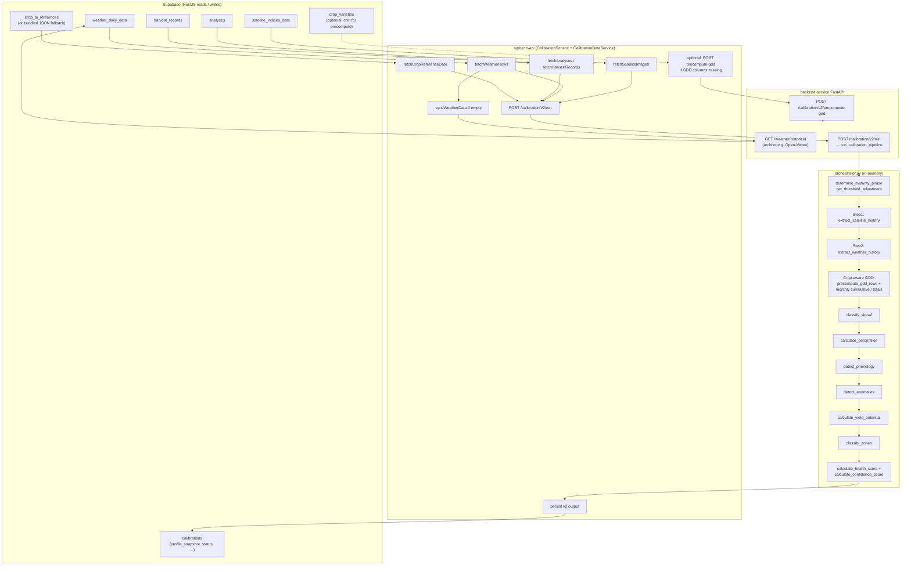
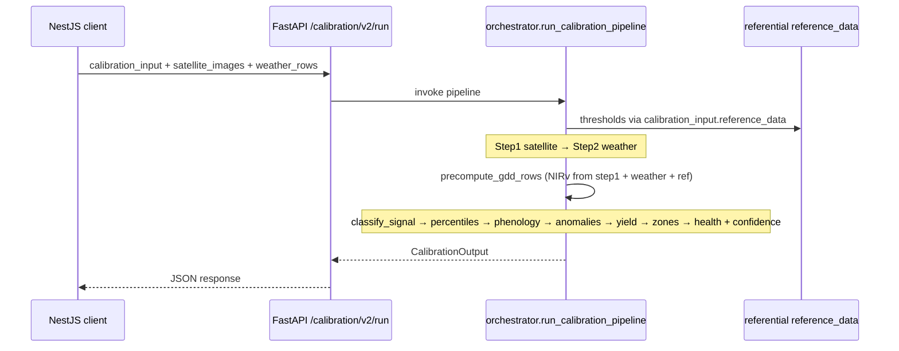

# Calibration pipeline — data flow (Mermaid)

End-to-end flow: **Supabase + NestJS** assemble inputs; **FastAPI** runs `run_calibration_pipeline` (orchestrator); results return to Nest for persistence.

> The Python **orchestrator does not query a database**; it only consumes the JSON body of `POST /calibration/v2/run`.

## Orchestrator-only sequence (steps inside `run_calibration_pipeline`)

## Related code

- Nest assembly and HTTP calls: `agritech-api/src/modules/calibration/calibration.service.ts`
- DB fetch helpers: `agritech-api/src/modules/calibration/calibration-data.service.ts`
- Pipeline entry: `backend-service/app/services/calibration/orchestrator.py`
- HTTP entry: `backend-service/app/api/calibration.py` (`CalibrationRunV2Request`, `_run_v2`)
