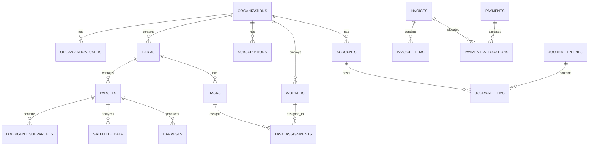

# Database Architecture

The AgriTech Platform uses PostgreSQL via Supabase as its primary database. This document details the database architecture, schema design principles, Row Level Security (RLS) implementation, and best practices.

## Database Overview

**Database Engine:** PostgreSQL 15.x
**Hosting:** Supabase (managed PostgreSQL)
**Extensions:** PostGIS (geospatial), pg_stat_statements (monitoring), uuid-ossp (UUID generation)

## Schema Organization

The database is organized into multiple schemas with distinct purposes:

```
agritech_database
├── public (application data)
│   ├── Tables
│   ├── Views
│   ├── Functions
│   ├── Triggers
│   └── RLS Policies
├── auth (Supabase Auth - managed)
├── storage (Supabase Storage - managed)
└── extensions (PostgreSQL extensions)
```

## Core Schema Design

### Entity Relationship Diagram



### Table Categories

#### 1. Multi-Tenancy Tables

These tables form the core tenant hierarchy:

**organizations**
```sql
CREATE TABLE organizations (
  id UUID PRIMARY KEY DEFAULT uuid_generate_v4(),
  name TEXT NOT NULL,
  description TEXT,
  currency TEXT NOT NULL DEFAULT 'USD',
  timezone TEXT NOT NULL DEFAULT 'UTC',
  settings JSONB DEFAULT '{}',
  created_at TIMESTAMPTZ NOT NULL DEFAULT NOW(),
  updated_at TIMESTAMPTZ NOT NULL DEFAULT NOW()
);

CREATE INDEX idx_organizations_created_at ON organizations(created_at);
```

**organization_users**
```sql
CREATE TABLE organization_users (
  id UUID PRIMARY KEY DEFAULT uuid_generate_v4(),
  organization_id UUID NOT NULL REFERENCES organizations(id) ON DELETE CASCADE,
  user_id UUID NOT NULL REFERENCES auth.users(id) ON DELETE CASCADE,
  role TEXT NOT NULL CHECK (role IN (
    'system_admin',
    'organization_admin',
    'farm_manager',
    'farm_worker',
    'day_laborer',
    'viewer'
  )),
  invited_by UUID REFERENCES auth.users(id),
  joined_at TIMESTAMPTZ NOT NULL DEFAULT NOW(),
  UNIQUE(organization_id, user_id)
);

CREATE INDEX idx_org_users_org_id ON organization_users(organization_id);
CREATE INDEX idx_org_users_user_id ON organization_users(user_id);
```

**farms**
```sql
CREATE TABLE farms (
  id UUID PRIMARY KEY DEFAULT uuid_generate_v4(),
  organization_id UUID NOT NULL REFERENCES organizations(id) ON DELETE CASCADE,
  name TEXT NOT NULL,
  location TEXT,
  area NUMERIC(10, 2),
  boundary GEOMETRY(POLYGON, 4326),
  created_at TIMESTAMPTZ NOT NULL DEFAULT NOW(),
  updated_at TIMESTAMPTZ NOT NULL DEFAULT NOW()
);

CREATE INDEX idx_farms_org_id ON farms(organization_id);
CREATE INDEX idx_farms_boundary ON farms USING GIST(boundary);
```

**parcels**
```sql
CREATE TABLE parcels (
  id UUID PRIMARY KEY DEFAULT uuid_generate_v4(),
  farm_id UUID NOT NULL REFERENCES farms(id) ON DELETE CASCADE,
  name TEXT NOT NULL,
  crop_type TEXT,
  area NUMERIC(10, 4) NOT NULL,
  boundary GEOMETRY(POLYGON, 4326) NOT NULL,
  planting_date DATE,
  expected_harvest_date DATE,
  notes TEXT,
  created_at TIMESTAMPTZ NOT NULL DEFAULT NOW(),
  updated_at TIMESTAMPTZ NOT NULL DEFAULT NOW()
);

CREATE INDEX idx_parcels_farm_id ON parcels(farm_id);
CREATE INDEX idx_parcels_boundary ON parcels USING GIST(boundary);
CREATE INDEX idx_parcels_crop_type ON parcels(crop_type);
```

**divergent_subparcels**
```sql
CREATE TABLE divergent_subparcels (
  id UUID PRIMARY KEY DEFAULT uuid_generate_v4(),
  parcel_id UUID NOT NULL REFERENCES parcels(id) ON DELETE CASCADE,
  name TEXT NOT NULL,
  description TEXT,
  boundary GEOMETRY(POLYGON, 4326) NOT NULL,
  area NUMERIC(10, 4) NOT NULL,
  created_at TIMESTAMPTZ NOT NULL DEFAULT NOW(),
  updated_at TIMESTAMPTZ NOT NULL DEFAULT NOW()
);

CREATE INDEX idx_subparcels_parcel_id ON divergent_subparcels(parcel_id);
CREATE INDEX idx_subparcels_boundary ON divergent_subparcels USING GIST(boundary);
```

#### 2. Operations Tables

**workers**
```sql
CREATE TABLE workers (
  id UUID PRIMARY KEY DEFAULT uuid_generate_v4(),
  organization_id UUID NOT NULL REFERENCES organizations(id) ON DELETE CASCADE,
  first_name TEXT NOT NULL,
  last_name TEXT NOT NULL,
  email TEXT,
  phone TEXT,
  employee_type TEXT NOT NULL CHECK (employee_type IN ('permanent', 'seasonal', 'contractor')),
  hire_date DATE NOT NULL,
  termination_date DATE,
  hourly_rate NUMERIC(10, 2),
  monthly_salary NUMERIC(10, 2),
  created_at TIMESTAMPTZ NOT NULL DEFAULT NOW(),
  updated_at TIMESTAMPTZ NOT NULL DEFAULT NOW()
);

CREATE INDEX idx_workers_org_id ON workers(organization_id);
CREATE INDEX idx_workers_type ON workers(employee_type);
```

**tasks**
```sql
CREATE TABLE tasks (
  id UUID PRIMARY KEY DEFAULT uuid_generate_v4(),
  farm_id UUID NOT NULL REFERENCES farms(id) ON DELETE CASCADE,
  parcel_id UUID REFERENCES parcels(id) ON DELETE SET NULL,
  title TEXT NOT NULL,
  description TEXT,
  task_type TEXT NOT NULL CHECK (task_type IN (
    'irrigation', 'fertilization', 'pesticide', 'harvest',
    'maintenance', 'planting', 'weeding', 'other'
  )),
  status TEXT NOT NULL DEFAULT 'pending' CHECK (status IN (
    'pending', 'in_progress', 'completed', 'cancelled'
  )),
  priority TEXT DEFAULT 'medium' CHECK (priority IN ('low', 'medium', 'high', 'urgent')),
  scheduled_date DATE NOT NULL,
  completed_date DATE,
  estimated_hours NUMERIC(5, 2),
  actual_hours NUMERIC(5, 2),
  cost_labor NUMERIC(10, 2) DEFAULT 0,
  cost_materials NUMERIC(10, 2) DEFAULT 0,
  cost_utilities NUMERIC(10, 2) DEFAULT 0,
  payment_status TEXT DEFAULT 'unpaid' CHECK (payment_status IN ('paid', 'unpaid', 'partial')),
  created_by UUID REFERENCES auth.users(id),
  created_at TIMESTAMPTZ NOT NULL DEFAULT NOW(),
  updated_at TIMESTAMPTZ NOT NULL DEFAULT NOW()
);

CREATE INDEX idx_tasks_farm_id ON tasks(farm_id);
CREATE INDEX idx_tasks_parcel_id ON tasks(parcel_id);
CREATE INDEX idx_tasks_status ON tasks(status);
CREATE INDEX idx_tasks_scheduled_date ON tasks(scheduled_date);
CREATE INDEX idx_tasks_type ON tasks(task_type);
```

**task_assignments**
```sql
CREATE TABLE task_assignments (
  id UUID PRIMARY KEY DEFAULT uuid_generate_v4(),
  task_id UUID NOT NULL REFERENCES tasks(id) ON DELETE CASCADE,
  worker_id UUID NOT NULL REFERENCES workers(id) ON DELETE CASCADE,
  assigned_at TIMESTAMPTZ NOT NULL DEFAULT NOW(),
  UNIQUE(task_id, worker_id)
);

CREATE INDEX idx_task_assignments_task_id ON task_assignments(task_id);
CREATE INDEX idx_task_assignments_worker_id ON task_assignments(worker_id);
```

**harvests**
```sql
CREATE TABLE harvests (
  id UUID PRIMARY KEY DEFAULT uuid_generate_v4(),
  parcel_id UUID NOT NULL REFERENCES parcels(id) ON DELETE CASCADE,
  harvest_date DATE NOT NULL,
  quantity NUMERIC(10, 2) NOT NULL,
  unit TEXT NOT NULL,
  quality TEXT CHECK (quality IN ('excellent', 'good', 'fair', 'poor')),
  price_per_unit NUMERIC(10, 2),
  total_revenue NUMERIC(10, 2),
  total_cost NUMERIC(10, 2) DEFAULT 0,
  profit NUMERIC(10, 2) GENERATED ALWAYS AS (total_revenue - total_cost) STORED,
  notes TEXT,
  created_at TIMESTAMPTZ NOT NULL DEFAULT NOW(),
  updated_at TIMESTAMPTZ NOT NULL DEFAULT NOW()
);

CREATE INDEX idx_harvests_parcel_id ON harvests(parcel_id);
CREATE INDEX idx_harvests_date ON harvests(harvest_date);
```

#### 3. Satellite Analysis Tables

**satellite_data**
```sql
CREATE TABLE satellite_data (
  id UUID PRIMARY KEY DEFAULT uuid_generate_v4(),
  parcel_id UUID REFERENCES parcels(id) ON DELETE CASCADE,
  subparcel_id UUID REFERENCES divergent_subparcels(id) ON DELETE CASCADE,
  acquisition_date DATE NOT NULL,
  index_type TEXT NOT NULL,
  mean_value NUMERIC(10, 6),
  min_value NUMERIC(10, 6),
  max_value NUMERIC(10, 6),
  std_value NUMERIC(10, 6),
  percentile_25 NUMERIC(10, 6),
  percentile_50 NUMERIC(10, 6),
  percentile_75 NUMERIC(10, 6),
  cloud_coverage NUMERIC(5, 2),
  geotiff_url TEXT,
  metadata JSONB,
  created_at TIMESTAMPTZ NOT NULL DEFAULT NOW(),
  CHECK (
    (parcel_id IS NOT NULL AND subparcel_id IS NULL) OR
    (parcel_id IS NULL AND subparcel_id IS NOT NULL)
  )
);

CREATE INDEX idx_satellite_data_parcel_id ON satellite_data(parcel_id);
CREATE INDEX idx_satellite_data_subparcel_id ON satellite_data(subparcel_id);
CREATE INDEX idx_satellite_data_date ON satellite_data(acquisition_date);
CREATE INDEX idx_satellite_data_index_type ON satellite_data(index_type);
```

#### 4. Accounting Tables

**accounts (Chart of Accounts)**
```sql
CREATE TABLE accounts (
  id UUID PRIMARY KEY DEFAULT uuid_generate_v4(),
  organization_id UUID NOT NULL REFERENCES organizations(id) ON DELETE CASCADE,
  code TEXT NOT NULL,
  name TEXT NOT NULL,
  account_type TEXT NOT NULL CHECK (account_type IN (
    'asset', 'liability', 'equity', 'revenue', 'expense'
  )),
  sub_type TEXT,
  parent_account_id UUID REFERENCES accounts(id),
  is_active BOOLEAN NOT NULL DEFAULT TRUE,
  balance NUMERIC(15, 2) NOT NULL DEFAULT 0,
  description TEXT,
  created_at TIMESTAMPTZ NOT NULL DEFAULT NOW(),
  updated_at TIMESTAMPTZ NOT NULL DEFAULT NOW(),
  UNIQUE(organization_id, code)
);

CREATE INDEX idx_accounts_org_id ON accounts(organization_id);
CREATE INDEX idx_accounts_type ON accounts(account_type);
CREATE INDEX idx_accounts_parent_id ON accounts(parent_account_id);
CREATE INDEX idx_accounts_code ON accounts(code);
```

**journal_entries**
```sql
CREATE TABLE journal_entries (
  id UUID PRIMARY KEY DEFAULT uuid_generate_v4(),
  organization_id UUID NOT NULL REFERENCES organizations(id) ON DELETE CASCADE,
  entry_number TEXT NOT NULL,
  entry_date DATE NOT NULL,
  description TEXT NOT NULL,
  reference TEXT,
  entry_type TEXT NOT NULL CHECK (entry_type IN (
    'manual', 'auto', 'closing', 'opening', 'adjustment'
  )),
  status TEXT NOT NULL DEFAULT 'draft' CHECK (status IN ('draft', 'posted', 'voided')),
  total_debit NUMERIC(15, 2) NOT NULL DEFAULT 0,
  total_credit NUMERIC(15, 2) NOT NULL DEFAULT 0,
  created_by UUID REFERENCES auth.users(id),
  posted_at TIMESTAMPTZ,
  created_at TIMESTAMPTZ NOT NULL DEFAULT NOW(),
  updated_at TIMESTAMPTZ NOT NULL DEFAULT NOW(),
  UNIQUE(organization_id, entry_number),
  CHECK (total_debit = total_credit)
);

CREATE INDEX idx_journal_entries_org_id ON journal_entries(organization_id);
CREATE INDEX idx_journal_entries_date ON journal_entries(entry_date);
CREATE INDEX idx_journal_entries_status ON journal_entries(status);
CREATE INDEX idx_journal_entries_number ON journal_entries(entry_number);
```

**journal_items**
```sql
CREATE TABLE journal_items (
  id UUID PRIMARY KEY DEFAULT uuid_generate_v4(),
  journal_entry_id UUID NOT NULL REFERENCES journal_entries(id) ON DELETE CASCADE,
  account_id UUID NOT NULL REFERENCES accounts(id),
  debit NUMERIC(15, 2) NOT NULL DEFAULT 0,
  credit NUMERIC(15, 2) NOT NULL DEFAULT 0,
  description TEXT,
  cost_center_id UUID REFERENCES cost_centers(id),
  created_at TIMESTAMPTZ NOT NULL DEFAULT NOW(),
  CHECK (
    (debit > 0 AND credit = 0) OR
    (credit > 0 AND debit = 0) OR
    (debit = 0 AND credit = 0)
  )
);

CREATE INDEX idx_journal_items_entry_id ON journal_items(journal_entry_id);
CREATE INDEX idx_journal_items_account_id ON journal_items(account_id);
CREATE INDEX idx_journal_items_cost_center ON journal_items(cost_center_id);
```

**invoices**
```sql
CREATE TABLE invoices (
  id UUID PRIMARY KEY DEFAULT uuid_generate_v4(),
  organization_id UUID NOT NULL REFERENCES organizations(id) ON DELETE CASCADE,
  invoice_number TEXT NOT NULL,
  invoice_type TEXT NOT NULL CHECK (invoice_type IN ('sales', 'purchase')),
  invoice_date DATE NOT NULL,
  due_date DATE NOT NULL,
  customer_supplier_name TEXT NOT NULL,
  subtotal NUMERIC(15, 2) NOT NULL DEFAULT 0,
  tax_amount NUMERIC(15, 2) NOT NULL DEFAULT 0,
  total_amount NUMERIC(15, 2) NOT NULL DEFAULT 0,
  outstanding_amount NUMERIC(15, 2) NOT NULL DEFAULT 0,
  status TEXT NOT NULL DEFAULT 'draft' CHECK (status IN (
    'draft', 'sent', 'paid', 'partial', 'overdue', 'cancelled'
  )),
  notes TEXT,
  created_by UUID REFERENCES auth.users(id),
  created_at TIMESTAMPTZ NOT NULL DEFAULT NOW(),
  updated_at TIMESTAMPTZ NOT NULL DEFAULT NOW(),
  UNIQUE(organization_id, invoice_number)
);

CREATE INDEX idx_invoices_org_id ON invoices(organization_id);
CREATE INDEX idx_invoices_type ON invoices(invoice_type);
CREATE INDEX idx_invoices_status ON invoices(status);
CREATE INDEX idx_invoices_date ON invoices(invoice_date);
CREATE INDEX idx_invoices_number ON invoices(invoice_number);
```

**payments**
```sql
CREATE TABLE payments (
  id UUID PRIMARY KEY DEFAULT uuid_generate_v4(),
  organization_id UUID NOT NULL REFERENCES organizations(id) ON DELETE CASCADE,
  payment_number TEXT NOT NULL,
  payment_date DATE NOT NULL,
  payment_type TEXT NOT NULL CHECK (payment_type IN ('receipt', 'payment')),
  payment_method TEXT NOT NULL CHECK (payment_method IN (
    'cash', 'check', 'bank_transfer', 'credit_card', 'other'
  )),
  amount NUMERIC(15, 2) NOT NULL,
  allocated_amount NUMERIC(15, 2) NOT NULL DEFAULT 0,
  unallocated_amount NUMERIC(15, 2) GENERATED ALWAYS AS (amount - allocated_amount) STORED,
  reference TEXT,
  notes TEXT,
  bank_account_id UUID REFERENCES bank_accounts(id),
  created_by UUID REFERENCES auth.users(id),
  created_at TIMESTAMPTZ NOT NULL DEFAULT NOW(),
  updated_at TIMESTAMPTZ NOT NULL DEFAULT NOW(),
  UNIQUE(organization_id, payment_number)
);

CREATE INDEX idx_payments_org_id ON payments(organization_id);
CREATE INDEX idx_payments_type ON payments(payment_type);
CREATE INDEX idx_payments_date ON payments(payment_date);
```

#### 5. Subscription Tables

**subscriptions**
```sql
CREATE TABLE subscriptions (
  id UUID PRIMARY KEY DEFAULT uuid_generate_v4(),
  organization_id UUID NOT NULL REFERENCES organizations(id) ON DELETE CASCADE,
  plan TEXT NOT NULL CHECK (plan IN ('free', 'basic', 'pro', 'enterprise')),
  status TEXT NOT NULL CHECK (status IN ('active', 'trial', 'cancelled', 'expired')),
  max_farms INTEGER,
  max_parcels INTEGER,
  max_users INTEGER,
  max_satellite_reports INTEGER,
  features JSONB DEFAULT '{}',
  trial_ends_at TIMESTAMPTZ,
  current_period_start TIMESTAMPTZ NOT NULL,
  current_period_end TIMESTAMPTZ NOT NULL,
  polar_subscription_id TEXT,
  created_at TIMESTAMPTZ NOT NULL DEFAULT NOW(),
  updated_at TIMESTAMPTZ NOT NULL DEFAULT NOW(),
  UNIQUE(organization_id)
);

CREATE INDEX idx_subscriptions_org_id ON subscriptions(organization_id);
CREATE INDEX idx_subscriptions_status ON subscriptions(status);
CREATE INDEX idx_subscriptions_polar_id ON subscriptions(polar_subscription_id);
```

## Row Level Security (RLS)

RLS is the primary mechanism for multi-tenant data isolation. All tables have RLS enabled and policies that filter data by organization.

### RLS Policy Patterns

#### Pattern 1: Organization-Based Access

```sql
-- Enable RLS
ALTER TABLE farms ENABLE ROW LEVEL SECURITY;

-- SELECT policy: Users can view farms in their organizations
CREATE POLICY "Users can view their organization's farms"
ON farms
FOR SELECT
USING (
  organization_id IN (
    SELECT organization_id
    FROM organization_users
    WHERE user_id = auth.uid()
  )
);

-- INSERT policy: Admins and managers can create farms
CREATE POLICY "Admins and managers can create farms"
ON farms
FOR INSERT
WITH CHECK (
  EXISTS (
    SELECT 1
    FROM organization_users
    WHERE user_id = auth.uid()
    AND organization_id = farms.organization_id
    AND role IN ('system_admin', 'organization_admin', 'farm_manager')
  )
);

-- UPDATE policy: Admins and managers can update farms
CREATE POLICY "Admins and managers can update farms"
ON farms
FOR UPDATE
USING (
  EXISTS (
    SELECT 1
    FROM organization_users
    WHERE user_id = auth.uid()
    AND organization_id = farms.organization_id
    AND role IN ('system_admin', 'organization_admin', 'farm_manager')
  )
);

-- DELETE policy: Only organization admins can delete farms
CREATE POLICY "Organization admins can delete farms"
ON farms
FOR DELETE
USING (
  EXISTS (
    SELECT 1
    FROM organization_users
    WHERE user_id = auth.uid()
    AND organization_id = farms.organization_id
    AND role IN ('system_admin', 'organization_admin')
  )
);
```

#### Pattern 2: Farm-Based Access

```sql
-- Enable RLS
ALTER TABLE parcels ENABLE ROW LEVEL SECURITY;

-- SELECT policy: Users can view parcels in accessible farms
CREATE POLICY "Users can view parcels in their farms"
ON parcels
FOR SELECT
USING (
  farm_id IN (
    SELECT f.id
    FROM farms f
    INNER JOIN organization_users ou ON f.organization_id = ou.organization_id
    WHERE ou.user_id = auth.uid()
  )
);
```

#### Pattern 3: User-Specific Access

```sql
-- Enable RLS
ALTER TABLE user_profiles ENABLE ROW LEVEL SECURITY;

-- Users can only view their own profile
CREATE POLICY "Users can view own profile"
ON user_profiles
FOR SELECT
USING (user_id = auth.uid());

-- Users can update their own profile
CREATE POLICY "Users can update own profile"
ON user_profiles
FOR UPDATE
USING (user_id = auth.uid());
```

### Performance Considerations

RLS policies can impact query performance. To optimize:

1. **Index foreign keys used in policies:**
```sql
CREATE INDEX idx_organization_users_lookup
ON organization_users(user_id, organization_id);
```

2. **Use security definer functions for complex checks:**
```sql
CREATE OR REPLACE FUNCTION user_can_access_farm(farm_id_param UUID)
RETURNS BOOLEAN AS $$
BEGIN
  RETURN EXISTS (
    SELECT 1
    FROM farms f
    INNER JOIN organization_users ou ON f.organization_id = ou.organization_id
    WHERE f.id = farm_id_param AND ou.user_id = auth.uid()
  );
END;
$$ LANGUAGE plpgsql SECURITY DEFINER;

-- Use in policy
CREATE POLICY "Users can access authorized farms"
ON tasks
FOR SELECT
USING (user_can_access_farm(farm_id));
```

## Database Functions

### Utility Functions

**get_user_organizations**
```sql
CREATE OR REPLACE FUNCTION get_user_organizations(user_id_param UUID)
RETURNS TABLE (
  id UUID,
  name TEXT,
  role TEXT,
  joined_at TIMESTAMPTZ
) AS $$
BEGIN
  RETURN QUERY
  SELECT
    o.id,
    o.name,
    ou.role,
    ou.joined_at
  FROM organizations o
  INNER JOIN organization_users ou ON o.id = ou.organization_id
  WHERE ou.user_id = user_id_param
  ORDER BY ou.joined_at DESC;
END;
$$ LANGUAGE plpgsql SECURITY DEFINER;
```

**create_organization_with_owner**
```sql
CREATE OR REPLACE FUNCTION create_organization_with_owner(
  org_name TEXT,
  owner_user_id UUID
)
RETURNS UUID AS $$
DECLARE
  new_org_id UUID;
BEGIN
  -- Insert organization
  INSERT INTO organizations (name)
  VALUES (org_name)
  RETURNING id INTO new_org_id;

  -- Add owner
  INSERT INTO organization_users (organization_id, user_id, role)
  VALUES (new_org_id, owner_user_id, 'organization_admin');

  RETURN new_org_id;
END;
$$ LANGUAGE plpgsql SECURITY DEFINER;
```

### Accounting Functions

**validate_journal_balance (Trigger)**
```sql
CREATE OR REPLACE FUNCTION validate_journal_balance()
RETURNS TRIGGER AS $$
DECLARE
  entry_total_debit NUMERIC(15, 2);
  entry_total_credit NUMERIC(15, 2);
BEGIN
  -- Calculate totals from journal items
  SELECT
    COALESCE(SUM(debit), 0),
    COALESCE(SUM(credit), 0)
  INTO entry_total_debit, entry_total_credit
  FROM journal_items
  WHERE journal_entry_id = NEW.journal_entry_id;

  -- Update journal entry totals
  UPDATE journal_entries
  SET
    total_debit = entry_total_debit,
    total_credit = entry_total_credit,
    updated_at = NOW()
  WHERE id = NEW.journal_entry_id;

  -- Validate balance
  IF entry_total_debit != entry_total_credit THEN
    RAISE EXCEPTION 'Debits (%) must equal credits (%)', entry_total_debit, entry_total_credit;
  END IF;

  RETURN NEW;
END;
$$ LANGUAGE plpgsql;

CREATE TRIGGER trigger_validate_journal_balance
AFTER INSERT OR UPDATE OR DELETE ON journal_items
FOR EACH ROW
EXECUTE FUNCTION validate_journal_balance();
```

## Database Migrations

### Migration Strategy

Migrations are managed using Supabase CLI:

**Location:** `/Users/boutchaz/Documents/CodeLovers/agritech/project/supabase/migrations/`

**Naming Convention:**
```
YYYYMMDDHHMMSS_description.sql
```

Example:
```
20240115120000_create_farms_table.sql
20240115130000_add_boundary_to_parcels.sql
20240116100000_create_accounting_tables.sql
```

### Migration Best Practices

1. **Always use transactions:**
```sql
BEGIN;

-- Migration code here

COMMIT;
```

2. **Make migrations reversible when possible:**
```sql
-- Up migration
ALTER TABLE farms ADD COLUMN area NUMERIC(10, 2);

-- Down migration (in separate file or comments)
-- ALTER TABLE farms DROP COLUMN area;
```

3. **Test locally before deploying:**
```bash
# Reset local database
npm run db:reset

# Test migration
npm run db:push
```

4. **Add indexes after data migration:**
```sql
-- Create table
CREATE TABLE large_table (...);

-- Insert data (if needed)

-- Add indexes (faster when done after data load)
CREATE INDEX idx_large_table_key ON large_table(key_column);
```

## Database Maintenance

### Backup Strategy

- **Automated backups:** Daily at 2 AM UTC (Supabase managed)
- **Retention:** 30 days for Pro plan, 7 days for Free plan
- **Point-in-time recovery:** Available for Pro plan

### Manual Backup

```bash
# Backup schema
npm run db:dump

# Backup data (custom script)
pg_dump -h <host> -U postgres -d postgres --data-only > backup.sql
```

### Performance Monitoring

**Query Performance:**
```sql
-- View slow queries
SELECT
  query,
  calls,
  total_time,
  mean_time,
  max_time
FROM pg_stat_statements
ORDER BY mean_time DESC
LIMIT 10;
```

**Index Usage:**
```sql
-- Check unused indexes
SELECT
  schemaname,
  tablename,
  indexname,
  idx_scan
FROM pg_stat_user_indexes
WHERE idx_scan = 0
ORDER BY schemaname, tablename;
```

## Type Generation

TypeScript types are automatically generated from the database schema:

```bash
# Generate types from local database
npm run db:generate-types

# Generate types from remote database
npm run db:generate-types-remote
```

**Output:** `/Users/boutchaz/Documents/CodeLovers/agritech/project/src/types/database.types.ts`

**Usage:**
```typescript
import type { Database, Tables, InsertDto, UpdateDto } from '@/types/database.types';

// Table type
type Farm = Tables<'farms'>;

// Insert type (for creating records)
type NewFarm = InsertDto<'farms'>;

// Update type (for updating records)
type FarmUpdate = UpdateDto<'farms'>;
```

## Related Documentation

- [Multi-Tenancy Architecture](./multi-tenancy.md)
- [Backend Architecture](./backend.md)
- [Database Migrations Guide](../guides/database-migrations.md)
