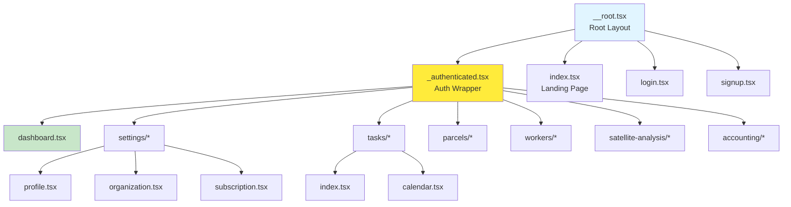
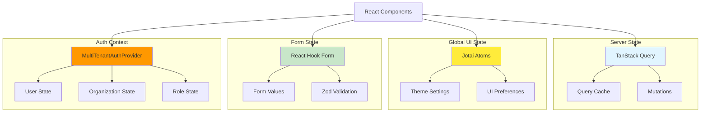

# Frontend Architecture

The AgriTech Platform frontend is built with React 19 and TypeScript, following modern patterns and best practices. This document details the architecture, component organization, routing strategy, and state management approach.

## Technology Stack

### Core Technologies

| Technology | Version | Purpose |
|-----------|---------|---------|
| React | 19.x | UI framework with concurrent features |
| TypeScript | 5.x | Type safety and developer experience |
| Vite | 5.x | Build tool and dev server |
| TanStack Router | 1.x | Type-safe file-based routing |
| TanStack Query | 5.x | Server state management and caching |
| React Hook Form | 7.x | Form state management |
| Zod | 3.x | Schema validation |
| Tailwind CSS | 3.x | Utility-first styling |
| Jotai | 2.x | Atomic state management |

### Supporting Libraries

- **UI Components:** Radix UI primitives, custom components
- **Maps:** Leaflet, React Leaflet, OpenLayers
- **Charts:** ECharts, Recharts
- **Internationalization:** react-i18next
- **Date/Time:** date-fns
- **HTTP Client:** Supabase client, axios for satellite service

## Project Structure

```
project/src/
├── routes/                      # TanStack Router routes
│   ├── __root.tsx               # Root layout with providers
│   ├── _authenticated.tsx       # Protected route wrapper
│   ├── dashboard.tsx            # Dashboard route
│   ├── settings/                # Settings section
│   │   ├── profile.tsx          # /settings/profile
│   │   └── organization.tsx     # /settings/organization
│   └── ...                      # Other routes
│
├── components/                  # React components
│   ├── ui/                      # Reusable UI primitives
│   │   ├── Button.tsx
│   │   ├── Input.tsx
│   │   ├── Select.tsx
│   │   ├── Dialog.tsx
│   │   └── ...
│   ├── SatelliteAnalysis/       # Feature: Satellite analysis
│   │   ├── SatelliteViewer.tsx
│   │   ├── VegetationIndexChart.tsx
│   │   └── ...
│   ├── Tasks/                   # Feature: Task management
│   ├── Workers/                 # Feature: Worker management
│   ├── FarmHierarchy/           # Feature: Org/Farm/Parcel management
│   ├── authorization/           # Permission components
│   │   ├── Can.tsx
│   │   ├── FeatureGate.tsx
│   │   └── ProtectedRoute.tsx
│   └── MultiTenantAuthProvider.tsx
│
├── hooks/                       # Custom React hooks
│   ├── useAuth.ts               # Authentication context
│   ├── useParcels.ts            # Parcel data fetching
│   ├── useWorkers.ts            # Worker data fetching
│   └── ...
│
├── lib/                         # Utilities and clients
│   ├── supabase.ts              # Supabase client
│   ├── satellite-api.ts         # Satellite service client
│   ├── accounting-api.ts        # Accounting API client
│   ├── casl/                    # Authorization logic
│   │   ├── defineAbilityFor.ts  # CASL ability definitions
│   │   └── AbilityContext.tsx   # CASL React context
│   └── utils/                   # Helper functions
│
├── schemas/                     # Zod validation schemas
│   ├── farm.schema.ts
│   ├── parcel.schema.ts
│   ├── task.schema.ts
│   └── ...
│
├── types/                       # TypeScript types
│   ├── database.types.ts        # Generated from Supabase
│   ├── api.types.ts
│   └── ...
│
└── locales/                     # i18n translations
    ├── en/
    ├── fr/
    └── ar/
```

## Routing Architecture

### TanStack Router Overview

The application uses TanStack Router v1 with file-based routing, providing:
- Type-safe navigation
- Automatic route tree generation
- Lazy loading support
- Search params validation
- Layout composition

### Route Naming Conventions

| File Pattern | Route Path | Description |
|-------------|-----------|-------------|
| `__root.tsx` | `/` | Root layout with providers |
| `_authenticated.tsx` | N/A | Layout wrapper (no path) |
| `dashboard.tsx` | `/dashboard` | Dashboard page |
| `settings.profile.tsx` | `/settings/profile` | Nested route (dot notation) |
| `tasks.index.tsx` | `/tasks` | Index route |
| `tasks.calendar.tsx` | `/tasks/calendar` | Child route |
| `$moduleId.tsx` | `/:moduleId` | Dynamic parameter |

### Route Tree Structure



### Root Layout

**Location:** `/Users/boutchaz/Documents/CodeLovers/agritech/project/src/routes/__root.tsx`

The root layout wraps the entire application with essential providers:

```typescript
import { createRootRoute, Outlet } from '@tanstack/react-router';
import { QueryClient, QueryClientProvider } from '@tanstack/react-query';
import { MultiTenantAuthProvider } from '@/components/MultiTenantAuthProvider';
import { I18nextProvider } from 'react-i18next';
import i18n from '@/lib/i18n';

const queryClient = new QueryClient({
  defaultOptions: {
    queries: {
      staleTime: 1000 * 60 * 5, // 5 minutes
      retry: 1,
    },
  },
});

export const Route = createRootRoute({
  component: RootLayout,
});

function RootLayout() {
  return (
    <QueryClientProvider client={queryClient}>
      <I18nextProvider i18n={i18n}>
        <MultiTenantAuthProvider>
          <Outlet /> {/* Renders child routes */}
        </MultiTenantAuthProvider>
      </I18nextProvider>
    </QueryClientProvider>
  );
}
```

### Protected Routes

**Location:** `/Users/boutchaz/Documents/CodeLovers/agritech/project/src/routes/_authenticated.tsx`

The `_authenticated` layout protects all child routes:

```typescript
import { createFileRoute, Outlet, redirect } from '@tanstack/react-router';
import { useAuth } from '@/hooks/useAuth';
import { Sidebar } from '@/components/Sidebar';
import { Header } from '@/components/Header';

export const Route = createFileRoute('/_authenticated')({
  beforeLoad: async ({ location }) => {
    const { user, subscription } = useAuth();

    // Redirect to login if not authenticated
    if (!user) {
      throw redirect({
        to: '/login',
        search: { redirect: location.href },
      });
    }

    // Check subscription (except for settings routes)
    if (!subscription && !location.pathname.startsWith('/settings')) {
      throw redirect({ to: '/select-trial' });
    }
  },
  component: AuthenticatedLayout,
});

function AuthenticatedLayout() {
  return (
    <div className="flex h-screen">
      <Sidebar />
      <div className="flex-1 flex flex-col">
        <Header />
        <main className="flex-1 overflow-auto p-6">
          <Outlet /> {/* Renders authenticated child routes */}
        </main>
      </div>
    </div>
  );
}
```

### Route Protection with CASL

Individual routes can be protected with CASL permissions:

```typescript
import { createFileRoute } from '@tanstack/react-router';
import { withRouteProtection } from '@/lib/casl/withRouteProtection';
import { FarmManagementPage } from '@/components/FarmManagement';

export const Route = createFileRoute('/_authenticated/farms')({
  component: withRouteProtection(
    FarmManagementPage,
    'read',     // action
    'Farm'      // resource
  ),
});
```

### Dynamic Routes

```typescript
// Route: /parcels/$parcelId
export const Route = createFileRoute('/_authenticated/parcels/$parcelId')({
  component: ParcelDetailPage,
});

function ParcelDetailPage() {
  const { parcelId } = Route.useParams(); // Type-safe param access
  const { data: parcel } = useQuery({
    queryKey: ['parcel', parcelId],
    queryFn: () => fetchParcel(parcelId),
  });

  return <div>{parcel?.name}</div>;
}
```

### Navigation

```typescript
import { Link, useNavigate } from '@tanstack/react-router';

function NavigationExample() {
  const navigate = useNavigate();

  return (
    <>
      {/* Declarative navigation */}
      <Link to="/dashboard">Dashboard</Link>
      <Link to="/parcels/$parcelId" params={{ parcelId: '123' }}>
        View Parcel
      </Link>

      {/* Programmatic navigation */}
      <button onClick={() => navigate({ to: '/tasks' })}>
        Go to Tasks
      </button>

      {/* Navigation with search params */}
      <button onClick={() => navigate({
        to: '/satellite-analysis',
        search: { parcelId: '123', date: '2024-01-01' }
      })}>
        Analyze
      </button>
    </>
  );
}
```

## State Management

### Three-Layer State Strategy

The application uses different state management solutions for different concerns:



### Layer 1: Server State (TanStack Query)

All API data fetching uses TanStack Query for:
- Automatic caching
- Background refetching
- Optimistic updates
- Request deduplication

**Query Key Structure:**
```typescript
// Auth-related queries
['auth', 'profile', userId]
['auth', 'organizations', userId]
['auth', 'farms', organizationId]

// Feature queries
['farms', { organizationId }]
['parcels', { farmId }]
['workers', { organizationId }]
['tasks', { parcelId }]
['satellite-data', parcelId, { startDate, endDate }]
['accounting', 'accounts', { organizationId }]
```

**Custom Hook Pattern:**
```typescript
// hooks/useParcels.ts
export function useParcels(farmId: string) {
  return useQuery({
    queryKey: ['parcels', { farmId }],
    queryFn: async () => {
      const { data, error } = await supabase
        .from('parcels')
        .select('*')
        .eq('farm_id', farmId);

      if (error) throw error;
      return data;
    },
    enabled: !!farmId,
    staleTime: 1000 * 60, // 1 minute
  });
}
```

**Mutation Pattern:**
```typescript
// hooks/useCreateParcel.ts
export function useCreateParcel() {
  const queryClient = useQueryClient();

  return useMutation({
    mutationFn: async (newParcel: InsertDto<'parcels'>) => {
      const { data, error } = await supabase
        .from('parcels')
        .insert(newParcel)
        .select()
        .single();

      if (error) throw error;
      return data;
    },
    onSuccess: (data) => {
      // Invalidate relevant queries
      queryClient.invalidateQueries({
        queryKey: ['parcels', { farmId: data.farm_id }]
      });

      // Optional: Optimistically update cache
      queryClient.setQueryData(['parcel', data.id], data);
    },
  });
}
```

### Layer 2: Global UI State (Jotai)

Jotai atoms manage global UI state:

```typescript
// lib/atoms/theme.ts
import { atom } from 'jotai';
import { atomWithStorage } from 'jotai/utils';

// Persisted to localStorage
export const themeAtom = atomWithStorage<'light' | 'dark'>('theme', 'light');
export const sidebarCollapsedAtom = atomWithStorage('sidebar-collapsed', false);

// In-memory atoms
export const selectedParcelIdsAtom = atom<string[]>([]);
export const mapViewportAtom = atom<{ center: [number, number], zoom: number }>({
  center: [0, 0],
  zoom: 10,
});
```

**Usage:**
```typescript
import { useAtom } from 'jotai';
import { themeAtom } from '@/lib/atoms/theme';

function ThemeToggle() {
  const [theme, setTheme] = useAtom(themeAtom);

  return (
    <button onClick={() => setTheme(theme === 'light' ? 'dark' : 'light')}>
      Toggle Theme
    </button>
  );
}
```

### Layer 3: Form State (React Hook Form)

All forms use React Hook Form with Zod validation:

```typescript
import { useForm } from 'react-hook-form';
import { zodResolver } from '@hookform/resolvers/zod';
import { z } from 'zod';

// 1. Define schema
const farmSchema = z.object({
  name: z.string().min(1, 'Name is required'),
  location: z.string().optional(),
  area: z.number().positive('Area must be positive').optional(),
});

type FarmFormData = z.infer<typeof farmSchema>;

// 2. Create form
function CreateFarmForm() {
  const form = useForm<FarmFormData>({
    resolver: zodResolver(farmSchema),
    defaultValues: {
      name: '',
      location: '',
    },
  });

  const createMutation = useCreateFarm();

  const onSubmit = form.handleSubmit(async (data) => {
    await createMutation.mutateAsync(data);
  });

  return (
    <form onSubmit={onSubmit}>
      <FormField
        control={form.control}
        name="name"
        render={({ field }) => (
          <FormItem>
            <FormLabel>Farm Name</FormLabel>
            <FormControl>
              <Input {...field} />
            </FormControl>
            <FormMessage />
          </FormItem>
        )}
      />
      {/* More fields... */}
      <Button type="submit" disabled={createMutation.isPending}>
        Create Farm
      </Button>
    </form>
  );
}
```

### Layer 4: Auth Context (MultiTenantAuthProvider)

See [Multi-Tenancy Architecture](./multi-tenancy.md) for detailed information.

## Component Architecture

### Component Organization Principles

1. **Feature-Based Organization:** Components grouped by feature (e.g., `SatelliteAnalysis/`, `Tasks/`)
2. **Reusable Primitives:** Common UI components in `ui/` directory
3. **Single Responsibility:** Each component has one clear purpose
4. **Composition over Inheritance:** Build complex UIs by composing simple components

### UI Component Library

**Location:** `/Users/boutchaz/Documents/CodeLovers/agritech/project/src/components/ui/`

The `ui/` directory contains reusable, accessible primitives built on Radix UI:

```
ui/
├── Button.tsx          # Button component with variants
├── Input.tsx           # Text input with validation states
├── Select.tsx          # Dropdown select
├── Dialog.tsx          # Modal dialog
├── FormField.tsx       # Form field wrapper (RHF integration)
├── Card.tsx            # Card container
├── Table.tsx           # Data table
├── Badge.tsx           # Status badge
├── Tabs.tsx            # Tab navigation
└── ...
```

**Button Example:**
```typescript
// components/ui/Button.tsx
import { cva, type VariantProps } from 'class-variance-authority';

const buttonVariants = cva(
  'inline-flex items-center justify-center rounded-md font-medium transition-colors',
  {
    variants: {
      variant: {
        default: 'bg-primary text-white hover:bg-primary/90',
        destructive: 'bg-red-500 text-white hover:bg-red-600',
        outline: 'border border-gray-300 hover:bg-gray-100',
        ghost: 'hover:bg-gray-100',
      },
      size: {
        default: 'h-10 px-4 py-2',
        sm: 'h-8 px-3 text-sm',
        lg: 'h-12 px-6 text-lg',
      },
    },
    defaultVariants: {
      variant: 'default',
      size: 'default',
    },
  }
);

interface ButtonProps
  extends React.ButtonHTMLAttributes<HTMLButtonElement>,
    VariantProps<typeof buttonVariants> {}

export function Button({ variant, size, className, ...props }: ButtonProps) {
  return (
    <button className={buttonVariants({ variant, size, className })} {...props} />
  );
}
```

### Feature Components

Feature components implement specific business logic:

**Example: Satellite Analysis Viewer**
```typescript
// components/SatelliteAnalysis/SatelliteViewer.tsx
import { useQuery } from '@tanstack/react-query';
import { satelliteApi } from '@/lib/satellite-api';
import { VegetationIndexChart } from './VegetationIndexChart';
import { HeatmapViewer } from './HeatmapViewer';

interface SatelliteViewerProps {
  parcelId: string;
  date: string;
  index: 'NDVI' | 'NDRE' | 'NDMI';
}

export function SatelliteViewer({ parcelId, date, index }: SatelliteViewerProps) {
  const { data, isLoading, error } = useQuery({
    queryKey: ['satellite-heatmap', parcelId, date, index],
    queryFn: () => satelliteApi.getHeatmap({ parcelId, date, index }),
  });

  if (isLoading) return <div>Loading satellite data...</div>;
  if (error) return <div>Error: {error.message}</div>;
  if (!data) return null;

  return (
    <div className="space-y-4">
      <HeatmapViewer data={data.heatmap} boundary={data.boundary} />
      <VegetationIndexChart
        statistics={data.statistics}
        index={index}
      />
    </div>
  );
}
```

### Authorization Components

**Location:** `/Users/boutchaz/Documents/CodeLovers/agritech/project/src/components/authorization/`

These components integrate CASL permissions:

```typescript
// components/authorization/Can.tsx
import { createContextualCan } from '@casl/react';
import { AbilityContext } from '@/lib/casl/AbilityContext';

export const Can = createContextualCan(AbilityContext.Consumer);

// Usage:
<Can I="create" a="Farm">
  <CreateFarmButton />
</Can>
```

```typescript
// components/authorization/FeatureGate.tsx
interface FeatureGateProps {
  feature: string;
  fallback?: React.ReactNode;
  children: React.ReactNode;
}

export function FeatureGate({ feature, fallback, children }: FeatureGateProps) {
  const { subscription } = useAuth();

  const hasFeature = subscription?.features?.[feature] === true;

  if (!hasFeature) {
    return fallback || <UpgradePrompt feature={feature} />;
  }

  return <>{children}</>;
}

// Usage:
<FeatureGate feature="advanced_reporting">
  <AdvancedReportsPage />
</FeatureGate>
```

## Performance Optimization

### Code Splitting

Routes are automatically code-split by TanStack Router:

```typescript
// Automatic code splitting per route file
export const Route = createFileRoute('/_authenticated/satellite-analysis')({
  component: SatelliteAnalysisPage, // Only loaded when route is accessed
});
```

### Component Lazy Loading

```typescript
import { lazy, Suspense } from 'react';

const HeavyChart = lazy(() => import('./HeavyChart'));

function Dashboard() {
  return (
    <Suspense fallback={<div>Loading chart...</div>}>
      <HeavyChart />
    </Suspense>
  );
}
```

### Memoization

```typescript
import { memo, useMemo, useCallback } from 'react';

// Memoize expensive component
export const ExpensiveComponent = memo(function ExpensiveComponent({ data }) {
  // Component logic
});

// Memoize expensive computation
function DataTable({ items }) {
  const sortedItems = useMemo(() => {
    return items.sort((a, b) => a.name.localeCompare(b.name));
  }, [items]);

  const handleSort = useCallback((column: string) => {
    // Sort logic
  }, []);

  return <table>{/* ... */}</table>;
}
```

### Query Optimization

```typescript
// Prefetch data on hover
function ParcelCard({ parcelId }) {
  const queryClient = useQueryClient();

  const prefetchDetails = () => {
    queryClient.prefetchQuery({
      queryKey: ['parcel', parcelId],
      queryFn: () => fetchParcelDetails(parcelId),
    });
  };

  return (
    <Link
      to="/parcels/$parcelId"
      params={{ parcelId }}
      onMouseEnter={prefetchDetails}
    >
      Parcel Details
    </Link>
  );
}
```

## Error Handling

### Error Boundaries

```typescript
// components/ErrorBoundary.tsx
import { Component, ReactNode } from 'react';

interface Props {
  children: ReactNode;
  fallback?: ReactNode;
}

interface State {
  hasError: boolean;
  error?: Error;
}

export class ErrorBoundary extends Component<Props, State> {
  state: State = { hasError: false };

  static getDerivedStateFromError(error: Error): State {
    return { hasError: true, error };
  }

  componentDidCatch(error: Error, errorInfo: React.ErrorInfo) {
    console.error('Error caught by boundary:', error, errorInfo);
    // Send to error tracking service (e.g., Sentry)
  }

  render() {
    if (this.state.hasError) {
      return this.props.fallback || (
        <div>Something went wrong. Please try again.</div>
      );
    }

    return this.props.children;
  }
}
```

### Query Error Handling

```typescript
function ParcelList() {
  const { data, error, isError } = useQuery({
    queryKey: ['parcels'],
    queryFn: fetchParcels,
    retry: 1,
    onError: (error) => {
      toast.error(`Failed to load parcels: ${error.message}`);
    },
  });

  if (isError) {
    return <ErrorMessage error={error} />;
  }

  // Normal render
}
```

## Testing Strategy

### Unit Tests (Vitest)

```typescript
// components/Button.test.tsx
import { describe, it, expect } from 'vitest';
import { render, screen } from '@testing-library/react';
import { Button } from './Button';

describe('Button', () => {
  it('renders with correct text', () => {
    render(<Button>Click me</Button>);
    expect(screen.getByText('Click me')).toBeInTheDocument();
  });

  it('applies variant styles', () => {
    render(<Button variant="destructive">Delete</Button>);
    const button = screen.getByRole('button');
    expect(button).toHaveClass('bg-red-500');
  });
});
```

### Component Tests

```typescript
// hooks/useParcels.test.ts
import { renderHook, waitFor } from '@testing-library/react';
import { QueryClient, QueryClientProvider } from '@tanstack/react-query';
import { useParcels } from './useParcels';

describe('useParcels', () => {
  it('fetches parcels for a farm', async () => {
    const queryClient = new QueryClient();
    const wrapper = ({ children }) => (
      <QueryClientProvider client={queryClient}>{children}</QueryClientProvider>
    );

    const { result } = renderHook(() => useParcels('farm-123'), { wrapper });

    await waitFor(() => expect(result.current.isSuccess).toBe(true));
    expect(result.current.data).toHaveLength(3);
  });
});
```

### E2E Tests (Playwright)

```typescript
// e2e/parcel-management.spec.ts
import { test, expect } from '@playwright/test';

test('user can create a new parcel', async ({ page }) => {
  // Login
  await page.goto('/login');
  await page.fill('[name="email"]', 'test@example.com');
  await page.fill('[name="password"]', 'password');
  await page.click('button[type="submit"]');

  // Navigate to parcels
  await page.click('text=Parcels');

  // Create parcel
  await page.click('text=New Parcel');
  await page.fill('[name="name"]', 'Test Parcel');
  await page.selectOption('[name="crop_type"]', 'wheat');
  await page.click('button:has-text("Create")');

  // Verify
  await expect(page.locator('text=Test Parcel')).toBeVisible();
});
```

## Related Documentation

- [Multi-Tenancy Architecture](./multi-tenancy.md)
- [Backend Architecture](./backend.md)
- [Component Guide](../guides/components.md)
- [State Management Guide](../guides/state-management.md)
