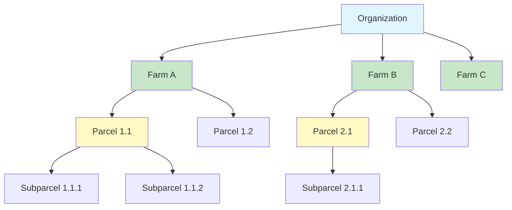
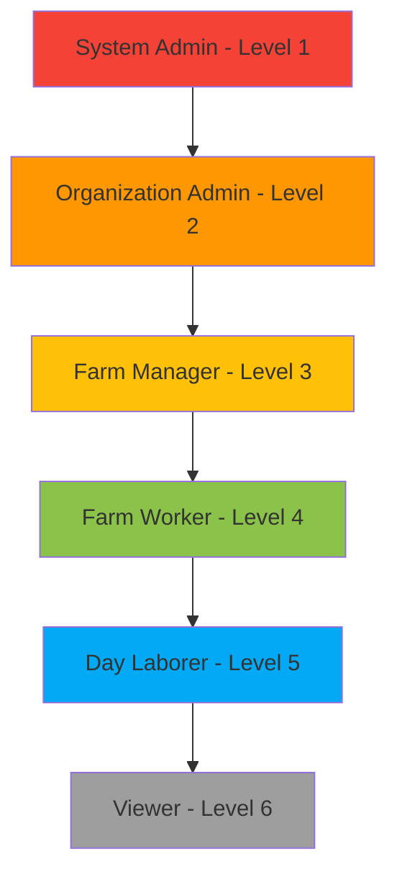
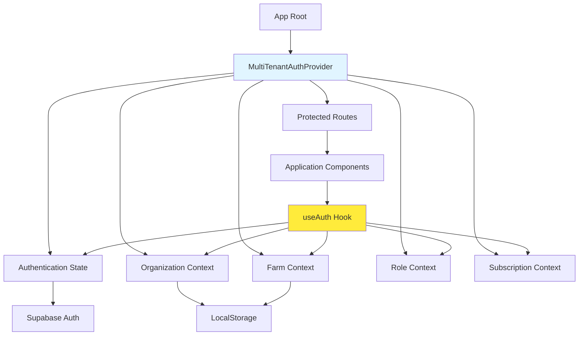
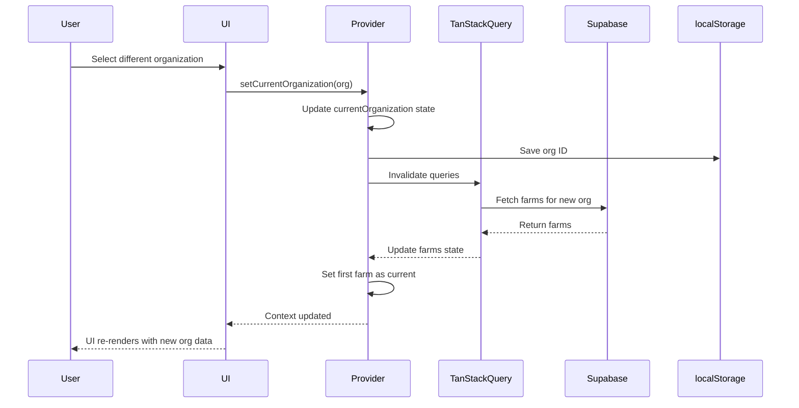
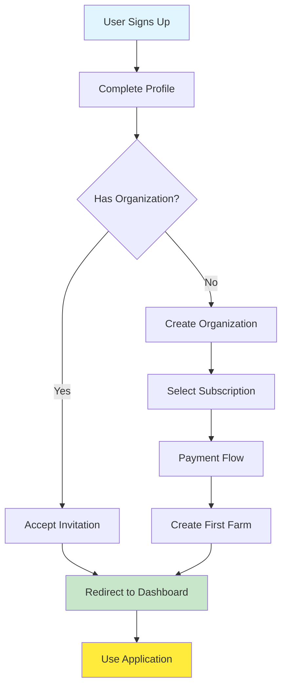

# Multi-Tenancy Architecture

The AgriTech Platform is built with a robust multi-tenant architecture that enables multiple organizations to use the platform while maintaining complete data isolation and security. This document explains the hierarchy, role-based access control, and implementation details.

## Tenant Hierarchy

The platform uses a four-level hierarchy to organize agricultural data:



### Hierarchy Levels

#### Level 1: Organization (Tenant Root)
The organization is the root tenant entity. Each organization represents a distinct business or entity using the platform.

**Key Properties:**
- Unique identifier (UUID)
- Organization name
- Currency and timezone settings
- Subscription plan and limits
- Billing information

**Database Table:** `organizations`

```typescript
interface Organization {
  id: string;
  name: string;
  description?: string;
  currency: string;           // ISO 4217 currency code (e.g., "USD", "EUR")
  timezone: string;           // IANA timezone (e.g., "America/New_York")
  created_at: string;
  updated_at: string;
  settings: Record<string, any>; // Custom organization settings
}
```

#### Level 2: Farm
Farms are physical agricultural locations managed by an organization. A single organization can manage multiple farms.

**Key Properties:**
- Farm name and location
- Farm-specific settings
- GeoJSON boundary (optional)
- Association with parent organization

**Database Table:** `farms`

```typescript
interface Farm {
  id: string;
  organization_id: string;    // Foreign key to organizations
  name: string;
  location?: string;
  area?: number;              // Total farm area (hectares)
  boundary?: GeoJSON;         // Farm boundary geometry
  created_at: string;
  updated_at: string;
}
```

#### Level 3: Parcel
Parcels are specific crop-growing areas within a farm. Each parcel has a defined boundary and crop information.

**Key Properties:**
- Parcel name and crop type
- GeoJSON boundary (required for satellite analysis)
- Planting and harvest dates
- Association with parent farm

**Database Table:** `parcels`

```typescript
interface Parcel {
  id: string;
  farm_id: string;            // Foreign key to farms
  name: string;
  crop_type?: string;
  area: number;               // Calculated from boundary
  boundary: GeoJSON;          // Polygon or MultiPolygon
  planting_date?: string;
  expected_harvest_date?: string;
  created_at: string;
  updated_at: string;
}
```

#### Level 4: Divergent Subparcel (AOI)
Subparcels are Areas of Interest (AOI) within a parcel used for targeted satellite analysis. They enable analysis of specific zones with different characteristics.

**Key Properties:**
- Subparcel name and description
- GeoJSON boundary (subset of parent parcel)
- Analysis-specific metadata

**Database Table:** `divergent_subparcels`

```typescript
interface DivergentSubparcel {
  id: string;
  parcel_id: string;          // Foreign key to parcels
  name: string;
  description?: string;
  boundary: GeoJSON;          // Must be within parent parcel boundary
  area: number;
  created_at: string;
  updated_at: string;
}
```

## Role-Based Access Control (RBAC)

The platform implements a hierarchical role system with six distinct roles, each with specific permissions.

### Role Hierarchy



### Role Definitions

#### 1. System Admin (Level 1)
**Scope:** Platform-wide access

**Permissions:**
- Full access to all organizations and their data
- Platform configuration and settings
- User management across all organizations
- Subscription plan management
- System monitoring and analytics

**Use Case:** Platform maintainers and support staff

**Database Value:** `system_admin`

#### 2. Organization Admin (Level 2)
**Scope:** Single organization (all farms)

**Permissions:**
- Full organization management (name, settings, currency)
- Subscription and billing management
- User invitation and role assignment
- Farm creation and deletion
- Access to all farms and parcels within organization
- Financial reports and analytics

**Use Case:** Business owners, management team

**Database Value:** `organization_admin`

#### 3. Farm Manager (Level 3)
**Scope:** Specific farm(s) within organization

**Permissions:**
- Farm-level operations (parcel management, settings)
- Worker assignment and task management
- Inventory and stock management
- Satellite analysis creation
- Report generation for assigned farms
- Cannot manage organization settings or billing

**Use Case:** Farm supervisors, agricultural managers

**Database Value:** `farm_manager`

#### 4. Farm Worker (Level 4)
**Scope:** Assigned parcels and tasks

**Permissions:**
- Task execution and status updates
- Satellite analysis creation for assigned parcels
- Cost entry (labor, materials, utilities)
- Harvest recording
- Inventory usage tracking
- Cannot create or delete parcels
- Cannot manage other workers

**Use Case:** Field workers, technicians

**Database Value:** `farm_worker`

#### 5. Day Laborer (Level 5)
**Scope:** Assigned tasks only

**Permissions:**
- View assigned tasks
- Update task status (start, complete)
- Record time and effort
- View basic parcel information
- Cannot create or modify tasks
- Cannot access financial data

**Use Case:** Temporary workers, seasonal labor

**Database Value:** `day_laborer`

#### 6. Viewer (Level 6)
**Scope:** Organization-wide, read-only

**Permissions:**
- Read-only access to all data
- View reports and analytics
- Cannot create, update, or delete any data
- Cannot perform any actions

**Use Case:** Auditors, consultants, stakeholders

**Database Value:** `viewer`

## Context Management: MultiTenantAuthProvider

The `MultiTenantAuthProvider` component is the core of the multi-tenant context system. It manages authentication state, organization/farm selection, and provides tenant-aware context throughout the application.

**Location:** `/Users/boutchaz/Documents/CodeLovers/agritech/project/src/components/MultiTenantAuthProvider.tsx`

### Provider Architecture



### Context Structure

The provider exposes a comprehensive context via the `useAuth()` hook:

```typescript
interface AuthContextValue {
  // Authentication
  user: User | null;                    // Supabase auth user
  profile: UserProfile | null;          // User profile data
  loading: boolean;                     // Loading state

  // Multi-tenancy
  organizations: Organization[];         // All user's organizations
  currentOrganization: Organization | null;
  setCurrentOrganization: (org: Organization | null) => void;

  farms: Farm[];                        // Farms in current organization
  currentFarm: Farm | null;
  setCurrentFarm: (farm: Farm | null) => void;

  // Role-based access
  userRole: UserRole | null;            // Role in current organization
  hasRole: (roles: UserRole | UserRole[]) => boolean;
  isAtLeastRole: (role: UserRole) => boolean;

  // Subscription
  subscription: Subscription | null;
  subscriptionLimits: SubscriptionLimits | null;

  // Actions
  signIn: (email: string, password: string) => Promise<void>;
  signUp: (email: string, password: string) => Promise<void>;
  signOut: () => Promise<void>;
  refreshContext: () => Promise<void>;
}
```

### Usage Example

```typescript
import { useAuth } from '@/hooks/useAuth';

function FarmDashboard() {
  const {
    user,
    currentOrganization,
    currentFarm,
    userRole,
    hasRole,
    isAtLeastRole
  } = useAuth();

  // Check if user has specific role
  if (!hasRole(['farm_manager', 'organization_admin'])) {
    return <div>Access denied</div>;
  }

  // Check if user meets minimum role level
  if (isAtLeastRole('farm_worker')) {
    // Show task management UI
  }

  return (
    <div>
      <h1>Welcome to {currentFarm?.name}</h1>
      <p>Organization: {currentOrganization?.name}</p>
      <p>Your role: {userRole}</p>
    </div>
  );
}
```

### State Persistence

The provider persists key state to localStorage for seamless user experience:

```typescript
// Persisted keys
localStorage.setItem('agritech_current_org_id', organizationId);
localStorage.setItem('agritech_current_farm_id', farmId);
localStorage.setItem('agritech_user_language', language);

// Restored on app load
const savedOrgId = localStorage.getItem('agritech_current_org_id');
const savedFarmId = localStorage.getItem('agritech_current_farm_id');
```

### Organization Switching Flow



## Data Isolation

### Row Level Security (RLS)

All database queries are automatically filtered by the user's organization through PostgreSQL Row Level Security policies.

**Example RLS Policy for Farms:**

```sql
-- Users can only see farms in their organizations
CREATE POLICY "Users can view farms in their organizations"
ON farms
FOR SELECT
USING (
  organization_id IN (
    SELECT organization_id
    FROM organization_users
    WHERE user_id = auth.uid()
  )
);

-- Only organization admins and farm managers can create farms
CREATE POLICY "Admins and managers can create farms"
ON farms
FOR INSERT
WITH CHECK (
  EXISTS (
    SELECT 1 FROM organization_users
    WHERE user_id = auth.uid()
    AND organization_id = farms.organization_id
    AND role IN ('organization_admin', 'farm_manager')
  )
);
```

**Benefits:**
- Enforced at database level (cannot be bypassed)
- No need for manual filtering in application code
- Automatic protection against SQL injection
- Performance-optimized with proper indexes

### API Security

All API requests include the user's JWT token, which is validated by Supabase:

```typescript
// Supabase client automatically includes JWT in requests
const { data, error } = await supabase
  .from('farms')
  .select('*')
  .eq('organization_id', currentOrganization.id);

// RLS automatically filters results to user's organizations
// User cannot access farms from other organizations
```

## User Onboarding Flow

The platform guides new users through a structured onboarding process:



### Onboarding Implementation

The MultiTenantAuthProvider handles onboarding redirects:

```typescript
// In MultiTenantAuthProvider.tsx
useEffect(() => {
  if (user && profile) {
    // New user without organization
    if (organizations.length === 0) {
      router.navigate('/onboarding/create-organization');
      return;
    }

    // User needs to select subscription
    if (currentOrganization && !subscription) {
      router.navigate('/select-trial');
      return;
    }

    // User needs to set password (invited user)
    if (profile.requires_password_setup) {
      router.navigate('/onboarding/set-password');
      return;
    }

    // Normal flow
    router.navigate('/dashboard');
  }
}, [user, profile, organizations, subscription]);
```

## Permission Checking Utilities

### Role Hierarchy Check

```typescript
// In MultiTenantAuthProvider.tsx
const ROLE_HIERARCHY: Record<UserRole, number> = {
  system_admin: 1,
  organization_admin: 2,
  farm_manager: 3,
  farm_worker: 4,
  day_laborer: 5,
  viewer: 6,
};

const isAtLeastRole = (requiredRole: UserRole): boolean => {
  if (!userRole) return false;
  return ROLE_HIERARCHY[userRole] <= ROLE_HIERARCHY[requiredRole];
};
```

### Usage Examples

```typescript
// Check exact role
if (hasRole('organization_admin')) {
  // Show billing settings
}

// Check multiple roles
if (hasRole(['organization_admin', 'farm_manager'])) {
  // Show farm management UI
}

// Check role hierarchy
if (isAtLeastRole('farm_worker')) {
  // All roles from farm_worker and above can access
  // (farm_worker, farm_manager, organization_admin, system_admin)
}
```

## Multi-Tenant Database Queries

### Query Patterns

#### Pattern 1: Organization-Scoped Query
```typescript
// Fetch all farms in current organization
const { data: farms } = await supabase
  .from('farms')
  .select('*')
  .eq('organization_id', currentOrganization.id);
```

#### Pattern 2: Farm-Scoped Query
```typescript
// Fetch all parcels in current farm
const { data: parcels } = await supabase
  .from('parcels')
  .select('*')
  .eq('farm_id', currentFarm.id);
```

#### Pattern 3: Cross-Farm Query (with RLS)
```typescript
// Fetch all parcels in current organization (across all farms)
const { data: parcels } = await supabase
  .from('parcels')
  .select(`
    *,
    farm:farms!inner(
      id,
      name,
      organization_id
    )
  `)
  .eq('farm.organization_id', currentOrganization.id);
```

#### Pattern 4: User-Organization Join
```typescript
// Fetch user's organizations with roles
const { data: userOrgs } = await supabase
  .from('organization_users')
  .select(`
    role,
    organization:organizations(*)
  `)
  .eq('user_id', user.id);
```

## Best Practices

### 1. Always Use Current Context
```typescript
// Good: Uses current organization from context
const { currentOrganization } = useAuth();
const farms = await fetchFarms(currentOrganization.id);

// Bad: Hardcoded or user-provided organization ID
const farms = await fetchFarms(someOrgId); // Bypasses security checks
```

### 2. Check Permissions Before Actions
```typescript
// Good: Check permission before showing UI
const { isAtLeastRole } = useAuth();

if (isAtLeastRole('farm_manager')) {
  return <CreateFarmButton />;
}

// Bad: Show UI without checking
return <CreateFarmButton />; // May fail on submission
```

### 3. Handle Organization Switching
```typescript
// Good: Invalidate queries on org change
useEffect(() => {
  queryClient.invalidateQueries({ queryKey: ['farms'] });
  queryClient.invalidateQueries({ queryKey: ['parcels'] });
}, [currentOrganization]);
```

### 4. Use RLS Policies
```typescript
// Good: Let RLS handle filtering
const { data } = await supabase
  .from('farms')
  .select('*');
// RLS automatically filters by user's organizations

// Bad: Manual filtering (error-prone)
const { data } = await supabase
  .from('farms')
  .select('*')
  .eq('organization_id', currentOrganization.id);
// May miss edge cases or be inconsistent
```

## Testing Multi-Tenancy

### Unit Tests
```typescript
describe('MultiTenantAuthProvider', () => {
  it('should filter organizations by user access', () => {
    // Test organization filtering
  });

  it('should enforce role hierarchy', () => {
    // Test isAtLeastRole function
  });

  it('should persist context to localStorage', () => {
    // Test localStorage integration
  });
});
```

### Integration Tests
```typescript
describe('RLS Policies', () => {
  it('should prevent cross-tenant data access', async () => {
    // Test that user A cannot access user B's data
  });

  it('should allow organization admin full access', async () => {
    // Test admin permissions
  });
});
```

## Related Documentation

- [Authorization System](../guides/authorization.md)
- [Database Architecture](./database.md)
- [Frontend Architecture](./frontend.md)
