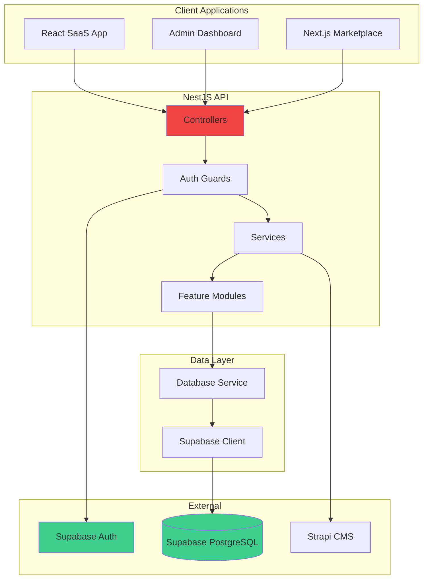

# NestJS API Architecture

The AgriTech NestJS API (`agritech-api/`) is a comprehensive backend service handling complex business logic that requires transaction management, multi-step operations, and advanced validation. It serves as the primary API for business operations, complementing Supabase for direct data access.

## Service Overview

**Location:** `agritech-api/`
**Technology:** NestJS 11 + TypeScript
**Port:** 3000
**API Docs:** http://localhost:3000/api/docs



## Why NestJS API?

The NestJS API handles operations that are too complex for direct Supabase queries:

| Use Case | Why NestJS? |
|----------|-------------|
| **Sequences** | Atomic number generation with race condition handling |
| **Journal Entries** | Multi-row transactions with balance validation |
| **Financial Reports** | Complex aggregations and calculations |
| **Payment Allocation** | Multi-invoice payment distribution |
| **Stock Valuation** | FIFO/LIFO calculations across entries |
| **Notifications** | Event-driven notifications with templates |

## Project Structure

```
agritech-api/
├── src/
│   ├── main.ts                    # Application entry point
│   ├── app.module.ts              # Root module
│   │
│   ├── modules/                   # Feature modules (61 total)
│   │   │
│   │   ├── auth/                  # Authentication & Authorization
│   │   │   ├── auth.module.ts
│   │   │   ├── auth.service.ts
│   │   │   ├── strategies/        # Passport JWT strategy
│   │   │   ├── guards/            # JwtAuthGuard, RolesGuard
│   │   │   └── decorators/        # @CurrentUser, @Public, @Roles
│   │   │
│   │   ├── database/              # Supabase Client Setup
│   │   │   ├── database.module.ts
│   │   │   └── database.service.ts
│   │   │
│   │   ├── casl/                  # Authorization (CASL)
│   │   │
│   │   │── # ─── ACCOUNTING ───
│   │   ├── accounts/              # Chart of Accounts
│   │   ├── journal-entries/       # Double-entry bookkeeping
│   │   ├── invoices/              # Sales & Purchase invoices
│   │   ├── payments/              # Payment processing
│   │   ├── payment-records/       # Payment history
│   │   ├── quotes/                # Price quotes
│   │   ├── sales-orders/          # Sales orders
│   │   ├── purchase-orders/       # Purchase orders
│   │   ├── taxes/                 # Tax configurations
│   │   ├── cost-centers/          # Cost center management
│   │   ├── account-mappings/      # Account mapping rules
│   │   ├── bank-accounts/         # Bank account management
│   │   ├── financial-reports/     # Balance sheet, P&L, Trial balance
│   │   ├── sequences/             # Document number generation
│   │   │
│   │   │── # ─── FARM MANAGEMENT ───
│   │   ├── organizations/         # Organization management
│   │   ├── organization-users/    # User-org relationships
│   │   ├── organization-modules/  # Module access per org
│   │   ├── farms/                 # Farm management
│   │   ├── parcels/               # Parcel management
│   │   ├── structures/            # Farm structures/buildings
│   │   ├── utilities/             # Farm utilities
│   │   │
│   │   │── # ─── PRODUCTION ───
│   │   ├── harvests/              # Harvest tracking
│   │   ├── production-intelligence/ # Yield analytics
│   │   ├── tree-management/       # Orchard management
│   │   ├── product-applications/  # Fertilizer/pesticide apps
│   │   ├── profitability/         # Profitability analysis
│   │   │
│   │   │── # ─── INVENTORY ───
│   │   ├── items/                 # Product/item catalog
│   │   ├── stock-entries/         # Stock movements
│   │   ├── warehouses/            # Warehouse management
│   │   ├── reception-batches/     # Incoming goods
│   │   ├── deliveries/            # Outgoing deliveries
│   │   │
│   │   │── # ─── WORKFORCE ───
│   │   ├── workers/               # Employee management
│   │   ├── tasks/                 # Task management
│   │   ├── task-assignments/      # Task assignments
│   │   ├── piece-work/            # Piece-rate work
│   │   ├── work-units/            # Work unit definitions
│   │   │
│   │   │── # ─── CRM ───
│   │   ├── customers/             # Customer management
│   │   ├── suppliers/             # Supplier management
│   │   ├── marketplace/           # B2B marketplace
│   │   │
│   │   │── # ─── ANALYSIS ───
│   │   ├── analyses/              # General analyses
│   │   ├── soil-analyses/         # Soil testing
│   │   ├── satellite-indices/     # Satellite data proxy
│   │   ├── lab-services/          # Lab integrations
│   │   │
│   │   │── # ─── PLATFORM ───
│   │   ├── users/                 # User management
│   │   ├── roles/                 # Role definitions
│   │   ├── subscriptions/         # Subscription management
│   │   ├── notifications/         # Notification system
│   │   ├── events/                # Event handling
│   │   ├── files/                 # File management
│   │   ├── document-templates/    # Document templates
│   │   ├── reports/               # Report generation
│   │   ├── dashboard/             # Dashboard data
│   │   ├── admin/                 # Admin operations
│   │   ├── demo-data/             # Demo data generation
│   │   │
│   │   │── # ─── INTEGRATIONS ───
│   │   ├── strapi/                # Strapi CMS integration
│   │   ├── blogs/                 # Blog content
│   │   └── reference-data/        # Reference data sync
│   │
│   ├── common/                    # Shared utilities
│   │   ├── decorators/            # Custom decorators
│   │   ├── filters/               # Exception filters
│   │   ├── guards/                # Custom guards
│   │   ├── interceptors/          # Request/response interceptors
│   │   ├── pipes/                 # Validation pipes
│   │   └── interfaces/            # Shared interfaces
│   │
│   ├── config/                    # Configuration
│   └── utils/                     # Helper functions
│
├── test/                          # Tests
├── Dockerfile                     # Docker configuration
├── docker-compose.yml             # Docker Compose
└── package.json
```

## Core Modules

### Authentication Module

**Location:** `agritech-api/src/modules/auth/`

Integrates with Supabase Auth for JWT validation:

```typescript
// JWT Strategy validates Supabase tokens
@Injectable()
export class JwtStrategy extends PassportStrategy(Strategy) {
  constructor(private configService: ConfigService) {
    super({
      jwtFromRequest: ExtractJwt.fromAuthHeaderAsBearerToken(),
      secretOrKey: configService.get('JWT_SECRET'),
    });
  }

  async validate(payload: JwtPayload) {
    return {
      id: payload.sub,
      email: payload.email,
      role: payload.role,
    };
  }
}
```

**Custom Decorators:**

```typescript
// Get current authenticated user
@CurrentUser() user: User

// Mark route as public (no auth required)
@Public()

// Require specific roles
@Roles('organization_admin', 'farm_manager')
```

**Guards:**

```typescript
// Protect all routes by default
@UseGuards(JwtAuthGuard)
@Controller('accounts')
export class AccountsController { }

// Role-based access
@UseGuards(JwtAuthGuard, RolesGuard)
@Roles('organization_admin')
@Delete(':id')
async delete() { }
```

### Database Module

**Location:** `agritech-api/src/modules/database/`

Provides Supabase client instances:

```typescript
@Injectable()
export class DatabaseService {
  private supabase: SupabaseClient;
  private adminClient: SupabaseClient;

  constructor(private configService: ConfigService) {
    // Standard client (RLS-enabled)
    this.supabase = createClient(
      configService.get('SUPABASE_URL'),
      configService.get('SUPABASE_ANON_KEY')
    );

    // Admin client (bypasses RLS)
    this.adminClient = createClient(
      configService.get('SUPABASE_URL'),
      configService.get('SUPABASE_SERVICE_ROLE_KEY')
    );
  }

  // RLS-enabled client
  getClient(): SupabaseClient {
    return this.supabase;
  }

  // Admin client (use sparingly)
  getAdminClient(): SupabaseClient {
    return this.adminClient;
  }

  // Client with specific user token
  getClientWithAuth(token: string): SupabaseClient {
    return createClient(
      this.configService.get('SUPABASE_URL'),
      this.configService.get('SUPABASE_ANON_KEY'),
      {
        global: {
          headers: { Authorization: `Bearer ${token}` }
        }
      }
    );
  }
}
```

### Sequences Module

**Location:** `agritech-api/src/modules/sequences/`

Generates unique sequential document numbers with race condition handling:

```typescript
@Injectable()
export class SequencesService {
  constructor(private db: DatabaseService) {}

  async getNextInvoiceNumber(organizationId: string): Promise<string> {
    const client = this.db.getAdminClient();

    // Use database function for atomic increment
    const { data, error } = await client.rpc('get_next_sequence', {
      org_id: organizationId,
      seq_type: 'invoice',
      prefix: 'INV',
    });

    if (error) throw new InternalServerErrorException(error.message);
    return data; // e.g., "INV-2025-00001"
  }
}
```

**Supported Sequences:**

| Type | Prefix | Example |
|------|--------|---------|
| Invoice | `INV-` | INV-2025-00001 |
| Quote | `QUO-` | QUO-2025-00001 |
| Sales Order | `SO-` | SO-2025-00001 |
| Purchase Order | `PO-` | PO-2025-00001 |
| Journal Entry | `JE-` | JE-2025-00001 |
| Payment | `PAY-` | PAY-2025-00001 |
| Stock Entry | `SE-` | SE-2025-00001 |

### Accounts Module (Chart of Accounts)

**Location:** `agritech-api/src/modules/accounts/`

Manages chart of accounts with support for multiple accounting standards:

```typescript
@Controller('accounts')
@UseGuards(JwtAuthGuard)
export class AccountsController {
  @Get()
  async findAll(
    @CurrentUser() user: User,
    @Query('organization_id') organizationId: string,
  ) {
    return this.accountsService.findAll(organizationId);
  }

  @Post()
  @Roles('organization_admin')
  async create(@Body() dto: CreateAccountDto) {
    return this.accountsService.create(dto);
  }

  @Post('initialize')
  @Roles('organization_admin')
  async initializeChartOfAccounts(
    @Body() dto: { organizationId: string; standard: 'OHADA' | 'IFRS' }
  ) {
    return this.accountsService.initializeFromTemplate(dto);
  }
}
```

### Journal Entries Module

**Location:** `agritech-api/src/modules/journal-entries/`

Handles double-entry bookkeeping with balance validation:

```typescript
@Injectable()
export class JournalEntriesService {
  async create(dto: CreateJournalEntryDto): Promise<JournalEntry> {
    // Validate debits = credits
    const totalDebits = dto.items.reduce((sum, item) => sum + item.debit, 0);
    const totalCredits = dto.items.reduce((sum, item) => sum + item.credit, 0);

    if (Math.abs(totalDebits - totalCredits) > 0.01) {
      throw new BadRequestException(
        `Debits (${totalDebits}) must equal credits (${totalCredits})`
      );
    }

    // Generate entry number
    const entryNumber = await this.sequencesService.getNextJournalEntryNumber(
      dto.organizationId
    );

    // Create entry with items in transaction
    const { data, error } = await this.db.getAdminClient()
      .rpc('create_journal_entry', {
        entry_data: {
          ...dto,
          entry_number: entryNumber,
        }
      });

    if (error) throw new InternalServerErrorException(error.message);
    return data;
  }

  async post(id: string): Promise<JournalEntry> {
    // Update account balances when posting
    const entry = await this.findOne(id);

    if (entry.status !== 'draft') {
      throw new BadRequestException('Only draft entries can be posted');
    }

    // Update account balances
    for (const item of entry.items) {
      await this.accountsService.updateBalance(
        item.account_id,
        item.debit - item.credit
      );
    }

    // Mark as posted
    return this.update(id, { status: 'posted', posted_at: new Date() });
  }
}
```

### Financial Reports Module

**Location:** `agritech-api/src/modules/financial-reports/`

Generates financial statements:

```typescript
@Controller('financial-reports')
@UseGuards(JwtAuthGuard)
export class FinancialReportsController {
  @Get('balance-sheet')
  async getBalanceSheet(
    @Query('organization_id') organizationId: string,
    @Query('as_of_date') asOfDate: string,
  ) {
    return this.reportsService.generateBalanceSheet(organizationId, asOfDate);
  }

  @Get('profit-loss')
  async getProfitLoss(
    @Query('organization_id') organizationId: string,
    @Query('start_date') startDate: string,
    @Query('end_date') endDate: string,
  ) {
    return this.reportsService.generateProfitLoss(
      organizationId,
      startDate,
      endDate
    );
  }

  @Get('trial-balance')
  async getTrialBalance(
    @Query('organization_id') organizationId: string,
    @Query('as_of_date') asOfDate: string,
  ) {
    return this.reportsService.generateTrialBalance(organizationId, asOfDate);
  }
}
```

### Invoices Module

**Location:** `agritech-api/src/modules/invoices/`

Handles invoice creation with automatic journal entries:

```typescript
@Injectable()
export class InvoicesService {
  async create(dto: CreateInvoiceDto): Promise<Invoice> {
    // Generate invoice number
    const invoiceNumber = await this.sequencesService.getNextInvoiceNumber(
      dto.organizationId
    );

    // Calculate totals
    const subtotal = dto.items.reduce(
      (sum, item) => sum + item.quantity * item.unit_price,
      0
    );
    const taxAmount = subtotal * (dto.tax_rate || 0) / 100;
    const totalAmount = subtotal + taxAmount;

    // Create invoice
    const invoice = await this.db.getClient()
      .from('invoices')
      .insert({
        ...dto,
        invoice_number: invoiceNumber,
        subtotal,
        tax_amount: taxAmount,
        total_amount: totalAmount,
        outstanding_amount: totalAmount,
        status: 'draft',
      })
      .select()
      .single();

    // Create invoice items
    await this.createInvoiceItems(invoice.data.id, dto.items);

    return invoice.data;
  }

  async post(id: string): Promise<Invoice> {
    const invoice = await this.findOne(id);

    // Create journal entry for posted invoice
    await this.journalEntriesService.create({
      organizationId: invoice.organization_id,
      entry_date: invoice.invoice_date,
      description: `Invoice ${invoice.invoice_number}`,
      entry_type: 'auto',
      items: [
        // Debit: Accounts Receivable
        {
          account_id: await this.getAccountId('accounts_receivable'),
          debit: invoice.total_amount,
          credit: 0,
        },
        // Credit: Revenue
        {
          account_id: await this.getAccountId('sales_revenue'),
          debit: 0,
          credit: invoice.subtotal,
        },
        // Credit: Tax Payable (if applicable)
        ...(invoice.tax_amount > 0 ? [{
          account_id: await this.getAccountId('tax_payable'),
          debit: 0,
          credit: invoice.tax_amount,
        }] : []),
      ],
    });

    return this.update(id, { status: 'sent' });
  }
}
```

### Payments Module

**Location:** `agritech-api/src/modules/payments/`

Handles payment processing with allocation to invoices:

```typescript
@Injectable()
export class PaymentsService {
  async allocateToInvoices(
    paymentId: string,
    allocations: { invoiceId: string; amount: number }[]
  ): Promise<void> {
    const payment = await this.findOne(paymentId);

    // Validate total allocation doesn't exceed payment amount
    const totalAllocation = allocations.reduce((sum, a) => sum + a.amount, 0);
    if (totalAllocation > payment.unallocated_amount) {
      throw new BadRequestException('Allocation exceeds available amount');
    }

    for (const allocation of allocations) {
      // Create allocation record
      await this.db.getClient()
        .from('payment_allocations')
        .insert({
          payment_id: paymentId,
          invoice_id: allocation.invoiceId,
          amount: allocation.amount,
        });

      // Update invoice outstanding amount
      await this.invoicesService.reduceOutstanding(
        allocation.invoiceId,
        allocation.amount
      );
    }

    // Update payment allocated amount
    await this.update(paymentId, {
      allocated_amount: payment.allocated_amount + totalAllocation,
    });
  }
}
```

## API Endpoints

### Base URL
- **Development:** `http://localhost:3000/api/v1`
- **Production:** `https://api.agritech.example.com/api/v1`

### Authentication
All endpoints require JWT token in Authorization header:
```
Authorization: Bearer <supabase-jwt-token>
```

### Core Endpoints

#### Sequences
| Method | Endpoint | Description |
|--------|----------|-------------|
| POST | `/sequences/invoice` | Generate invoice number |
| POST | `/sequences/quote` | Generate quote number |
| POST | `/sequences/journal-entry` | Generate journal entry number |

#### Accounts
| Method | Endpoint | Description |
|--------|----------|-------------|
| GET | `/accounts` | List all accounts |
| POST | `/accounts` | Create account |
| PUT | `/accounts/:id` | Update account |
| DELETE | `/accounts/:id` | Delete account |
| POST | `/accounts/initialize` | Initialize chart of accounts |

#### Journal Entries
| Method | Endpoint | Description |
|--------|----------|-------------|
| GET | `/journal-entries` | List entries |
| POST | `/journal-entries` | Create entry |
| POST | `/journal-entries/:id/post` | Post entry |
| POST | `/journal-entries/:id/void` | Void entry |

#### Invoices
| Method | Endpoint | Description |
|--------|----------|-------------|
| GET | `/invoices` | List invoices |
| POST | `/invoices` | Create invoice |
| POST | `/invoices/:id/post` | Post invoice |
| GET | `/invoices/:id/pdf` | Generate PDF |

#### Financial Reports
| Method | Endpoint | Description |
|--------|----------|-------------|
| GET | `/financial-reports/balance-sheet` | Balance sheet |
| GET | `/financial-reports/profit-loss` | P&L statement |
| GET | `/financial-reports/trial-balance` | Trial balance |

## Error Handling

### Standard Error Response

```typescript
interface ApiError {
  statusCode: number;
  message: string;
  error: string;
  timestamp: string;
  path: string;
}
```

### Common Error Codes

| Code | Error | Description |
|------|-------|-------------|
| 400 | Bad Request | Invalid input data |
| 401 | Unauthorized | Missing or invalid token |
| 403 | Forbidden | Insufficient permissions |
| 404 | Not Found | Resource not found |
| 409 | Conflict | Resource conflict (e.g., duplicate) |
| 500 | Internal Server Error | Server error |

### Exception Filter

```typescript
@Catch()
export class AllExceptionsFilter implements ExceptionFilter {
  catch(exception: unknown, host: ArgumentsHost) {
    const ctx = host.switchToHttp();
    const response = ctx.getResponse<Response>();
    const request = ctx.getRequest<Request>();

    const status = exception instanceof HttpException
      ? exception.getStatus()
      : HttpStatus.INTERNAL_SERVER_ERROR;

    const message = exception instanceof HttpException
      ? exception.message
      : 'Internal server error';

    response.status(status).json({
      statusCode: status,
      message,
      timestamp: new Date().toISOString(),
      path: request.url,
    });
  }
}
```

## Configuration

### Environment Variables

| Variable | Description | Required |
|----------|-------------|----------|
| `NODE_ENV` | Environment (development/production) | No |
| `PORT` | Server port (default: 3000) | No |
| `API_PREFIX` | API route prefix (default: api/v1) | No |
| `SUPABASE_URL` | Supabase project URL | **Yes** |
| `SUPABASE_ANON_KEY` | Supabase anonymous key | **Yes** |
| `SUPABASE_SERVICE_ROLE_KEY` | Supabase service role key | **Yes** |
| `JWT_SECRET` | JWT signing secret (from Supabase) | **Yes** |
| `CORS_ORIGIN` | Allowed CORS origins | No |
| `RATE_LIMIT_TTL` | Rate limit window (seconds) | No |
| `RATE_LIMIT_MAX` | Max requests per window | No |

### CORS Configuration

```typescript
// main.ts
app.enableCors({
  origin: configService.get('CORS_ORIGIN')?.split(',') || [
    'http://localhost:5173',
    'http://localhost:3001',
  ],
  credentials: true,
});
```

## Development

### Running Locally

```bash
cd agritech-api

# Install dependencies
npm install

# Copy environment variables
cp .env.example .env
# Edit .env with your credentials

# Start development server
npm run start:dev

# API available at http://localhost:3000
# Swagger docs at http://localhost:3000/api/docs
```

### Testing

```bash
# Unit tests
npm test

# Watch mode
npm run test:watch

# Coverage
npm run test:cov

# E2E tests
npm run test:e2e
```

### Docker

```bash
# Build image
docker build -t agritech-api .

# Run with Docker Compose
docker-compose up -d

# View logs
docker-compose logs -f agritech-api
```

## Related Documentation

- [Architecture Overview](./overview)
- [Backend Architecture](./backend)
- [Database Architecture](./database)
- [Frontend Architecture](./frontend)
