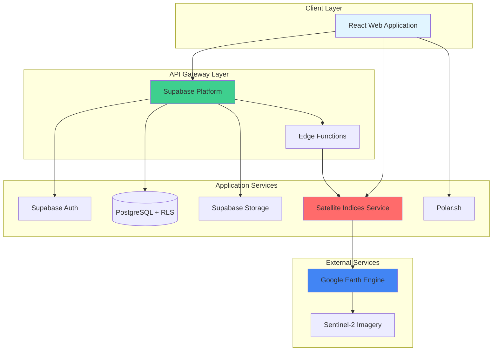
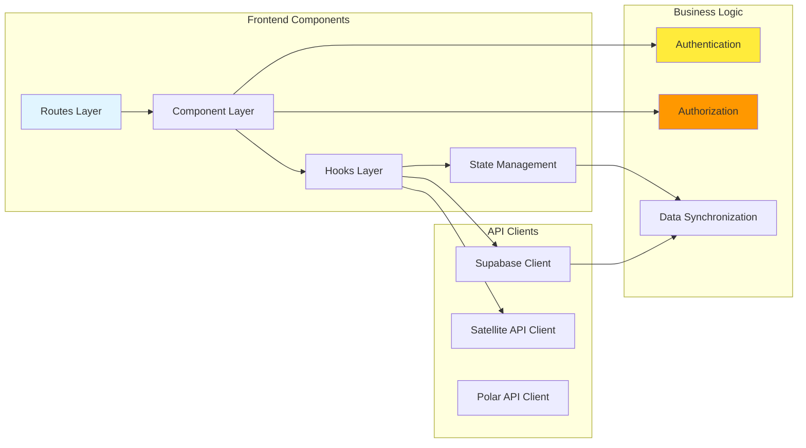
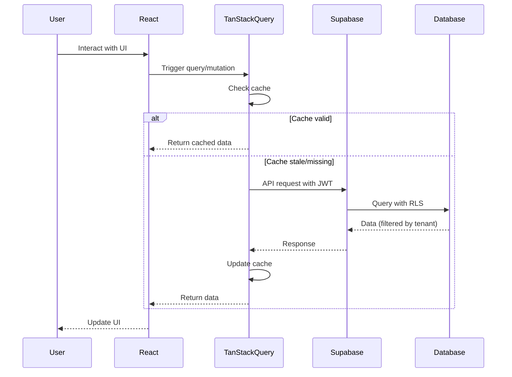
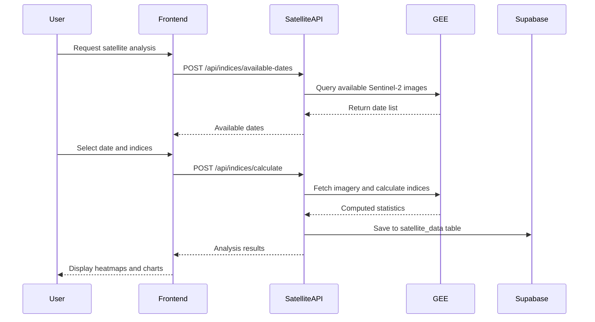

# Architecture Overview

The AgriTech Platform is a comprehensive agricultural technology solution built with a modern, scalable architecture. This document provides a high-level overview of the system's design, technology choices, and key architectural decisions.

## System Architecture

The platform follows a microservices-inspired architecture with a React frontend, PostgreSQL database via Supabase, and a specialized FastAPI satellite service.



## Technology Stack

### Frontend Stack

The frontend is built with React 19 and TypeScript, leveraging modern tooling and libraries:

| Category | Technology | Purpose |
|----------|-----------|---------|
| **Framework** | React 19 + TypeScript | Component-based UI with type safety |
| **Build Tool** | Vite | Fast development server and optimized builds |
| **Routing** | TanStack Router v1 | File-based routing with type-safe navigation |
| **State Management** | TanStack Query (React Query) | Server state caching and synchronization |
| | Jotai | Atomic global state management |
| **Forms** | React Hook Form v7+ | Performant forms with minimal re-renders |
| | Zod | Schema validation and type inference |
| **UI Components** | Custom + Radix UI | Accessible, composable primitives |
| **Styling** | Tailwind CSS | Utility-first CSS framework |
| **Authentication** | Supabase Auth | JWT-based authentication with multi-tenant support |
| **Authorization** | CASL | Isomorphic authorization with subscription enforcement |
| **Internationalization** | react-i18next | Multi-language support (EN, FR, AR) |
| **Maps** | Leaflet + OpenLayers | Interactive maps and geospatial visualization |
| **Charts** | ECharts + Recharts | Data visualization and analytics |

### Backend Stack

The backend consists of multiple services, each handling specific concerns:

| Service | Technology | Purpose |
|---------|-----------|---------|
| **Database** | Supabase (PostgreSQL) | Primary data store with real-time capabilities |
| **Row Level Security** | PostgreSQL RLS | Tenant isolation and data security |
| **Satellite Service** | FastAPI + Python | Vegetation analysis and GEE integration |
| **Storage** | Supabase Storage | Document and file management |
| **Background Jobs** | Celery + Redis | Batch processing for satellite analysis |
| **Payments** | Polar.sh | Subscription management and billing |
| **Edge Functions** | Deno | Serverless functions for server-side logic |

### External Services

| Service | Purpose |
|---------|---------|
| **Google Earth Engine** | Satellite imagery processing and analysis |
| **Sentinel-2** | Multi-spectral satellite imagery source |
| **Polar.sh** | Payment processing and subscription management |

## Project Structure

The monorepo is organized into three main directories:

```
agritech/
├── project/                              # React frontend (main application)
│   ├── src/
│   │   ├── routes/                       # TanStack Router file-based routes
│   │   ├── components/                   # React components (organized by feature)
│   │   │   ├── ui/                       # Reusable UI primitives
│   │   │   ├── SatelliteAnalysis/        # Satellite feature components
│   │   │   ├── FarmHierarchy/            # Organization/farm/parcel components
│   │   │   ├── authorization/            # Permission guards and wrappers
│   │   │   └── ...                       # Other feature components
│   │   ├── hooks/                        # Custom React hooks
│   │   ├── lib/                          # Utilities and API clients
│   │   │   ├── supabase.ts               # Supabase client
│   │   │   ├── satellite-api.ts          # Satellite service client
│   │   │   ├── casl/                     # Authorization logic
│   │   │   └── utils/                    # Helper functions
│   │   ├── schemas/                      # Zod validation schemas
│   │   ├── types/                        # TypeScript types
│   │   │   └── database.types.ts         # Generated DB types
│   │   └── locales/                      # i18n translations (en, fr, ar)
│   ├── supabase/                         # Supabase configuration
│   │   ├── migrations/                   # Database migrations
│   │   └── functions/                    # Edge functions
│   └── package.json
│
├── satellite-indices-service/            # FastAPI backend
│   ├── app/
│   │   ├── api/                          # FastAPI route handlers
│   │   │   ├── indices/                  # Vegetation indices endpoints
│   │   │   └── analysis/                 # Analysis endpoints
│   │   ├── services/                     # Business logic
│   │   │   ├── gee_service.py            # Google Earth Engine integration
│   │   │   └── cloud_masking.py          # Cloud filtering logic
│   │   ├── models/                       # Pydantic models
│   │   └── core/                         # Configuration
│   ├── research/                         # Jupyter notebooks for GEE research
│   └── requirements.txt
│
└── supabase/                             # Shared Supabase resources
    ├── migrations/                       # Database schema migrations
    └── functions/                        # Shared edge functions
```

## Component Architecture

The system is composed of several key components that work together:



### Layer Responsibilities

#### Routes Layer (`src/routes/`)
- File-based routing with TanStack Router
- Route-level authentication and authorization checks
- Layout composition and nested routing
- Lazy loading for code splitting

#### Component Layer (`src/components/`)
- Feature-based organization (SatelliteAnalysis, Tasks, Workers, etc.)
- Reusable UI primitives (`ui/` directory)
- Permission-aware rendering via CASL
- Responsive and accessible design

#### Hooks Layer (`src/hooks/`)
- Custom hooks for data fetching (TanStack Query)
- Business logic encapsulation
- Reusable state management patterns
- Multi-tenant context access

#### State Management
- **Server State**: TanStack Query for all API data
- **Global State**: Jotai atoms for UI state and preferences
- **Form State**: React Hook Form for form management
- **Auth Context**: MultiTenantAuthProvider for user, org, and farm context

## Data Flow

### Request Flow



### Satellite Analysis Flow



## Security Architecture

The platform implements security at multiple layers:

### Authentication
- JWT-based authentication via Supabase Auth
- Secure token storage in httpOnly cookies
- Automatic token refresh
- Multi-factor authentication support

### Authorization
- Two-layer system: CASL for UI + RLS for database
- Role hierarchy: system_admin → organization_admin → farm_manager → farm_worker → day_laborer → viewer
- Subscription-based feature gating
- Resource-level permissions

### Data Isolation
- Row Level Security (RLS) enforced at database level
- Organization-based tenant isolation
- User can only access their organization's data
- Cross-tenant queries blocked by RLS policies

### API Security
- All API requests require valid JWT
- Edge functions verify user authentication
- Satellite service validates requests via Supabase client
- Rate limiting on expensive operations

## Scalability Considerations

### Frontend Scalability
- **Code Splitting**: Routes lazy-loaded for smaller initial bundle
- **Query Caching**: TanStack Query reduces redundant API calls
- **Virtual Scrolling**: For long lists (workers, parcels, tasks)
- **Debounced Inputs**: Search and filter operations optimized
- **CDN Delivery**: Static assets served via CDN

### Backend Scalability
- **Connection Pooling**: Supabase handles database connections
- **Background Jobs**: Celery for long-running satellite analysis
- **Batch Processing**: Process multiple parcels in parallel
- **Caching**: Query results cached with strategic staleTime
- **Read Replicas**: PostgreSQL read replicas for analytics (future)

### Database Scalability
- **Indexes**: Strategic indexing on foreign keys and query columns
- **Partitioning**: Large tables (satellite_data, journal_items) can be partitioned
- **Materialized Views**: For complex aggregations and reports
- **Archive Strategy**: Old data moved to cold storage

## Performance Optimization

### Frontend Performance
- React 19 with automatic batching and transitions
- Memoization for expensive computations
- Lazy loading of heavy components (maps, charts)
- Image optimization (WebP format, lazy loading)
- Tree-shaking for smaller bundle size

### API Performance
- Query optimization with proper SELECT fields
- Batch operations where possible
- Pagination for large datasets
- Strategic use of database functions (RPC)
- Cloud-optimized GeoTIFF for satellite exports

### Monitoring and Observability
- Error tracking (planned: Sentry integration)
- Performance monitoring (planned: Web Vitals)
- Database query performance (Supabase dashboard)
- API response times tracked
- User analytics for feature usage

## Development Philosophy

### Type Safety First
- TypeScript throughout the stack
- Generated types from database schema
- Zod for runtime validation
- Pydantic for Python API validation

### Developer Experience
- Fast development server (Vite)
- Hot module replacement (HMR)
- Type checking in editor (LSP)
- Automated linting and formatting
- Clear error messages

### Testing Strategy
- Unit tests with Vitest for utilities and hooks
- Component tests with React Testing Library
- E2E tests with Playwright for critical flows
- Manual testing before production deployment

### Documentation
- Inline code comments for complex logic
- JSDoc for public APIs
- Architecture documentation (this guide)
- README files in each major directory

## Future Considerations

### Planned Enhancements
- Real-time collaboration features (Supabase Realtime)
- Mobile application (React Native)
- Advanced AI/ML features for crop predictions
- Integration with IoT sensors for real-time monitoring
- GraphQL API for third-party integrations
- Multi-region deployment for global availability

### Technical Debt
- Migrate older components to newer patterns
- Increase test coverage to 80%+
- Implement comprehensive error boundaries
- Add more granular permission controls
- Optimize satellite data storage and retrieval

## Related Documentation

- [Multi-Tenancy Architecture](./multi-tenancy.md)
- [Frontend Architecture](./frontend.md)
- [Backend Architecture](./backend.md)
- [Database Architecture](./database.md)
- [Satellite Service Architecture](./satellite-service.md)
