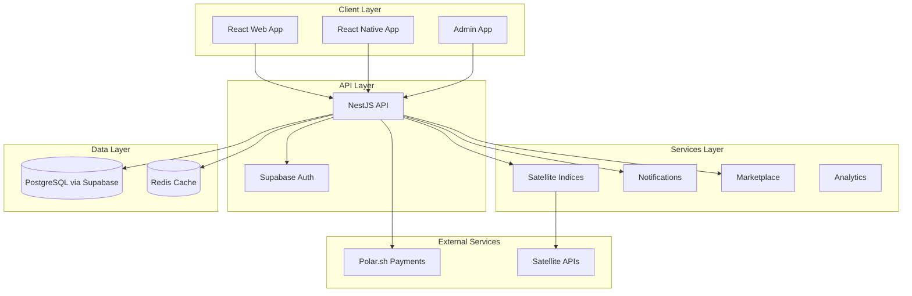

# Architecture Overview

The AgriTech Platform is built as a **multi-tenant SaaS application** using a monorepo structure with pnpm workspaces.

## Monorepo Structure

```
agritech/
├── agritech-api/          # NestJS backend API
├── project/               # React frontend (web app)
├── mobile/                # React Native mobile app
├── admin-app/             # Admin application
├── admin-tool/            # Admin CLI tool
├── cms/                   # Content management system
├── directus/              # Directus CMS instance
├── supabase/              # Supabase functions and migrations
├── backend-service/       # Shared backend services
├── agritech-remotion/     # Video generation with Remotion
├── marketplace-frontend/  # Marketplace subdomain
├── docs/                  # Docusaurus documentation
└── scripts/               # Build and deployment scripts
```

## High-Level Architecture


```mermaid
graph TB
    subgraph "Client Layer"
        WEB[React Web App]
        MOBILE[React Native App]
        ADMIN[Admin App]
    end

    subgraph "API Layer"
        API[NestJS API]
        AUTH[Supabase Auth]
    end

    subgraph "Services Layer"
        SATELLITE[Satellite Indices]
        NOTIFICATIONS[Notifications]
        MARKETPLACE[Marketplace]
        ANALYTICS[Analytics]
    end

    subgraph "Data Layer"
        PG[(PostgreSQL via Supabase)]
        REDIS[(Redis Cache)]
    end

    subgraph "External Services"
        POLAR[Polar.sh Payments]
        SATELLITE_API[Satellite APIs]
    end

    WEB --> API
    MOBILE --> API
    ADMIN --> API

    API --> AUTH
    API --> SATELLITE
    API --> NOTIFICATIONS
    API --> MARKETPLACE

    API --> PG
    API --> REDIS

    API --> POLAR
    SATELLITE --> SATELLITE_API
```

## Frontend Architecture (project/)

### Tech Stack

- **React 18** with TypeScript
- **TanStack Router v7** (formerly React Router) - File-based routing with loaders
- **TanStack Query** - Server state management
- **Zustand** - Client state management
- **TailwindCSS** - Styling
- **Radix UI** - Component primitives
- **React Hook Form** - Form management
- **Zod** - Schema validation

### Directory Structure

```
project/
├── src/
│   ├── components/          # Reusable components
│   │   ├── ui/             # Radix UI components
│   │   ├── Dashboard/      # Dashboard widgets
│   │   ├── AIReportSection/ # AI report components
│   │   ├── Accounting/     # Accounting components
│   │   ├── FarmHierarchy/  # Farm management
│   │   ├── Billing/        # Subscription billing
│   │   └── ...
│   ├── routes/             # TanStack Router file-based routes
│   │   ├── _authenticated/ # Protected routes
│   │   │   ├── (production)/ # Production module routes
│   │   │   ├── (accounting)/ # Accounting module routes
│   │   │   ├── (inventory)/  # Inventory module routes
│   │   │   ├── (workforce)/  # Workforce module routes
│   │   │   └── (misc)/       # Miscellaneous routes
│   │   └── (auth)/          # Public auth routes
│   ├── lib/                # Utilities and configurations
│   │   ├── api-client.ts   # Axios-based API client
│   │   ├── api-service-factory.ts # Service factory
│   │   ├── subscription-config.ts # Plan bundles (deprecated - use DB)
│   │   └── query-keys.ts   # React Query keys
│   ├── hooks/              # Custom React hooks
│   │   ├── useQueryData.ts
│   │   ├── useTreeManagement.ts
│   │   └── ...
│   ├── services/           # API service modules
│   │   ├── farmsService.ts
│   │   ├── parcelsService.ts
│   │   ├── subscriptionsService.ts
│   │   └── ...
│   └── stores/             # Zustand stores
└── package.json
```

### Route Organization

Routes are organized by functional area using TanStack Router's file-based routing:

| Route Directory | Purpose |
|-----------------|---------|
| `(production)/` | Farm, parcel, crop, harvest management |
| `(accounting)/` | Financial accounts, journal entries, invoices |
| `(inventory)/` | Stock, warehouses, items |
| `(workforce)/` | Workers, tasks |
| `(misc)/` | Marketplace, lab services, utilities, notifications |
| `(settings)/` | Settings pages |
| `(core)/` | Core authenticated routes |

### Key Routes

**Production Routes**:
- `/parcels` - Parcel list
- `/parcels/:parcelId` - Parcel detail
- `/parcels/:parcelId/analyse` - Analysis view
- `/parcels/:parcelId/satellite` - Satellite imagery
- `/parcels/:parcelId/weather` - Weather data
- `/parcels/:parcelId/production` - Production data
- `/parcels/:parcelId/reports` - Reports
- `/parcels/:parcelId/profitability` - Profitability
- `/orchards` - Orchard management
- `/trees` - Tree management
- `/pruning` - Pruning records
- `/harvests` - Harvest management
- `/crop-cycles` - Crop cycles
- `/campaigns` - Campaigns
- `/quality-control` - Quality control
- `/farm-hierarchy` - Farm hierarchy

**Accounting Routes**:
- `/accounting` - Accounting dashboard
- `/accounting/accounts` - Chart of accounts
- `/accounting/journal` - Journal entries
- `/accounting/invoices` - Invoices
- `/accounting/quotes` - Quotes
- `/accounting/sales-orders` - Sales orders
- `/accounting/purchase-orders` - Purchase orders
- `/accounting/payments` - Payments
- `/accounting/reports` - Financial reports

## Backend Architecture (agritech-api/)

### Tech Stack

- **NestJS** - Framework
- **PostgreSQL** via Supabase - Database
- **Supabase Auth** - Authentication
- **CASL** - Authorization
- **Bull** - Job queue
- **Swagger** - API documentation

### Directory Structure

```
agritech-api/
├── src/
│   ├── common/             # Shared utilities
│   │   ├── guards/         # Route guards
│   │   │   ├── jwt-auth.guard.ts
│   │   │   ├── organization.guard.ts
│   │   │   └── subscription.guard.ts
│   │   ├── decorators/     # Custom decorators
│   │   ├── filters/        # Exception filters
│   │   └── interceptors/   # Interceptors
│   ├── modules/            # Feature modules
│   │   ├── auth/           # Authentication
│   │   ├── organizations/  # Organization management
│   │   ├── farms/          # Farm management
│   │   ├── parcels/        # Parcel management
│   │   ├── crops/          # Crop management
│   │   ├── harvests/       # Harvest tracking
│   │   ├── subscriptions/  # Subscription management
│   │   ├── module-config/  # Module configuration
│   │   ├── organization-modules/ # Org module assignment
│   │   ├── accounts/       # Chart of accounts
│   │   ├── journal-entries/ # Double-entry accounting
│   │   ├── invoices/       # Invoice management
│   │   ├── quotes/         # Quote management
│   │   ├── sales-orders/   # Sales order management
│   │   ├── purchase-orders/ # Purchase order management
│   │   ├── payments/       # Payment tracking
│   │   ├── stock-entries/  # Stock management
│   │   ├── warehouses/     # Warehouse management
│   │   ├── workers/        # Worker management
│   │   ├── tasks/          # Task management
│   │   ├── tree-management/ # Tree-specific operations
│   │   ├── marketplace/    # B2B marketplace
│   │   ├── compliance/     # Compliance & certifications
│   │   ├── ai-reports/     # AI-powered reports
│   │   ├── chat/           # Chat functionality
│   │   ├── notifications/  # Notification service
│   │   ├── satellite-indices/ # Satellite imagery
│   │   └── ...
│   ├── database/           # Database utilities
│   └── main.ts             # Application entry point
└── package.json
```

### API Modules (80+ modules)

The backend is organized into feature modules:

**Core**: auth, organizations, users, roles, subscriptions

**Production**: farms, parcels, crops, harvests, crop-cycles, campaigns, quality-control, tree-management, pruning

**Accounting**: accounts, journal-entries, invoices, quotes, sales-orders, purchase-orders, payments, financial-reports, taxes, fiscal-years

**Inventory**: warehouses, items, stock-entries, reception-batches, suppliers

**Workforce**: workers, piece-work, work-units, task-assignments

**Analytics**: satellite-indices, soil-analyses, production-intelligence, profitability, analyses

**Services**: marketplace, ai-reports, chat, notifications, reminders, pest-alerts, document-templates

## Multi-Tenancy

The platform uses **organization-based multi-tenancy**:

### Database Pattern

```sql
-- Organizations are the top-level tenant
CREATE TABLE organizations (
  id UUID PRIMARY KEY DEFAULT gen_random_uuid(),
  name VARCHAR(255) NOT NULL,
  slug VARCHAR(100) UNIQUE NOT NULL,
  created_at TIMESTAMPTZ DEFAULT NOW()
);

-- All data tables reference organization_id
CREATE TABLE farms (
  id UUID PRIMARY KEY DEFAULT gen_random_uuid(),
  organization_id UUID NOT NULL REFERENCES organizations(id),
  name VARCHAR(255) NOT NULL,
  -- ...
);

-- Users can belong to multiple organizations
CREATE TABLE organization_users (
  id UUID PRIMARY KEY DEFAULT gen_random_uuid(),
  organization_id UUID NOT NULL REFERENCES organizations(id),
  user_id UUID NOT NULL REFERENCES users(id),
  role_id UUID REFERENCES roles(id),
  is_active BOOLEAN DEFAULT true,
  UNIQUE(organization_id, user_id)
);
```

### Authorization Flow

1. User authenticates with Supabase Auth
2. JWT token contains user ID
3. `JwtAuthGuard` validates token and sets `request.userId`
4. `OrganizationGuard` determines organization from header/context
5. `SubscriptionGuard` checks organization's subscription status
6. Controllers access data scoped to organization

## Module System

The platform uses a **database-driven module system**:

### Key Components

1. **Database Configuration**: `modules` table with translations
2. **Supabase RPC Functions**: `get_module_config()`, `calculate_module_subscription_price()`
3. **Module Config Service**: Fetches config from database
4. **Subscription Guard**: Protects API routes
5. **Trial Subscriptions**: 14-day trial for new organizations

### Module Categories

| Category | Modules |
|----------|---------|
| **Production** | Farm Management, Orchards, Trees, Crop Cycles, Harvests, Pruning |
| **Inventory** | Stock, Warehouses, Items, Reception Batches |
| **Accounting** | Accounts, Journal Entries, Invoices, Quotes, Sales Orders |
| **Workforce** | Workers, Tasks, Piece Work |
| **Analytics** | Satellite Analysis, Quality Control, Production Intelligence |
| **Marketplace** | B2B Marketplace integration |
| **Compliance** | Certifications, Document Management |

See [Subscriptions](/features/subscriptions) for complete details.

## Satellite Service

### Architecture

The satellite service provides multi-provider access to Sentinel-2 data through a unified interface:

```
Satellite Indices Module (backend-service/)
├── Provider Factory (auto-selects GEE or CDSE)
│   ├── GEEProvider (Google Earth Engine - dev/fallback)
│   └── CDSEProvider (Copernicus Data Space - commercial)
├── Abstract Interface (ISatelliteProvider)
├── Shared Types & Utilities
└── FastAPI Endpoints
```

### Multi-Provider Support

| Provider | Use Case | Cost | Commercial |
|----------|----------|------|------------|
| **GEE** | Development/Fallback | Free (research/dev) | ❌ Requires license |
| **CDSE/openEO** | Production | Free tier (10K credits/mo) | ✅ Allowed |

### Integration Points

- **API**: FastAPI endpoints in `backend-service/app/api/`
- **Backend**: Python service with openEO integration
- **Frontend**: `/parcels/:parcelId/satellite` route for visualization
- **Factory**: `SatelliteServiceFactory` for provider selection

See [Satellite Analysis](/features/satellite-analysis) for complete details.

## Marketplace Service

### Architecture

The B2B marketplace connects farmers with suppliers:

```
Marketplace Module
├── Quote Requests (sent/received)
├── Supplier Directory
├── Product Catalog
└── Order Management
```

### Integration Points

- **API**: `/marketplace` endpoints
- **Frontend**: `/marketplace` routes
- **Services**: Quote request management, supplier matching

## Security

### Authentication

- Supabase Auth for user authentication
- JWT tokens with short expiry
- Refresh token rotation

### Authorization

- CASL (Code Access Security Library) for permissions
- Role-based access control (RBAC)
- Organization-based data scoping
- Subscription-based feature access

### Guards

| Guard | Purpose |
|-------|---------|
| `JwtAuthGuard` | Validates JWT token |
| `OrganizationGuard` | Sets organization context |
| `SubscriptionGuard` | Checks valid subscription |
| `PoliciesGuard` | Enforces CASL policies |

## Deployment

### Infrastructure

- **Hosting**: Docker containers
- **Database**: Supabase-hosted PostgreSQL
- **CDN**: CloudFlare for static assets
- **Monitoring**: Custom monitoring service

### Environment Configuration

```bash
# agritech-api/.env
DATABASE_URL=postgresql://...
SUPABASE_URL=https://...
SUPABASE_ANON_KEY=...
JWT_SECRET=...
```

See [Deployment](/deployment/production) for full details.

## API Documentation

Swagger documentation is available at `/api` when running the development server.

### Module Configuration Endpoints

- `GET /module-config` - Get module configuration with translations
- `POST /module-config/calculate-price` - Calculate subscription price
- `POST /module-config/clear-cache` - Clear configuration cache

### Subscription Endpoints

- `POST /subscriptions/trial` - Create trial subscription
- `GET /subscriptions/check` - Check subscription validity
- `GET /subscriptions/usage` - Get usage statistics

## References

- [Frontend Architecture](/architecture/frontend) - Frontend patterns and conventions
- [NestJS API](/architecture/nestjs-api) - Backend architecture details
- [Database](/architecture/database) - Database schema and design
- [Subscriptions](/features/subscriptions) - Module system documentation
