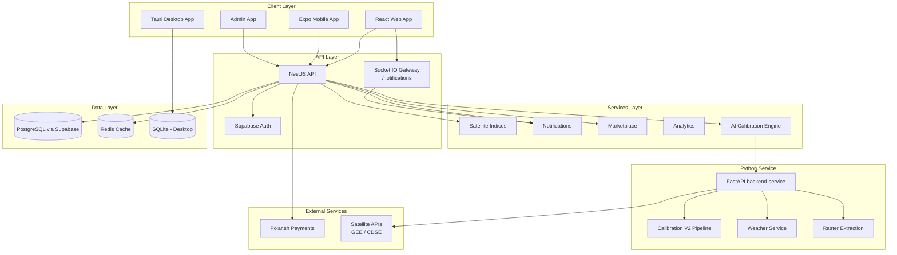

# Architecture Overview

The AgroGina Platform is built as a **multi-tenant SaaS application** using a monorepo structure with pnpm workspaces.

## Monorepo Structure

```
agritech/
├── agritech-api/          # NestJS backend API
├── project/               # React frontend (web app)
├── mobile/                # Expo SDK 54 mobile app (field workers)
├── admin-app/             # Admin application
├── admin-tool/            # Admin CLI tool
├── cms/                   # Content management system
├── directus/              # Directus CMS instance
├── supabase/              # Supabase functions and migrations
├── backend-service/       # Python/FastAPI satellite and AI calibration service
├── agritech-remotion/     # Video generation with Remotion
├── marketplace-frontend/  # Marketplace subdomain
├── docs/                  # Docusaurus documentation
└── scripts/               # Build and deployment scripts
```

## High-Level Architecture


```mermaid
graph TB
    subgraph "Client Layer"
        WEB[React Web App]
        MOBILE[Expo Mobile App]
        DESKTOP[Tauri Desktop App]
        ADMIN[Admin App]
    end

    subgraph "API Layer"
        API[NestJS API]
        AUTH[Supabase Auth]
        WS[Socket.IO Gateway\n/notifications]
    end

    subgraph "Services Layer"
        SATELLITE[Satellite Indices]
        NOTIFICATIONS[Notifications]
        MARKETPLACE[Marketplace]
        ANALYTICS[Analytics]
        AI[AI Calibration Engine]
    end

    subgraph "Python Service"
        PYAPI[FastAPI backend-service]
        PIPELINE[Calibration V2 Pipeline]
        WEATHER[Weather Service]
        RASTER[Raster Extraction]
    end

    subgraph "Data Layer"
        PG[(PostgreSQL via Supabase)]
        REDIS[(Redis Cache)]
        SQLITE[(SQLite - Desktop)]
    end

    subgraph "External Services"
        POLAR[Polar.sh Payments]
        SATELLITE_API[Satellite APIs\nGEE / CDSE]
    end

    WEB --> API
    WEB --> WS
    MOBILE --> API
    DESKTOP --> SQLITE
    ADMIN --> API

    API --> AUTH
    API --> SATELLITE
    API --> NOTIFICATIONS
    API --> MARKETPLACE
    API --> AI
    WS --> NOTIFICATIONS

    AI --> PYAPI
    PYAPI --> PIPELINE
    PYAPI --> WEATHER
    PYAPI --> RASTER

    API --> PG
    API --> REDIS

    API --> POLAR
    PYAPI --> SATELLITE_API
```

## Frontend Architecture (project/)

### Tech Stack

- **React 18** with TypeScript
- **TanStack Router** - File-based routing with loaders
- **TanStack Query** - Server state management
- **Zustand** - Client state management
- **TailwindCSS** - Styling
- **Radix UI** - Component primitives
- **React Hook Form** - Form management
- **Zod** - Schema validation

### Directory Structure

```
project/
├── src/
│   ├── components/          # Reusable components
│   │   ├── ui/             # Radix UI components
│   │   ├── Dashboard/      # Dashboard widgets
│   │   ├── AIReportSection/ # AI report components
│   │   ├── Accounting/     # Accounting components
│   │   ├── FarmHierarchy/  # Farm management
│   │   ├── Billing/        # Subscription billing
│   │   └── ...
│   ├── routes/             # TanStack Router file-based routes
│   │   ├── _authenticated/ # Protected routes
│   │   │   ├── (production)/ # Production module routes
│   │   │   ├── (accounting)/ # Accounting module routes
│   │   │   ├── (inventory)/  # Inventory module routes
│   │   │   ├── (workforce)/  # Workforce module routes
│   │   │   └── (misc)/       # Miscellaneous routes
│   │   └── (auth)/          # Public auth routes
│   ├── lib/                # Utilities and configurations
│   │   ├── api-client.ts   # Axios-based API client
│   │   ├── api-service-factory.ts # Service factory
│   │   ├── subscription-config.ts # Plan bundles (deprecated - use DB)
│   │   └── query-keys.ts   # React Query keys
│   ├── hooks/              # Custom React hooks
│   │   ├── useQueryData.ts
│   │   ├── useTreeManagement.ts
│   │   └── ...
│   ├── services/           # API service modules
│   │   ├── farmsService.ts
│   │   ├── parcelsService.ts
│   │   ├── subscriptionsService.ts
│   │   └── ...
│   └── stores/             # Zustand stores
└── package.json
```

### Route Organization

Routes are organized by functional area using TanStack Router's file-based routing:

| Route Directory | Purpose |
|-----------------|---------|
| `(production)/` | Farm, parcel, crop, harvest management |
| `(accounting)/` | Financial accounts, journal entries, invoices |
| `(inventory)/` | Stock, warehouses, items |
| `(workforce)/` | Workers, tasks |
| `(misc)/` | Marketplace, lab services, utilities, notifications |
| `(settings)/` | Settings pages |
| `(core)/` | Core authenticated routes |

### Key Routes

**Production Routes**:
- `/parcels` - Parcel list
- `/parcels/:parcelId` - Parcel detail
- `/parcels/:parcelId/analyse` - Analysis view
- `/parcels/:parcelId/satellite` - Satellite imagery
- `/parcels/:parcelId/weather` - Weather data
- `/parcels/:parcelId/production` - Production data
- `/parcels/:parcelId/reports` - Reports
- `/parcels/:parcelId/profitability` - Profitability
- `/orchards` - Orchard management
- `/trees` - Tree management
- `/pruning` - Pruning records
- `/harvests` - Harvest management
- `/crop-cycles` - Crop cycles
- `/campaigns` - Campaigns
- `/quality-control` - Quality control
- `/farm-hierarchy` - Farm hierarchy

**Accounting Routes**:
- `/accounting` - Accounting dashboard
- `/accounting/accounts` - Chart of accounts
- `/accounting/journal` - Journal entries
- `/accounting/invoices` - Invoices
- `/accounting/quotes` - Quotes
- `/accounting/sales-orders` - Sales orders
- `/accounting/purchase-orders` - Purchase orders
- `/accounting/payments` - Payments
- `/accounting/reports` - Financial reports

## Backend Architecture (agritech-api/)

### Tech Stack

- **NestJS** - Framework
- **PostgreSQL** via Supabase - Database
- **Supabase Auth** - Authentication
- **CASL** - Authorization
- **Bull** - Job queue
- **Socket.IO** - Real-time WebSocket gateway
- **Swagger** - API documentation

### Directory Structure

```
agritech-api/
├── src/
│   ├── common/             # Shared utilities
│   │   ├── guards/         # Route guards
│   │   │   ├── jwt-auth.guard.ts
│   │   │   ├── organization.guard.ts
│   │   │   └── subscription.guard.ts
│   │   ├── decorators/     # Custom decorators
│   │   ├── filters/        # Exception filters
│   │   └── interceptors/   # Interceptors
│   ├── modules/            # Feature modules
│   │   ├── auth/           # Authentication
│   │   ├── organizations/  # Organization management
│   │   ├── farms/          # Farm management
│   │   ├── parcels/        # Parcel management
│   │   ├── crops/          # Crop management
│   │   ├── harvests/       # Harvest tracking
│   │   ├── calibration/    # AI Calibration Engine
│   │   ├── subscriptions/  # Subscription management
│   │   ├── module-config/  # Module configuration
│   │   ├── organization-modules/ # Org module assignment
│   │   ├── accounts/       # Chart of accounts
│   │   ├── journal-entries/ # Double-entry accounting
│   │   ├── invoices/       # Invoice management
│   │   ├── quotes/         # Quote management
│   │   ├── sales-orders/   # Sales order management
│   │   ├── purchase-orders/ # Purchase order management
│   │   ├── payments/       # Payment tracking
│   │   ├── stock-entries/  # Stock management
│   │   ├── warehouses/     # Warehouse management
│   │   ├── workers/        # Worker management
│   │   ├── tasks/          # Task management
│   │   ├── tree-management/ # Tree-specific operations
│   │   ├── marketplace/    # B2B marketplace
│   │   ├── compliance/     # Compliance & certifications
│   │   ├── ai-reports/     # AI-powered reports
│   │   ├── chat/           # Chat functionality
│   │   ├── notifications/  # Notification service + Socket.IO gateway
│   │   ├── satellite-indices/ # Satellite imagery
│   │   └── ...
│   ├── database/           # Database utilities
│   └── main.ts             # Application entry point
└── package.json
```

### API Modules (80+ modules)

The backend is organized into feature modules:

**Core**: auth, organizations, users, roles, subscriptions

**Production**: farms, parcels, crops, harvests, crop-cycles, campaigns, quality-control, tree-management, pruning

**Accounting**: accounts, journal-entries, invoices, quotes, sales-orders, purchase-orders, payments, financial-reports, taxes, fiscal-years

**Inventory**: warehouses, items, stock-entries, reception-batches, suppliers

**Workforce**: workers, piece-work, work-units, task-assignments

**Analytics**: satellite-indices, soil-analyses, production-intelligence, profitability, analyses

**AI**: calibration (state machine, V2 pipeline, nutrition options)

**Services**: marketplace, ai-reports, chat, notifications, reminders, pest-alerts, document-templates

## AI Calibration Engine

The AI Calibration Engine automates parcel analysis through a state machine and a multi-step satellite pipeline.

### State Machine

Parcel calibration progresses through the following states:

```
disabled
  -> downloading        (satellite data fetch initiated)
  -> pret_calibrage     (data ready, awaiting pipeline start)
  -> calibrating        (V2 pipeline running)
  -> awaiting_validation (pipeline complete, user must validate results)
  -> awaiting_nutrition_option (user selects nutrition plan)
  -> active             (ai_enabled flag set, calibration complete)
```

The `ai_enabled` flag is only set after explicit user validation. Phase gating ensures no state is skipped.

### V2 Pipeline (8 Steps)

The calibration pipeline runs in `backend-service/` via FastAPI:

| Step | Description |
|------|-------------|
| 1 | Satellite extraction (Sentinel-2 NDVI, EVI, NDWI) |
| 2 | Weather data integration (historical + forecast) |
| 3 | Percentile computation (baseline statistics) |
| 4 | Phenology analysis (growth stage detection) |
| 5 | Anomaly detection (stress and disease indicators) |
| 6 | Yield estimation (predicted harvest output) |
| 7 | Zone mapping (spatial variability within parcel) |
| 8 | Health score computation (composite parcel score) |

### Nutrition Option Selection

After pipeline validation, users select a nutrition plan:

| Option | Label | Description |
|--------|-------|-------------|
| A | Standard | Baseline fertilization program |
| B | Enhanced | Optimized nutrient delivery |
| C | Intensive | Maximum yield nutrition protocol |

### Real-time Progress Streaming

Pipeline progress is streamed to the frontend via Socket.IO. See the WebSocket section below for event details.

### Cron Jobs

| Job | Schedule (UTC) | Description |
|-----|----------------|-------------|
| Satellite fetch | 06:00 daily | Pull latest Sentinel-2 imagery |
| Weather fetch | 06:30 daily | Fetch historical and forecast weather |
| AI pipeline | 08:00 daily | Run calibration pipeline for active parcels |

## WebSocket / Real-time Architecture

### Socket.IO Gateway

The NestJS notifications module exposes a Socket.IO gateway on the `/notifications` namespace.

**Authentication**: JWT token required on connection (validated by `JwtAuthGuard`).

**Rooms**: Clients are placed in organization-scoped and user-scoped rooms:
- `org:{orgId}` - All users in an organization
- `user:{userId}` - Individual user notifications

### Events

| Event | Direction | Description |
|-------|-----------|-------------|
| `calibration:phase-changed` | Server -> Client | Calibration state machine transition |
| `calibration:progress` | Server -> Client | Pipeline step progress (0-100%) |
| `calibration:failed` | Server -> Client | Pipeline error with reason |
| `notification:new` | Server -> Client | New in-app notification |

## Python Satellite Service (backend-service/)

### Tech Stack

- **FastAPI** - API framework
- **Google Earth Engine (GEE)** - Development / fallback satellite provider
- **Copernicus Data Space (CDSE / openEO)** - Production satellite provider
- **NumPy / Rasterio** - Raster processing

### API Endpoints

| Endpoint | Description |
|----------|-------------|
| `POST /api/calibration/v2/run` | Start the 8-step calibration pipeline |
| `POST /api/calibration/v2/precompute-gdd` | Precompute GDD per daily row (`latitude`, `longitude`, `crop_type`, `rows[]` with temps — see `calibration.py` / OpenAPI) |
| `POST /api/calibration/v2/extract-raster` | Extract raster values for a parcel geometry |
| `GET /api/weather/historical` | Fetch historical weather data |
| `GET /api/weather/forecast` | Fetch weather forecast |

### Multi-Provider Support

| Provider | Use Case | Cost | Commercial |
|----------|----------|------|------------|
| **GEE** | Development/Fallback | Free (research/dev) | Requires license |
| **CDSE/openEO** | Production | Free tier (10K credits/mo) | Allowed |

### Integration Points

- **API**: FastAPI endpoints in `backend-service/app/api/`
- **Backend**: Called by NestJS calibration module
- **Frontend**: Progress streamed via Socket.IO
- **Factory**: `SatelliteServiceFactory` for provider selection

See [Satellite Analysis](/features/satellite-analysis) for complete details.

## Mobile App Architecture (mobile/)

### Tech Stack

- **Expo SDK 54** with React Native
- **expo-router** - File-based navigation
- **TanStack Query** - Server state management
- **Zustand** - Client state management
- **expo-sqlite** - Offline local database

### Tab Navigation

| Tab | Description |
|-----|-------------|
| Home | Dashboard with today's summary |
| Tasks | View and complete assigned tasks |
| Harvest | Record new harvests with GPS and photos |
| Clock | Clock in/out, view time entries |
| Profile | User settings and logout |

### Directory Structure

```
mobile/
├── app/                  # Expo Router pages
│   ├── _layout.tsx       # Root layout with providers
│   ├── (auth)/           # Auth screens
│   ├── (tabs)/           # Main tab navigation
│   │   ├── index.tsx     # Home dashboard
│   │   ├── tasks.tsx     # Task list
│   │   ├── harvest.tsx   # Harvest recording
│   │   ├── clock.tsx     # Time tracking
│   │   └── profile.tsx   # User profile
│   ├── task/[id].tsx     # Task detail screen
│   └── harvest/new.tsx   # New harvest modal
├── src/
│   ├── hooks/            # React Query hooks
│   ├── stores/           # Zustand stores
│   ├── lib/              # API client, offline sync
│   └── types/            # TypeScript types
└── app.json
```

### Key Capabilities

- Offline-first with expo-sqlite local cache
- Biometric authentication (Face ID / fingerprint)
- Camera integration for harvest photo capture
- GPS tracking for harvest location recording
- Push notifications for task reminders

## Desktop App Architecture (project/src-tauri/)

### Tech Stack

- **Tauri v1** - Desktop framework (Rust backend + web frontend)
- **SQLite** - Local database via rusqlite
- **bcrypt** - Offline password hashing
- **aes-gcm** - Encrypted data bundle import

### Key Features

- **Offline-first**: Fully functional without internet connection
- **Data Import**: Import encrypted organization data bundles exported from the web app
- **Full CRUD**: Manage farms, parcels, tasks, workers, harvests, inventory locally
- **Cross-platform**: macOS, Windows, Linux

### Database Schema

The desktop SQLite database mirrors the cloud PostgreSQL schema with 35+ tables:

| Category | Tables |
|----------|--------|
| Core | organizations, roles, user_profiles, organization_users |
| Farm | farms, parcels, structures, warehouses, cost_centers |
| Workforce | workers, tasks, task_assignments |
| Harvest | harvest_records, reception_batches |
| Inventory | items, item_groups, stock_entries, stock_entry_items |
| Sales | customers, quotes, sales_orders, invoices |
| Purchasing | suppliers, purchase_orders |
| Accounting | accounts, journal_entries, costs, revenues, payments |

### Directory Structure

```
project/src-tauri/
├── src/
│   ├── main.rs           # Tauri app entry point
│   ├── commands/         # Tauri IPC commands (Rust)
│   │   ├── auth.rs       # Local login/logout/setup
│   │   ├── farms.rs      # Farm CRUD operations
│   │   ├── parcels.rs    # Parcel CRUD operations
│   │   ├── organizations.rs
│   │   ├── import.rs     # Bundle import/validation
│   │   └── data.rs       # Generic table operations
│   └── db/
│       ├── mod.rs        # SQLite database initialization
│       └── schema.sql    # Full database schema
├── Cargo.toml           # Rust dependencies
└── tauri.conf.json      # Tauri configuration
```

### Data Bundle Import Flow

1. Web app exports organization data as an encrypted bundle (AES-GCM)
2. User provides passphrase to decrypt
3. Desktop app validates bundle integrity
4. Data is imported into local SQLite database
5. User works fully offline with complete data access

## Multi-Tenancy

The platform uses **organization-based multi-tenancy**:

### Hierarchy

```
Organizations
  -> Farms
    -> Parcels
      -> Sub-parcels
```

### Roles

| Role | Level |
|------|-------|
| system_admin | Platform-wide administration |
| organization_admin | Full organization access |
| farm_manager | Manage assigned farms |
| farm_worker | Operational farm tasks |
| day_laborer | Limited task execution |
| viewer | Read-only access |

### Database Pattern

```sql
-- Organizations are the top-level tenant
CREATE TABLE organizations (
  id UUID PRIMARY KEY DEFAULT gen_random_uuid(),
  name VARCHAR(255) NOT NULL,
  slug VARCHAR(100) UNIQUE NOT NULL,
  created_at TIMESTAMPTZ DEFAULT NOW()
);

-- All data tables reference organization_id
CREATE TABLE farms (
  id UUID PRIMARY KEY DEFAULT gen_random_uuid(),
  organization_id UUID NOT NULL REFERENCES organizations(id),
  name VARCHAR(255) NOT NULL,
  -- ...
);

-- Users can belong to multiple organizations
CREATE TABLE organization_users (
  id UUID PRIMARY KEY DEFAULT gen_random_uuid(),
  organization_id UUID NOT NULL REFERENCES organizations(id),
  user_id UUID NOT NULL REFERENCES users(id),
  role_id UUID REFERENCES roles(id),
  is_active BOOLEAN DEFAULT true,
  UNIQUE(organization_id, user_id)
);
```

### Authorization Flow

1. User authenticates with Supabase Auth
2. JWT token contains user ID
3. `JwtAuthGuard` validates token and sets `request.userId`
4. `OrganizationGuard` determines organization from header/context
5. `SubscriptionGuard` checks organization's subscription status
6. Controllers access data scoped to organization

## Module System

The platform uses a **database-driven module system**:

### Key Components

1. **Database Configuration**: `modules` table with translations
2. **Supabase RPC Functions**: `get_module_config()`, `calculate_module_subscription_price()`
3. **Module Config Service**: Fetches config from database
4. **Subscription Guard**: Protects API routes
5. **Trial Subscriptions**: 14-day trial for new organizations

### Module Categories

| Category | Modules |
|----------|---------|
| **Production** | Farm Management, Orchards, Trees, Crop Cycles, Harvests, Pruning |
| **Inventory** | Stock, Warehouses, Items, Reception Batches |
| **Accounting** | Accounts, Journal Entries, Invoices, Quotes, Sales Orders |
| **Workforce** | Workers, Tasks, Piece Work |
| **Analytics** | Satellite Analysis, Quality Control, Production Intelligence |
| **AI** | Calibration Engine, Nutrition Options |
| **Marketplace** | B2B Marketplace integration |
| **Compliance** | Certifications, Document Management |

See [Subscriptions](/features/subscriptions) for complete details.

## Marketplace Service

### Architecture

The B2B marketplace connects farmers with suppliers:

```
Marketplace Module
├── Quote Requests (sent/received)
├── Supplier Directory
├── Product Catalog
└── Order Management
```

### Integration Points

- **API**: `/marketplace` endpoints
- **Frontend**: `/marketplace` routes
- **Services**: Quote request management, supplier matching

## Security

### Authentication

- Supabase Auth for user authentication
- JWT tokens with short expiry
- Refresh token rotation

### Authorization

- CASL (Code Access Security Library) for permissions
- Role-based access control (RBAC)
- Organization-based data scoping
- Subscription-based feature access

### Guards

| Guard | Purpose |
|-------|---------|
| `JwtAuthGuard` | Validates JWT token |
| `OrganizationGuard` | Sets organization context |
| `SubscriptionGuard` | Checks valid subscription |
| `PoliciesGuard` | Enforces CASL policies |

## Deployment

### Infrastructure

- **Hosting**: Docker containers
- **Database**: Supabase-hosted PostgreSQL
- **CDN**: CloudFlare for static assets
- **Monitoring**: Custom monitoring service

### Environment Configuration

```bash
# agritech-api/.env
DATABASE_URL=postgresql://...
SUPABASE_URL=https://...
SUPABASE_ANON_KEY=...
JWT_SECRET=...

# backend-service/.env
GEE_SERVICE_ACCOUNT=...
GEE_PRIVATE_KEY=...
SUPABASE_URL=...
SUPABASE_KEY=...
```

See [Deployment](/deployment/production) for full details.

## API Documentation

Swagger documentation is available at `/api` when running the development server.

### Module Configuration Endpoints

- `GET /module-config` - Get module configuration with translations
- `POST /module-config/calculate-price` - Calculate subscription price
- `POST /module-config/clear-cache` - Clear configuration cache

### Subscription Endpoints

- `POST /subscriptions/trial` - Create trial subscription
- `GET /subscriptions/check` - Check subscription validity
- `GET /subscriptions/usage` - Get usage statistics

## References

- [Frontend Architecture](/architecture/frontend) - Frontend patterns and conventions
- [NestJS API](/architecture/nestjs-api) - Backend architecture details
- [Database](/architecture/database) - Database schema and design
- [Subscriptions](/features/subscriptions) - Module system documentation
