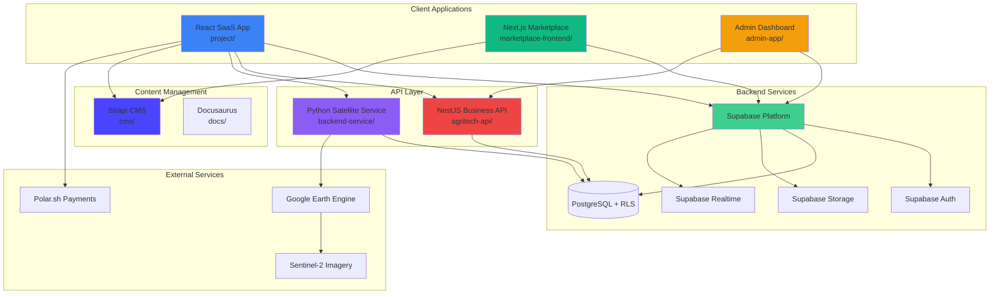
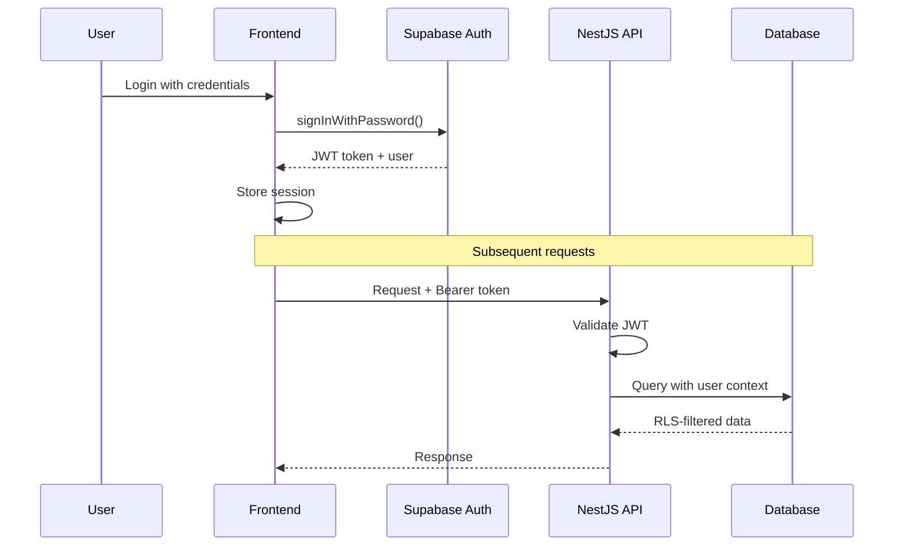
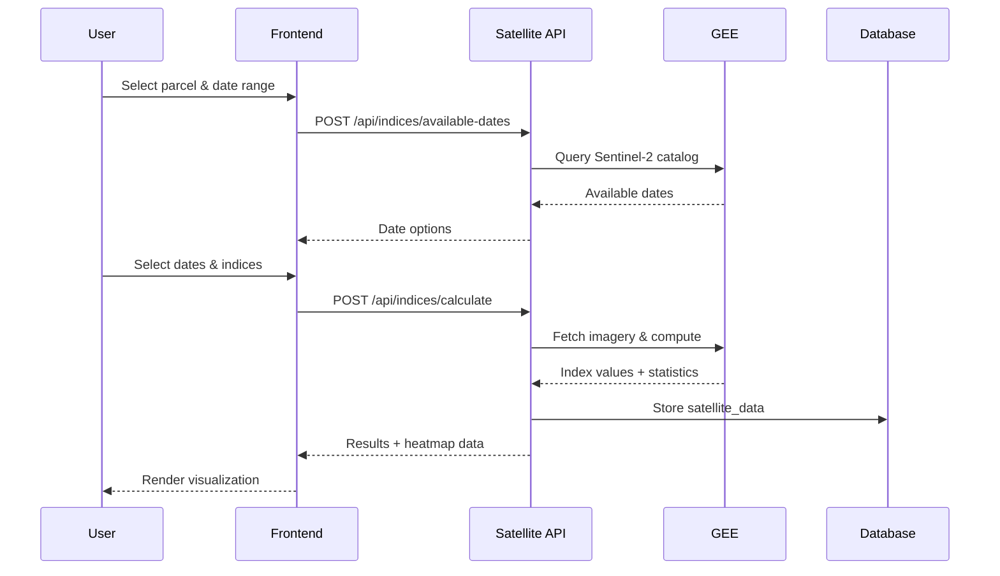
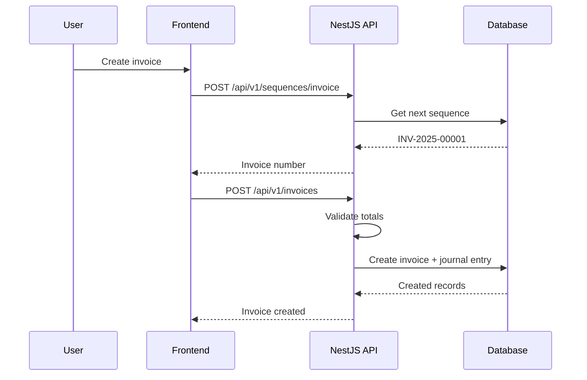
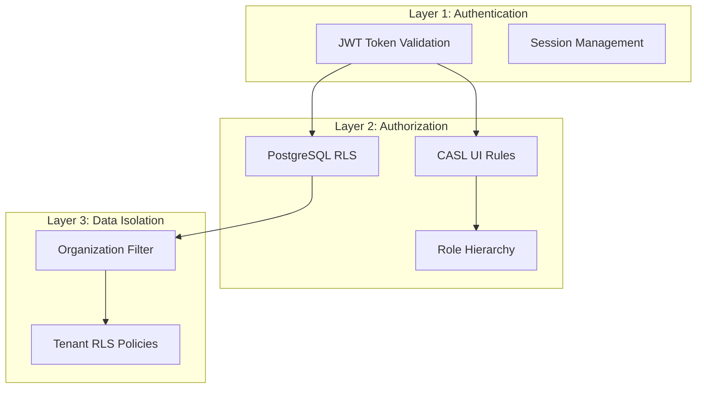
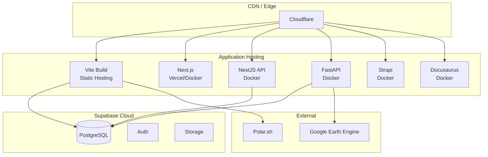

# Architecture Overview

The AgriTech Platform is a comprehensive multi-tenant agricultural SaaS solution built with a modern, scalable architecture. This document provides a high-level overview of the system's design, technology choices, and key architectural decisions.

## System Architecture

The platform follows a microservices architecture with multiple specialized services:


```mermaid
graph TB
    subgraph "Client Applications"
        WebApp[React SaaS App<br/>project/]
        Marketplace[Next.js Marketplace<br/>marketplace-frontend/]
        AdminApp[Admin Dashboard<br/>admin-app/]
    end

    subgraph "API Layer"
        NestAPI[NestJS Business API<br/>agritech-api/]
        SatService[Python Satellite Service<br/>backend-service/]
    end

    subgraph "Backend Services"
        Supabase[Supabase Platform]
        Auth[Supabase Auth]
        DB[(PostgreSQL + RLS)]
        Storage[Supabase Storage]
        Realtime[Supabase Realtime]
    end

    subgraph "Content Management"
        CMS[Strapi CMS<br/>cms/]
        Docs[Docusaurus<br/>docs/]
    end

    subgraph "External Services"
        GEE[Google Earth Engine]
        Sentinel[Sentinel-2 Imagery]
        Polar[Polar.sh Payments]
    end

    WebApp --> Supabase
    WebApp --> NestAPI
    WebApp --> SatService
    WebApp --> CMS
    Marketplace --> Supabase
    Marketplace --> CMS
    AdminApp --> Supabase
    AdminApp --> NestAPI

    Supabase --> Auth
    Supabase --> DB
    Supabase --> Storage
    Supabase --> Realtime

    NestAPI --> DB
    SatService --> DB
    SatService --> GEE
    GEE --> Sentinel

    WebApp --> Polar

    style WebApp fill:#3b82f6
    style Marketplace fill:#10b981
    style AdminApp fill:#f59e0b
    style NestAPI fill:#ef4444
    style SatService fill:#8b5cf6
    style Supabase fill:#3ecf8e
    style CMS fill:#4945ff
```

## Technology Stack

### Frontend Applications

| Application | Stack | Purpose |
|-------------|-------|---------|
| **Main SaaS** (`project/`) | React 19.2 + Vite 7 + TypeScript | Primary multi-tenant farm management application |
| **Marketplace** (`marketplace-frontend/`) | Next.js 16 + React 19 | Agricultural marketplace for buying/selling |
| **Admin Dashboard** (`admin-app/`) | React 19 + Vite + TypeScript | Internal administration and system management |

### Main Frontend Stack (project/)

| Category | Technology | Version | Purpose |
|----------|-----------|---------|---------|
| **Framework** | React + TypeScript | 19.2 | Component-based UI with type safety |
| **Build Tool** | Vite | 7.x | Fast development server and optimized builds |
| **Routing** | TanStack Router | 1.131+ | File-based routing with type-safe navigation |
| **Server State** | TanStack Query | 5.87+ | Server state caching and synchronization |
| **Client State** | Jotai + Zustand | Latest | Atomic and store-based state management |
| **Forms** | React Hook Form + Zod | 7.x / 4.x | Performant forms with schema validation |
| **UI Components** | Radix UI + Custom | Latest | Accessible, composable primitives |
| **Styling** | Tailwind CSS | 3.x | Utility-first CSS framework |
| **Authentication** | Supabase Auth | 2.x | JWT-based auth with multi-tenant support |
| **Authorization** | CASL | 6.7+ | Isomorphic authorization with subscription enforcement |
| **i18n** | react-i18next | 16.x | Multi-language support (EN, FR, AR) |
| **Maps** | Leaflet + OpenLayers | Latest | Interactive maps and geospatial visualization |
| **Charts** | ECharts + Recharts | Latest | Data visualization and analytics |
| **PDF** | jsPDF + AutoTable | Latest | Report generation |

### Backend Services

| Service | Technology | Purpose |
|---------|-----------|---------|
| **Business API** (`agritech-api/`) | NestJS 11 + TypeScript | Complex business logic, sequences, accounting |
| **Satellite Service** (`backend-service/`) | FastAPI + Python | Vegetation indices, GEE integration |
| **Database** | Supabase (PostgreSQL 15) | Primary data store with RLS |
| **Auth** | Supabase Auth | Authentication and user management |
| **Storage** | Supabase Storage | Document and file management |
| **Realtime** | Supabase Realtime | Live subscriptions and updates |
| **Background Jobs** | Celery + Redis | Batch satellite processing |

### Content & Documentation

| Service | Technology | Purpose |
|---------|-----------|---------|
| **CMS** (`cms/`) | Strapi 5.31 | Blog content, marketing pages |
| **Documentation** (`docs/`) | Docusaurus 3 | Technical documentation |

### External Integrations

| Service | Purpose |
|---------|---------|
| **Google Earth Engine** | Satellite imagery processing and analysis |
| **Sentinel-2** | Multi-spectral satellite imagery source |
| **Polar.sh** | Subscription billing and payment processing |

## Project Structure

The monorepo contains 7 applications and shared configuration:

```
agritech/
├── project/                          # Main React SaaS Application
│   ├── src/
│   │   ├── routes/                   # 80+ TanStack Router routes
│   │   │   ├── dashboard.tsx
│   │   │   ├── farm-hierarchy.tsx
│   │   │   ├── accounting*.tsx       # Full accounting module
│   │   │   ├── billing-*.tsx         # Quotes, orders, invoices
│   │   │   ├── parcels.*.tsx         # Parcel management & analysis
│   │   │   ├── workers.tsx           # Workforce management
│   │   │   ├── tasks.*.tsx           # Task management
│   │   │   ├── harvests.tsx          # Harvest tracking
│   │   │   ├── stock.tsx             # Inventory management
│   │   │   ├── production-intelligence.tsx
│   │   │   ├── satellite-analysis.tsx
│   │   │   ├── quality-control.tsx
│   │   │   ├── marketplace.*.tsx     # Marketplace integration
│   │   │   └── settings.*.tsx        # Configuration pages
│   │   ├── components/               # Feature-organized components
│   │   │   ├── ui/                   # Reusable UI primitives
│   │   │   ├── Accounting/
│   │   │   ├── FarmHierarchy/
│   │   │   ├── SatelliteAnalysis/
│   │   │   ├── ProductionIntelligence/
│   │   │   └── ...
│   │   ├── hooks/                    # 60+ custom React hooks
│   │   ├── lib/
│   │   │   ├── api/                  # 50+ API modules
│   │   │   ├── supabase.ts           # Supabase client
│   │   │   ├── casl/                 # Authorization rules
│   │   │   └── utils/
│   │   ├── types/
│   │   │   └── database.types.ts     # Auto-generated from Supabase
│   │   └── locales/                  # i18n (en, fr, ar)
│   ├── supabase/
│   │   └── migrations/               # 100+ database migrations
│   └── e2e/                          # Playwright E2E tests
│
├── agritech-api/                     # NestJS Business Logic API
│   └── src/
│       ├── modules/
│       │   ├── auth/                 # JWT authentication
│       │   ├── database/             # Supabase client
│       │   ├── sequences/            # Document numbering
│       │   ├── accounts/             # Chart of accounts
│       │   ├── journal-entries/      # Double-entry bookkeeping
│       │   ├── invoices/             # Invoice operations
│       │   ├── payments/             # Payment processing
│       │   ├── financial-reports/    # Balance sheet, P&L
│       │   ├── production-intelligence/
│       │   ├── harvests/
│       │   ├── tasks/
│       │   ├── workers/
│       │   └── stock-entries/
│       └── common/                   # Shared utilities
│
├── backend-service/                  # Python Satellite Service
│   ├── app/
│   │   ├── api/                      # FastAPI routes
│   │   ├── services/                 # GEE integration
│   │   └── models/                   # Pydantic models
│   └── research/                     # GEE notebooks
│
├── marketplace-frontend/             # Next.js Marketplace
│   └── src/app/                      # App router pages
│
├── admin-app/                        # Admin Dashboard
│   └── src/
│       ├── routes/
│       └── components/
│
├── cms/                              # Strapi CMS
│   ├── config/
│   └── src/
│       └── api/                      # Content types
│
└── docs/                             # Docusaurus Documentation
    └── docs/
        ├── architecture/
        ├── features/
        ├── database/
        └── api/
```

## Feature Modules

The platform includes comprehensive agricultural management features:

### Core Farm Management
- **Farm Hierarchy**: Organizations → Farms → Parcels → Sub-parcels
- **Parcel Management**: Crop types, planting systems, area tracking
- **Infrastructure**: Buildings, equipment, utilities
- **Crop Cycles**: Seasonal planning and tracking

### Financial Management
- **Chart of Accounts**: Multi-country accounting standards (OHADA, IFRS)
- **Journal Entries**: Double-entry bookkeeping with auto-balancing
- **Invoicing**: Sales invoices with PDF generation
- **Payments**: Payment tracking and allocation
- **Billing**: Quotes, sales orders, purchase orders
- **Financial Reports**: Balance sheet, P&L, trial balance
- **Cost Centers**: Department-level cost tracking

### Production & Operations
- **Harvest Tracking**: Quantity, quality, destination tracking
- **Production Intelligence**: Yield analytics, benchmarks, forecasts
- **Quality Control**: Lab results, grade tracking
- **Stock Management**: FIFO/LIFO inventory valuation
- **Task Management**: Assignment, scheduling, calendar view

### Workforce Management
- **Workers**: Employee profiles and contracts
- **Day Laborers**: Temporary workforce tracking
- **Piece Work**: Task-based compensation
- **Work Units**: Configurable work metrics

### Satellite & Analytics
- **Satellite Analysis**: 12+ vegetation indices (NDVI, NDRE, etc.)
- **Weather Integration**: Local weather data
- **Soil Analysis**: Lab integration
- **Profitability Analysis**: Per-parcel financial performance

### Platform Features
- **Marketplace**: B2B agricultural trading
- **Blog**: CMS-powered content
- **Multi-language**: English, French, Arabic
- **Subscriptions**: Tiered feature access via Polar.sh

## Data Flow

### Authentication Flow


```mermaid
sequenceDiagram
    participant User
    participant Frontend
    participant Supabase Auth
    participant NestJS API
    participant Database

    User->>Frontend: Login with credentials
    Frontend->>Supabase Auth: signInWithPassword()
    Supabase Auth-->>Frontend: JWT token + user
    Frontend->>Frontend: Store session
    
    Note over Frontend,Database: Subsequent requests
    
    Frontend->>NestJS API: Request + Bearer token
    NestJS API->>NestJS API: Validate JWT
    NestJS API->>Database: Query with user context
    Database-->>NestJS API: RLS-filtered data
    NestJS API-->>Frontend: Response
```

### Satellite Analysis Flow


```mermaid
sequenceDiagram
    participant User
    participant Frontend
    participant Satellite API
    participant GEE
    participant Database

    User->>Frontend: Select parcel & date range
    Frontend->>Satellite API: POST /api/indices/available-dates
    Satellite API->>GEE: Query Sentinel-2 catalog
    GEE-->>Satellite API: Available dates
    Satellite API-->>Frontend: Date options

    User->>Frontend: Select dates & indices
    Frontend->>Satellite API: POST /api/indices/calculate
    Satellite API->>GEE: Fetch imagery & compute
    GEE-->>Satellite API: Index values + statistics
    Satellite API->>Database: Store satellite_data
    Satellite API-->>Frontend: Results + heatmap data
    Frontend-->>User: Render visualization
```

### Accounting Transaction Flow


```mermaid
sequenceDiagram
    participant User
    participant Frontend
    participant NestJS API
    participant Database

    User->>Frontend: Create invoice
    Frontend->>NestJS API: POST /api/v1/sequences/invoice
    NestJS API->>Database: Get next sequence
    Database-->>NestJS API: INV-2025-00001
    NestJS API-->>Frontend: Invoice number

    Frontend->>NestJS API: POST /api/v1/invoices
    NestJS API->>NestJS API: Validate totals
    NestJS API->>Database: Create invoice + journal entry
    Database-->>NestJS API: Created records
    NestJS API-->>Frontend: Invoice created
```

## Security Architecture

### Multi-Layer Security


```mermaid
graph TB
    subgraph "Layer 1: Authentication"
        JWT[JWT Token Validation]
        Session[Session Management]
    end

    subgraph "Layer 2: Authorization"
        CASL[CASL UI Rules]
        RLS[PostgreSQL RLS]
        Roles[Role Hierarchy]
    end

    subgraph "Layer 3: Data Isolation"
        OrgFilter[Organization Filter]
        TenantRLS[Tenant RLS Policies]
    end

    JWT --> CASL
    JWT --> RLS
    CASL --> Roles
    RLS --> OrgFilter
    OrgFilter --> TenantRLS
```

### Role Hierarchy

| Role | Permissions |
|------|-------------|
| `system_admin` | Full platform access |
| `organization_admin` | Full organization access |
| `farm_manager` | Farm-level management |
| `farm_worker` | Operational tasks |
| `day_laborer` | Limited task access |
| `viewer` | Read-only access |

### Row Level Security

Every table with tenant data has RLS policies:

```sql
-- Example: farms table RLS
CREATE POLICY "Users can view farms in their organization"
ON farms FOR SELECT
USING (organization_id IN (
  SELECT organization_id FROM organization_members
  WHERE user_id = auth.uid()
));
```

## Deployment Architecture


```mermaid
graph TB
    subgraph "CDN / Edge"
        CF[Cloudflare]
    end

    subgraph "Application Hosting"
        Frontend[Vite Build<br/>Static Hosting]
        Marketplace[Next.js<br/>Vercel/Docker]
        NestJS[NestJS API<br/>Docker]
        Python[FastAPI<br/>Docker]
        CMS[Strapi<br/>Docker]
        Docs[Docusaurus<br/>Docker]
    end

    subgraph "Supabase Cloud"
        SupaDB[(PostgreSQL)]
        SupaAuth[Auth]
        SupaStorage[Storage]
    end

    subgraph "External"
        GEE[Google Earth Engine]
        Polar[Polar.sh]
    end

    CF --> Frontend
    CF --> Marketplace
    CF --> NestJS
    CF --> Python
    CF --> CMS
    CF --> Docs

    Frontend --> SupaDB
    NestJS --> SupaDB
    Python --> SupaDB
    Python --> GEE
    Frontend --> Polar
```

## Development Workflow

### Local Development

```bash
# Frontend (project/)
cd project && npm run dev          # http://localhost:5173

# NestJS API (agritech-api/)
cd agritech-api && npm run start:dev  # http://localhost:3000

# Satellite Service (backend-service/)
cd backend-service && uvicorn app.main:app --reload --port 8001

# CMS (cms/)
cd cms && npm run develop          # http://localhost:1337

# Documentation (docs/)
cd docs && npm start               # http://localhost:3000
```

### Type Generation

```bash
# After any database schema change
cd project && npm run db:generate-types-remote
```

### Testing

```bash
# Unit tests
cd project && npm test

# E2E tests
cd project && npm run test:e2e

# API tests
cd agritech-api && npm test

# Python tests
cd backend-service && pytest
```

## Performance Optimizations

### Frontend
- Route-based code splitting (80+ lazy-loaded routes)
- TanStack Query caching with strategic `staleTime`
- Virtual scrolling for large lists
- Image lazy loading and WebP format
- Debounced search inputs

### Backend
- PostgreSQL connection pooling via Supabase
- Redis caching for satellite data
- Batch processing with Celery
- Strategic database indexes
- Materialized views for reports

### Database
- RLS policies optimized with security definer functions
- Composite indexes on frequently queried columns
- Partitioning for large tables (satellite_data, journal_items)
- Query plan analysis and optimization

## Related Documentation

- [Multi-Tenancy Architecture](./multi-tenancy)
- [Frontend Architecture](./frontend)
- [Backend Architecture](./backend)
- [Database Architecture](./database)
- [Satellite Service](./satellite-service)
