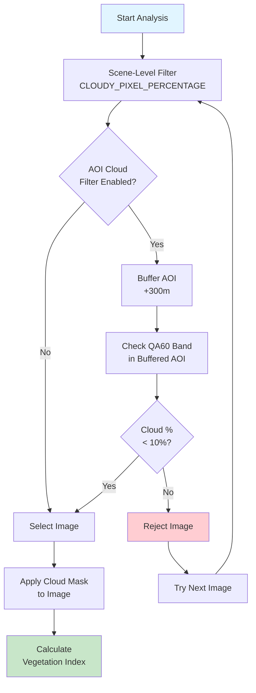

# Satellite Service Architecture

The AgriTech Platform includes a specialized FastAPI service for satellite imagery analysis using Google Earth Engine (GEE). This document details the service architecture, vegetation index calculations, cloud masking strategies, and integration patterns.

## Service Overview

The Satellite Indices Service is a Python-based FastAPI application that acts as a bridge between the frontend and Google Earth Engine, providing vegetation analysis capabilities for agricultural parcels.

**Location:** `/Users/boutchaz/Documents/CodeLovers/agritech/satellite-indices-service/`

```mermaid
graph TB
    subgraph "Client Layer"
        Frontend[React Frontend]
    end

    subgraph "Satellite Service"
        FastAPI[FastAPI Application]
        Routes[API Routes]
        Services[Business Logic]
        GEEClient[GEE Client]
    end

    subgraph "Background Processing"
        Celery[Celery Workers]
        Redis[(Redis Queue)]
    end

    subgraph "External Services"
        GEE[Google Earth Engine]
        Sentinel[Sentinel-2 Imagery]
    end

    subgraph "Storage"
        Supabase[(Supabase Database)]
        Storage[Supabase Storage]
    end

    Frontend -->|HTTP REST API| FastAPI
    FastAPI --> Routes
    Routes --> Services
    Services --> GEEClient
    Services --> Redis

    GEEClient --> GEE
    GEE --> Sentinel

    Celery --> Redis
    Celery --> GEEClient

    Services --> Supabase
    Services --> Storage
    Celery --> Supabase

    style FastAPI fill:#ff6b6b
    style GEE fill:#4285f4
    style Sentinel fill:#00d4ff
```

## Technology Stack

| Component | Technology | Purpose |
|-----------|-----------|---------|
| **Web Framework** | FastAPI 0.100+ | High-performance async API framework |
| **GEE SDK** | earthengine-api | Google Earth Engine Python client |
| **Validation** | Pydantic 2.x | Data validation and serialization |
| **Background Jobs** | Celery 5.x | Distributed task queue |
| **Message Broker** | Redis 7.x | Task queue and caching |
| **HTTP Client** | httpx | Async HTTP requests |
| **Geospatial** | shapely | Geometry manipulation |
| **Storage Client** | supabase-py | Supabase integration |

## Project Structure

```
satellite-indices-service/
├── app/
│   ├── main.py                    # FastAPI application entry point
│   ├── api/                       # API route handlers
│   │   ├── indices/               # Vegetation indices endpoints
│   │   │   ├── available_dates.py
│   │   │   ├── calculate.py
│   │   │   ├── heatmap.py
│   │   │   └── export.py
│   │   └── analysis/              # Analysis endpoints
│   │       ├── statistics.py
│   │       ├── cloud_coverage.py
│   │       └── batch.py
│   ├── services/                  # Business logic
│   │   ├── gee_service.py         # Core GEE integration
│   │   ├── cloud_masking.py       # Cloud filtering logic
│   │   ├── indices_calculator.py  # Vegetation index calculations
│   │   ├── heatmap_generator.py   # Heatmap data generation
│   │   └── export_service.py      # GeoTIFF export
│   ├── models/                    # Pydantic models
│   │   ├── requests.py            # Request models
│   │   ├── responses.py           # Response models
│   │   └── indices.py             # Index definitions
│   ├── core/                      # Configuration
│   │   ├── config.py              # Settings and environment
│   │   └── gee_auth.py            # GEE authentication
│   └── tasks.py                   # Celery tasks
├── research/                      # Jupyter notebooks
│   ├── index_exploration.ipynb
│   └── cloud_masking_tests.ipynb
├── tests/                         # Unit and integration tests
├── requirements.txt               # Python dependencies
└── Dockerfile                     # Container configuration
```

## Core Components

### 1. FastAPI Application

**Location:** `/Users/boutchaz/Documents/CodeLovers/agritech/satellite-indices-service/app/main.py`

```python
from fastapi import FastAPI
from fastapi.middleware.cors import CORSMiddleware
from app.api.indices import router as indices_router
from app.api.analysis import router as analysis_router
from app.core.config import settings

app = FastAPI(
    title="AgriTech Satellite Indices Service",
    description="Vegetation analysis using Google Earth Engine",
    version="1.0.0"
)

# CORS middleware
app.add_middleware(
    CORSMiddleware,
    allow_origins=settings.ALLOWED_ORIGINS,
    allow_credentials=True,
    allow_methods=["*"],
    allow_headers=["*"],
)

# Register routers
app.include_router(indices_router, prefix="/api/indices", tags=["indices"])
app.include_router(analysis_router, prefix="/api/analysis", tags=["analysis"])

@app.get("/health")
async def health_check():
    return {"status": "healthy", "service": "satellite-indices"}
```

### 2. Google Earth Engine Service

**Location:** `/Users/boutchaz/Documents/CodeLovers/agritech/satellite-indices-service/app/services/gee_service.py`

The GEE service handles all interactions with Google Earth Engine:

```python
import ee
from typing import Dict, List, Optional
from datetime import datetime
from app.core.gee_auth import initialize_gee

class GEEService:
    def __init__(self):
        """Initialize Google Earth Engine connection."""
        initialize_gee()
        self.sentinel_collection = 'COPERNICUS/S2_SR_HARMONIZED'

    def get_sentinel_collection(
        self,
        geometry: Dict,
        start_date: str,
        end_date: str,
        cloud_threshold: int = 20
    ) -> ee.ImageCollection:
        """
        Get Sentinel-2 image collection for AOI and date range.

        Args:
            geometry: GeoJSON geometry
            start_date: Start date (YYYY-MM-DD)
            end_date: End date (YYYY-MM-DD)
            cloud_threshold: Maximum cloud coverage percentage

        Returns:
            Filtered Sentinel-2 image collection
        """
        aoi = ee.Geometry(geometry)

        collection = (
            ee.ImageCollection(self.sentinel_collection)
            .filterBounds(aoi)
            .filterDate(start_date, end_date)
            .filter(ee.Filter.lt('CLOUDY_PIXEL_PERCENTAGE', cloud_threshold))
            .sort('system:time_start', False)
        )

        return collection

    def get_available_dates(
        self,
        geometry: Dict,
        start_date: str,
        end_date: str,
        cloud_threshold: int = 20
    ) -> List[str]:
        """
        Get list of available image dates for AOI.

        Returns:
            List of dates in YYYY-MM-DD format
        """
        collection = self.get_sentinel_collection(
            geometry, start_date, end_date, cloud_threshold
        )

        # Get acquisition dates
        dates = collection.aggregate_array('system:time_start').getInfo()

        # Convert timestamps to date strings
        date_strings = [
            datetime.fromtimestamp(d / 1000).strftime('%Y-%m-%d')
            for d in dates
        ]

        # Remove duplicates (multiple images per day)
        unique_dates = sorted(list(set(date_strings)), reverse=True)

        return unique_dates

    def get_image_for_date(
        self,
        geometry: Dict,
        date: str,
        use_aoi_cloud_filter: bool = True,
        cloud_buffer_meters: int = 300
    ) -> Optional[ee.Image]:
        """
        Get the best Sentinel-2 image for a specific date.

        Args:
            geometry: GeoJSON geometry
            date: Target date (YYYY-MM-DD)
            use_aoi_cloud_filter: Apply AOI-specific cloud masking
            cloud_buffer_meters: Buffer around AOI for cloud checking

        Returns:
            Sentinel-2 image or None if no suitable image found
        """
        aoi = ee.Geometry(geometry)

        # Get images for the date (allow ±1 day for flexibility)
        collection = self.get_sentinel_collection(
            geometry,
            date,
            date,
            cloud_threshold=100  # Don't filter by scene cloud coverage yet
        )

        if collection.size().getInfo() == 0:
            return None

        if use_aoi_cloud_filter:
            # Filter by AOI-specific cloud coverage
            buffered_aoi = aoi.buffer(cloud_buffer_meters)

            def aoi_cloud_filter(image):
                cloud_mask = image.select('QA60')
                clouds = cloud_mask.bitwiseAnd(1 << 10).Or(
                    cloud_mask.bitwiseAnd(1 << 11)
                )

                # Calculate cloud percentage in buffered AOI
                cloud_percentage = clouds.reduceRegion(
                    reducer=ee.Reducer.mean(),
                    geometry=buffered_aoi,
                    scale=10,
                    maxPixels=1e9
                ).get('QA60')

                return image.set('aoi_cloud_percentage', cloud_percentage)

            collection = collection.map(aoi_cloud_filter)
            collection = collection.filter(
                ee.Filter.lt('aoi_cloud_percentage', 0.1)  # <10% clouds in AOI
            )

        # Get the first (most recent) image
        image = collection.first()

        return image if image else None
```

### 3. Vegetation Indices Calculator

**Location:** `/Users/boutchaz/Documents/CodeLovers/agritech/satellite-indices-service/app/services/indices_calculator.py`

The calculator implements various vegetation indices:

```python
import ee
from typing import Dict, List

class IndicesCalculator:
    """Calculate vegetation indices from Sentinel-2 imagery."""

    @staticmethod
    def calculate_ndvi(image: ee.Image) -> ee.Image:
        """
        Normalized Difference Vegetation Index (NDVI)

        Formula: (NIR - Red) / (NIR + Red)
        Range: -1 to 1 (higher = more vegetation)
        Best for: General vegetation health and biomass
        """
        nir = image.select('B8')   # Near-infrared (842nm)
        red = image.select('B4')   # Red (665nm)

        ndvi = nir.subtract(red).divide(nir.add(red)).rename('NDVI')
        return ndvi.clamp(-1, 1)

    @staticmethod
    def calculate_ndre(image: ee.Image) -> ee.Image:
        """
        Normalized Difference Red Edge Index (NDRE)

        Formula: (NIR - RedEdge) / (NIR + RedEdge)
        Range: -1 to 1
        Best for: Nitrogen content, crop health monitoring
        """
        nir = image.select('B8')      # Near-infrared (842nm)
        red_edge = image.select('B5') # Red edge (705nm)

        ndre = nir.subtract(red_edge).divide(nir.add(red_edge)).rename('NDRE')
        return ndre.clamp(-1, 1)

    @staticmethod
    def calculate_ndmi(image: ee.Image) -> ee.Image:
        """
        Normalized Difference Moisture Index (NDMI)

        Formula: (NIR - SWIR) / (NIR + SWIR)
        Range: -1 to 1
        Best for: Water content, drought stress
        """
        nir = image.select('B8')   # Near-infrared (842nm)
        swir = image.select('B11') # SWIR (1610nm)

        ndmi = nir.subtract(swir).divide(nir.add(swir)).rename('NDMI')
        return ndmi.clamp(-1, 1)

    @staticmethod
    def calculate_mndwi(image: ee.Image) -> ee.Image:
        """
        Modified Normalized Difference Water Index (MNDWI)

        Formula: (Green - SWIR) / (Green + SWIR)
        Range: -1 to 1
        Best for: Water body detection, irrigation monitoring
        """
        green = image.select('B3')  # Green (560nm)
        swir = image.select('B11')  # SWIR (1610nm)

        mndwi = green.subtract(swir).divide(green.add(swir)).rename('MNDWI')
        return mndwi.clamp(-1, 1)

    @staticmethod
    def calculate_savi(image: ee.Image, L: float = 0.5) -> ee.Image:
        """
        Soil Adjusted Vegetation Index (SAVI)

        Formula: ((NIR - Red) / (NIR + Red + L)) * (1 + L)
        Range: -1 to 1
        Best for: Areas with exposed soil, sparse vegetation

        Args:
            L: Soil brightness correction factor (0.5 for moderate vegetation)
        """
        nir = image.select('B8')
        red = image.select('B4')

        savi = (
            nir.subtract(red)
            .divide(nir.add(red).add(L))
            .multiply(1 + L)
            .rename('SAVI')
        )
        return savi.clamp(-1, 1)

    @staticmethod
    def calculate_gci(image: ee.Image) -> ee.Image:
        """
        Green Chlorophyll Index (GCI)

        Formula: (NIR / Green) - 1
        Range: 0 to inf (typically 0-5)
        Best for: Chlorophyll content, leaf nitrogen
        """
        nir = image.select('B8')
        green = image.select('B3')

        gci = nir.divide(green).subtract(1).rename('GCI')
        return gci.clamp(0, 10)

    @staticmethod
    def calculate_evi(image: ee.Image) -> ee.Image:
        """
        Enhanced Vegetation Index (EVI)

        Formula: 2.5 * ((NIR - Red) / (NIR + 6*Red - 7.5*Blue + 1))
        Range: -1 to 1
        Best for: Dense vegetation, atmospheric correction
        """
        nir = image.select('B8')
        red = image.select('B4')
        blue = image.select('B2')

        evi = (
            nir.subtract(red)
            .divide(
                nir.add(red.multiply(6))
                .subtract(blue.multiply(7.5))
                .add(1)
            )
            .multiply(2.5)
            .rename('EVI')
        )
        return evi.clamp(-1, 1)

    def calculate_index(self, image: ee.Image, index_name: str) -> ee.Image:
        """
        Calculate a specific vegetation index.

        Args:
            image: Sentinel-2 image
            index_name: Name of the index (e.g., 'NDVI', 'NDRE')

        Returns:
            Calculated index as ee.Image
        """
        calculators = {
            'NDVI': self.calculate_ndvi,
            'NDRE': self.calculate_ndre,
            'NDMI': self.calculate_ndmi,
            'MNDWI': self.calculate_mndwi,
            'SAVI': self.calculate_savi,
            'GCI': self.calculate_gci,
            'EVI': self.calculate_evi,
        }

        calculator = calculators.get(index_name.upper())
        if not calculator:
            raise ValueError(f"Unknown index: {index_name}")

        return calculator(image)

    def calculate_statistics(
        self,
        image: ee.Image,
        geometry: Dict,
        scale: int = 10
    ) -> Dict:
        """
        Calculate statistics for an index over an AOI.

        Args:
            image: Index image (single band)
            geometry: GeoJSON geometry
            scale: Pixel resolution in meters

        Returns:
            Dictionary with mean, min, max, std, and percentiles
        """
        aoi = ee.Geometry(geometry)

        # Calculate statistics
        stats = image.reduceRegion(
            reducer=ee.Reducer.mean()
                .combine(ee.Reducer.minMax(), '', True)
                .combine(ee.Reducer.stdDev(), '', True)
                .combine(ee.Reducer.percentile([10, 25, 50, 75, 90]), '', True),
            geometry=aoi,
            scale=scale,
            maxPixels=1e9,
            bestEffort=True
        ).getInfo()

        # Get the band name (first key in stats dict)
        band_name = list(stats.keys())[0].replace('_mean', '')

        return {
            'mean': stats.get(f'{band_name}_mean'),
            'min': stats.get(f'{band_name}_min'),
            'max': stats.get(f'{band_name}_max'),
            'std': stats.get(f'{band_name}_stdDev'),
            'percentiles': {
                'p10': stats.get(f'{band_name}_p10'),
                'p25': stats.get(f'{band_name}_p25'),
                'p50': stats.get(f'{band_name}_p50'),
                'p75': stats.get(f'{band_name}_p75'),
                'p90': stats.get(f'{band_name}_p90'),
            }
        }
```

## Vegetation Indices Reference

### Supported Indices

| Index | Full Name | Formula | Range | Best For |
|-------|-----------|---------|-------|----------|
| **NDVI** | Normalized Difference Vegetation Index | (NIR - Red) / (NIR + Red) | -1 to 1 | General vegetation health, biomass |
| **NDRE** | Normalized Difference Red Edge | (NIR - RedEdge) / (NIR + RedEdge) | -1 to 1 | Nitrogen content, crop health |
| **NDMI** | Normalized Difference Moisture Index | (NIR - SWIR) / (NIR + SWIR) | -1 to 1 | Water content, drought stress |
| **MNDWI** | Modified Normalized Difference Water Index | (Green - SWIR) / (Green + SWIR) | -1 to 1 | Water bodies, irrigation |
| **SAVI** | Soil Adjusted Vegetation Index | ((NIR - Red) / (NIR + Red + L)) * (1 + L) | -1 to 1 | Sparse vegetation, exposed soil |
| **OSAVI** | Optimized SAVI | (NIR - Red) / (NIR + Red + 0.16) | -1 to 1 | Similar to SAVI, optimized |
| **MSAVI2** | Modified SAVI 2 | Complex formula | -1 to 1 | Minimizes soil background |
| **GCI** | Green Chlorophyll Index | (NIR / Green) - 1 | 0 to 10 | Chlorophyll content |
| **EVI** | Enhanced Vegetation Index | 2.5 * ((NIR - Red) / (NIR + 6*Red - 7.5*Blue + 1)) | -1 to 1 | Dense vegetation |
| **PRI** | Photochemical Reflectance Index | (B3 - B5) / (B3 + B5) | -1 to 1 | Photosynthetic activity |

### Sentinel-2 Bands Used

| Band | Name | Wavelength | Resolution | Use |
|------|------|------------|------------|-----|
| B2 | Blue | 490 nm | 10m | EVI, water detection |
| B3 | Green | 560 nm | 10m | GCI, MNDWI |
| B4 | Red | 665 nm | 10m | NDVI, SAVI, EVI |
| B5 | Red Edge 1 | 705 nm | 20m | NDRE, PRI |
| B6 | Red Edge 2 | 740 nm | 20m | Advanced indices |
| B7 | Red Edge 3 | 783 nm | 20m | Advanced indices |
| B8 | NIR | 842 nm | 10m | NDVI, NDRE, NDMI |
| B8A | Narrow NIR | 865 nm | 20m | Alternative NIR |
| B11 | SWIR 1 | 1610 nm | 20m | NDMI, MNDWI |
| B12 | SWIR 2 | 2190 nm | 20m | Moisture indices |
| QA60 | Cloud Mask | N/A | 60m | Cloud detection |

## Cloud Masking Strategy

### Two-Level Cloud Filtering



### Cloud Masking Implementation

**Location:** `/Users/boutchaz/Documents/CodeLovers/agritech/satellite-indices-service/app/services/cloud_masking.py`

```python
import ee
from typing import Dict

class CloudMasking:
    """Cloud masking utilities for Sentinel-2 imagery."""

    @staticmethod
    def mask_clouds_qa60(image: ee.Image) -> ee.Image:
        """
        Mask clouds using the QA60 band (default Sentinel-2 cloud mask).

        QA60 bit flags:
        - Bit 10: Opaque clouds
        - Bit 11: Cirrus clouds
        """
        qa = image.select('QA60')

        # Bits 10 and 11 are clouds and cirrus
        cloud_mask = qa.bitwiseAnd(1 << 10).Or(qa.bitwiseAnd(1 << 11))

        # Invert mask (0 = cloud, 1 = clear)
        clear_mask = cloud_mask.Not()

        return image.updateMask(clear_mask)

    @staticmethod
    def calculate_aoi_cloud_coverage(
        image: ee.Image,
        geometry: Dict,
        buffer_meters: int = 300
    ) -> float:
        """
        Calculate cloud coverage percentage within AOI.

        Args:
            image: Sentinel-2 image
            geometry: GeoJSON geometry
            buffer_meters: Buffer around AOI to check

        Returns:
            Cloud coverage percentage (0-100)
        """
        aoi = ee.Geometry(geometry)
        buffered_aoi = aoi.buffer(buffer_meters)

        qa = image.select('QA60')
        clouds = qa.bitwiseAnd(1 << 10).Or(qa.bitwiseAnd(1 << 11))

        # Calculate mean (0 = clear, 1 = cloud)
        cloud_percentage = clouds.reduceRegion(
            reducer=ee.Reducer.mean(),
            geometry=buffered_aoi,
            scale=60,  # QA60 is 60m resolution
            maxPixels=1e9
        ).get('QA60')

        return cloud_percentage.getInfo() * 100 if cloud_percentage else 0

    @staticmethod
    def get_cloud_free_image(
        collection: ee.ImageCollection,
        geometry: Dict,
        max_cloud_percentage: float = 10.0,
        buffer_meters: int = 300
    ) -> ee.Image:
        """
        Get the best cloud-free image from collection.

        Prioritizes:
        1. Lowest cloud coverage in AOI
        2. Most recent date
        """
        aoi = ee.Geometry(geometry)
        buffered_aoi = aoi.buffer(buffer_meters)

        def add_cloud_score(image):
            qa = image.select('QA60')
            clouds = qa.bitwiseAnd(1 << 10).Or(qa.bitwiseAnd(1 << 11))

            cloud_percentage = clouds.reduceRegion(
                reducer=ee.Reducer.mean(),
                geometry=buffered_aoi,
                scale=60,
                maxPixels=1e9
            ).get('QA60')

            return image.set('aoi_cloud_percentage', cloud_percentage)

        # Add cloud scores
        scored_collection = collection.map(add_cloud_score)

        # Filter by cloud threshold
        filtered = scored_collection.filter(
            ee.Filter.lt('aoi_cloud_percentage', max_cloud_percentage / 100)
        )

        # Sort by cloud coverage (ascending) then date (descending)
        sorted_collection = filtered.sort('aoi_cloud_percentage').sort(
            'system:time_start', False
        )

        return sorted_collection.first()
```

### Cloud Masking Configuration

Default configuration in API requests:

```python
{
  "use_aoi_cloud_filter": True,      # Enable AOI-specific filtering
  "cloud_buffer_meters": 300,         # Buffer around AOI
  "max_cloud_percentage": 10,         # Max clouds in AOI (%)
  "scene_cloud_threshold": 20         # Max scene-level clouds (%)
}
```

## Background Processing

### Celery Configuration

**Location:** `/Users/boutchaz/Documents/CodeLovers/agritech/satellite-indices-service/app/tasks.py`

```python
from celery import Celery
from app.services.gee_service import GEEService
from app.services.indices_calculator import IndicesCalculator
import logging

celery_app = Celery(
    'satellite_tasks',
    broker='redis://localhost:6379/0',
    backend='redis://localhost:6379/0'
)

celery_app.conf.update(
    task_serializer='json',
    accept_content=['json'],
    result_serializer='json',
    timezone='UTC',
    enable_utc=True,
    task_track_started=True,
    task_time_limit=30 * 60,  # 30 minutes
)

logger = logging.getLogger(__name__)

@celery_app.task(bind=True, name='process_parcel_batch')
def process_parcel_batch(
    self,
    job_id: str,
    parcel_data: List[Dict],
    date: str,
    indices: List[str]
):
    """
    Background task to process multiple parcels.

    Args:
        job_id: Unique job identifier
        parcel_data: List of parcel info (id, geometry)
        date: Analysis date
        indices: List of indices to calculate
    """
    gee_service = GEEService()
    calculator = IndicesCalculator()

    total_parcels = len(parcel_data)
    processed = 0
    failed = 0

    for i, parcel in enumerate(parcel_data):
        # Update task progress
        self.update_state(
            state='PROGRESS',
            meta={
                'current': i + 1,
                'total': total_parcels,
                'status': f'Processing parcel {parcel["id"]}'
            }
        )

        try:
            # Get Sentinel-2 image
            image = gee_service.get_image_for_date(
                geometry=parcel['geometry'],
                date=date
            )

            if not image:
                logger.warning(f"No image found for parcel {parcel['id']}")
                failed += 1
                continue

            # Calculate each index
            results = {}
            for index_name in indices:
                index_image = calculator.calculate_index(image, index_name)
                stats = calculator.calculate_statistics(
                    index_image,
                    parcel['geometry']
                )
                results[index_name] = stats

            # Save to database
            save_satellite_data(parcel['id'], date, results)
            processed += 1

        except Exception as e:
            logger.error(f"Error processing parcel {parcel['id']}: {str(e)}")
            failed += 1

    return {
        'job_id': job_id,
        'status': 'completed',
        'total': total_parcels,
        'processed': processed,
        'failed': failed
    }
```

**Starting Celery worker:**
```bash
celery -A app.tasks worker --loglevel=info --concurrency=4
```

**Monitoring tasks:**
```bash
# Celery flower (web UI)
celery -A app.tasks flower
```

## Performance Optimization

### 1. Request Optimization

- **Batch processing:** Process multiple parcels in background jobs
- **Caching:** Cache available dates for 24 hours
- **Resolution scaling:** Adjust resolution based on AOI size

### 2. GEE Optimization

- **Efficient queries:** Filter collection before computation
- **Scale parameter:** Use appropriate scale (10m for 10m bands)
- **maxPixels:** Set reasonable limits to prevent timeout

### 3. Export Optimization

- **Cloud-optimized GeoTIFF:** Use COG format for faster loading
- **Compression:** Apply LZW compression to reduce file size
- **Tile size:** Optimize tile size for web viewing

## Error Handling

### Common Error Scenarios

```python
from fastapi import HTTPException

class SatelliteServiceError(Exception):
    """Base exception for satellite service."""
    pass

class ImageNotFoundError(SatelliteServiceError):
    """No suitable image found for date and AOI."""
    pass

class GEETimeoutError(SatelliteServiceError):
    """Google Earth Engine request timed out."""
    pass

class CloudCoverageError(SatelliteServiceError):
    """Cloud coverage exceeds threshold."""
    pass

# Error handling in endpoints
@router.post("/calculate")
async def calculate_indices(request: CalculateRequest):
    try:
        result = gee_service.calculate(...)
        return result
    except ImageNotFoundError:
        raise HTTPException(
            status_code=404,
            detail="No cloud-free image found for the specified date"
        )
    except GEETimeoutError:
        raise HTTPException(
            status_code=504,
            detail="Request timed out. Try reducing the AOI size."
        )
    except Exception as e:
        logger.error(f"Unexpected error: {str(e)}")
        raise HTTPException(status_code=500, detail="Internal server error")
```

## Security Considerations

### Authentication

- All requests should include user JWT for verification
- Service account credentials for GEE stored securely
- Environment variables for sensitive configuration

### Rate Limiting

- Implement rate limiting to prevent abuse
- Queue long-running jobs in Celery
- Monitor GEE quota usage

### Data Validation

- Validate all input geometries
- Limit AOI size to prevent excessive computation
- Sanitize file paths for exports

## Monitoring and Logging

### Logging Strategy

```python
import logging

logger = logging.getLogger(__name__)

# Request logging
logger.info('Processing request', extra={
    'parcel_id': parcel_id,
    'date': date,
    'indices': indices,
    'user_id': user_id
})

# Performance logging
logger.info('GEE request completed', extra={
    'duration_ms': duration,
    'parcel_id': parcel_id
})

# Error logging
logger.error('Failed to calculate index', extra={
    'error': str(error),
    'parcel_id': parcel_id,
    'index': index_name
})
```

### Metrics to Track

- API response times
- GEE request durations
- Success/failure rates
- Cloud coverage statistics
- Queue lengths (Celery)

## Related Documentation

- [Backend Architecture](./backend.md)
- [API Reference](../api/satellite-api.md)
- [Google Earth Engine Documentation](https://developers.google.com/earth-engine)
