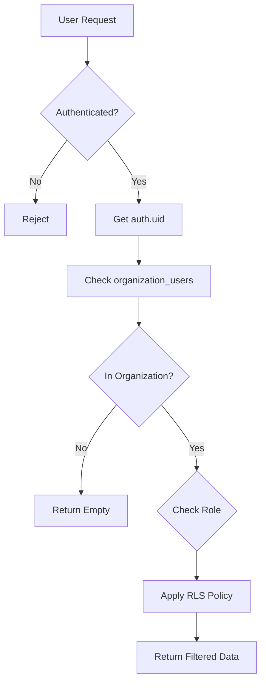

# Row Level Security (RLS) Policies

This document covers Row Level Security implementation in the AgriTech Platform, ensuring multi-tenant data isolation and role-based access control.

## Overview

Row Level Security (RLS) is PostgreSQL's built-in feature that restricts row access based on the current database user. In Supabase, RLS uses `auth.uid()` to identify the authenticated user and enforce access policies.

## Architecture



## Core Principles

### 1. Multi-Tenant Isolation

All data is scoped to organizations. Users can only access data from organizations they belong to:

```sql
-- Standard pattern for all tables
CREATE POLICY "org_access_tablename" ON tablename
FOR ALL USING (
  organization_id IN (
    SELECT organization_id FROM organization_users
    WHERE user_id = auth.uid() AND is_active = TRUE
  )
);
```

### 2. Role-Based Access

Different roles have different permissions:

```sql
-- Read access for all members
CREATE POLICY "org_read_invoices" ON invoices
FOR SELECT USING (
  organization_id IN (
    SELECT organization_id FROM organization_users
    WHERE user_id = auth.uid()
  )
);

-- Write access for managers only
CREATE POLICY "org_write_invoices" ON invoices
FOR INSERT WITH CHECK (
  organization_id IN (
    SELECT organization_id FROM organization_users
    WHERE user_id = auth.uid()
    AND role IN ('organization_admin', 'farm_manager', 'farm_worker')
  )
);
```

## Policy Patterns

### Pattern 1: Full Access (FOR ALL)

Simplest pattern - all operations use same check:

```sql
ALTER TABLE farms ENABLE ROW LEVEL SECURITY;

CREATE POLICY "org_access_farms" ON farms
FOR ALL USING (
  organization_id IN (
    SELECT organization_id FROM organization_users
    WHERE user_id = auth.uid()
  )
);
```

**Used for:** farms, parcels, workers, suppliers, warehouses

---

### Pattern 2: Separate Read/Write

Different policies for SELECT vs INSERT/UPDATE/DELETE:

```sql
-- Anyone can read
CREATE POLICY "org_read_accounts" ON accounts
FOR SELECT USING (
  organization_id IN (
    SELECT organization_id FROM organization_users
    WHERE user_id = auth.uid()
  )
);

-- Only admins can modify
CREATE POLICY "org_write_accounts" ON accounts
FOR INSERT WITH CHECK (
  organization_id IN (
    SELECT organization_id FROM organization_users
    WHERE user_id = auth.uid()
    AND role IN ('organization_admin', 'farm_manager')
  )
);

CREATE POLICY "org_update_accounts" ON accounts
FOR UPDATE USING (
  organization_id IN (
    SELECT organization_id FROM organization_users
    WHERE user_id = auth.uid()
    AND role IN ('organization_admin', 'farm_manager')
  )
);

CREATE POLICY "org_delete_accounts" ON accounts
FOR DELETE USING (
  organization_id IN (
    SELECT organization_id FROM organization_users
    WHERE user_id = auth.uid()
    AND role = 'organization_admin'
  )
);
```

**Used for:** accounts, journal_entries, invoices, payments

---

### Pattern 3: Inherited Access

Access based on parent table relationship:

```sql
-- Access journal_items through journal_entries
CREATE POLICY "org_access_journal_items" ON journal_items
FOR ALL USING (
  journal_entry_id IN (
    SELECT je.id FROM journal_entries je
    WHERE je.organization_id IN (
      SELECT organization_id FROM organization_users
      WHERE user_id = auth.uid()
    )
  )
);
```

**Used for:** journal_items, invoice_items, payment_allocations

---

### Pattern 4: Owner-Only Access

Users can only access their own records:

```sql
CREATE POLICY "users_own_profile" ON user_profiles
FOR ALL USING (id = auth.uid());
```

**Used for:** user_profiles, user_settings

---

### Pattern 5: Public Read, Restricted Write

Anyone authenticated can read, only admins can write:

```sql
-- Public read for all authenticated users
CREATE POLICY "currencies_select_all" ON currencies
FOR SELECT TO authenticated
USING (TRUE);

-- Admin-only write
CREATE POLICY "currencies_modify_admin" ON currencies
FOR ALL TO authenticated
USING (
  EXISTS (
    SELECT 1 FROM organization_users
    WHERE user_id = auth.uid()
    AND role = 'system_admin'
  )
);
```

**Used for:** currencies, crop_types, reference data

---

## Table-Specific Policies

### Organizations

```sql
ALTER TABLE organizations ENABLE ROW LEVEL SECURITY;

-- Users can see organizations they belong to
CREATE POLICY "users_see_own_orgs" ON organizations
FOR SELECT USING (
  id IN (
    SELECT organization_id FROM organization_users
    WHERE user_id = auth.uid()
  )
);

-- Admins can update their organization
CREATE POLICY "admins_update_own_org" ON organizations
FOR UPDATE USING (
  id IN (
    SELECT organization_id FROM organization_users
    WHERE user_id = auth.uid()
    AND role = 'organization_admin'
  )
);
```

---

### Subscriptions

```sql
ALTER TABLE subscriptions ENABLE ROW LEVEL SECURITY;

-- Users can view their org's subscription
CREATE POLICY "users_view_org_subscription" ON subscriptions
FOR SELECT USING (
  organization_id IN (
    SELECT organization_id FROM organization_users
    WHERE user_id = auth.uid()
  )
);

-- Only org admins can modify subscriptions
CREATE POLICY "admins_manage_subscription" ON subscriptions
FOR ALL USING (
  organization_id IN (
    SELECT organization_id FROM organization_users
    WHERE user_id = auth.uid()
    AND role = 'organization_admin'
  )
);
```

---

### Tasks

```sql
ALTER TABLE tasks ENABLE ROW LEVEL SECURITY;

-- Members can view tasks
CREATE POLICY "org_members_can_view_tasks" ON tasks
FOR SELECT USING (
  organization_id IN (
    SELECT organization_id FROM organization_users
    WHERE user_id = auth.uid()
  )
);

-- Members can create tasks
CREATE POLICY "org_members_can_insert_tasks" ON tasks
FOR INSERT WITH CHECK (
  organization_id IN (
    SELECT organization_id FROM organization_users
    WHERE user_id = auth.uid()
    AND role IN ('organization_admin', 'farm_manager', 'farm_worker')
  )
);

-- Assigned users or managers can update
CREATE POLICY "org_members_can_update_tasks" ON tasks
FOR UPDATE USING (
  assigned_to = auth.uid() OR
  organization_id IN (
    SELECT organization_id FROM organization_users
    WHERE user_id = auth.uid()
    AND role IN ('organization_admin', 'farm_manager')
  )
);
```

---

### Accounting Tables

#### Journal Entries

```sql
-- All org members can read
CREATE POLICY "org_read_journal_entries" ON journal_entries
FOR SELECT USING (
  organization_id IN (
    SELECT organization_id FROM organization_users
    WHERE user_id = auth.uid()
  )
);

-- Only managers can create/modify
CREATE POLICY "org_write_journal_entries" ON journal_entries
FOR INSERT WITH CHECK (
  organization_id IN (
    SELECT organization_id FROM organization_users
    WHERE user_id = auth.uid()
    AND role IN ('organization_admin', 'farm_manager')
  )
);
```

#### Invoices

```sql
-- All can read
CREATE POLICY "org_read_invoices" ON invoices
FOR SELECT USING (
  organization_id IN (
    SELECT organization_id FROM organization_users
    WHERE user_id = auth.uid()
  )
);

-- Workers and managers can create invoices
CREATE POLICY "org_write_invoices" ON invoices
FOR INSERT WITH CHECK (
  organization_id IN (
    SELECT organization_id FROM organization_users
    WHERE user_id = auth.uid()
    AND role IN ('organization_admin', 'farm_manager', 'farm_worker')
  )
);

-- Workers and managers can update draft invoices
CREATE POLICY "org_update_invoices" ON invoices
FOR UPDATE USING (
  organization_id IN (
    SELECT organization_id FROM organization_users
    WHERE user_id = auth.uid()
    AND role IN ('organization_admin', 'farm_manager', 'farm_worker')
  )
  AND status = 'draft'
);
```

---

## Testing RLS Policies

### Test User Access

```sql
-- Create test users and org
INSERT INTO auth.users (id, email) VALUES
  ('user1-uuid', 'admin@test.com'),
  ('user2-uuid', 'worker@test.com'),
  ('user3-uuid', 'other@test.com');

INSERT INTO organizations (id, name) VALUES
  ('org1-uuid', 'Test Org 1'),
  ('org2-uuid', 'Test Org 2');

INSERT INTO organization_users (organization_id, user_id, role) VALUES
  ('org1-uuid', 'user1-uuid', 'organization_admin'),
  ('org1-uuid', 'user2-uuid', 'farm_worker'),
  ('org2-uuid', 'user3-uuid', 'organization_admin');

-- Set session user
SET request.jwt.claims.sub = 'user1-uuid';

-- Test queries
SELECT * FROM farms; -- Should see Org 1 farms only
SELECT * FROM invoices; -- Should see Org 1 invoices only

-- Switch user
SET request.jwt.claims.sub = 'user3-uuid';
SELECT * FROM farms; -- Should see Org 2 farms only
```

### Test with Application

```typescript
// Frontend test
import { supabase } from '@/lib/supabase';

// Login as user
await supabase.auth.signInWithPassword({
  email: 'admin@test.com',
  password: 'password'
});

// Try to access data
const { data, error } = await supabase
  .from('farms')
  .select('*');

console.log('Accessible farms:', data);
// Should only return farms from user's organization
```

---

## Debugging RLS

### Check if RLS is Enabled

```sql
SELECT schemaname, tablename, rowsecurity
FROM pg_tables
WHERE schemaname = 'public'
ORDER BY tablename;
```

### List Policies

```sql
SELECT schemaname, tablename, policyname, permissive, roles, cmd, qual
FROM pg_policies
WHERE schemaname = 'public'
ORDER BY tablename, policyname;
```

### Test Policy Logic

```sql
-- Simulate user context
SET request.jwt.claims.sub = 'user-uuid-here';

-- Check what organizations user belongs to
SELECT * FROM organization_users WHERE user_id = auth.uid();

-- Test specific table access
SELECT * FROM farms;
-- If empty but data exists, RLS is blocking access
```

### Temporarily Disable RLS (for debugging only!)

```sql
-- Disable for testing (NEVER in production!)
ALTER TABLE farms DISABLE ROW LEVEL SECURITY;

-- Re-enable
ALTER TABLE farms ENABLE ROW LEVEL SECURITY;
```

---

## Performance Optimization

### 1. Index organization_id

```sql
CREATE INDEX idx_farms_org ON farms(organization_id);
CREATE INDEX idx_parcels_org ON parcels(organization_id);
CREATE INDEX idx_workers_org ON workers(organization_id);
```

### 2. Index Foreign Keys in Policies

```sql
-- For inherited access patterns
CREATE INDEX idx_journal_items_entry ON journal_items(journal_entry_id);
CREATE INDEX idx_invoice_items_invoice ON invoice_items(invoice_id);
```

### 3. Materialize User Organizations

For frequently accessed data, cache organization membership:

```typescript
// Frontend caching with TanStack Query
const { data: userOrgs } = useQuery({
  queryKey: ['auth', 'organizations', user?.id],
  queryFn: async () => {
    const { data } = await supabase
      .from('organization_users')
      .select('organization_id, role')
      .eq('user_id', user.id)
      .eq('is_active', true);
    return data;
  },
  staleTime: 5 * 60 * 1000 // 5 minutes
});
```

---

## Common Issues & Solutions

### Issue 1: Policy Too Restrictive

**Symptom:** Users can't see data they should access

**Solution:** Check role in policy:
```sql
-- Too restrictive
WHERE role = 'organization_admin'

-- Better
WHERE role IN ('organization_admin', 'farm_manager', 'farm_worker')
```

### Issue 2: Missing is_active Check

**Symptom:** Inactive users still have access

**Solution:** Add is_active filter:
```sql
SELECT organization_id FROM organization_users
WHERE user_id = auth.uid()
AND is_active = TRUE  -- Add this
```

### Issue 3: Circular Policy Dependencies

**Symptom:** Infinite recursion error

**Solution:** Use SECURITY DEFINER functions:
```sql
CREATE OR REPLACE FUNCTION has_org_access(org_id UUID)
RETURNS BOOLEAN
LANGUAGE plpgsql
SECURITY DEFINER
AS $$
BEGIN
  RETURN EXISTS (
    SELECT 1 FROM organization_users
    WHERE organization_id = org_id
    AND user_id = auth.uid()
    AND is_active = TRUE
  );
END;
$$;

-- Use in policy
CREATE POLICY "org_access" ON farms
FOR ALL USING (has_org_access(organization_id));
```

### Issue 4: Service Role Bypass

**Symptom:** Backend operations fail with RLS

**Solution:** Use service role key for admin operations:
```typescript
// Use anon key for user operations
const supabase = createClient(url, anonKey);

// Use service key for admin operations
const supabaseAdmin = createClient(url, serviceKey);
```

---

## Security Best Practices

### 1. Always Enable RLS

```sql
-- Enable RLS on ALL user tables
ALTER TABLE tablename ENABLE ROW LEVEL SECURITY;
```

### 2. Default Deny

Without policies, RLS denies all access. Always explicit:

```sql
-- Don't rely on default deny
-- Explicitly create policies for expected access
```

### 3. Use WITH CHECK for INSERT

```sql
-- Ensure inserted rows are accessible
CREATE POLICY "policy_name" ON tablename
FOR INSERT WITH CHECK (
  organization_id IN (
    SELECT organization_id FROM organization_users
    WHERE user_id = auth.uid()
  )
);
```

### 4. Audit Policy Changes

```sql
-- Log policy creation/modification
CREATE TABLE policy_audit (
  id UUID PRIMARY KEY DEFAULT gen_random_uuid(),
  table_name TEXT,
  policy_name TEXT,
  action TEXT,
  changed_by UUID REFERENCES auth.users(id),
  changed_at TIMESTAMPTZ DEFAULT NOW()
);
```

---

## RLS with Subscription Limits

Combine RLS with subscription enforcement:

```sql
-- Block operations if subscription invalid
CREATE OR REPLACE FUNCTION block_write_without_subscription()
RETURNS TRIGGER AS $$
DECLARE
  user_org_id UUID;
  is_valid BOOLEAN;
BEGIN
  SELECT organization_id INTO user_org_id
  FROM organization_users
  WHERE user_id = auth.uid() AND is_active = TRUE
  LIMIT 1;

  IF user_org_id IS NOT NULL THEN
    is_valid := has_valid_subscription(user_org_id);
    IF NOT is_valid THEN
      RAISE EXCEPTION 'Active subscription required';
    END IF;
  END IF;

  RETURN NEW;
END;
$$ LANGUAGE plpgsql;

-- Apply to tables
CREATE TRIGGER trg_check_subscription_farms
BEFORE INSERT OR UPDATE ON farms
FOR EACH ROW
EXECUTE FUNCTION block_write_without_subscription();
```

---

## Next Steps

- [Functions](./functions.md) - PostgreSQL helper functions for RLS
- [Triggers](./triggers.md) - Database triggers and automation
- [Schema](./schema.md) - Complete database schema reference
