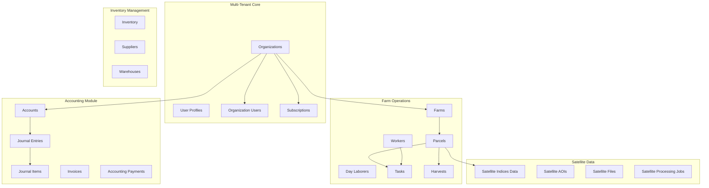
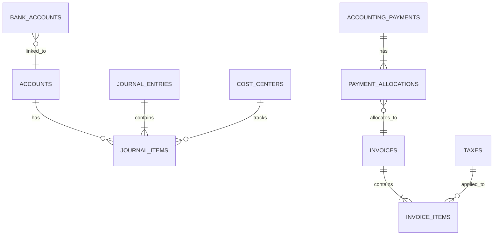
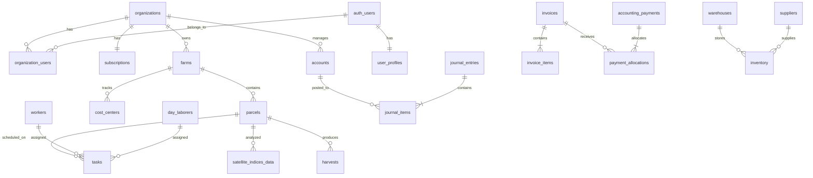

# Database Schema

This document provides a comprehensive overview of the AgriTech Platform database schema, including all tables, relationships, and Entity Relationship Diagrams (ERD).

## Overview

The AgriTech Platform uses PostgreSQL (via Supabase) with a multi-tenant architecture. The schema is organized into several functional domains:

- **Operations**: Organizations, farms, parcels, workers, tasks
- **Inventory**: Products, suppliers, warehouses, stock management
- **Satellite**: Satellite imagery, vegetation indices, processing jobs
- **Accounting**: Chart of accounts, journal entries, invoices, payments
- **Analytics**: Profitability, reports, dashboards
- **Auth & Permissions**: Users, roles, subscriptions

## Database Architecture



## Core Tables

### Organizations & Multi-Tenancy

#### organizations
Central table for multi-tenant isolation. Every farm, parcel, and user belongs to an organization.

```sql
CREATE TABLE organizations (
  id UUID PRIMARY KEY DEFAULT gen_random_uuid(),
  name VARCHAR(255) NOT NULL,

  -- Organization details
  address TEXT,
  city VARCHAR(100),
  country VARCHAR(100) DEFAULT 'Morocco',
  postal_code VARCHAR(20),
  phone VARCHAR(50),
  email VARCHAR(255),
  website VARCHAR(255),

  -- Business settings
  currency VARCHAR(3) DEFAULT 'MAD',
  timezone VARCHAR(100) DEFAULT 'Africa/Casablanca',
  fiscal_year_start DATE DEFAULT CURRENT_DATE,

  -- Billing
  tax_id VARCHAR(100),

  -- Metadata
  created_at TIMESTAMPTZ DEFAULT NOW(),
  updated_at TIMESTAMPTZ DEFAULT NOW(),
  created_by UUID REFERENCES auth.users(id)
);
```

**Relationships:**
- One-to-Many with `farms`, `workers`, `subscriptions`, `accounts`
- Many-to-Many with `users` via `organization_users`

**Indexes:**
- Primary key on `id`
- Index on `created_by`

**RLS Policies:**
- Users can only access organizations they belong to via `organization_users`

---

#### user_profiles
Extended user profile information beyond Supabase auth.users.

```sql
CREATE TABLE user_profiles (
  id UUID PRIMARY KEY REFERENCES auth.users(id) ON DELETE CASCADE,

  -- Personal info
  first_name VARCHAR(100),
  last_name VARCHAR(100),
  phone VARCHAR(50),
  avatar_url TEXT,

  -- Preferences
  language VARCHAR(10) DEFAULT 'en',
  timezone VARCHAR(100) DEFAULT 'Africa/Casablanca',

  -- Onboarding
  onboarding_completed BOOLEAN DEFAULT FALSE,
  password_set BOOLEAN DEFAULT FALSE,

  -- Metadata
  created_at TIMESTAMPTZ DEFAULT NOW(),
  updated_at TIMESTAMPTZ DEFAULT NOW()
);
```

**Triggers:**
- Auto-created when user signs up via `handle_new_user()` trigger

---

#### organization_users
Junction table linking users to organizations with roles.

```sql
CREATE TABLE organization_users (
  id UUID PRIMARY KEY DEFAULT gen_random_uuid(),
  organization_id UUID NOT NULL REFERENCES organizations(id) ON DELETE CASCADE,
  user_id UUID NOT NULL REFERENCES auth.users(id) ON DELETE CASCADE,

  -- Role hierarchy (1-6, lower is higher privilege)
  role VARCHAR(50) NOT NULL CHECK (role IN (
    'system_admin',        -- Level 1
    'organization_admin',  -- Level 2
    'farm_manager',        -- Level 3
    'farm_worker',         -- Level 4
    'day_laborer',         -- Level 5
    'viewer'               -- Level 6
  )),

  is_active BOOLEAN DEFAULT TRUE,
  invited_by UUID REFERENCES auth.users(id),
  invited_at TIMESTAMPTZ DEFAULT NOW(),
  joined_at TIMESTAMPTZ,

  created_at TIMESTAMPTZ DEFAULT NOW(),
  updated_at TIMESTAMPTZ DEFAULT NOW(),

  UNIQUE(organization_id, user_id)
);
```

**Relationships:**
- Many-to-One with `organizations`
- Many-to-One with `auth.users`

---

#### subscriptions
Subscription plans and limits for organizations (Polar.sh integration).

```sql
CREATE TABLE subscriptions (
  id UUID PRIMARY KEY DEFAULT gen_random_uuid(),
  organization_id UUID NOT NULL UNIQUE REFERENCES organizations(id) ON DELETE CASCADE,

  -- Polar.sh references
  polar_subscription_id VARCHAR(255),
  polar_customer_id VARCHAR(255),
  polar_product_id VARCHAR(255),

  -- Plan details
  plan_type VARCHAR(50) DEFAULT 'trial' CHECK (plan_type IN (
    'trial', 'essential', 'professional', 'enterprise'
  )),
  status VARCHAR(50) DEFAULT 'active' CHECK (status IN (
    'active', 'trialing', 'past_due', 'canceled', 'unpaid'
  )),

  -- Limits
  max_farms INTEGER DEFAULT 1,
  max_parcels INTEGER DEFAULT 10,
  max_users INTEGER DEFAULT 3,
  max_satellite_reports INTEGER DEFAULT 5,

  -- Features
  has_analytics BOOLEAN DEFAULT FALSE,
  has_sensor_integration BOOLEAN DEFAULT FALSE,
  has_ai_recommendations BOOLEAN DEFAULT FALSE,
  has_advanced_reporting BOOLEAN DEFAULT FALSE,
  has_api_access BOOLEAN DEFAULT FALSE,
  has_priority_support BOOLEAN DEFAULT FALSE,

  -- Billing period
  current_period_start TIMESTAMPTZ,
  current_period_end TIMESTAMPTZ,
  cancel_at_period_end BOOLEAN DEFAULT FALSE,
  canceled_at TIMESTAMPTZ,

  -- Metadata
  metadata JSONB,
  created_at TIMESTAMPTZ DEFAULT NOW(),
  updated_at TIMESTAMPTZ DEFAULT NOW()
);
```

**Key Functions:**
- `has_valid_subscription(org_id UUID)`: Checks if subscription is active
- `can_create_farm(org_id UUID)`: Validates farm creation against limits
- `can_create_parcel(org_id UUID)`: Validates parcel creation against limits
- `can_add_user(org_id UUID)`: Validates user addition against limits

---

### Farm Operations

#### farms
Individual farm properties within an organization.

```sql
CREATE TABLE farms (
  id UUID PRIMARY KEY DEFAULT gen_random_uuid(),
  organization_id UUID NOT NULL REFERENCES organizations(id) ON DELETE CASCADE,

  name VARCHAR(255) NOT NULL,
  description TEXT,

  -- Location
  location VARCHAR(255),
  latitude DECIMAL(10, 8),
  longitude DECIMAL(11, 8),

  -- Area
  total_area DECIMAL(10, 2), -- in hectares

  created_at TIMESTAMPTZ DEFAULT NOW(),
  updated_at TIMESTAMPTZ DEFAULT NOW(),
  created_by UUID REFERENCES auth.users(id)
);
```

**Relationships:**
- Many-to-One with `organizations`
- One-to-Many with `parcels`, `cost_centers`

**Indexes:**
- `idx_farms_org` on `organization_id`
- GiST index on `(latitude, longitude)` for spatial queries

---

#### parcels
Agricultural parcels/fields with geospatial boundaries.

```sql
CREATE TABLE parcels (
  id UUID PRIMARY KEY DEFAULT gen_random_uuid(),
  organization_id UUID NOT NULL REFERENCES organizations(id) ON DELETE CASCADE,
  farm_id UUID NOT NULL REFERENCES farms(id) ON DELETE CASCADE,

  name VARCHAR(255) NOT NULL,
  description TEXT,

  -- Geospatial
  boundary JSONB, -- GeoJSON coordinates
  calculated_area DECIMAL(10, 4), -- in hectares

  -- Crop info
  crop_type VARCHAR(100),
  crop_variety VARCHAR(100),
  planting_date DATE,
  expected_harvest_date DATE,

  -- Fruit tree specific fields
  is_fruit_trees BOOLEAN DEFAULT FALSE,
  tree_category_id UUID REFERENCES tree_categories(id),
  tree_count INTEGER,
  tree_density DECIMAL(10, 2), -- trees per hectare
  tree_spacing DECIMAL(10, 2), -- meters between trees
  planting_year INTEGER,
  tree_age_years INTEGER,
  irrigation_system VARCHAR(100),

  -- Status
  is_active BOOLEAN DEFAULT TRUE,

  created_at TIMESTAMPTZ DEFAULT NOW(),
  updated_at TIMESTAMPTZ DEFAULT NOW(),
  created_by UUID REFERENCES auth.users(id)
);
```

**Triggers:**
- `calculate_parcel_area_from_boundary()`: Auto-calculates area from GeoJSON boundary

**Relationships:**
- Many-to-One with `farms`
- One-to-Many with `tasks`, `satellite_indices_data`, `harvests`

---

#### workers
Permanent workers with salary contracts.

```sql
CREATE TABLE workers (
  id UUID PRIMARY KEY DEFAULT gen_random_uuid(),
  organization_id UUID NOT NULL REFERENCES organizations(id) ON DELETE CASCADE,
  user_id UUID REFERENCES auth.users(id), -- Optional link to auth user

  -- Personal info
  first_name VARCHAR(100) NOT NULL,
  last_name VARCHAR(100) NOT NULL,
  phone VARCHAR(50),
  email VARCHAR(255),

  -- Employment
  worker_type VARCHAR(50) CHECK (worker_type IN (
    'fixed_salary', 'daily_worker', 'metayage'
  )),

  -- Compensation
  base_salary DECIMAL(10, 2),
  payment_frequency VARCHAR(50) CHECK (payment_frequency IN (
    'monthly', 'daily', 'per_task', 'harvest_share'
  )),

  -- Métayage (sharecropping) specific
  metayage_type VARCHAR(50),
  metayage_percentage DECIMAL(5, 2), -- Worker's share percentage
  calculation_basis VARCHAR(50) CHECK (calculation_basis IN (
    'gross_revenue', 'net_revenue'
  )),

  -- Employment dates
  hire_date DATE,
  termination_date DATE,
  is_active BOOLEAN DEFAULT TRUE,

  created_at TIMESTAMPTZ DEFAULT NOW(),
  updated_at TIMESTAMPTZ DEFAULT NOW()
);
```

**Relationships:**
- Many-to-One with `organizations`
- Optional One-to-One with `auth.users`
- One-to-Many with `tasks` (assigned worker)

---

#### day_laborers
Temporary workers paid daily or per task.

```sql
CREATE TABLE day_laborers (
  id UUID PRIMARY KEY DEFAULT gen_random_uuid(),
  organization_id UUID NOT NULL REFERENCES organizations(id) ON DELETE CASCADE,

  first_name VARCHAR(100) NOT NULL,
  last_name VARCHAR(100) NOT NULL,
  phone VARCHAR(50),

  daily_rate DECIMAL(10, 2),

  created_at TIMESTAMPTZ DEFAULT NOW()
);
```

---

#### tasks
Work tasks assigned to workers or laborers.

```sql
CREATE TABLE tasks (
  id UUID PRIMARY KEY DEFAULT gen_random_uuid(),
  organization_id UUID REFERENCES organizations(id) ON DELETE CASCADE,
  farm_id UUID REFERENCES farms(id),
  parcel_id UUID REFERENCES parcels(id),

  title VARCHAR(255) NOT NULL,
  description TEXT,

  -- Task type
  category VARCHAR(100), -- irrigation, fertilization, pesticide, harvest, etc.
  priority VARCHAR(50) DEFAULT 'medium',

  -- Assignment
  assigned_to UUID, -- Can be worker_id or day_laborer_id
  assigned_to_type VARCHAR(50), -- 'worker' or 'day_laborer'

  -- Scheduling
  due_date DATE,
  start_date DATE,
  end_date DATE,

  -- Status
  status VARCHAR(50) DEFAULT 'pending' CHECK (status IN (
    'pending', 'in_progress', 'completed', 'cancelled'
  )),

  -- Costing
  estimated_cost DECIMAL(10, 2),
  actual_cost DECIMAL(10, 2),
  payment_status VARCHAR(50) DEFAULT 'unpaid',

  created_at TIMESTAMPTZ DEFAULT NOW(),
  updated_at TIMESTAMPTZ DEFAULT NOW(),
  created_by UUID REFERENCES auth.users(id),
  completed_by UUID REFERENCES auth.users(id),
  completed_at TIMESTAMPTZ
);
```

---

### Accounting Module

The accounting module implements double-entry bookkeeping for agricultural finance management.



#### accounts
Chart of Accounts - hierarchical account structure.

```sql
CREATE TABLE accounts (
  id UUID PRIMARY KEY DEFAULT gen_random_uuid(),
  organization_id UUID NOT NULL REFERENCES organizations(id) ON DELETE CASCADE,
  parent_id UUID REFERENCES accounts(id) ON DELETE RESTRICT,

  code VARCHAR(50) NOT NULL,
  name VARCHAR(255) NOT NULL,

  -- Account classification
  account_type VARCHAR(50) NOT NULL CHECK (account_type IN (
    'Asset', 'Liability', 'Equity', 'Revenue', 'Expense'
  )),
  account_subtype VARCHAR(100),

  -- Structure
  is_group BOOLEAN DEFAULT FALSE, -- Group accounts can't have transactions
  is_active BOOLEAN DEFAULT TRUE,

  currency_code VARCHAR(3) DEFAULT 'MAD',
  allow_cost_center BOOLEAN DEFAULT TRUE,

  description TEXT,

  created_at TIMESTAMPTZ DEFAULT NOW(),
  updated_at TIMESTAMPTZ DEFAULT NOW(),

  UNIQUE(organization_id, code)
);
```

**Common Account Types:**
- **Assets**: Cash, Bank Accounts, Accounts Receivable, Inventory, Fixed Assets
- **Liabilities**: Accounts Payable, Loans, Accrued Expenses
- **Equity**: Owner's Capital, Retained Earnings
- **Revenue**: Sales, Service Income, Other Income
- **Expenses**: Cost of Goods Sold, Operating Expenses, Administrative Expenses

---

#### journal_entries
General ledger journal entries (transaction headers).

```sql
CREATE TABLE journal_entries (
  id UUID PRIMARY KEY DEFAULT gen_random_uuid(),
  organization_id UUID NOT NULL REFERENCES organizations(id) ON DELETE CASCADE,

  entry_date DATE NOT NULL,
  posting_date DATE NOT NULL,

  -- Reference tracking
  reference_number VARCHAR(100),
  reference_type VARCHAR(50), -- 'invoice', 'payment', 'manual', etc.
  reference_id UUID,

  status VARCHAR(50) DEFAULT 'draft' CHECK (status IN (
    'draft', 'submitted', 'posted', 'cancelled'
  )),

  remarks TEXT,

  -- Totals (must balance for posted entries)
  total_debit DECIMAL(15, 2) DEFAULT 0,
  total_credit DECIMAL(15, 2) DEFAULT 0,

  -- Workflow
  created_by UUID REFERENCES auth.users(id),
  posted_by UUID REFERENCES auth.users(id),
  posted_at TIMESTAMPTZ,

  created_at TIMESTAMPTZ DEFAULT NOW(),
  updated_at TIMESTAMPTZ DEFAULT NOW(),

  CHECK (status != 'posted' OR (total_debit = total_credit AND total_debit > 0))
);
```

**Triggers:**
- `validate_journal_balance()`: Auto-updates totals when items change

---

#### journal_items
Individual debit/credit lines within journal entries.

```sql
CREATE TABLE journal_items (
  id UUID PRIMARY KEY DEFAULT gen_random_uuid(),
  journal_entry_id UUID NOT NULL REFERENCES journal_entries(id) ON DELETE CASCADE,
  account_id UUID NOT NULL REFERENCES accounts(id) ON DELETE RESTRICT,

  debit DECIMAL(15, 2) DEFAULT 0 CHECK (debit >= 0),
  credit DECIMAL(15, 2) DEFAULT 0 CHECK (credit >= 0),

  -- Analytical dimensions
  cost_center_id UUID REFERENCES cost_centers(id),
  farm_id UUID REFERENCES farms(id),
  parcel_id UUID REFERENCES parcels(id),

  description TEXT,

  created_at TIMESTAMPTZ DEFAULT NOW(),

  CHECK ((debit > 0 AND credit = 0) OR (credit > 0 AND debit = 0))
);
```

---

#### invoices
Sales and purchase invoices.

```sql
CREATE TABLE invoices (
  id UUID PRIMARY KEY DEFAULT gen_random_uuid(),
  organization_id UUID NOT NULL REFERENCES organizations(id) ON DELETE CASCADE,

  invoice_number VARCHAR(100) NOT NULL,
  invoice_type VARCHAR(50) CHECK (invoice_type IN ('sales', 'purchase')),

  -- Party (customer or supplier)
  party_type VARCHAR(50) CHECK (party_type IN ('Customer', 'Supplier')),
  party_id UUID,
  party_name VARCHAR(255) NOT NULL,

  -- Dates
  invoice_date DATE NOT NULL,
  due_date DATE NOT NULL,

  -- Amounts
  subtotal DECIMAL(15, 2) DEFAULT 0,
  tax_total DECIMAL(15, 2) DEFAULT 0,
  grand_total DECIMAL(15, 2) DEFAULT 0,
  outstanding_amount DECIMAL(15, 2) DEFAULT 0,

  currency_code VARCHAR(3) DEFAULT 'MAD',
  exchange_rate DECIMAL(12, 6) DEFAULT 1.0,

  -- Status
  status VARCHAR(50) DEFAULT 'draft' CHECK (status IN (
    'draft', 'submitted', 'paid', 'partially_paid', 'overdue', 'cancelled'
  )),

  -- Context
  farm_id UUID REFERENCES farms(id),
  parcel_id UUID REFERENCES parcels(id),

  attachment_url TEXT,
  remarks TEXT,

  -- GL posting
  journal_entry_id UUID REFERENCES journal_entries(id),

  created_at TIMESTAMPTZ DEFAULT NOW(),
  updated_at TIMESTAMPTZ DEFAULT NOW(),

  UNIQUE(organization_id, invoice_number)
);
```

**Triggers:**
- `update_invoice_totals()`: Auto-calculates totals from line items
- `update_invoice_outstanding()`: Updates outstanding amount when payments allocated

---

#### invoice_items
Line items within invoices.

```sql
CREATE TABLE invoice_items (
  id UUID PRIMARY KEY DEFAULT gen_random_uuid(),
  invoice_id UUID NOT NULL REFERENCES invoices(id) ON DELETE CASCADE,

  item_code VARCHAR(100),
  item_name VARCHAR(255) NOT NULL,
  description TEXT,

  quantity DECIMAL(12, 3) NOT NULL CHECK (quantity > 0),
  unit_price DECIMAL(15, 2) NOT NULL CHECK (unit_price >= 0),

  -- Tax
  tax_id UUID REFERENCES taxes(id),
  tax_rate DECIMAL(5, 2) DEFAULT 0,
  tax_amount DECIMAL(15, 2) DEFAULT 0,

  amount DECIMAL(15, 2) NOT NULL,

  -- GL accounts
  income_account_id UUID REFERENCES accounts(id),
  expense_account_id UUID REFERENCES accounts(id),

  created_at TIMESTAMPTZ DEFAULT NOW()
);
```

---

#### accounting_payments
Payment records (separate from worker payments).

```sql
CREATE TABLE accounting_payments (
  id UUID PRIMARY KEY DEFAULT gen_random_uuid(),
  organization_id UUID NOT NULL REFERENCES organizations(id) ON DELETE CASCADE,

  payment_number VARCHAR(100) NOT NULL,
  payment_type VARCHAR(50) CHECK (payment_type IN ('receive', 'pay')),

  -- Party
  party_type VARCHAR(50) CHECK (party_type IN ('Customer', 'Supplier')),
  party_id UUID,
  party_name VARCHAR(255) NOT NULL,

  -- Payment details
  payment_date DATE NOT NULL,
  payment_method VARCHAR(50) CHECK (payment_method IN (
    'cash', 'bank_transfer', 'check', 'card', 'mobile_money'
  )),
  amount DECIMAL(15, 2) NOT NULL CHECK (amount > 0),

  currency_code VARCHAR(3) DEFAULT 'MAD',

  -- Bank details
  bank_account_id UUID REFERENCES bank_accounts(id),
  reference_number VARCHAR(100),

  status VARCHAR(50) DEFAULT 'draft',
  remarks TEXT,

  -- GL posting
  journal_entry_id UUID REFERENCES journal_entries(id),

  created_at TIMESTAMPTZ DEFAULT NOW(),
  updated_at TIMESTAMPTZ DEFAULT NOW(),

  UNIQUE(organization_id, payment_number)
);
```

---

#### payment_allocations
Links payments to invoices.

```sql
CREATE TABLE payment_allocations (
  id UUID PRIMARY KEY DEFAULT gen_random_uuid(),
  payment_id UUID NOT NULL REFERENCES accounting_payments(id) ON DELETE CASCADE,
  invoice_id UUID NOT NULL REFERENCES invoices(id) ON DELETE RESTRICT,

  allocated_amount DECIMAL(15, 2) NOT NULL CHECK (allocated_amount > 0),

  created_at TIMESTAMPTZ DEFAULT NOW(),

  UNIQUE(payment_id, invoice_id)
);
```

---

#### cost_centers
Analytical dimensions for cost tracking by farm/parcel.

```sql
CREATE TABLE cost_centers (
  id UUID PRIMARY KEY DEFAULT gen_random_uuid(),
  organization_id UUID NOT NULL REFERENCES organizations(id) ON DELETE CASCADE,
  parent_id UUID REFERENCES cost_centers(id),

  code VARCHAR(50) NOT NULL,
  name VARCHAR(255) NOT NULL,

  -- Optional auto-mapping
  farm_id UUID REFERENCES farms(id),
  parcel_id UUID REFERENCES parcels(id),

  is_group BOOLEAN DEFAULT FALSE,
  is_active BOOLEAN DEFAULT TRUE,
  description TEXT,

  created_at TIMESTAMPTZ DEFAULT NOW(),
  updated_at TIMESTAMPTZ DEFAULT NOW(),

  UNIQUE(organization_id, code)
);
```

---

### Satellite Data

#### satellite_indices_data
Calculated vegetation indices from satellite imagery.

```sql
CREATE TABLE satellite_indices_data (
  id UUID PRIMARY KEY DEFAULT gen_random_uuid(),
  organization_id UUID NOT NULL REFERENCES organizations(id) ON DELETE CASCADE,
  parcel_id UUID NOT NULL REFERENCES parcels(id) ON DELETE CASCADE,

  -- Temporal
  acquisition_date DATE NOT NULL,
  processing_date TIMESTAMPTZ DEFAULT NOW(),

  -- Index values
  ndvi DECIMAL(5, 3),
  ndre DECIMAL(5, 3),
  ndmi DECIMAL(5, 3),
  mndwi DECIMAL(5, 3),
  gci DECIMAL(5, 3),
  savi DECIMAL(5, 3),

  -- Statistics
  mean_value DECIMAL(5, 3),
  std_dev DECIMAL(5, 3),
  min_value DECIMAL(5, 3),
  max_value DECIMAL(5, 3),

  -- Quality
  cloud_coverage DECIMAL(5, 2),
  data_quality VARCHAR(50),

  -- Export
  geotiff_url TEXT,

  created_at TIMESTAMPTZ DEFAULT NOW()
);
```

**Indexes:**
- Composite index on `(parcel_id, acquisition_date)`
- Index on `organization_id`

---

#### satellite_processing_jobs
Batch satellite processing job tracking.

```sql
CREATE TABLE satellite_processing_jobs (
  id UUID PRIMARY KEY DEFAULT gen_random_uuid(),
  organization_id UUID NOT NULL REFERENCES organizations(id) ON DELETE CASCADE,

  job_type VARCHAR(50) DEFAULT 'batch_processing',
  status VARCHAR(50) DEFAULT 'pending' CHECK (status IN (
    'pending', 'running', 'completed', 'failed', 'cancelled'
  )),

  -- Configuration
  date_range_start DATE NOT NULL,
  date_range_end DATE NOT NULL,
  indices VARCHAR[] NOT NULL,

  -- Progress
  total_parcels INTEGER DEFAULT 0,
  completed_parcels INTEGER DEFAULT 0,
  failed_parcels INTEGER DEFAULT 0,

  -- Results
  results JSONB,
  error_message TEXT,

  created_at TIMESTAMPTZ DEFAULT NOW(),
  started_at TIMESTAMPTZ,
  completed_at TIMESTAMPTZ,
  created_by UUID REFERENCES auth.users(id)
);
```

---

### Inventory Management

#### inventory
Stock items with packaging details.

```sql
CREATE TABLE inventory (
  id UUID PRIMARY KEY DEFAULT gen_random_uuid(),
  organization_id UUID NOT NULL REFERENCES organizations(id) ON DELETE CASCADE,
  warehouse_id UUID REFERENCES warehouses(id),

  -- Product info
  product_name VARCHAR(255) NOT NULL,
  product_code VARCHAR(100),
  category VARCHAR(100),

  -- Packaging
  packaging_type VARCHAR(50), -- 'bidon', 'sac', 'piece', etc.
  unit_volume DECIMAL(10, 2), -- e.g., 5L, 20L
  unit_weight DECIMAL(10, 2), -- e.g., 25kg, 50kg

  -- Stock
  quantity DECIMAL(12, 2) DEFAULT 0,
  unit_price DECIMAL(10, 2),
  total_value DECIMAL(15, 2),

  -- Thresholds
  reorder_level DECIMAL(10, 2),
  max_stock_level DECIMAL(10, 2),

  -- Metadata
  last_restock_date DATE,
  supplier_id UUID REFERENCES suppliers(id),

  created_at TIMESTAMPTZ DEFAULT NOW(),
  updated_at TIMESTAMPTZ DEFAULT NOW()
);
```

---

## Key Database Features

### 1. Row Level Security (RLS)

All tables have RLS enabled with policies based on organization membership:

```sql
-- Example RLS policy
CREATE POLICY "org_access_farms" ON farms
FOR ALL USING (
  organization_id IN (
    SELECT organization_id FROM organization_users
    WHERE user_id = auth.uid()
  )
);
```

See [rls-policies.md](./rls-policies.md) for complete documentation.

---

### 2. Automatic Triggers

Key triggers for data integrity:

- **Area calculation**: Auto-calculate parcel area from GeoJSON
- **Balance validation**: Ensure journal entries balance
- **Invoice totals**: Auto-update invoice totals from line items
- **Outstanding amounts**: Track invoice payments automatically

See [triggers.md](./triggers.md) for complete documentation.

---

### 3. Helper Functions

Utility functions for business logic:

- `has_valid_subscription(org_id)`: Check subscription status
- `can_create_farm(org_id)`: Validate against subscription limits
- `generate_invoice_number(org_id, type)`: Auto-generate invoice numbers
- `calculate_metayage_share(worker_id, revenue, charges)`: Calculate sharecropper payments

See [functions.md](./functions.md) for complete documentation.

---

### 4. Analytical Views

Pre-built views for reporting:

```sql
-- Ledger view for GL report
CREATE VIEW vw_ledger AS
SELECT
  je.entry_date,
  a.code AS account_code,
  a.name AS account_name,
  ji.debit,
  ji.credit,
  cc.name AS cost_center
FROM journal_items ji
JOIN journal_entries je ON ji.journal_entry_id = je.id
JOIN accounts a ON ji.account_id = a.id
LEFT JOIN cost_centers cc ON ji.cost_center_id = cc.id
WHERE je.status = 'posted';

-- Account balances
CREATE VIEW vw_account_balances AS
SELECT
  a.code,
  a.name,
  a.account_type,
  SUM(ji.debit) AS total_debit,
  SUM(ji.credit) AS total_credit,
  CASE
    WHEN a.account_type IN ('Asset', 'Expense')
    THEN SUM(ji.debit - ji.credit)
    ELSE SUM(ji.credit - ji.debit)
  END AS balance
FROM accounts a
LEFT JOIN journal_items ji ON a.id = ji.account_id
GROUP BY a.id;

-- Invoice aging
CREATE VIEW vw_invoice_aging AS
SELECT
  i.*,
  CURRENT_DATE - i.due_date AS days_overdue,
  CASE
    WHEN CURRENT_DATE <= i.due_date THEN 'Current'
    WHEN CURRENT_DATE - i.due_date <= 30 THEN '1-30 days'
    WHEN CURRENT_DATE - i.due_date <= 60 THEN '31-60 days'
    ELSE 'Over 60 days'
  END AS aging_bucket
FROM invoices i
WHERE status IN ('submitted', 'partially_paid', 'overdue');
```

---

## Database Diagrams

### Complete ERD



---

## Data Types & Enums

### Worker Types
- `fixed_salary`: Monthly/fixed salary workers
- `daily_worker`: Paid per day worked
- `metayage`: Sharecropping arrangement

### Métayage Types
- `khammass`: 20% share (1/5)
- `rebaa`: 25% share (1/4)
- `tholth`: 33% share (1/3)
- `custom`: Custom percentage

### Task Status
- `pending`: Not started
- `in_progress`: Currently being worked on
- `completed`: Finished
- `cancelled`: Cancelled

### Invoice Status
- `draft`: Being prepared
- `submitted`: Sent to customer/supplier
- `paid`: Fully paid
- `partially_paid`: Partial payment received
- `overdue`: Past due date
- `cancelled`: Cancelled

### Journal Entry Status
- `draft`: Being prepared
- `submitted`: Ready for posting
- `posted`: Posted to GL (immutable)
- `cancelled`: Cancelled

---

## Indexes Strategy

### Primary Indexes
- All tables: Primary key on `id` (UUID)
- Tenant isolation: Index on `organization_id`
- Time-series: Composite indexes on `(organization_id, date)` or `(parcel_id, acquisition_date)`

### Foreign Key Indexes
Automatically created for all foreign key relationships.

### Specialized Indexes
- Geospatial: GiST indexes for location queries
- Full-text search: GIN indexes on text fields
- Partial indexes: On active records only (`WHERE is_active = TRUE`)

---

## Performance Considerations

### Query Optimization
1. **Multi-tenant queries**: Always filter by `organization_id` first
2. **Date ranges**: Use indexed date columns
3. **Joins**: Limit join depth, use CTEs for complex queries
4. **Aggregations**: Use materialized views for heavy analytics

### Connection Pooling
- Supabase uses PgBouncer for connection pooling
- Max connections configured per organization tier

### Caching Strategy
- Frontend: TanStack Query with 5-minute stale time
- Database: Materialized views for reports (refreshed nightly)

---

## Next Steps

- [Migration Workflow](./migrations.md) - How to create and manage schema changes
- [RLS Policies](./rls-policies.md) - Row Level Security implementation
- [Functions](./functions.md) - PostgreSQL functions and RPCs
- [Triggers](./triggers.md) - Database triggers and automation
- [Type Generation](./type-generation.md) - TypeScript type generation from schema
