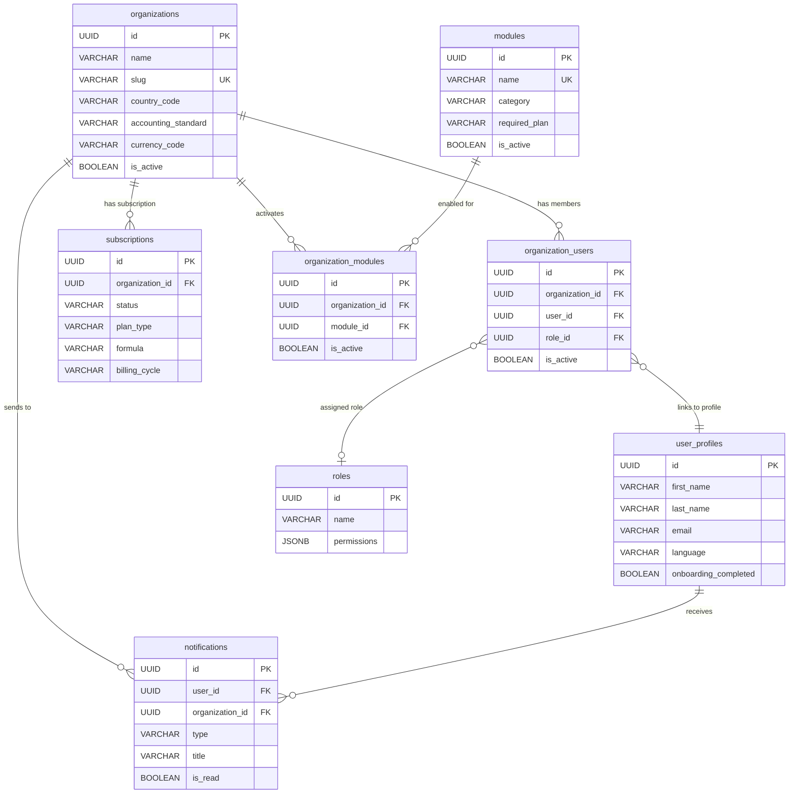
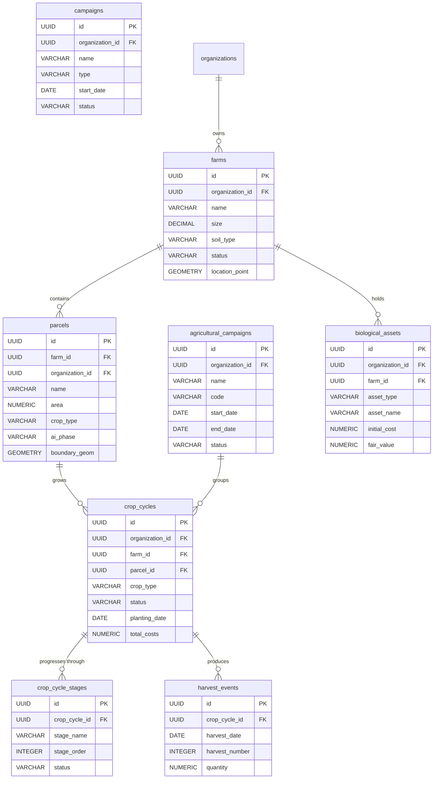
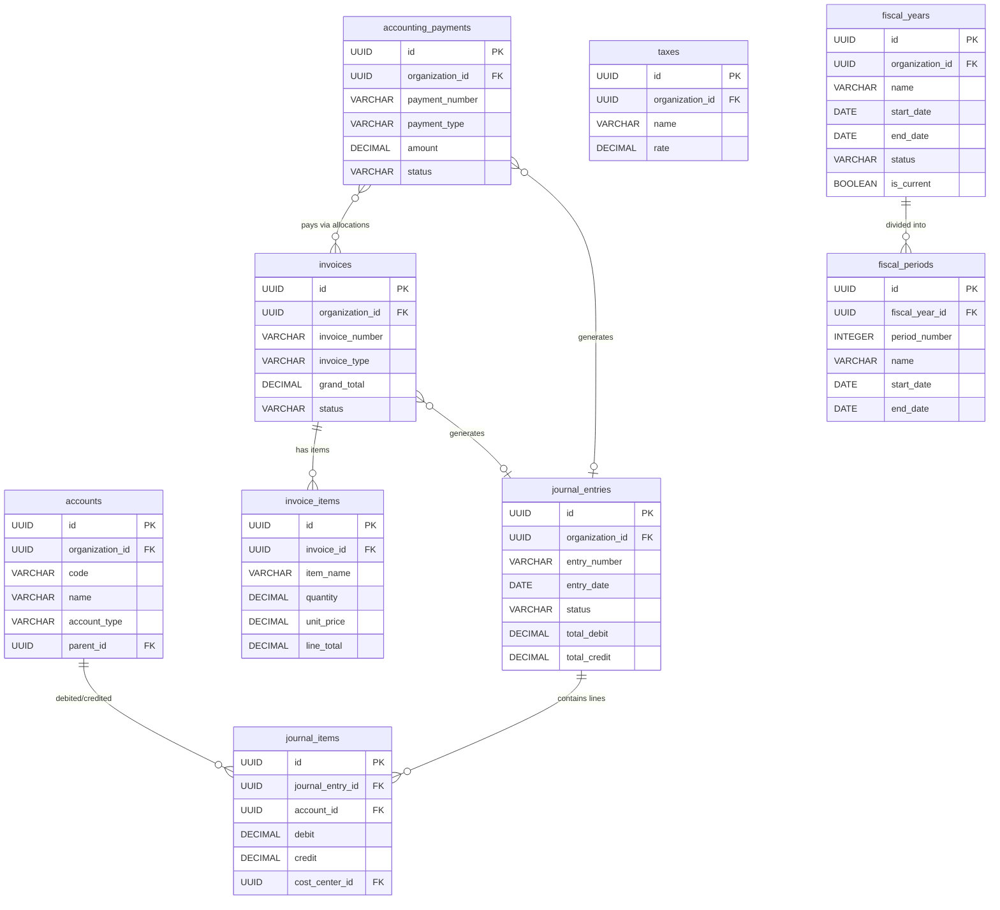
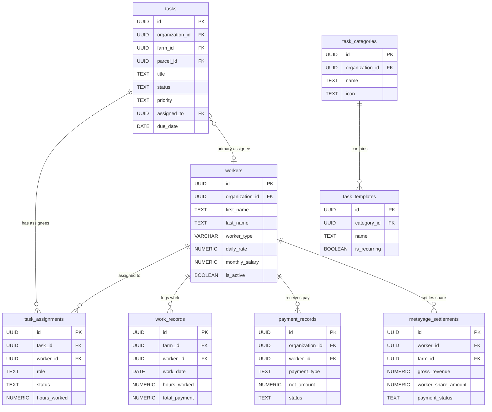
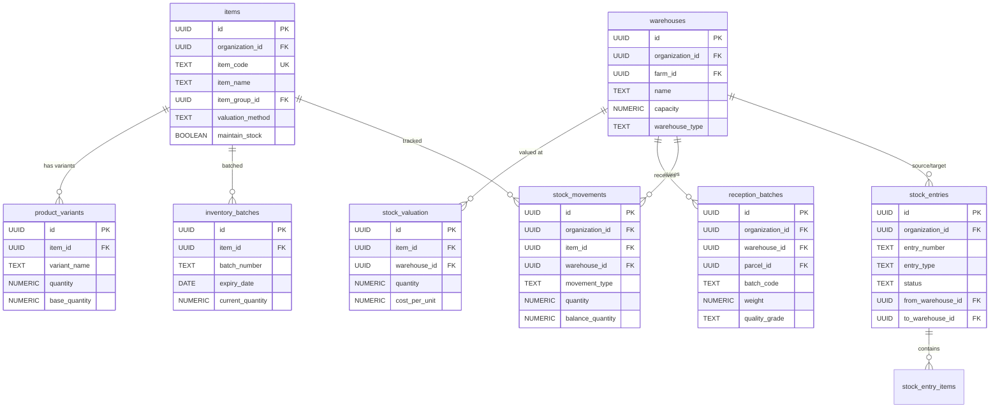
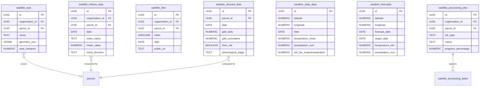
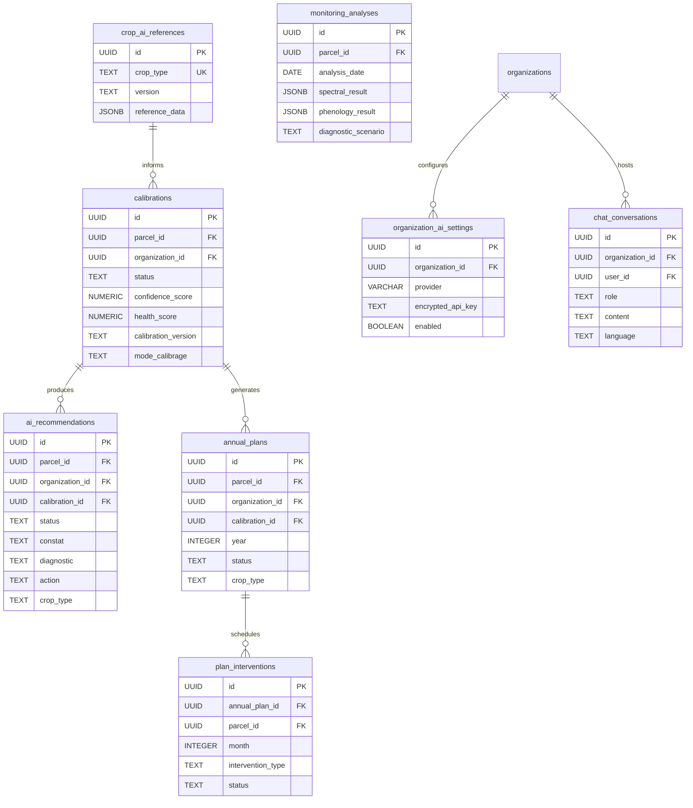
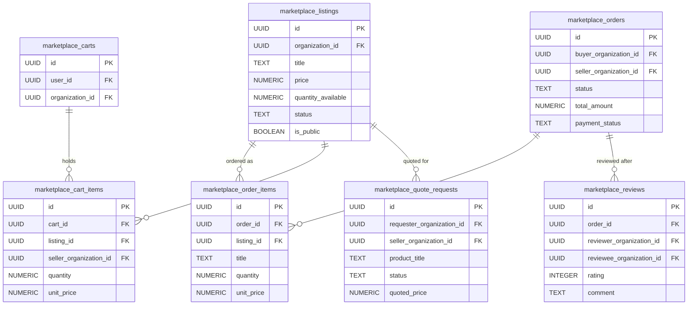
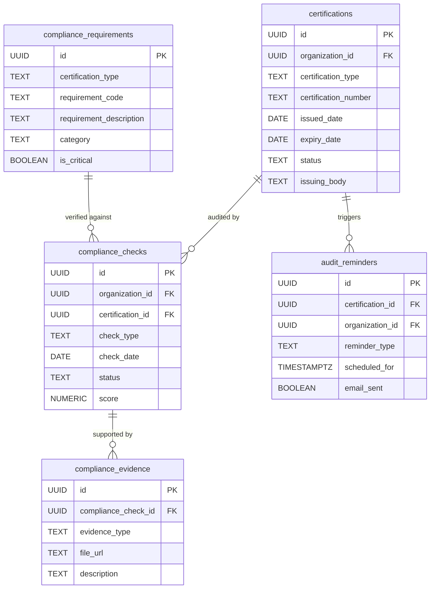
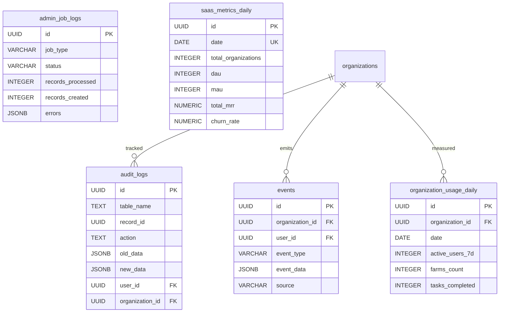

# Database Schema

## Overview

The AgroGina platform uses **PostgreSQL** via **Supabase** as its database backend. The schema comprises **120+ tables** organized across 10 domain areas, supporting a multi-tenant SaaS architecture with comprehensive **Row-Level Security (RLS)** policies.

Key characteristics:

- **Multi-tenant**: All business data is scoped to an `organization_id`. The `organization_users` junction table controls membership and roles.
- **UUID primary keys**: Every table uses `UUID` primary keys generated with `gen_random_uuid()`.
- **Soft deletes**: Critical tables (`workers`, `tasks`, `crop_cycles`, `harvest_records`) support soft deletion via a `deleted_at` column.
- **Audit trail**: An `audit_logs` table with generic triggers captures INSERT/UPDATE/DELETE operations on critical tables.
- **Multi-country accounting**: Supports CGNC (Morocco), PCG (France), PCN (Tunisia), US GAAP, FRS 102 (UK), HGB (Germany), IFRS, and OHADA.
- **PostGIS**: Native geometry columns (`GEOMETRY(Point, 4326)`, `GEOMETRY(Polygon, 4326)`) on `farms` and `parcels` for geospatial queries.
- **AI-ready**: Dedicated tables for calibrations, recommendations, annual plans, monitoring, and crop AI references.

---

## 1. Core & Multi-tenancy


```mermaid
erDiagram
    organizations {
        UUID id PK
        VARCHAR name
        VARCHAR slug UK
        VARCHAR country_code
        VARCHAR accounting_standard
        VARCHAR currency_code
        BOOLEAN is_active
    }
    organization_users {
        UUID id PK
        UUID organization_id FK
        UUID user_id FK
        UUID role_id FK
        BOOLEAN is_active
    }
    user_profiles {
        UUID id PK
        VARCHAR first_name
        VARCHAR last_name
        VARCHAR email
        VARCHAR language
        BOOLEAN onboarding_completed
    }
    roles {
        UUID id PK
        VARCHAR name
        JSONB permissions
    }
    subscriptions {
        UUID id PK
        UUID organization_id FK
        VARCHAR status
        VARCHAR plan_type
        VARCHAR formula
        VARCHAR billing_cycle
    }
    modules {
        UUID id PK
        VARCHAR name UK
        VARCHAR category
        VARCHAR required_plan
        BOOLEAN is_active
    }
    organization_modules {
        UUID id PK
        UUID organization_id FK
        UUID module_id FK
        BOOLEAN is_active
    }
    notifications {
        UUID id PK
        UUID user_id FK
        UUID organization_id FK
        VARCHAR type
        VARCHAR title
        BOOLEAN is_read
    }

    organizations ||--o{ organization_users : "has members"
    organization_users }o--|| user_profiles : "links to profile"
    organization_users }o--o| roles : "assigned role"
    organizations ||--o{ subscriptions : "has subscription"
    organizations ||--o{ organization_modules : "activates"
    modules ||--o{ organization_modules : "enabled for"
    organizations ||--o{ notifications : "sends to"
    user_profiles ||--o{ notifications : "receives"
```

| Table | Description |
|---|---|
| `organizations` | Tenant organizations with address, accounting standard, country, and configuration |
| `organization_users` | Junction table linking users to organizations with role assignments |
| `user_profiles` | User profile data (name, email, language, onboarding state, avatar) |
| `roles` | Role definitions with JSONB permissions (system_admin, organization_admin, farm_manager, etc.) |
| `subscriptions` | Subscription plans with limits (farms, parcels, users), billing cycle, and contract details |
| `modules` | Application modules (dashboard, farms, harvests, tasks, accounting, satellite, etc.) |
| `organization_modules` | Per-organization module activation with settings |
| `notifications` | In-app real-time notifications per user |
| `currencies` | Reference table of supported currencies (MAD, USD, EUR, GBP, TND) |
| `organization_addons` | Addon module subscriptions per organization |
| `subscription_usage` | Usage tracking per subscription period |
| `subscription_contracts` | Formal contract records linked to subscriptions |
| `subscription_events` | Lifecycle events (created, renewed, upgraded, cancelled) |
| `billing_documents` | Invoice/credit-note records for billing |
| `internal_admins` | Platform-level administrator access |
| `document_templates` | Customizable PDF templates for invoices, quotes, reports |

---

## 2. Farm Management


```mermaid
erDiagram
    farms {
        UUID id PK
        UUID organization_id FK
        VARCHAR name
        DECIMAL size
        VARCHAR soil_type
        VARCHAR status
        GEOMETRY location_point
    }
    parcels {
        UUID id PK
        UUID farm_id FK
        UUID organization_id FK
        VARCHAR name
        NUMERIC area
        VARCHAR crop_type
        VARCHAR ai_phase
        GEOMETRY boundary_geom
    }
    crop_cycles {
        UUID id PK
        UUID organization_id FK
        UUID farm_id FK
        UUID parcel_id FK
        VARCHAR crop_type
        VARCHAR status
        DATE planting_date
        NUMERIC total_costs
    }
    crop_cycle_stages {
        UUID id PK
        UUID crop_cycle_id FK
        VARCHAR stage_name
        INTEGER stage_order
        VARCHAR status
    }
    harvest_events {
        UUID id PK
        UUID crop_cycle_id FK
        DATE harvest_date
        INTEGER harvest_number
        NUMERIC quantity
    }
    agricultural_campaigns {
        UUID id PK
        UUID organization_id FK
        VARCHAR name
        VARCHAR code
        DATE start_date
        DATE end_date
        VARCHAR status
    }
    biological_assets {
        UUID id PK
        UUID organization_id FK
        UUID farm_id FK
        VARCHAR asset_type
        VARCHAR asset_name
        NUMERIC initial_cost
        NUMERIC fair_value
    }
    campaigns {
        UUID id PK
        UUID organization_id FK
        VARCHAR name
        VARCHAR type
        DATE start_date
        VARCHAR status
    }

    organizations ||--o{ farms : "owns"
    farms ||--o{ parcels : "contains"
    parcels ||--o{ crop_cycles : "grows"
    crop_cycles ||--o{ crop_cycle_stages : "progresses through"
    crop_cycles ||--o{ harvest_events : "produces"
    agricultural_campaigns ||--o{ crop_cycles : "groups"
    farms ||--o{ biological_assets : "holds"
```

| Table | Description |
|---|---|
| `farms` | Farm properties with location, size, soil type, manager info, and PostGIS geometry |
| `parcels` | Land parcels with crop info, area, boundary, AI calibration phase, and irrigation details |
| `crop_cycles` | Growing cycles tracking planting-to-harvest with costs, revenue, yield, and WIP valuation |
| `crop_cycle_stages` | Ordered stages within a crop cycle (land_prep, growing, harvesting) |
| `harvest_events` | Individual harvest events within a crop cycle |
| `agricultural_campaigns` | Cross-farm campaign periods linking to fiscal years |
| `campaigns` | Operational campaigns (planting, harvest, maintenance, fertilization) |
| `biological_assets` | IAS 41 compliant biological asset tracking with fair value and depreciation |
| `biological_asset_valuations` | Periodic fair value assessments for biological assets |
| `crop_cycle_allocations` | Cost/revenue allocations to crop cycles by percentage |
| `crop_templates` | Global and per-org crop configuration templates |
| `quality_inspections` | Pre/post-harvest quality inspection records with JSONB results |

---

## 3. Accounting & Finance


```mermaid
erDiagram
    accounts {
        UUID id PK
        UUID organization_id FK
        VARCHAR code
        VARCHAR name
        VARCHAR account_type
        UUID parent_id FK
    }
    journal_entries {
        UUID id PK
        UUID organization_id FK
        VARCHAR entry_number
        DATE entry_date
        VARCHAR status
        DECIMAL total_debit
        DECIMAL total_credit
    }
    journal_items {
        UUID id PK
        UUID journal_entry_id FK
        UUID account_id FK
        DECIMAL debit
        DECIMAL credit
        UUID cost_center_id FK
    }
    invoices {
        UUID id PK
        UUID organization_id FK
        VARCHAR invoice_number
        VARCHAR invoice_type
        DECIMAL grand_total
        VARCHAR status
    }
    invoice_items {
        UUID id PK
        UUID invoice_id FK
        VARCHAR item_name
        DECIMAL quantity
        DECIMAL unit_price
        DECIMAL line_total
    }
    accounting_payments {
        UUID id PK
        UUID organization_id FK
        VARCHAR payment_number
        VARCHAR payment_type
        DECIMAL amount
        VARCHAR status
    }
    taxes {
        UUID id PK
        UUID organization_id FK
        VARCHAR name
        DECIMAL rate
    }
    fiscal_years {
        UUID id PK
        UUID organization_id FK
        VARCHAR name
        DATE start_date
        DATE end_date
        VARCHAR status
        BOOLEAN is_current
    }
    fiscal_periods {
        UUID id PK
        UUID fiscal_year_id FK
        INTEGER period_number
        VARCHAR name
        DATE start_date
        DATE end_date
    }

    accounts ||--o{ journal_items : "debited/credited"
    journal_entries ||--o{ journal_items : "contains lines"
    invoices ||--o{ invoice_items : "has items"
    accounting_payments }o--o{ invoices : "pays via allocations"
    fiscal_years ||--o{ fiscal_periods : "divided into"
    invoices }o--o| journal_entries : "generates"
    accounting_payments }o--o| journal_entries : "generates"
```

| Table | Description |
|---|---|
| `accounts` | Chart of accounts per organization (hierarchical with parent_id) |
| `account_templates` | Pre-configured chart of accounts by country/standard (PCEC, PCG, GAAP, FRS102) |
| `account_mappings` | Maps business operations (labor, harvest, etc.) to country-specific account codes |
| `account_translations` | Multi-language translations for account names |
| `journal_entries` | Double-entry journal entries with status (draft/posted) |
| `journal_items` | Individual debit/credit lines in journal entries |
| `invoices` | Sales and purchase invoices with party, totals, and status |
| `invoice_items` | Line items on invoices with quantity, price, tax |
| `quotes` | Sales quotes with validity dates and conversion tracking |
| `quote_items` | Line items on quotes |
| `sales_orders` | Customer sales orders with delivery and stock tracking |
| `sales_order_items` | Line items on sales orders |
| `purchase_orders` | Supplier purchase orders |
| `purchase_order_items` | Line items on purchase orders |
| `accounting_payments` | Payment records (received/sent) with method and status |
| `payment_allocations` | Links payments to invoices with allocated amounts |
| `taxes` | Tax definitions per organization |
| `tax_configurations` | Country-level and org-level tax rate configurations |
| `bank_accounts` | Bank account records with balances |
| `cost_centers` | Hierarchical cost/profit centers linked to farms/parcels/crop cycles |
| `cost_center_budgets` | Budget vs actual tracking per cost center and fiscal year |
| `fiscal_years` | Fiscal year periods with open/closed status |
| `fiscal_periods` | Monthly or quarterly periods within fiscal years |
| `customers` | Customer records with contact info, credit limits, and payment terms |
| `suppliers` | Supplier/vendor records with contact info and payment terms |
| `financial_transactions` | Legacy financial transaction records |

---

## 4. Workforce & Tasks


```mermaid
erDiagram
    workers {
        UUID id PK
        UUID organization_id FK
        TEXT first_name
        TEXT last_name
        VARCHAR worker_type
        NUMERIC daily_rate
        NUMERIC monthly_salary
        BOOLEAN is_active
    }
    tasks {
        UUID id PK
        UUID organization_id FK
        UUID farm_id FK
        UUID parcel_id FK
        TEXT title
        TEXT status
        TEXT priority
        UUID assigned_to FK
        DATE due_date
    }
    task_assignments {
        UUID id PK
        UUID task_id FK
        UUID worker_id FK
        TEXT role
        TEXT status
        NUMERIC hours_worked
    }
    task_categories {
        UUID id PK
        UUID organization_id FK
        TEXT name
        TEXT icon
    }
    task_templates {
        UUID id PK
        UUID category_id FK
        TEXT name
        BOOLEAN is_recurring
    }
    work_records {
        UUID id PK
        UUID farm_id FK
        UUID worker_id FK
        DATE work_date
        NUMERIC hours_worked
        NUMERIC total_payment
    }
    payment_records {
        UUID id PK
        UUID organization_id FK
        UUID worker_id FK
        TEXT payment_type
        NUMERIC net_amount
        TEXT status
    }
    metayage_settlements {
        UUID id PK
        UUID worker_id FK
        UUID farm_id FK
        NUMERIC gross_revenue
        NUMERIC worker_share_amount
        TEXT payment_status
    }

    workers ||--o{ task_assignments : "assigned to"
    tasks ||--o{ task_assignments : "has assignees"
    workers ||--o{ work_records : "logs work"
    workers ||--o{ payment_records : "receives pay"
    workers ||--o{ metayage_settlements : "settles share"
    task_categories ||--o{ task_templates : "contains"
    tasks }o--o| workers : "primary assignee"
```

| Table | Description |
|---|---|
| `workers` | Workers/employees with type (daily_worker, fixed_salary, metayage), rates, and skills |
| `tasks` | Work tasks with priority, status, due date, checklist, and piece-work payment fields |
| `task_assignments` | Multi-worker assignments per task with hours/units tracking |
| `task_categories` | Categorization for tasks (e.g., irrigation, fertilization) |
| `task_templates` | Reusable task templates with recurrence patterns |
| `task_comments` | Comments and status updates on tasks |
| `task_time_logs` | Time tracking with start/end times and break duration |
| `task_dependencies` | Task dependency relationships (finish-to-start, etc.) |
| `task_equipment` | Equipment used per task with condition tracking |
| `work_records` | Daily work records for laborers with payment status |
| `work_units` | Unit definitions for piece-work (count, weight, volume, area, length) |
| `payment_records` | Payroll records with base amount, bonuses, deductions, net calculation |
| `payment_advances` | Advance payment requests with approval workflow |
| `payment_bonuses` | Bonus line items on payment records |
| `payment_deductions` | Deduction line items (CNSS, tax, advance repayment) |
| `metayage_settlements` | Sharecropping settlement calculations per harvest period |

---

## 5. Inventory & Stock


```mermaid
erDiagram
    warehouses {
        UUID id PK
        UUID organization_id FK
        UUID farm_id FK
        TEXT name
        NUMERIC capacity
        TEXT warehouse_type
    }
    items {
        UUID id PK
        UUID organization_id FK
        TEXT item_code UK
        TEXT item_name
        UUID item_group_id FK
        TEXT valuation_method
        BOOLEAN maintain_stock
    }
    inventory_batches {
        UUID id PK
        UUID item_id FK
        TEXT batch_number
        DATE expiry_date
        NUMERIC current_quantity
    }
    stock_entries {
        UUID id PK
        UUID organization_id FK
        TEXT entry_number
        TEXT entry_type
        TEXT status
        UUID from_warehouse_id FK
        UUID to_warehouse_id FK
    }
    stock_movements {
        UUID id PK
        UUID organization_id FK
        UUID item_id FK
        UUID warehouse_id FK
        TEXT movement_type
        NUMERIC quantity
        NUMERIC balance_quantity
    }
    stock_valuation {
        UUID id PK
        UUID item_id FK
        UUID warehouse_id FK
        NUMERIC quantity
        NUMERIC cost_per_unit
    }
    reception_batches {
        UUID id PK
        UUID organization_id FK
        UUID warehouse_id FK
        UUID parcel_id FK
        TEXT batch_code
        NUMERIC weight
        TEXT quality_grade
    }
    product_variants {
        UUID id PK
        UUID item_id FK
        TEXT variant_name
        NUMERIC quantity
        NUMERIC base_quantity
    }

    warehouses ||--o{ stock_entries : "source/target"
    items ||--o{ stock_movements : "tracked"
    items ||--o{ inventory_batches : "batched"
    items ||--o{ product_variants : "has variants"
    stock_entries ||--o{ stock_entry_items : "contains"
    warehouses ||--o{ stock_movements : "stores"
    warehouses ||--o{ reception_batches : "receives"
    warehouses ||--o{ stock_valuation : "valued at"
```

| Table | Description |
|---|---|
| `warehouses` | Storage facilities with capacity, type, and location |
| `items` | Item master with sales/purchase/stock flags, valuation method, and dimensions |
| `item_groups` | Hierarchical item categorization with default accounts |
| `inventory_items` | Legacy inventory items (seeds, fertilizers, pesticides, equipment) |
| `inventory_batches` | Batch tracking with expiry dates and supplier reference |
| `inventory_serial_numbers` | Serial number tracking for individual items |
| `stock_entries` | Stock movement documents (receipt, issue, transfer, reconciliation) |
| `stock_entry_items` | Line items in stock entries with quantity and cost |
| `stock_movements` | Atomic stock movement records with running balance |
| `stock_valuation` | FIFO/LIFO/Average cost valuation records per item/warehouse |
| `opening_stock_balances` | Opening stock balances for new fiscal periods |
| `stock_closing_entries` | Period-end stock closing documents |
| `stock_closing_items` | Line items in closing entries |
| `stock_account_mappings` | Maps stock entry types to debit/credit accounts |
| `reception_batches` | Harvest reception at warehouse with quality grading and decision routing |
| `product_variants` | Multi-dimension variants (1L, 5L, 10kg) for the same item |
| `product_applications` | Historical record of product applications (fertilizers, pesticides) on parcels |

---

## 6. Satellite & Weather


```mermaid
erDiagram
    satellite_aois {
        UUID id PK
        UUID organization_id FK
        UUID parcel_id FK
        TEXT name
        JSONB geometry_json
        NUMERIC area_hectares
    }
    satellite_indices_data {
        UUID id PK
        UUID organization_id FK
        UUID parcel_id FK
        DATE date
        TEXT index_name
        NUMERIC mean_value
        TEXT trend_direction
    }
    satellite_files {
        UUID id PK
        UUID organization_id FK
        UUID parcel_id FK
        VARCHAR index
        DATE date
        TEXT public_url
    }
    satellite_processing_jobs {
        UUID id PK
        UUID organization_id FK
        UUID parcel_id FK
        TEXT job_type
        TEXT status
        NUMERIC progress_percentage
    }
    weather_daily_data {
        UUID id PK
        NUMERIC latitude
        NUMERIC longitude
        DATE date
        NUMERIC temperature_mean
        NUMERIC precipitation_sum
        NUMERIC et0_fao_evapotranspiration
    }
    weather_forecasts {
        UUID id PK
        NUMERIC latitude
        NUMERIC longitude
        DATE forecast_date
        DATE target_date
        NUMERIC temperature_min
        NUMERIC precipitation_sum
    }
    weather_derived_data {
        UUID id PK
        UUID parcel_id FK
        DATE date
        NUMERIC gdd_daily
        NUMERIC gdd_cumulative
        BOOLEAN frost_risk
        TEXT phenological_stage
    }

    satellite_aois }o--o| parcels : "covers"
    satellite_indices_data }o--|| parcels : "measured for"
    satellite_processing_jobs ||--o{ satellite_processing_tasks : "spawns"
    weather_derived_data }o--|| parcels : "computed for"
```

| Table | Description |
|---|---|
| `satellite_aois` | Areas of interest for satellite analysis per farm/parcel |
| `satellite_indices_data` | Vegetation index values (NDVI, NDRE, NDMI, EVI, etc.) per parcel/date |
| `satellite_files` | GeoTIFF and image files from satellite processing |
| `satellite_par_data` | Daily PAR cache for NIRvP index computation (location-based, shared) |
| `satellite_processing_jobs` | Batch processing job tracking with progress |
| `satellite_processing_tasks` | Individual processing tasks within a job |
| `cloud_coverage_checks` | Cloud coverage assessments for satellite imagery windows |
| `weather_daily_data` | Location-based daily weather cache (temperature, precipitation, soil, GDD) |
| `weather_forecasts` | Location-based weather forecast cache |
| `weather_derived_data` | Per-parcel derived metrics (GDD, chill hours, frost risk, water balance) |

---

## 7. AI & Calibration


```mermaid
erDiagram
    calibrations {
        UUID id PK
        UUID parcel_id FK
        UUID organization_id FK
        TEXT status
        NUMERIC confidence_score
        NUMERIC health_score
        TEXT calibration_version
        TEXT mode_calibrage
    }
    ai_recommendations {
        UUID id PK
        UUID parcel_id FK
        UUID organization_id FK
        UUID calibration_id FK
        TEXT status
        TEXT constat
        TEXT diagnostic
        TEXT action
        TEXT crop_type
    }
    annual_plans {
        UUID id PK
        UUID parcel_id FK
        UUID organization_id FK
        UUID calibration_id FK
        INTEGER year
        TEXT status
        TEXT crop_type
    }
    plan_interventions {
        UUID id PK
        UUID annual_plan_id FK
        UUID parcel_id FK
        INTEGER month
        TEXT intervention_type
        TEXT status
    }
    crop_ai_references {
        UUID id PK
        TEXT crop_type UK
        TEXT version
        JSONB reference_data
    }
    monitoring_analyses {
        UUID id PK
        UUID parcel_id FK
        DATE analysis_date
        JSONB spectral_result
        JSONB phenology_result
        TEXT diagnostic_scenario
    }
    organization_ai_settings {
        UUID id PK
        UUID organization_id FK
        VARCHAR provider
        TEXT encrypted_api_key
        BOOLEAN enabled
    }
    chat_conversations {
        UUID id PK
        UUID organization_id FK
        UUID user_id FK
        TEXT role
        TEXT content
        TEXT language
    }

    calibrations ||--o{ ai_recommendations : "produces"
    calibrations ||--o{ annual_plans : "generates"
    annual_plans ||--o{ plan_interventions : "schedules"
    crop_ai_references ||--o{ calibrations : "informs"
    organizations ||--o{ organization_ai_settings : "configures"
    organizations ||--o{ chat_conversations : "hosts"
```

| Table | Description |
|---|---|
| `calibrations` | AI parcel calibration records with baselines, confidence, health score, and zone classification |
| `ai_recommendations` | AI-generated recommendations (constat, diagnostic, action) with status tracking |
| `annual_plans` | AI-generated annual intervention plans per parcel/year |
| `plan_interventions` | Scheduled interventions within annual plans (month, type, product, dose) |
| `crop_ai_references` | Reference data per crop type (olivier, agrumes, avocatier, palmier_dattier) |
| `monitoring_analyses` | Periodic spectral and phenology analysis results |
| `yield_forecasts` | AI yield predictions with confidence and alternance status |
| `evenements_parcelle` | Parcel events that may trigger recalibration |
| `suivis_saison` | Season tracking data for annual recalibration and ML training |
| `organization_ai_settings` | Encrypted API keys for AI providers (OpenAI, Gemini) per org |
| `chat_conversations` | AI chat history between users and assistant |
| `performance_alerts` | AI-generated and manual performance alerts (drought, frost, pest, yield) |
| `phenological_stages` | Reference: phenological stages per crop with BBCH codes and GDD thresholds |
| `crop_kc_coefficients` | Reference: crop coefficient (Kc) values per crop/stage |
| `crop_mineral_exports` | Reference: mineral export rates per ton by crop type |
| `crop_diseases` | Reference: disease catalog with conditions, treatments, and satellite signals |
| `crop_index_thresholds` | Reference: healthy/stress/critical ranges for vegetation indices |

---

## 8. Marketplace


```mermaid
erDiagram
    marketplace_listings {
        UUID id PK
        UUID organization_id FK
        TEXT title
        NUMERIC price
        NUMERIC quantity_available
        TEXT status
        BOOLEAN is_public
    }
    marketplace_orders {
        UUID id PK
        UUID buyer_organization_id FK
        UUID seller_organization_id FK
        TEXT status
        NUMERIC total_amount
        TEXT payment_status
    }
    marketplace_order_items {
        UUID id PK
        UUID order_id FK
        UUID listing_id FK
        TEXT title
        NUMERIC quantity
        NUMERIC unit_price
    }
    marketplace_reviews {
        UUID id PK
        UUID order_id FK
        UUID reviewer_organization_id FK
        UUID reviewee_organization_id FK
        INTEGER rating
        TEXT comment
    }
    marketplace_carts {
        UUID id PK
        UUID user_id FK
        UUID organization_id FK
    }
    marketplace_cart_items {
        UUID id PK
        UUID cart_id FK
        UUID listing_id FK
        UUID seller_organization_id FK
        NUMERIC quantity
        NUMERIC unit_price
    }
    marketplace_quote_requests {
        UUID id PK
        UUID requester_organization_id FK
        UUID seller_organization_id FK
        TEXT product_title
        TEXT status
        NUMERIC quoted_price
    }

    marketplace_listings ||--o{ marketplace_order_items : "ordered as"
    marketplace_orders ||--o{ marketplace_order_items : "contains"
    marketplace_orders ||--o{ marketplace_reviews : "reviewed after"
    marketplace_carts ||--o{ marketplace_cart_items : "holds"
    marketplace_listings ||--o{ marketplace_cart_items : "added to cart"
    marketplace_listings ||--o{ marketplace_quote_requests : "quoted for"
```

| Table | Description |
|---|---|
| `marketplace_listings` | Product listings with price, quantity, images, and public/private visibility |
| `marketplace_orders` | B2B orders between buyer and seller organizations |
| `marketplace_order_items` | Line items in marketplace orders with stock deduction tracking |
| `marketplace_reviews` | Buyer/seller reviews with 1-5 rating (one per order side) |
| `marketplace_carts` | Shopping carts (one per user) |
| `marketplace_cart_items` | Items in shopping carts with seller reference |
| `marketplace_quote_requests` | Quote requests from buyers to sellers with response tracking |
| `product_categories` | Hierarchical product categorization for marketplace |

---

## 9. Compliance


```mermaid
erDiagram
    certifications {
        UUID id PK
        UUID organization_id FK
        TEXT certification_type
        TEXT certification_number
        DATE issued_date
        DATE expiry_date
        TEXT status
        TEXT issuing_body
    }
    compliance_checks {
        UUID id PK
        UUID organization_id FK
        UUID certification_id FK
        TEXT check_type
        DATE check_date
        TEXT status
        NUMERIC score
    }
    compliance_requirements {
        UUID id PK
        TEXT certification_type
        TEXT requirement_code
        TEXT requirement_description
        TEXT category
        BOOLEAN is_critical
    }
    compliance_evidence {
        UUID id PK
        UUID compliance_check_id FK
        TEXT evidence_type
        TEXT file_url
        TEXT description
    }
    audit_reminders {
        UUID id PK
        UUID certification_id FK
        UUID organization_id FK
        TEXT reminder_type
        TIMESTAMPTZ scheduled_for
        BOOLEAN email_sent
    }

    certifications ||--o{ compliance_checks : "audited by"
    compliance_checks ||--o{ compliance_evidence : "supported by"
    certifications ||--o{ audit_reminders : "triggers"
    compliance_requirements ||--o{ compliance_checks : "verified against"
```

| Table | Description |
|---|---|
| `certifications` | Organization certifications (GlobalGAP, HACCP, ISO9001, Organic, FairTrade, etc.) |
| `compliance_checks` | Audit records with check type (pesticide_usage, traceability, worker_safety, etc.) |
| `compliance_requirements` | Reference library of requirements by certification type |
| `compliance_evidence` | Supporting documents (photos, reports, certificates) for compliance checks |
| `audit_reminders` | Scheduled reminders for certification audits (30, 14, 7, 1 day, overdue) |

---

## 10. Admin & Analytics


```mermaid
erDiagram
    audit_logs {
        UUID id PK
        TEXT table_name
        UUID record_id
        TEXT action
        JSONB old_data
        JSONB new_data
        UUID user_id FK
        UUID organization_id FK
    }
    events {
        UUID id PK
        UUID organization_id FK
        UUID user_id FK
        VARCHAR event_type
        JSONB event_data
        VARCHAR source
    }
    admin_job_logs {
        UUID id PK
        VARCHAR job_type
        VARCHAR status
        INTEGER records_processed
        INTEGER records_created
        JSONB errors
    }
    saas_metrics_daily {
        UUID id PK
        DATE date UK
        INTEGER total_organizations
        INTEGER dau
        INTEGER mau
        NUMERIC total_mrr
        NUMERIC churn_rate
    }
    organization_usage_daily {
        UUID id PK
        UUID organization_id FK
        DATE date
        INTEGER active_users_7d
        INTEGER farms_count
        INTEGER tasks_completed
    }

    organizations ||--o{ audit_logs : "tracked"
    organizations ||--o{ events : "emits"
    organizations ||--o{ organization_usage_daily : "measured"
```

| Table | Description |
|---|---|
| `audit_logs` | Change tracking for all audited tables (INSERT/UPDATE/DELETE with old/new data) |
| `events` | User action events for funnels, retention, and analytics |
| `admin_job_logs` | Import/seed/bulk operation logs with record counts and errors |
| `saas_metrics_daily` | Daily SaaS metrics snapshot (MRR, ARR, DAU, MAU, churn rate) |
| `organization_usage_daily` | Per-org daily usage aggregates (users, farms, tasks, harvests, API calls) |
| `internal_admins` | Platform administrators with cross-org access |
| `file_registry` | File tracking across storage buckets with orphan detection |
| `abstract_entities` | Generic entity abstraction for unified module access |
| `entity_types` | Configuration for abstract entity types |
| `entity_relationships` | Parent-child relationships between abstract entities |
| `entity_events` | Event log for abstract entity lifecycle |

---

## Row-Level Security (RLS) Pattern

All business tables have RLS enabled. The standard pattern uses a helper function:

```sql
CREATE OR REPLACE FUNCTION is_organization_member(org_id UUID)
RETURNS BOOLEAN AS $$
BEGIN
  RETURN EXISTS (
    SELECT 1 FROM organization_users
    WHERE user_id = auth.uid()
      AND organization_id = org_id
      AND is_active = true
  );
END;
$$ LANGUAGE plpgsql SECURITY DEFINER;
```

Typical policies:

- **SELECT**: `USING (is_organization_member(organization_id))`
- **INSERT**: `WITH CHECK (is_organization_member(organization_id))`
- **UPDATE**: `USING (is_organization_member(organization_id))`
- **DELETE**: Restricted to admin roles via JOIN on `roles` table

Special cases:
- `notifications` use `auth.uid() = user_id` for user-level isolation
- `weather_daily_data`, `weather_forecasts`, and `satellite_par_data` have **no RLS** (shared geographic caches)
- `marketplace_listings` allow public SELECT for active published listings
- `compliance_requirements` are publicly readable (reference data)
- Admin operations use `current_setting('role', true) = 'service_role'`

---

## Key Indexes

The schema includes 200+ indexes optimized for common query patterns:

| Pattern | Example Index |
|---|---|
| Organization scoping | `idx_farms_org ON farms(organization_id)` |
| Status filtering | `idx_tasks_status ON tasks(status)` |
| Date ordering | `idx_invoices_date ON invoices(invoice_date DESC)` |
| Composite lookups | `idx_invoices_org_status_date ON invoices(organization_id, status, invoice_date DESC)` |
| Geospatial (GIST) | `idx_farms_location ON farms USING GIST(location_point)` |
| JSONB (GIN) | `idx_parcels_boundary ON parcels USING GIN(boundary)` |
| Unique business keys | `idx_items_code_org ON items(organization_id, item_code)` |
| Soft delete filtering | `idx_workers_deleted ON workers(deleted_at) WHERE deleted_at IS NOT NULL` |
| Active-only partial | `idx_workers_org_active ON workers(organization_id, is_active) WHERE is_active = true` |

---

## Migration Instructions

The entire schema is defined in a single idempotent migration file:

```
project/supabase/migrations/00000000000000_schema.sql
```

To apply:

```bash
# Using Supabase CLI
cd project
supabase db reset        # Reset and re-apply all migrations (dev only)
supabase migration up    # Apply pending migrations

# Direct psql
psql $DATABASE_URL -f supabase/migrations/00000000000000_schema.sql
```

Key migration characteristics:
- All `CREATE TABLE` statements use `IF NOT EXISTS` for idempotency
- `ALTER TABLE` additions use `ADD COLUMN IF NOT EXISTS`
- Constraints and indexes use `IF NOT EXISTS` checks
- Seed data uses `ON CONFLICT DO NOTHING`
- RLS policies are dropped before recreation for clean re-runs
