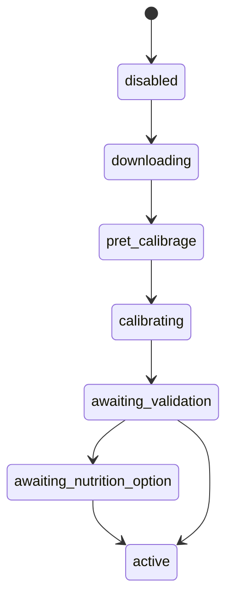
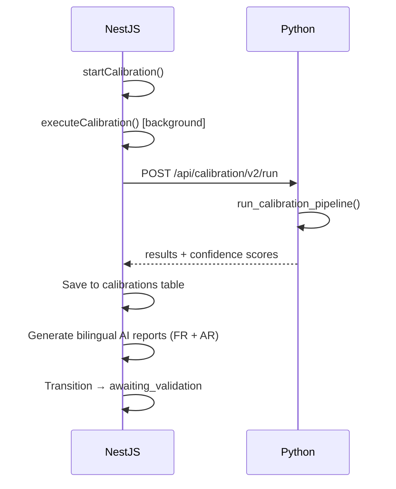
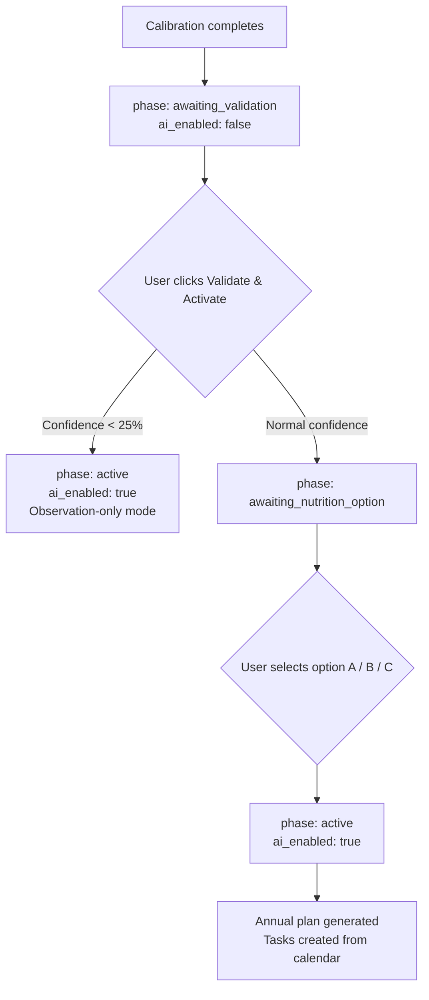

# AI Calibration Engine

## Overview

The V2 calibration pipeline calibrates AI models on a per-parcel basis using satellite imagery, weather data, soil and water analyses, and harvest records. The output includes health scores, anomaly detection, yield estimates, and nutrition recommendations.

Each parcel progresses through a defined state machine before AI-driven recommendations become active. The pipeline is fully bilingual (French and Arabic) and streams real-time progress to the frontend via Socket.IO.

## Supported Crops

- `olivier` (olive)
- `agrumes` (citrus)
- `avocatier` (avocado)
- `palmier dattier` (date palm)

---

## State Machine

**Source file:** `agritech-api/src/modules/calibration/calibration-state-machine.ts`

### Valid Transitions

| From | To | Trigger |
|------|----|---------|
| `disabled` | `downloading` | Satellite data sync initiated |
| `downloading` | `pret_calibrage` | Data download complete |
| `pret_calibrage` | `calibrating` | User starts calibration |
| `calibrating` | `awaiting_validation` | Pipeline completes successfully |
| `awaiting_validation` | `awaiting_nutrition_option` | User validates (normal confidence) |
| `awaiting_validation` | `active` | User validates (low confidence, observation-only) |
| `awaiting_nutrition_option` | `active` | User selects nutrition option A, B, or C |

### Phase Gating

`ai_enabled` is set to `true` **only** after explicit user validation — never automatically on calibration completion. Phase changes emit a `calibration:phase-changed` event via Socket.IO.

---

## Calibration Pipeline (8 Steps)

The pipeline is triggered from NestJS and executed asynchronously in the Python backend.

### Step Details

**Step 1 — `extract_satellite_history`**
Extracts NDVI, NDRE, NDMI, EVI, and NIRv time series. Applies cloud filtering, temporal interpolation, and outlier detection.

**Step 2 — `extract_weather_history`**
Computes Growing Degree Days (GDD), chill hours, and extreme weather events. Applies crop-specific frost thresholds.

**Step 3 — `calculate_percentiles`**
Computes P10, P25, P50, P75, and P90 baselines. Uses period-based segmentation when more than 24 months of data are available.

**Step 4 — `detect_phenology`**
Analyzes NIRv and NDVI curves to identify dormancy, peak, plateau, and decline phases.

**Step 5 — `detect_anomalies`**
Detects: `sudden_drop`, `progressive_decline`, `abnormal_value`, `trend_break`, `stagnation`.

**Step 6 — `calculate_yield_potential`**
Combines reference yield brackets with historical harvest records.

**Step 7 — `classify_zones`**
Classifies NDVI raster pixels into spatial health zones.

**Step 8 — `calculate_health_score`**
Computes a rolling-median-based composite score from 5 weighted components (see below).

### Confidence Scoring

After the 8 steps, a confidence score is computed from six sources:

| Source | Description |
|--------|-------------|
| Satellite | Coverage and cloud-free ratio |
| Soil | Presence and recency of soil analyses |
| Water | Presence and recency of water analyses |
| Yield | Number of harvest records available |
| Profile | Crop and parcel metadata completeness |
| Coherence | Internal consistency across indices |

---

## Health Score Components

The health score is a weighted composite computed from rolling medians of spectral indices against their P10–P90 baselines.

| Component | Weight | Source |
|-----------|--------|--------|
| Vigor | 30% | Rolling median of NDVI vs P10–P90 range |
| Homogeneity | 20% | Temporal CV proxy (std / mean of NDVI) |
| Stability | 15% | `100 - anomaly_count x 8` |
| Hydric | 20% | Rolling median of NDMI vs P10–P90 range |
| Nutritional | 15% | Rolling median of NDRE vs P10–P90 range |

---

## Auto-Provisioning

The pipeline auto-syncs missing data before calibration begins:

- **Satellite data**: Fetched from the satellite service via `SatelliteCacheService` when no local cache exists.
- **Weather data**: Fetched from `/api/weather/historical` when missing.
- **GDD**: Precomputed from raw weather rows when GDD columns are null.

---

## Validation Flow

1. Calibration completes → `phase: awaiting_validation`, `ai_enabled: false`
2. User clicks "Validate & Activate":
   - Low confidence (< 25%) → `phase: active` (observation-only), `ai_enabled: true`
   - Normal confidence → `phase: awaiting_nutrition_option`
3. User selects nutrition option → `phase: active`, `ai_enabled: true`
4. Annual fertilization plan and task calendar are generated

---

## Nutrition Options

| Option | Label | Trigger Condition |
|--------|-------|-------------------|
| A (Standard) | Balanced fertigation + standard foliar | Recent soil and water analyses present, non-saline |
| B (Enhanced) | Enhanced fertigation + biostimulant | Default when option A prerequisites are not met |
| C (Intensive) | Intensive program + leaching management | Salinity detected (EC above threshold) |

---

## Recalibration Modes

| Mode | Name | Description |
|------|------|-------------|
| F1 | Full | Complete recalibration from scratch |
| F2 | Partial | Motif-based recalibration (e.g., `water_source_change`, `irrigation_change`, `new_soil_analysis`) |
| F3 | Annual | Post-harvest recalibration when eligibility criteria are met |

---

## Real-Time Progress Streaming

The backend emits `calibration:progress` events via Socket.IO at each major pipeline step.

### Full Calibration Steps (7)

| Step | Key |
|------|-----|
| 1 | `data_collection` |
| 2 | `satellite_sync` |
| 3 | `raster_extraction` |
| 4 | `gdd_precompute` |
| 5 | `calibration_engine` |
| 6 | `saving_results` |
| 7 | `ai_reports` |

### Partial Recalibration Steps (5)

Steps 2 (`satellite_sync`) and 3 (`raster_extraction`) are skipped for partial recalibrations.

### Frontend Integration

- Component: `CalibrationProgressStepper` — renders live step-by-step progress with an animated progress bar.
- Hook: `useCalibrationProgress(parcelId)` — subscribes to Socket.IO events and auto-resets on phase change.

---

## Key Files

| File | Purpose |
|------|---------|
| `agritech-api/src/modules/calibration/calibration.service.ts` | Main calibration orchestrator |
| `agritech-api/src/modules/calibration/calibration-state-machine.ts` | Phase transition logic |
| `agritech-api/src/modules/calibration/nutrition-option.service.ts` | A/B/C nutrition option selection |
| `backend-service/app/api/calibration.py` | Python V2 pipeline HTTP endpoints |
| `backend-service/app/services/calibration/` | 8-step pipeline implementation |
| `project/src/hooks/useCalibrationV2.ts` | Frontend data and mutation hooks |
| `project/src/hooks/useCalibrationSocket.ts` | WebSocket progress tracking hook |
