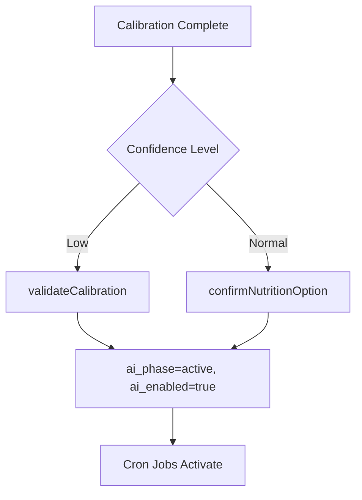

# AI Operational Engine

## Overview

The operational engine runs daily cron jobs that generate diagnostics, alerts, and recommendations for parcels with active AI. It only activates after explicit user validation (`ai_phase === 'active'` AND `ai_enabled === true`).

## Phase Gating

This is a critical constraint: `ai_enabled` is **not** set automatically during calibration completion. It is only set when the user explicitly validates through one of two paths:

- **Low confidence path**: `validateCalibration()` sets `active` + `ai_enabled=true`
- **Normal path**: `confirmNutritionOption()` sets `active` + `ai_enabled=true`

All cron jobs and endpoints enforce this gate:

- Cron jobs filter: `.eq('ai_enabled', true).eq('ai_phase', 'active')`
- Diagnostics endpoint rejects requests if `ai_phase !== 'active'`
- Frontend gates the diagnostics section on `phase === 'active'`

## Cron Jobs

Defined in `ai-jobs.service.ts`, three jobs run daily in sequence:

| Job | Schedule | Description |
|-----|----------|-------------|
| Daily Satellite Sync | 06:00 UTC | Fetch latest satellite indices for active parcels |
| Daily Weather Fetch | 06:30 UTC | Fetch historical weather for active parcels |
| Daily AI Pipeline | 08:00 UTC | Run diagnostics, alerts, and recommendations for active parcels |

The pipeline job at 08:00 UTC depends on data fetched by the earlier two jobs. All three jobs query only parcels where `ai_enabled = true` and `ai_phase = 'active'`.

## Diagnostics

Computed by `ai-diagnostics.service.ts` from three data sources:

- Latest calibration results (soil and crop baseline)
- Latest satellite readings (NDVI, EVI, moisture indices)
- Latest weather readings (temperature, humidity, precipitation)

Produces three assessments per parcel:

- **Vegetation health**: derived from NDVI and EVI trends
- **Water stress**: derived from moisture indices and precipitation deficit
- **Thermal stress**: derived from temperature anomalies vs. crop thresholds

Only computes for parcels where `ai_phase === 'active'`.

## Alerts

Managed by `ai-alerts.service.ts`. Alerts are created from diagnostics when stress values exceed configured thresholds.

**Deduplication**: Before creating an alert, the service checks for an existing unresolved alert with the same `alert_code` for the parcel. If one exists, no duplicate is created.

Alert types:

| Type | Trigger |
|------|---------|
| `vegetation_stress` | NDVI below threshold |
| `water_stress` | Moisture deficit above threshold |
| `thermal_stress` | Temperature anomaly above threshold |

## Recommendations

Generated by `ai-recommendations.service.ts` alongside alerts. Each recommendation provides an actionable suggestion tied to the detected stress condition.

Examples: irrigation schedule adjustment, fertilization timing, canopy management.

**Deduplication**: Checks for existing pending recommendations with the same code before inserting a new one.

## Key Files

| File | Purpose |
|------|---------|
| `agritech-api/src/modules/ai-jobs/ai-jobs.service.ts` | Cron job orchestrator |
| `agritech-api/src/modules/ai-diagnostics/ai-diagnostics.service.ts` | Diagnostics computation |
| `agritech-api/src/modules/ai-alerts/` | Alert creation and management |
| `agritech-api/src/modules/ai-recommendations/` | Recommendation engine |
