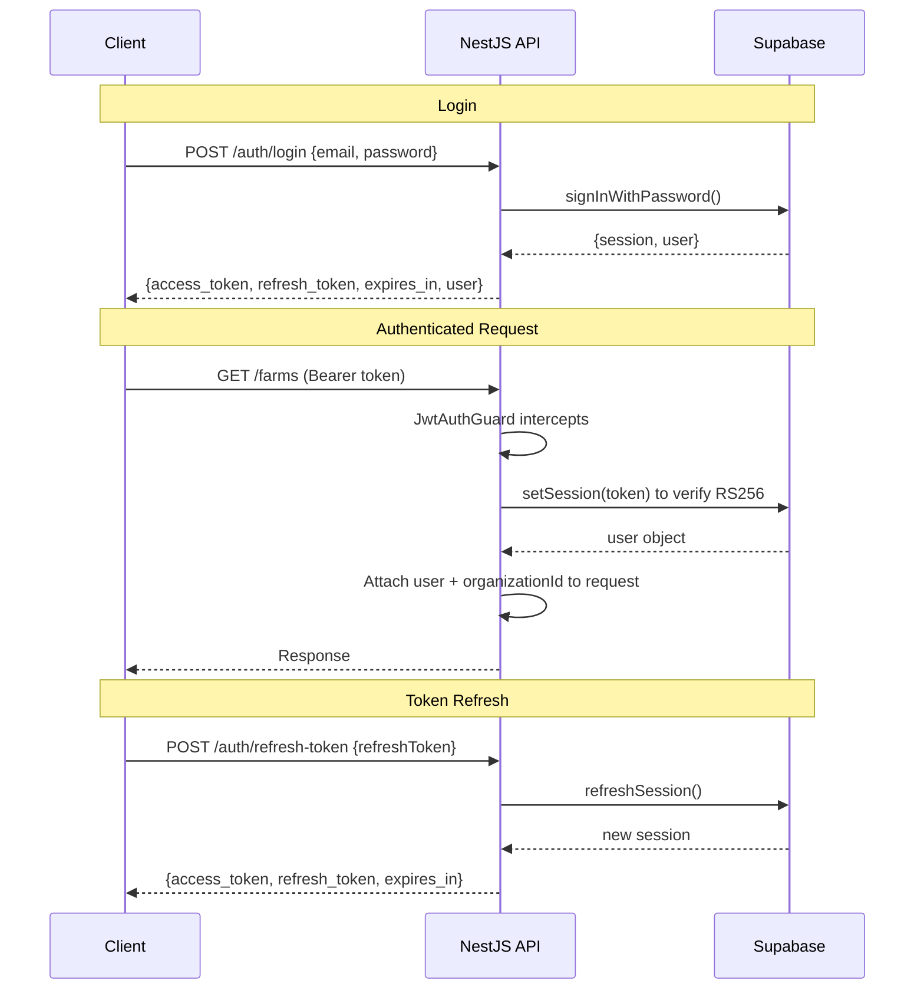
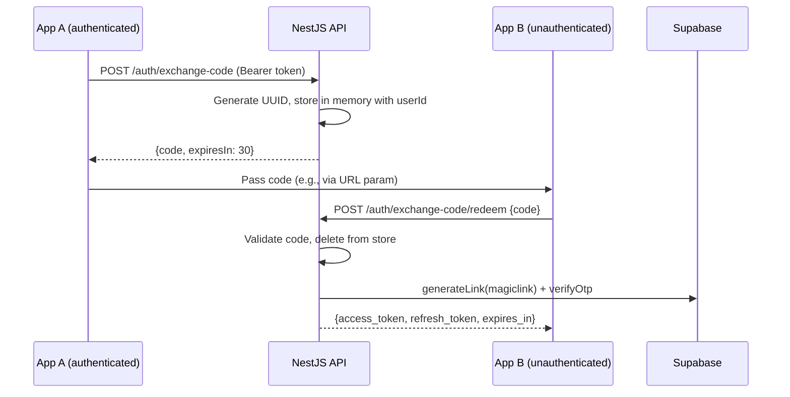
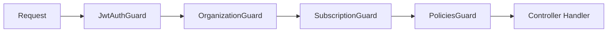

# Authentication & Permissions

## Overview

The platform uses **Supabase** as its authentication provider with **JWT (RS256)** tokens. Authorization is handled through a role-based access control (RBAC) system powered by **CASL**, a JavaScript authorization library that defines what a user *can* and *cannot* do.

Key design decisions:

- **Supabase manages identity** -- user creation, password hashing, email confirmation, and token signing all happen in Supabase.
- **The API validates tokens with Supabase on every request** -- the `JwtStrategy` sends the Bearer token back to Supabase for RS256 signature verification rather than verifying locally.
- **CASL is the single source of truth for permissions** -- the `CaslAbilityFactory` on the server defines all abilities. Frontend/mobile clients fetch their abilities via the `/auth/me/abilities` endpoint and use them for UI gating only; actual enforcement always happens server-side.

## Authentication Flow



### Login

`POST /auth/login` accepts `email`, `password`, and an optional `rememberMe` flag. A **fresh Supabase client** is created for each login attempt to prevent session state leaking between concurrent requests. When `rememberMe` is `false`, the refresh token is returned as an empty string.

### Signup

`POST /auth/signup` creates the user, their profile, and an organization in a single transaction-like flow:

1. Create Supabase auth user via the admin API (email auto-confirmed).
2. Create a `user_profiles` row.
3. Either join an existing organization (if `invitedToOrganization` is provided) or create a new one.
4. When creating a new organization: assign the user as `organization_admin`, create a trial subscription (Starter plan), and optionally seed demo data.
5. If any step after user creation fails, the auth user is rolled back via `deleteUser`.

The response includes `requiresLogin: true` -- the frontend must call Supabase `signInWithPassword` directly to obtain a session.

### Token Refresh

`POST /auth/refresh-token` accepts a `refreshToken` and returns a new token pair via Supabase's `refreshSession()`.

### Logout

`POST /auth/logout` (authenticated) extracts the JWT from the `Authorization` header and calls `signOut` with the `'global'` scope, revoking all refresh tokens for the user across all devices.

### Password Management

| Endpoint | Auth | Description |
|---|---|---|
| `POST /auth/change-password` | Required | Changes password and sets `password_set = true` in profile. Also clears any worker temp password. |
| `POST /auth/forgot-password` | Public | Sends a Supabase password reset email. Always returns success to prevent email enumeration. |
| `POST /auth/reset-password` | Required (recovery token) | Resets password after the user clicks the email link and is authenticated with the recovery token. |

### OAuth

| Endpoint | Auth | Description |
|---|---|---|
| `POST /auth/oauth/url` | Public | Returns the Supabase OAuth authorize URL for a given provider (e.g., `google`). |
| `POST /auth/oauth/callback` | Public | Exchanges an OAuth authorization code for session tokens. |

## Cross-App Authentication

The platform supports multiple client applications (web dashboard, desktop app, mobile). When a user is already authenticated in one app, they can seamlessly authenticate in another using **exchange codes**.



Key properties:
- Codes are stored **in-memory** (a `Map<string, {userId, createdAt}>`).
- Codes expire after **30 seconds** and are **single-use** (deleted upon redemption).
- A background cleanup runs every 60 seconds to remove expired codes.
- Redemption works by generating a Supabase magic link for the user's email, then immediately verifying the OTP to produce a session.

## Role Hierarchy

Roles are stored in the `roles` database table and associated with users per-organization via `organization_users`. Each role has a numeric `level` -- higher numbers mean more privilege.

| Role | Level | Description |
|---|---|---|
| `system_admin` | 100 | Full access to everything, including cross-organization operations |
| `organization_admin` | 80 | Full access within their organization |
| `farm_manager` | 60 | Manages farm operations, limited financial access |
| `farm_worker` | 40 | Operational access (tasks, harvests, stock entries), no financial access |
| `day_laborer` | 20 | Minimal access -- assigned tasks and basic read-only views |
| `viewer` | 10 | Read-only access to all resources, cannot create/update/delete |

Role checks use the convention "user's level >= required level", so a `farm_manager` (60) passes a check requiring level 40.

## CASL Permission System

### Actions

Defined in `action.enum.ts`:

```typescript
export enum Action {
    Manage = 'manage',  // wildcard -- implies all CRUD actions
    Create = 'create',
    Read   = 'read',
    Update = 'update',
    Delete = 'delete',
}
```

### Subjects

The `Subject` enum in `casl-ability.factory.ts` defines over 50 resource types organized into categories:

| Category | Subjects |
|---|---|
| User & Org | `User`, `Organization`, `Role`, `Subscription` |
| Physical | `Farm`, `Parcel`, `Warehouse`, `Infrastructure`, `Structure`, `Tree`, `FarmHierarchy` |
| Financial | `Invoice`, `Payment`, `JournalEntry`, `Account`, `Customer`, `Supplier`, `FinancialReport`, `CostCenter`, `Tax`, `BankAccount`, `Period`, `AccountingReport`, `AccountMapping` |
| Workforce | `Worker`, `Employee`, `DayLaborer`, `Task`, `PieceWork`, `WorkUnit` |
| Production | `Harvest`, `CropCycle`, `Campaign`, `FiscalYear`, `ProductApplication`, `Analysis`, `SoilAnalysis`, `PlantAnalysis`, `WaterAnalysis` |
| Inventory | `Product`, `Stock`, `StockEntry`, `StockItem`, `BiologicalAsset` |
| Sales | `SalesOrder`, `PurchaseOrder`, `Quote`, `Delivery`, `ReceptionBatch` |
| Quality | `QualityControl`, `LabService` |
| Compliance | `Certification`, `ComplianceCheck` |
| Analytics | `Report`, `SatelliteAnalysis`, `SatelliteReport`, `ProductionIntelligence`, `Dashboard`, `Analytics`, `Sensor` |
| Other | `Chat`, `Settings`, `API`, `all` |

### How Abilities Are Built

The `CaslAbilityFactory.createForUser(user, organizationId)` method:

1. Queries `organization_users` joined with `roles` to get the user's role name and level for the given organization.
2. Uses CASL's `AbilityBuilder` to define `can` and `cannot` rules based on the role name.
3. Returns a compiled `Ability` instance.

**Permission summary by role:**

| Capability | system_admin | organization_admin | farm_manager | farm_worker | day_laborer | viewer |
|---|---|---|---|---|---|---|
| All resources | `manage all` | -- | -- | -- | -- | -- |
| Farms & Parcels | -- | manage | manage | read | read | read |
| Tasks | -- | manage | manage | create/read/update | read/update | read |
| Harvests | -- | manage | manage | create/read/update | read | read |
| Invoices & Payments | -- | manage | CRUD | blocked | blocked | read |
| Journal Entries | -- | manage | read only | blocked | blocked | read |
| Chart of Accounts | -- | manage | blocked | blocked | blocked | read |
| Workers | -- | manage | manage | read | blocked | read |
| Stock | -- | manage | manage | read + create/update entries | -- | read |
| Organization settings | -- | read/update | -- | -- | -- | read |
| User management | -- | read/update | -- | -- | -- | read |
| Dashboard | -- | read/update | read | read | read | read |

### Frontend Abilities Endpoint

`GET /auth/me/abilities` returns a JSON-serializable representation of the user's abilities:

```json
{
  "role": {
    "name": "farm_manager",
    "display_name": "Farm Manager",
    "level": 60
  },
  "abilities": [
    { "action": "manage", "subject": "Farm" },
    { "action": "read", "subject": "Invoice" },
    { "action": "manage", "subject": "JournalEntry", "inverted": true },
    ...
  ]
}
```

The `inverted: true` flag indicates a `cannot` rule. Frontend clients use this to rebuild a CASL `Ability` instance for UI-level permission checks.

## Guards

The API uses a layered guard system. Guards are applied via `@UseGuards()` and execute in declaration order.



### JwtAuthGuard

**File:** `src/modules/auth/guards/jwt-auth.guard.ts`

- Checks if the route is marked `@Public()` (via `isPublic` metadata). If so, allows access immediately.
- Otherwise, delegates to `JwtStrategy`, which extracts the Bearer token, sends it to Supabase for RS256 verification, resolves the user's `organizationId` from `organization_users`, and attaches the full user object to `request.user`.

### OrganizationGuard

**File:** `src/common/guards/organization.guard.ts`

- Skips public routes.
- Extracts `organizationId` from the `X-Organization-Id` header (case-insensitive lookup), query parameter, or request body.
- Validates that the value is a proper UUID (rejects `"undefined"`, `"null"`, empty strings).
- Verifies the user is an **active member** of that organization by querying `organization_users`.
- Optionally checks required roles if `@RequireRole()` metadata is present.
- Attaches `organizationId` to both `request.organizationId` and `request.user.organizationId`.

### SubscriptionGuard

**File:** `src/common/guards/subscription.guard.ts`

- Skips routes marked with `@PublicSubscription()`.
- Reads `request.organizationId` (set by `OrganizationGuard` -- this guard must run after it).
- Calls `SubscriptionsService.hasValidSubscription(organizationId)`.
- Throws `ForbiddenException` if the organization has no active subscription.

### PoliciesGuard

**File:** `src/modules/casl/policies.guard.ts`

- Reads `PolicyHandler[]` from `@CheckPolicies()` metadata on the route handler.
- If no policies are defined, allows access.
- Resolves `organizationId` from headers, query, body, or `request.user` (same cascade as `OrganizationGuard`).
- Builds a CASL `Ability` via `CaslAbilityFactory.createForUser()`.
- Executes each policy handler against the ability. **All handlers must pass** (AND logic).
- Throws `ForbiddenException` with message `"You do not have sufficient permissions (CASL)"` on failure.

## Permission Decorators

The `permissions.decorator.ts` file provides convenience decorators that wrap `@CheckPolicies()`:

```typescript
// Generic
@RequirePermission(Action.Create, Subject.INVOICE)

// Multiple (all must pass)
@RequirePermissions([[Action.Create, Subject.INVOICE], [Action.Read, Subject.CUSTOMER]])

// Pre-built shortcuts
@CanCreateInvoice()
@CanManageFarms()
@CanReadReports()
@RequireAdmin()        // organization_admin or system_admin
@RequireManager()      // + farm_manager
@RequireWorker()       // + farm_worker
```

## Key Endpoints

| Method | Path | Auth | Description |
|---|---|---|---|
| `POST` | `/auth/login` | Public | Email/password login |
| `POST` | `/auth/signup` | Public | Create user + organization |
| `POST` | `/auth/refresh-token` | Public | Refresh access token |
| `POST` | `/auth/forgot-password` | Public | Send password reset email |
| `POST` | `/auth/oauth/url` | Public | Get OAuth provider URL |
| `POST` | `/auth/oauth/callback` | Public | Exchange OAuth code |
| `POST` | `/auth/exchange-code/redeem` | Public | Redeem cross-app exchange code |
| `GET` | `/auth/me` | JWT | Get current user profile |
| `GET` | `/auth/organizations` | JWT | Get user's organizations |
| `GET` | `/auth/me/role` | JWT + `X-Organization-Id` | Get role and DB permissions |
| `GET` | `/auth/me/abilities` | JWT + `X-Organization-Id` | Get CASL abilities (source of truth) |
| `POST` | `/auth/change-password` | JWT | Change password |
| `POST` | `/auth/reset-password` | JWT (recovery) | Reset password after email link |
| `POST` | `/auth/logout` | JWT | Revoke all sessions globally |
| `POST` | `/auth/setup-organization` | JWT | Create org for existing user |
| `POST` | `/auth/exchange-code` | JWT | Generate cross-app exchange code |

## Key File Paths

| File | Purpose |
|---|---|
| `agritech-api/src/modules/auth/auth.service.ts` | Core auth logic (login, signup, token validation, exchange codes) |
| `agritech-api/src/modules/auth/auth.controller.ts` | HTTP endpoints and DTOs for login, password, OAuth |
| `agritech-api/src/modules/auth/strategies/jwt.strategy.ts` | Supabase JWT validation and user resolution |
| `agritech-api/src/modules/auth/guards/jwt-auth.guard.ts` | Authentication guard (checks `@Public()`, delegates to strategy) |
| `agritech-api/src/modules/auth/decorators/public.decorator.ts` | `@Public()` decorator to bypass auth |
| `agritech-api/src/modules/auth/dto/signup.dto.ts` | Signup and SetupOrganization DTOs |
| `agritech-api/src/common/guards/organization.guard.ts` | Org membership + role verification guard |
| `agritech-api/src/common/guards/subscription.guard.ts` | Subscription validity guard |
| `agritech-api/src/modules/casl/casl-ability.factory.ts` | CASL ability builder (permission source of truth) |
| `agritech-api/src/modules/casl/action.enum.ts` | `Action` enum (manage, create, read, update, delete) |
| `agritech-api/src/modules/casl/policies.guard.ts` | CASL policy enforcement guard |
| `agritech-api/src/modules/casl/check-policies.decorator.ts` | `@CheckPolicies()` decorator |
| `agritech-api/src/modules/casl/permissions.decorator.ts` | Convenience permission decorators (`@CanCreateInvoice()`, etc.) |
| `agritech-api/src/modules/casl/policy.interface.ts` | `PolicyHandler` type definition |
