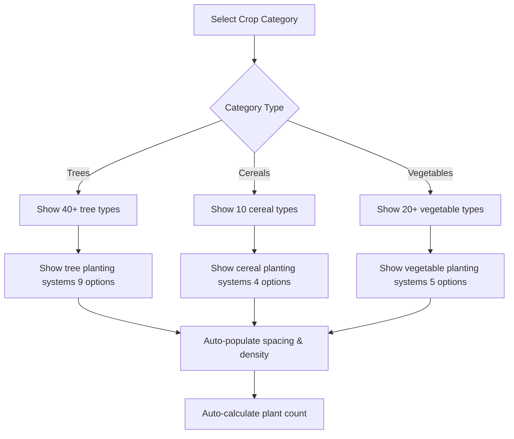

# Enhanced Parcel Planting Systems

## Overview

The enhanced parcel management system supports comprehensive planting data for three main crop categories:
- **Trees** (arbres fruitiers) - Fruit trees with various planting densities
- **Cereals** (céréales) - Grain crops with seeding rates
- **Vegetables** (légumes) - Vegetable crops with field/greenhouse systems

This system automatically calculates plant counts, densities, and provides intelligent defaults based on agronomic best practices from Moroccan agriculture.

## Database Schema

### New Fields in `parcels` Table

```sql
-- Crop classification
crop_category TEXT CHECK (crop_category IN ('trees', 'cereals', 'vegetables', 'other'))
variety TEXT  -- Specific cultivar (e.g., Arbequine olive, Durum wheat)

-- Planting system
planting_system TEXT  -- System type (e.g., 'Super intensif', 'Densité standard')
spacing TEXT  -- Format: "row x plant" (e.g., "4x1.5" meters)
density_per_hectare NUMERIC(10,2)  -- Plants/trees per hectare
plant_count INTEGER  -- Total plants (auto-calculated: area * density)

-- Planting dates
planting_date DATE  -- Actual planting date
planting_year INTEGER  -- Year planted (for age tracking)

-- Tree-specific
rootstock TEXT  -- Rootstock variety for grafted trees
```

### Auto-Calculation Trigger

The `calculate_plant_count()` trigger automatically updates `plant_count` when area or density changes:

```sql
-- Example: 5 hectares * 1666 trees/ha = 8330 trees
plant_count = area * density_per_hectare
```

### Database Function

`get_planting_system_recommendations(crop_category, crop_type)` returns recommended systems:

```sql
-- Usage example
SELECT * FROM get_planting_system_recommendations('trees');
-- Returns: Super intensif, Intensif, Semi-intensif, Traditionnel systems
```

## Frontend Implementation

### File Structure

```
project/src/
├── lib/
│   └── plantingSystemData.ts       # Constants and helper functions
└── components/
    └── FarmHierarchy/
        └── ParcelManagementModal.tsx  # Enhanced parcel creation form
```

### Planting System Data ([plantingSystemData.ts](/Users/boutchaz/Documents/CodeLovers/agritech/project/src/lib/plantingSystemData.ts))

Provides structured data from `data/agritech_production.json`:

**Tree Categories**:
- Arbres fruitiers à noyau (stone fruit) - 8 types including Olivier, Pêcher, Abricotier
- Arbres fruitiers à pépins (pome fruit) - 4 types including Pommier, Poirier
- Agrumes (citrus) - 7 types including Oranger, Citronnier
- Arbres tropicaux et subtropicaux - 14 types including Avocatier, Manguier
- Arbres à fruits secs (nuts) - 7 types including Noyer, Amandier
- Vigne et assimilés - 5 types including Vigne, Figuier
- Palmacées fruitières - 4 types including Palmier dattier, Cocotier

**Tree Planting Systems**:
| Type | Spacing | Trees/ha | Description |
|------|---------|----------|-------------|
| Super intensif | 4x1.5 | 1666 | High-density modern orchard |
| Super intensif | 3x1.5 | 2222 | Ultra high-density |
| Intensif | 4x2 | 1250 | Intensive system |
| Intensif | 3x2 | 1666 | Intensive compact |
| Semi-intensif | 6x3 | 555 | Hybrid traditional-modern |
| Traditionnel amélioré | 6x6 | 277 | Improved traditional |
| Traditionnel | 8x8 | 156 | Traditional wide spacing |
| Traditionnel | 8x7 | 179 | Traditional standard |
| Traditionnel très espacé | 10x10 | 100 | Very wide spacing |

**Cereal Crops**:
- Blé tendre, Blé dur, Orge, Maïs, Avoine, Seigle, Riz, Sorgho, Millet, Triticale

**Cereal Planting Systems**:
| Type | Spacing | Seeds/ha | Seeding Rate | Description |
|------|---------|----------|--------------|-------------|
| Densité standard | 15-20cm rows | 3,000,000 | 180-220 kg/ha | Irrigated wheat |
| Densité réduite - bour | 20-25cm rows | 2,000,000 | 120-150 kg/ha | Dryland durum wheat |
| Densité élevée - irrigué | 12-15cm rows | 4,000,000 | 220-280 kg/ha | High rainfall |
| Orge - standard | 18-22cm rows | 2,500,000 | 140-180 kg/ha | Barley |

**Vegetable Crops**:
- Tomate, Pomme de terre, Oignon, Carotte, Poivron, Aubergine, Courgette, Concombre, Laitue, Chou, and 10 more

**Vegetable Planting Systems**:
| Type | Spacing | Plants/ha | Description |
|------|---------|-----------|-------------|
| Pleine terre - rangées simples | 0.8x0.3 | 41,666 | Tomatoes, peppers, eggplants |
| Pleine terre - rangées doubles | 1.5x0.4 | 33,333 | Double row system |
| Sous serre | 1.2x0.4 | 41,666 | Greenhouse intensive |
| Semis dense - légumes feuilles | À la volée | 500,000 | Leafy vegetables |
| Billons - tubercules | 0.75x0.3 | 44,444 | Potatoes, sweet potatoes |

### Helper Functions

```typescript
// Get planting systems for a crop category
const systems = getPlantingSystemsByCategory('trees');

// Get crop types for a category
const crops = getCropTypesByCategory('vegetables');

// Get varieties for a crop (currently only olives)
const varieties = getVarietiesByCropType('Olivier');

// Calculate total plants
const count = calculatePlantCount(5.5, 1666); // 5.5 ha * 1666 trees/ha = 9163 trees

// Get density from spacing
const density = getDensityFromSpacing('4x1.5'); // Returns 1666 trees/ha
```

## User Workflows

### Workflow 1: Create Tree Parcel (Olive Grove)

1. **Open Parcel Management** from Farm Hierarchy
2. **Select Crop Category**: "Arbres fruitiers"
3. **Select Crop Type**: "Olivier" (from dropdown of 40+ tree types)
4. **Select Variety**: "Arbequine" (from olive varieties list)
5. **Enter Area**: 5.5 hectares
6. **Select Planting System**: "Super intensif (4x1.5)"
   - **Auto-populated**: Spacing = "4x1.5", Density = 1666 trees/ha
   - **Auto-calculated**: Plant count = 9,163 trees
7. **Optional**: Enter rootstock (e.g., "GF677")
8. **Optional**: Enter planting date and year
9. **Save**: Parcel created with full planting data

**Result**: Parcel tracks 9,163 olive trees on 5.5 hectares with Super intensif system

### Workflow 2: Create Cereal Parcel (Wheat)

1. **Open Parcel Management**
2. **Select Crop Category**: "Céréales"
3. **Select Crop Type**: "Blé dur" (from 10 cereal types)
4. **Enter Area**: 20 hectares
5. **Select Planting System**: "Densité réduite - bour (20-25cm)"
   - **Auto-populated**: Spacing = "20-25cm rows", Density = 2,000,000 seeds/ha
   - **Auto-calculated**: Plant count = 40,000,000 seeds
6. **Optional**: Enter planting date (sowing date)
7. **Save**

**Result**: Dryland wheat parcel with appropriate seeding density

### Workflow 3: Create Vegetable Parcel (Tomatoes)

1. **Open Parcel Management**
2. **Select Crop Category**: "Légumes"
3. **Select Crop Type**: "Tomate" (from 20+ vegetable types)
4. **Enter Area**: 2 hectares
5. **Select Planting System**: "Sous serre (1.2x0.4)"
   - **Auto-populated**: Spacing = "1.2x0.4", Density = 41,666 plants/ha
   - **Auto-calculated**: Plant count = 83,332 plants
6. **Optional**: Select irrigation type: "Goutte à goutte"
7. **Save**

**Result**: Greenhouse tomato operation with precise plant tracking

### Workflow 4: Edit Existing Parcel

1. **Click Edit** on any parcel card
2. **Form pre-fills** with all existing data
3. **Change planting system** → Density and plant count auto-recalculate
4. **Update area** → Plant count auto-recalculates
5. **Save** → All changes persisted with audit trail

## Dynamic Form Behavior

### Category Selection Flow



### Auto-Calculation Logic

**When planting system changes**:
```typescript
1. Find selected system in availablePlantingSystems
2. Extract density (treesPerHectare or plantsPerHectare or seedsPerHectare)
3. Set density_per_hectare field
4. Set spacing field
5. Trigger plant_count calculation
```

**When area or density changes**:
```typescript
plant_count = Math.round(area * density_per_hectare)
```

### Conditional Field Visibility

- **Variety dropdown**: Only shown for crops with variety data (e.g., olives)
- **Rootstock field**: Only shown for tree category
- **Planting system section**: Only shown when category is selected
- **Crop type dropdown/input**: Dropdown if category selected, free text if no category

## Integration Points

### Production Intelligence

Planting system data feeds into yield forecasting:

```typescript
// Get expected yield based on tree age and variety
const parcel = await getParcel(parcelId);
const variety = OLIVE_VARIETIES.find(v => v.variety === parcel.variety);
const treeAge = currentYear - parcel.planting_year;

// Expected yield ranges by age
if (treeAge <= 2) return variety.yieldByAge['0-2years'];
if (treeAge === 3) return variety.yieldByAge['3years'];
// ... age-based yield prediction
```

### Harvest Management

Plant count enables per-plant yield tracking:

```sql
-- Calculate kg per tree
SELECT
  harvest_quantity / plant_count as kg_per_plant,
  harvest_quantity / (plant_count / 1000.0) as kg_per_1000_plants
FROM parcels p
JOIN harvests h ON h.parcel_id = p.id
WHERE p.crop_category = 'trees';
```

### Cost Analysis

Density affects input calculations:

```typescript
// Fertilizer per tree
const fertilizerPerTree = 2.5; // kg
const totalFertilizer = parcel.plant_count * fertilizerPerTree;

// Water per plant (drip irrigation)
const litersPerPlantPerDay = 5;
const dailyWaterNeed = parcel.plant_count * litersPerPlantPerDay;
```

## Migration Guide

### Migrating Existing Parcels

**For existing tree parcels** (with `tree_type` field):

```sql
-- Auto-migration executed by migration
UPDATE parcels
SET
  crop_type = tree_type,
  crop_category = 'trees',
  plant_count = tree_count
WHERE tree_type IS NOT NULL;
```

**Manual update recommended**:
1. Review migrated parcels
2. Add `planting_system`, `variety`, `density_per_hectare`
3. Update `planting_date` if `planting_year` exists

### Backfilling Planting Data

```sql
-- Example: Update all olive parcels with standard system
UPDATE parcels
SET
  variety = 'Picholine marocaine',
  planting_system = 'Traditionnel',
  spacing = '8x8',
  density_per_hectare = 156,
  plant_count = ROUND(area * 156)
WHERE crop_type = 'Olivier' AND planting_system IS NULL;
```

## API Examples

### Query Parcels by Crop Category

```typescript
const { data: treeParcels } = await supabase
  .from('parcels')
  .select('*')
  .eq('farm_id', farmId)
  .eq('crop_category', 'trees')
  .order('name');
```

### Get Total Trees in Farm

```sql
SELECT
  SUM(plant_count) as total_trees,
  crop_type,
  COUNT(*) as parcel_count
FROM parcels
WHERE farm_id = 'farm-123' AND crop_category = 'trees'
GROUP BY crop_type;
```

### Calculate Average Density by System

```sql
SELECT
  planting_system,
  AVG(density_per_hectare) as avg_density,
  COUNT(*) as usage_count
FROM parcels
WHERE crop_category = 'trees'
GROUP BY planting_system
ORDER BY usage_count DESC;
```

## Best Practices

### For Tree Parcels

1. **Always specify planting system** for accurate density tracking
2. **Use official variety names** for olives (enables yield forecasting)
3. **Record rootstock** for grafted fruit trees (affects disease resistance)
4. **Update planting_date** on actual transplanting (not germination)

### For Cereal Parcels

1. **Adjust seeding rate** based on rainfall zone:
   - Irrigated: High density (220-280 kg/ha)
   - Bour favorable: Standard (180-220 kg/ha)
   - Bour aride: Reduced (120-150 kg/ha)
2. **Track planting date** for harvest window prediction
3. **Link to soil_type** for variety recommendations

### For Vegetable Parcels

1. **Distinguish greenhouse vs field** in planting system
2. **Update plant_count after transplanting** (mortality adjustments)
3. **Use variety field** for hybrid tracking (e.g., "Marmande F1")
4. **Link irrigation_type** (critical for vegetable production)

## Troubleshooting

### "Plant count not auto-calculating"

**Check**:
1. Area is set and positive
2. Density_per_hectare is set and positive
3. Database trigger is enabled:
```sql
SELECT * FROM pg_trigger WHERE tgname = 'trigger_calculate_plant_count';
```

### "Planting system dropdown empty"

**Cause**: Crop category not selected

**Solution**: Select crop category first (trees/cereals/vegetables)

### "Variety dropdown not showing"

**Cause**: Currently only olives have variety data

**Solution**: Use free-text variety field for other crops or expand variety data in `plantingSystemData.ts`

### "Density seems wrong after saving"

**Check database trigger execution**:
```sql
-- View parcel with calculated values
SELECT
  name, area, density_per_hectare, plant_count,
  ROUND(area * density_per_hectare) as expected_count
FROM parcels
WHERE id = 'parcel-123';
```

## Future Enhancements

### Planned Features

1. **More variety data**: Expand beyond olives to include apple, citrus, date palm varieties
2. **Regional planting calendars**: Recommended planting dates by crop and region
3. **Spacing calculator**: Interactive tool to test custom spacing configurations
4. **Planting cost estimator**: Calculate planting costs based on system and area
5. **Tree age tracking**: Visual timeline showing parcel maturity and expected yield progression

### API Enhancements

```typescript
// Planned: Get recommended planting system
POST /api/parcels/recommend-system
{
  cropType: "Olivier",
  area: 5.5,
  soilType: "Argileux",
  irrigationType: "Goutte à goutte",
  budget: "moderate"
}

// Returns: Recommended systems ranked by suitability
```

## Related Documentation

- [Farm Hierarchy](/Users/boutchaz/Documents/CodeLovers/agritech/docs/docs/features/farm-management.md)
- [Production Intelligence](/Users/boutchaz/Documents/CodeLovers/agritech/docs/docs/features/production-intelligence-data-flow.md)
- [Harvest Management](/Users/boutchaz/Documents/CodeLovers/agritech/docs/docs/features/harvest-tracking.md)
- [Database Schema](/Users/boutchaz/Documents/CodeLovers/agritech/docs/docs/database/schema.md)

## Code References

- **Migration**: [20251030140000_enhance_parcel_planting_systems.sql](/Users/boutchaz/Documents/CodeLovers/agritech/project/supabase/migrations/20251030140000_enhance_parcel_planting_systems.sql)
- **Data Library**: [plantingSystemData.ts](/Users/boutchaz/Documents/CodeLovers/agritech/project/src/lib/plantingSystemData.ts)
- **UI Component**: [ParcelManagementModal.tsx](/Users/boutchaz/Documents/CodeLovers/agritech/project/src/components/FarmHierarchy/ParcelManagementModal.tsx)
- **Source Data**: [agritech_production.json](/Users/boutchaz/Documents/CodeLovers/agritech/data/agritech_production.json)
