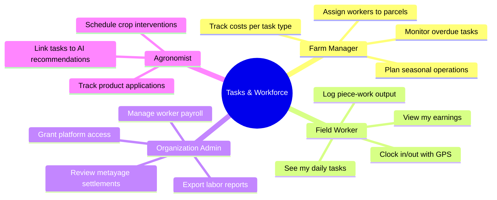
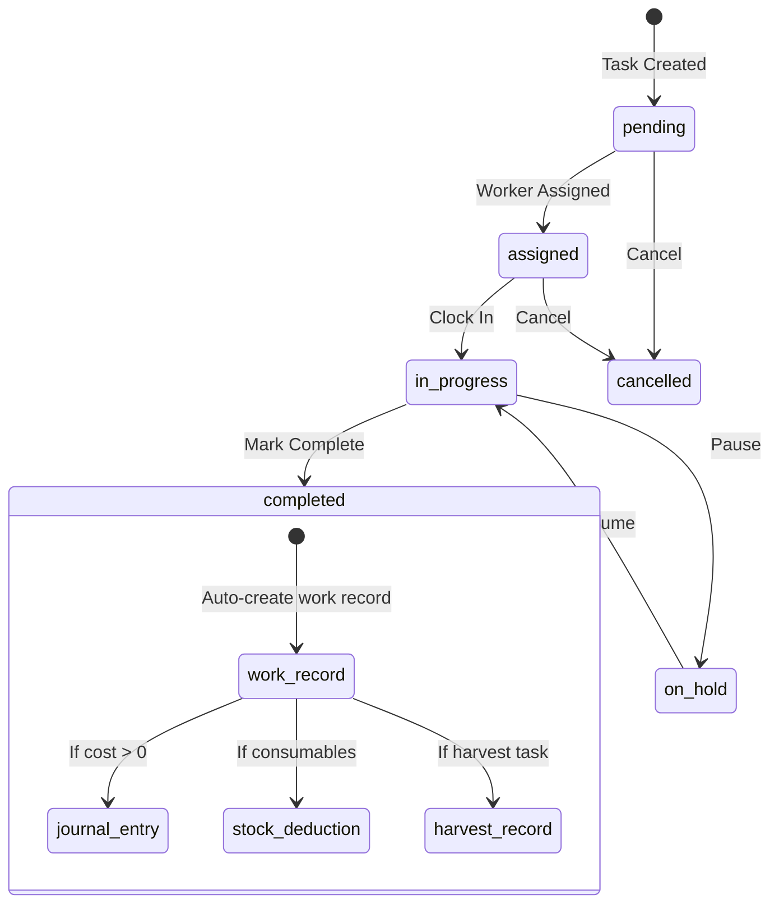
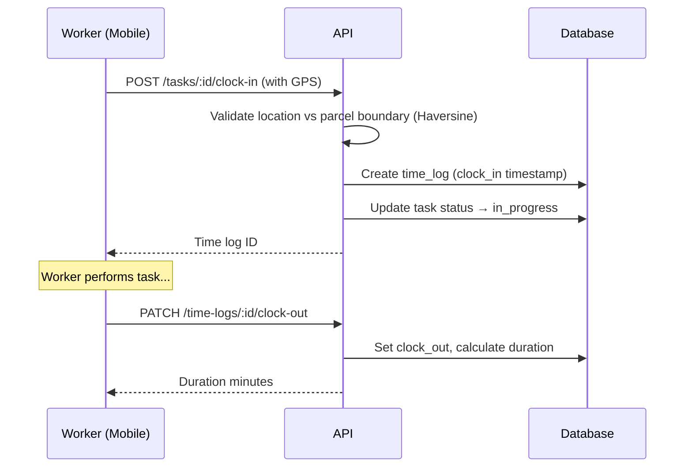
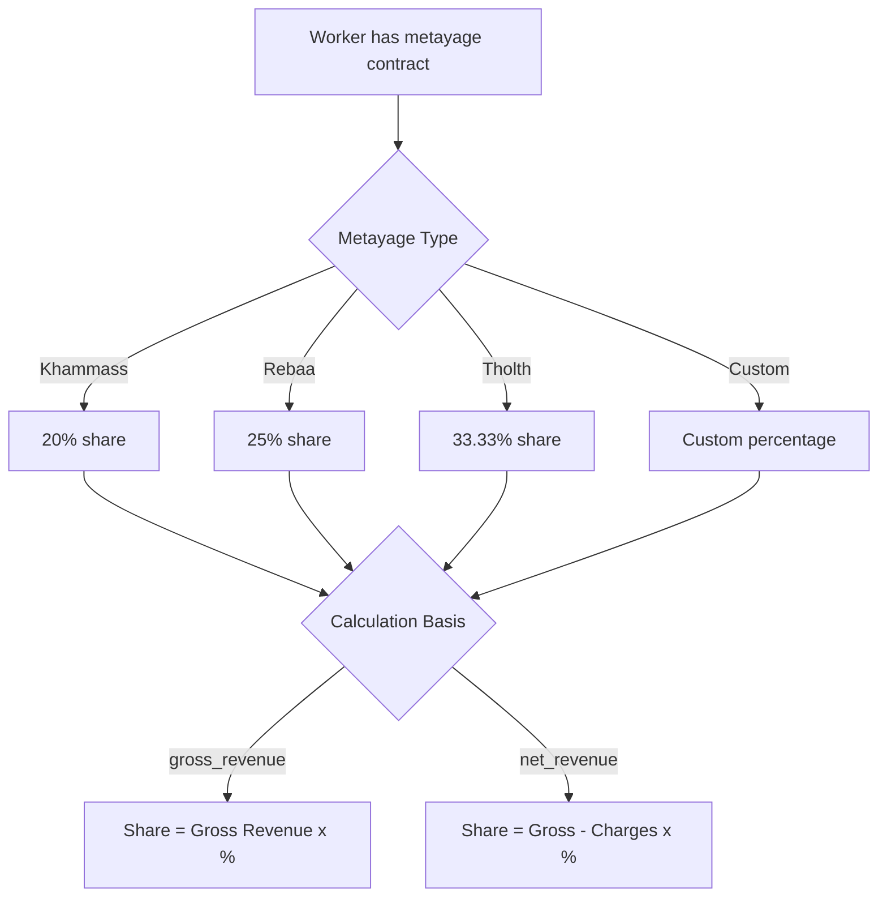
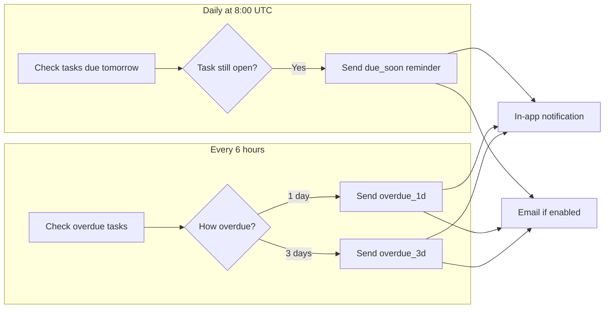

# Tasks & Workforce

The Tasks & Workforce module is the operational backbone of AgroGina — it connects **what needs to happen** in the field with **who does it**, **how long it takes**, and **how much it costs**. Every task completion can automatically trigger accounting entries, stock deductions, and harvest records.

## Who Uses This and Why



## Task Lifecycle

Every task follows this lifecycle, with automatic side effects at key transitions:



### What Happens Automatically on Completion

| Trigger | Auto-Action | Condition |
|---------|-------------|-----------|
| Any task completed with assigned worker | Work record created with calculated payment | Always |
| Task has `actual_cost > 0` | Journal entry created via accounting automation | Cost provided |
| Task type is fertilization, pest_control, irrigation, planting, soil_preparation | Stock deducted for consumed products | `planned_items` defined |
| Harvest task completed | Reception batch + lot number generated | Harvest task type |
| Task status changes | In-app notification sent to assigned worker | Worker has user account |

## Task Types and Their Purpose

| Type | Typical Use | Auto-Actions |
|------|------------|--------------|
| `planting` | New crop establishment | Stock deduction (seeds, seedlings) |
| `harvesting` | Crop collection | Creates harvest record + reception batch |
| `irrigation` | Water management | Stock deduction (if fertigation) |
| `fertilization` | Nutrient application | Stock deduction (fertilizers) |
| `pest_control` | Disease/pest treatment | Stock deduction (pesticides) |
| `pruning` | Tree/vine maintenance | — |
| `soil_preparation` | Plowing, tilling | Stock deduction (soil amendments) |
| `maintenance` | Equipment, infrastructure | — |
| `general` | Catch-all | — |

## Task Fields Reference

### Core Fields

- **Location**: `farm_id` (required), `parcel_id`, `crop_id`, `location_lat`, `location_lng`
- **Scheduling**: `scheduled_start`, `scheduled_end`, `due_date`, `estimated_duration` (hours)
- **Priority**: `low`, `medium`, `high`, `urgent`
- **Assignment**: `assigned_to` (worker ID)

### Cost & Payment

- `cost_estimate` — budgeted cost
- `actual_cost` — recorded on completion (triggers journal entry)
- `payment_type` — `daily`, `per_unit`, `monthly`, `metayage`, `none`
- `work_unit_id`, `units_required`, `rate_per_unit` — for piece-work tasks

### Requirements & Consumables

- `required_skills` — array of skill tags
- `equipment_required` — array of equipment items
- `weather_dependency` — boolean flag
- `planned_items` — array of products/materials consumed on completion

## Filtering & Pagination

`GET /tasks` supports rich filtering:

| Parameter | Description |
|-----------|-------------|
| `status` | Comma-separated: pending, assigned, in_progress, completed, cancelled, on_hold |
| `priority` | Comma-separated: low, medium, high, urgent |
| `task_type` | Comma-separated task types |
| `assigned_to` | Worker UUID |
| `farm_id` / `parcel_id` | Location filter |
| `date_from` / `date_to` | Date range on `scheduled_start` |
| `search` | Free-text search on title and description |
| `page` / `pageSize` | Pagination (1-based, default 10) |
| `sortBy` / `sortDir` | Sort field and direction |

Response with pagination: `{ data, total, page, pageSize, totalPages }`

### My Tasks

`GET /tasks/my-tasks` returns tasks assigned to the current user across **all their organizations**. Supports `includeCompleted` parameter (default `false`).

### Task Statistics

`GET /tasks/statistics` returns aggregate counts: total, completed, in_progress, overdue, completion_rate, total_cost.

## Task Assignment System

### Simple Assignment

`PATCH /tasks/:taskId/assign` — assigns a single worker. Validates the worker is active. Auto-updates task status from `pending` to `assigned`.

### Granular Assignments Module

For complex tasks requiring multiple workers with different roles:

```
/api/v1/organizations/:orgId/tasks/:taskId/assignments
```

| Operation | Method | Description |
|-----------|--------|-------------|
| List assignments | `GET /` | All assignments (excludes removed) |
| Assign worker | `POST /` | Single worker with role |
| Bulk assign | `POST /bulk` | Multiple workers at once |
| Update | `PATCH /:id` | Change status, hours, notes |
| Remove | `DELETE /:id` | Soft-delete (sets status to `removed`) |

**Assignment roles**: `worker`, `supervisor`, `lead`

**Assignment statuses**: `assigned`, `working`, `completed`, `removed`

Re-assigning a previously removed worker **reactivates** the existing record (no duplicates).

## Task Templates

Create tasks from existing tasks used as templates:

```
POST /organizations/:orgId/task-templates/create-from-template
```

Copies: title, description, type, priority, estimated duration, equipment, dependencies. Accepts overrides for `farmId`, `assignedTo`, `scheduledDate`.

### Task Categories & Comments

- Custom categories per organization: `GET /tasks/categories/all`, `POST /tasks/categories`
- Comments on tasks: `GET /tasks/:id/comments`, `POST /tasks/:id/comments`

## Time Tracking

Clock-in/clock-out system with optional GPS validation:



| Endpoint | Method | Description |
|----------|--------|-------------|
| `/tasks/:id/clock-in` | POST | Start tracking |
| `/tasks/:id/clock-in-with-validation` | POST | Start with GPS validation against parcel |
| `/tasks/time-logs/:id/clock-out` | PATCH | Stop tracking |
| `/tasks/:id/time-logs` | GET | List time logs for task |
| `/tasks/time-logs/active-session` | GET | Current user's active session |
| `/tasks/time-logs/auto-clock-out` | POST | Admin: close stale sessions (default 12h) |

**Location validation** uses the Haversine formula to check if the worker's GPS coordinates are within the parcel boundary.

## Worker Management

### Worker Profiles

Workers have comprehensive profiles covering identity, employment, compensation, and social data:

- **Identity**: name, email, phone, CIN (national ID), date of birth, photo
- **Employment**: position, worker_type, farm assignment, specialties, certifications
- **Compensation**: hourly_rate, daily_rate, monthly_salary, payment_method, payment_frequency
- **Social**: CNSS number, bank account, address
- **Metayage**: type, percentage, calculation basis, contract details

### Worker Statistics

`GET /workers/:id/stats` returns:
- Total work records and days worked
- Total amount paid (work records + payment records + metayage settlements)
- Pending payments
- Tasks completed

### Worker Self-Service Dashboard

Workers with platform access can view their own data at `/workers/me`:

| Endpoint | Returns |
|----------|---------|
| `GET /workers/me` | Own profile |
| `GET /workers/me/tasks` | Assigned tasks (filterable by status) |
| `GET /workers/me/time-logs` | Time logs (filterable by date range) |
| `GET /workers/me/statistics` | Tasks breakdown, hours, earnings, completion rate |

### Platform Access Provisioning

`POST /workers/:id/grant-platform-access` — gives a field worker their own login:

1. Generates random 16-character temporary password (expires in 7 days)
2. Creates Supabase auth user
3. Creates user profile
4. Assigns `farm_worker` role in organization
5. Links auth user to worker record
6. Sends welcome email with credentials

If any step fails after auth user creation, the auth user is rolled back.

## Metayage (Sharecropping) System

Traditional Moroccan sharecropping with predefined tiers:



Endpoints:
- `GET /workers/:id/metayage-settlements` — list settlements
- `POST /workers/:id/metayage-settlements` — create settlement
- `POST /workers/:id/calculate-metayage-share` — preview calculation

## Piece-Work Tracking

### Work Units

Measurable output units for piece-work payment:

- **Categories**: `count`, `weight`, `volume`, `area`, `length`
- **Multilingual**: `name`, `name_ar`, `name_fr`
- **Protection**: Units with `usage_count > 0` cannot be deleted

### Piece-Work Records

Track output-based labor at `/organizations/:orgId/farms/:farmId/piece-work`:

| Operation | Description |
|-----------|-------------|
| Create | Auto-calculates `total_amount = units_completed x rate_per_unit` |
| Update | Auto-recalculates if units or rate change |
| Delete | Blocked if payment_status is `paid` |
| Verify | Marks as `approved`, sets verified_at/verified_by |

**Payment lifecycle**: `pending` → `approved` (verified) → `paid`

## Automated Reminders



### Deduplication

Each reminder is recorded in `task_reminders` with task_id + reminder_type. The system checks before sending to prevent duplicates.

### User Preferences

Configurable per user per organization at `/reminders/preferences`:

| Setting | Default | Description |
|---------|---------|-------------|
| `taskRemindersEnabled` | true | Master toggle |
| `taskReminder1dBefore` | true | 1-day advance reminder |
| `taskReminderOnDueDate` | true | Due-date reminder |
| `taskOverdueAlerts` | true | Overdue escalation |
| `emailNotifications` | true | Email channel |
| `pushNotifications` | false | Push channel |

## Integration Map

```mermaid
flowchart TD
    TASKS[Tasks Module]
    WORKERS[Workers Module]
    PIECEWORK[Piece-Work]

    TASKS -->|completion triggers| ACCOUNTING[Accounting: Journal Entries]
    TASKS -->|harvest tasks| RECEPTION[Reception Batches]
    TASKS -->|consumables| INVENTORY[Inventory: Stock Deduction]
    TASKS -->|status change| NOTIFICATIONS[Notifications]
    TASKS -->|first task| ADOPTION[Adoption Milestones]
    TASKS -->|time logs| TIMEKEEPING[Time Tracking]

    WORKERS -->|work records| PAYROLL[Payment Records]
    WORKERS -->|metayage| SHARECROP[Metayage Settlements]
    WORKERS -->|platform access| AUTH[Auth: Supabase Users]

    PIECEWORK -->|verification| APPROVAL[Approval Workflow]
    PIECEWORK -->|work units| UNITS[Work Unit Registry]
```



## Mobile Experience

The mobile app provides field workers with:

- **Task list** with status filters (all, pending, in_progress, completed)
- **Task cards** showing title, priority badge, status badge, location, due date
- **Clock in/out** with GPS location
- **Pull-to-refresh** for real-time updates
- **Photo upload** for task documentation
- **Local notifications** for due/overdue reminders

## Known Limitations

| Area | Limitation | Workaround |
|------|-----------|------------|
| Recurring tasks | Not supported | Create tasks manually or use templates |
| Worker availability | No schedule/leave system | Check manually before assigning |
| Skill matching | No auto-validation on assignment | Manual skill verification |
| Bulk task operations | No bulk create/update/delete | Create individually |
| Timezone handling | Reminders fire at fixed UTC times | All users see UTC-based timing |
| My Tasks pagination | No pagination for cross-org query | Could be slow with thousands of tasks |
| Payment generation | Piece-work doesn't auto-generate payments | Process payments separately |

## Key File Paths

| Module | Path |
|--------|------|
| Tasks service | `agritech-api/src/modules/tasks/tasks.service.ts` (1,792 lines) |
| Tasks controller | `agritech-api/src/modules/tasks/tasks.controller.ts` (349 lines, 20 endpoints) |
| Task assignments | `agritech-api/src/modules/task-assignments/` |
| Task templates | `agritech-api/src/modules/task-templates/` |
| Workers service | `agritech-api/src/modules/workers/workers.service.ts` (1,218 lines) |
| Workers controller | `agritech-api/src/modules/workers/workers.controller.ts` |
| Worker self-service | `agritech-api/src/modules/workers/workers-me.controller.ts` |
| Piece-work | `agritech-api/src/modules/piece-work/` |
| Work units | `agritech-api/src/modules/work-units/` |
| Reminders | `agritech-api/src/modules/reminders/` |
| Mobile hooks | `mobile/src/hooks/useTasks.ts` |
| Mobile screen | `mobile/app/(drawer)/(tabs)/tasks.tsx` |
