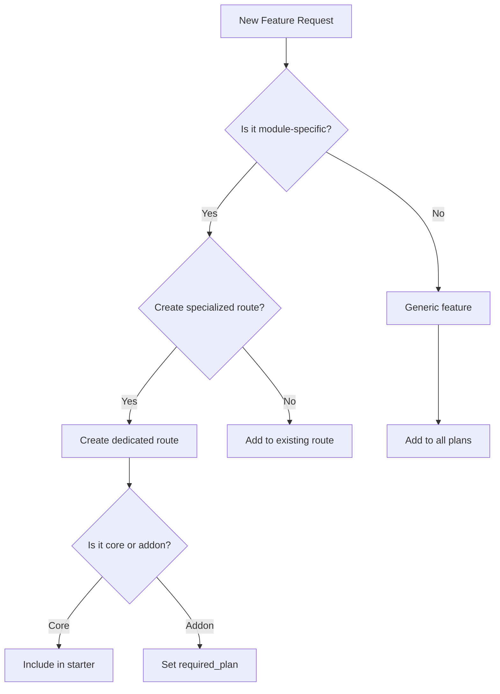

# Adding a Feature

This guide walks through adding a new feature to the AgriTech Platform.

## Overview

When adding a feature, you need to consider:
1. **Does it belong to a module?** If yes, determine which module
2. **Which subscription tier should access it?** Update module config in database
3. **Does it need new database tables?** Create Supabase migration
4. **What API endpoints are needed?** Follow NestJS patterns

## Decision Tree



## Step 1: Plan the Feature

### Determine Module Strategy

**Question**: Should this be a specialized route or part of an existing module?

**Specialized Routes Example**: `/trees`, `/orchards`, `/pruning`
- These have dedicated route files
- Serve specific agricultural purposes
- May share underlying services

**Generic Routes Example**: `/parcels`, `/accounting`
- Serve multiple module types
- Use filtering/parameters for specialization

### Determine Subscription Tier

The platform uses a **trial-based system**:
- **Starter Trial**: 14 days, core farming modules
- **Professional Trial**: 14 days, includes advanced features
- **Enterprise**: Custom, all modules + API access

## Step 2: Database Schema

### For Module-Specific Features

**Option A: Extend existing table** (preferred)

```sql
-- Add module-specific columns
ALTER TABLE crops ADD COLUMN IF NOT EXISTS is_tree BOOLEAN DEFAULT false;
ALTER TABLE crops ADD COLUMN IF NOT EXISTS tree_variety VARCHAR(100);
ALTER TABLE crops ADD COLUMN IF NOT EXISTS planting_date DATE;
```

**Option B: Create new table** (only for genuinely new concepts)

```sql
CREATE TABLE crop_pruning (
  id UUID PRIMARY KEY DEFAULT gen_random_uuid(),
  organization_id UUID NOT NULL REFERENCES organizations(id),
  crop_id UUID REFERENCES crops(id),
  pruning_date DATE NOT NULL,
  pruning_type VARCHAR(50),
  notes TEXT,
  created_at TIMESTAMPTZ DEFAULT NOW()
);

-- Add RLS policy
ALTER TABLE crop_pruning ENABLE ROW LEVEL SECURITY;

CREATE POLICY "Organization isolation" ON crop_pruning
  FOR ALL USING (organization_id = (SELECT current_setting('app.current_org_id')::uuid));
```

### For Generic Features

```sql
CREATE TABLE user_settings (
  id UUID PRIMARY KEY DEFAULT gen_random_uuid(),
  user_id UUID NOT NULL REFERENCES users(id),
  key VARCHAR(100) NOT NULL,
  value JSONB,
  updated_at TIMESTAMPTZ DEFAULT NOW(),
  UNIQUE(user_id, key)
);
```

## Step 3: Backend API

### Create NestJS Module

```bash
# In agritech-api/src/modules/
pnpm nest g module crop-pruning
pnpm nest g controller crop-pruning
pnpm nest g service crop-pruning
```

### Service Implementation

```typescript
// agritech-api/src/modules/crop-pruning/crop-pruning.service.ts
import { Injectable } from '@nestjs/common';
import { createClient, SupabaseClient } from '@supabase/supabase-js';
import { ConfigService } from '@nestjs/config';

@Injectable()
export class CropPruningService {
  private supabase: SupabaseClient;

  constructor(private configService: ConfigService) {
    this.supabase = createClient(
      this.configService.get('SUPABASE_URL'),
      this.configService.get('SUPABASE_ANON_KEY')
    );
  }

  async findAll(organizationId: string, cropId?: string) {
    let query = this.supabase
      .from('crop_pruning')
      .select('*')
      .eq('organization_id', organizationId);

    if (cropId) {
      query = query.eq('crop_id', cropId);
    }

    const { data, error } = await query;
    if (error) throw error;
    return data;
  }

  async create(organizationId: string, data: CreatePruningDto) {
    const { data: result, error } = await this.supabase
      .from('crop_pruning')
      .insert({
        ...data,
        organization_id: organizationId,
      })
      .select()
      .single();

    if (error) throw error;
    return result;
  }
}
```

### Controller with Guards

```typescript
// agritech-api/src/modules/crop-pruning/crop-pruning.controller.ts
import { Controller, Get, Post, Body, UseGuards } from '@nestjs/common';
import { JwtAuthGuard } from '../../common/guards/jwt-auth.guard';
import { OrganizationGuard } from '../../common/guards/organization.guard';
import { SubscriptionGuard } from '../../common/guards/subscription.guard';

@Controller('organizations/:organizationId/crop-pruning')
@UseGuards(JwtAuthGuard, OrganizationGuard, SubscriptionGuard)
export class CropPruningController {
  constructor(private service: CropPruningService) {}

  @Get()
  async findAll(
    @Param('organizationId') organizationId: string,
    @Query('cropId') cropId?: string,
  ) {
    return this.service.findAll(organizationId, cropId);
  }

  @Post()
  async create(
    @Param('organizationId') organizationId: string,
    @Body() data: CreatePruningDto,
  ) {
    return this.service.create(organizationId, data);
  }
}
```

## Step 4: Frontend Implementation

### API Service

```typescript
// project/src/services/cropPruningService.ts
import { apiClient } from '@/lib/api-client';

export interface PruningRecord {
  id: string;
  cropId: string;
  pruningDate: string;
  pruningType: string;
  notes?: string;
}

export const cropPruningService = {
  list: (orgId: string, cropId?: string) =>
    apiClient.get(`/organizations/${orgId}/crop-pruning`, {
      params: { cropId },
    }),

  create: (orgId: string, data: Omit<PruningRecord, 'id'>) =>
    apiClient.post(`/organizations/${orgId}/crop-pruning`, data),
};
```

### React Hook

```typescript
// project/src/hooks/useCropPruning.ts
import { useQuery, useMutation, useQueryClient } from '@tanstack/react-query';
import { cropPruningService } from '@/services/cropPruningService';

export function useCropPruning(orgId: string, cropId?: string) {
  return useQuery({
    queryKey: ['crop-pruning', orgId, cropId],
    queryFn: () => cropPruningService.list(orgId, cropId),
  });
}

export function useCreatePruning(orgId: string) {
  const queryClient = useQueryClient();

  return useMutation({
    mutationFn: (data: Parameters<typeof cropPruningService.create>[1]) =>
      cropPruningService.create(orgId, data),
    onSuccess: () => {
      queryClient.invalidateQueries({
        queryKey: ['crop-pruning', orgId],
      });
    },
  });
}
```

### Component

```typescript
// project/src/components/crops/PruningCalendar.tsx
import { useCropPruning, useCreatePruning } from '@/hooks/useCropPruning';

interface PruningCalendarProps {
  organizationId: string;
  cropId: string;
}

export function PruningCalendar({ organizationId, cropId }: PruningCalendarProps) {
  const { data: pruningRecords, isLoading } = useCropPruning(organizationId, cropId);
  const createPruning = useCreatePruning(organizationId);

  if (isLoading) return <div>Loading...</div>;

  return (
    <div>
      <h3>Pruning Records</h3>
      {pruningRecords?.map(record => (
        <div key={record.id}>{record.pruningDate} - {record.pruningType}</div>
      ))}

      <button onClick={() => createPruning.mutate({
        cropId,
        pruningDate: new Date().toISOString(),
        pruningType: 'maintenance'
      })}>
        Add Pruning Record
      </button>
    </div>
  );
}
```

### Route Integration

**For specialized routes**, create a new route file:

```typescript
// project/src/routes/_authenticated/(production)/pruning.tsx
import { createFileRoute } from '@tanstack/react-router';
import { PruningCalendar } from '@/components/crops/PruningCalendar';

export const Route = createFileRoute('/_authenticated/pruning')({
  component: PruningPage,
});

function PruningPage() {
  const { organizationId } = useOrganizationContext();
  return <PruningCalendar organizationId={organizationId} cropId={undefined} />;
}
```

**For adding to existing routes**, integrate into the component:

```typescript
// project/src/routes/_authenticated/(production)/parcels.$parcelId.tsx
import { PruningCalendar } from '@/components/crops/PruningCalendar';

function ParcelDetail() {
  // ... existing code

  return (
    <div>
      {/* ... existing UI */}
      <Tab value="pruning">
        <PruningCalendar organizationId={orgId} cropId={cropId} />
      </Tab>
    </div>
  );
}
```

## Step 5: Module Configuration

### Database Entry

If the feature belongs to a new module, add it to the database:

```sql
-- Insert module
INSERT INTO modules (slug, icon, category, display_order, price_monthly, is_required, is_available)
VALUES (
  'pruning-management',
  'scissors',
  'production',
  50,
  0,
  false,
  true
)
RETURNING id;

-- Add translations
INSERT INTO module_translations (module_id, locale, name, description, features)
VALUES
  ('<module_id>', 'en', 'Pruning Management', 'Track pruning operations', ARRAY['Pruning records', 'Tree health']),
  ('<module_id>', 'fr', 'Gestion de la Taille', 'Suivre les opérations de taille', ARRAY['Registres de taille', 'Santé des arbres']),
  ('<module_id>', 'ar', 'إدارة التقليم', 'تتبع عمليات التقليم', ARRAY['سجلات التقليم', 'صحة الأشجار']);
```

### Update Navigation

Update `navigation_items` in the modules table:

```sql
UPDATE modules
SET navigation_items = ARRAY['/pruning']
WHERE slug = 'pruning-management';
```

## Step 6: Navigation Integration

The frontend uses dynamic navigation based on module configuration. Navigation items are fetched from the module config API.

No code changes needed - just update the `navigation_items` array in the database.

## Step 7: Testing

### Backend Tests

```typescript
// agritech-api/src/modules/crop-pruning/crop-pruning.controller.spec.ts
describe('CropPruningController', () => {
  it('should return pruning records for organization', async () => {
    const result = await controller.findAll(orgId, cropId);
    expect(result).toEqual([]);
  });
});
```

### Frontend Tests

```typescript
// project/src/components/crops/PruningCalendar.test.tsx
import { render, screen } from '@testing-library/react';
import { PruningCalendar } from './PruningCalendar';

describe('PruningCalendar', () => {
  it('renders pruning records', () => {
    render(<PruningCalendar organizationId="org1" cropId="crop1" />);
    expect(screen.getByText('Pruning Records')).toBeInTheDocument();
  });
});
```

## Checklist

- [ ] Database migration created and applied
- [ ] NestJS module, service, controller created
- [ ] Guards applied (JwtAuthGuard, OrganizationGuard, SubscriptionGuard)
- [ ] Module entry in database (if new module)
- [ ] Translations added (en, fr, ar)
- [ ] API service created in frontend
- [ ] React hooks created
- [ ] Component created
- [ ] Route created (or integrated)
- [ ] Navigation items updated in database
- [ ] Tests written
- [ ] Documentation updated

## Routing Patterns

### Specialized Routes

Use when the feature has distinct UI/logic:

```
/trees - Tree management
/orchards - Orchard management
/pruning - Pruning records
/harvests - Harvest management
```

### Generic Routes with Parameters

Use for shared functionality:

```
/parcels/:parcelId - Generic parcel detail
/parcels/:parcelId/production - Production view
/parcels/:parcelId/satellite - Satellite view
```

## References

- [Subscriptions](/features/subscriptions) - Module system details
- [Database Schema](/database/schema) - Database structure
- [Architecture](/architecture/overview) - System design
