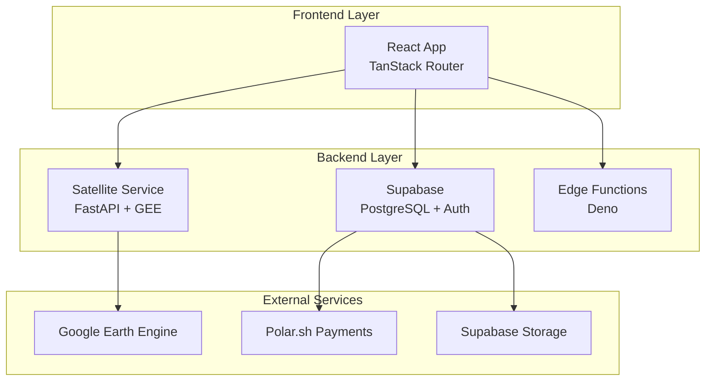

# AgriTech Platform Documentation

Welcome to the **AgriTech Platform** documentation! This comprehensive agricultural technology platform combines multi-tenant architecture, satellite data analysis via Google Earth Engine, and AI-powered insights to revolutionize farm management.

## What is AgriTech Platform?

AgriTech Platform is a full-stack web application designed to help agricultural businesses manage their operations efficiently. It provides:

- **Multi-Tenant Architecture**: Organizations, farms, and parcels with role-based access control
- **Satellite Data Analysis**: Real-time vegetation indices (NDVI, NDRE, NDMI, etc.) via Google Earth Engine
- **Task Management**: Comprehensive task tracking with cost allocation
- **Inventory Management**: Stock tracking with automatic product creation
- **Accounting Module**: Full double-entry bookkeeping with invoices, payments, and financial reports
- **Worker Management**: Track permanent workers and day laborers
- **Harvest Tracking**: Record harvests and calculate profitability
- **Subscription System**: Feature gating with Polar.sh integration

## Tech Stack

### Frontend
- **React 19** with TypeScript
- **TanStack Router** (file-based routing)
- **TanStack Query** (React Query) for server state
- **React Hook Form** with Zod validation
- **Tailwind CSS** for styling
- **Leaflet** & **OpenLayers** for maps
- **ECharts** for data visualization

### Backend
- **Supabase** (PostgreSQL with Row Level Security)
- **FastAPI** (Python) for satellite processing
- **Google Earth Engine** for satellite imagery
- **Celery + Redis** for background jobs

### DevOps
- **Vite** for build tooling
- **Vitest** for unit testing
- **Playwright** for E2E testing
- **ESLint** & **Prettier** for code quality

## Key Features

### 🌍 Satellite Analysis
Leverage Google Earth Engine to analyze crop health with 12+ vegetation indices. Get cloud-free imagery, historical time series, and export GeoTIFF files for GIS software.

### 📊 Accounting
Full double-entry bookkeeping system with:
- Chart of Accounts hierarchy
- Sales and purchase invoices
- Payment tracking and allocation
- Financial reports (Balance Sheet, P&L, Trial Balance)
- Multi-currency support

### 🌾 Farm Management
Organize your agricultural operations with:
- Multi-level hierarchy (Organizations → Farms → Parcels → Sub-parcels)
- Role-based access control (6 role levels)
- Cost center tracking per farm/parcel
- Geospatial boundaries with GeoJSON

### 📋 Task Management
Track all farm activities:
- Task types: irrigation, fertilization, pesticide, harvest, maintenance
- Worker assignment and labor tracking
- Cost allocation (labor, materials, utilities)
- Payment status tracking
- Calendar view

### 📦 Inventory
Smart inventory management:
- Automatic product creation from purchases
- Packaging type support (bidon, sac, etc.)
- Stock level alerts
- Supplier and warehouse management
- Invoice attachments via Supabase Storage

### 💰 Subscriptions
Monetize with feature gating:
- Plans: Free, Basic, Pro, Enterprise
- Usage limits (farms, parcels, users, reports)
- Feature flags (analytics, sensors, API access)
- Polar.sh integration for payments

## Getting Started

Ready to dive in? Check out our guides:

1. [Installation](getting-started/installation) - Set up your development environment
2. [Quick Start](getting-started/quick-start) - Get the app running locally
3. [Environment Setup](getting-started/environment-setup) - Configure environment variables
4. [First Deployment](getting-started/first-deployment) - Deploy to production

## Architecture Overview

The platform follows a modern, scalable architecture:

## Documentation Structure

- **Getting Started**: Installation, setup, and deployment guides
- **Architecture**: System design, multi-tenancy, and component overview
- **Frontend**: React components, routing, state management, and UI patterns
- **Backend**: Supabase setup, satellite service, edge functions
- **Database**: Schema, migrations, RLS policies, and type generation
- **Features**: Detailed guides for each platform feature
- **Guides**: Step-by-step tutorials for common tasks
- **Development**: Coding standards, testing, and best practices
- **Deployment**: Production deployment and monitoring
- **API Reference**: Complete API documentation

## Community & Support

- **GitHub**: [Report issues and contribute](https://github.com/agritech/platform)
- **License**: Proprietary (update based on your licensing)

## Next Steps

- 📖 Read the [Architecture Overview](architecture/overview)
- 🚀 Follow the [Quick Start Guide](getting-started/quick-start)
- 💻 Learn about the [Frontend Stack](frontend/tech-stack)
- 🗄️ Explore the [Database Schema](database/schema)

