# Avocado Referential -- Persea americana Mill.

**Operational referential for precision avocado management in Morocco**

Version 1.0 -- February 2026

---

## 1. Overview

The avocado (*Persea americana* Mill., family Lauraceae) is a subtropical evergreen fruit tree originating from Mexico and Guatemala, domesticated approximately 5,000 years ago. In Morocco, avocado cultivation has expanded rapidly from 3,000 ha in 2010 to over 8,000 ha in 2024, concentrated in mild Atlantic-climate zones.

### Key Growing Regions in Morocco

| Region | Area (ha) | National Share | Climate Profile |
|---|---|---|---|
| Gharb (Kenitra) | 3,500 | 44% | Atlantic mild, limited frost risk |
| Loukkos (Larache) | 2,000 | 25% | Atlantic humid |
| Rabat-Sale | 1,000 | 12% | Atlantic, microclimate |
| Souss-Massa | 800 | 10% | Semi-arid, intensive irrigation |
| Other | 700 | 9% | Variable |

### Botanical Races

Three botanical races define avocado genetics:

- **Mexican** (P. americana var. drymifolia) -- small fruit, high oil, most cold-tolerant (-6 to -8 C)
- **Guatemalan** (P. americana var. guatemalensis) -- medium-large fruit, thick rough skin, moderate cold tolerance (-2 to -4 C)
- **West Indian** (P. americana var. americana) -- large fruit, smooth skin, frost-sensitive (0 to -2 C)
- **Hybrids** (G x M) -- combine traits of both parents, widely planted commercially

### Dichogamy and Floral Types

The avocado exhibits **synchronous protogynous dichogamy**: each flower opens twice, first as female (receptive), then as male (pollen-shedding). This mechanism promotes cross-pollination between Type A and Type B varieties.

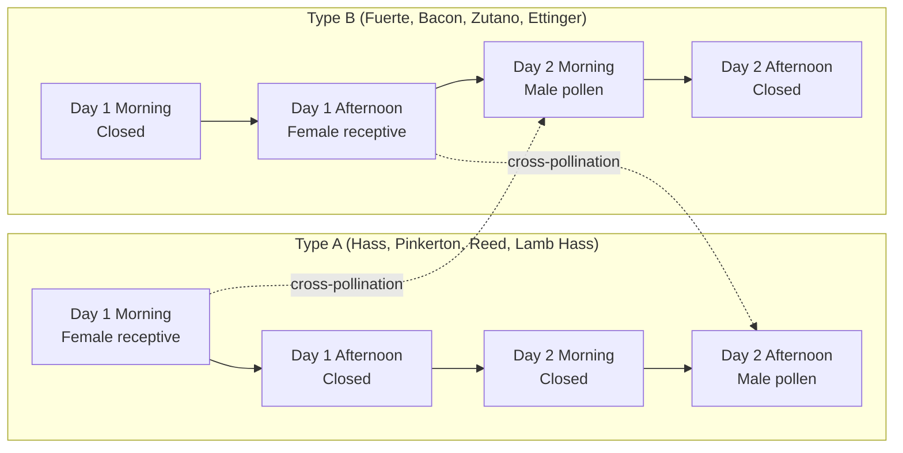

**Pollination requirements:**
- Ratio: 1 Type B pollinator for every 8-10 Type A trees
- Beehives: 4-6 per hectare during bloom

---

## 2. Variety Comparison

### Main Varieties Grown in Morocco

| Characteristic | Hass | Fuerte | Bacon | Zutano | Ettinger | Reed |
|---|---|---|---|---|---|---|
| **Floral Type** | A | B | B | B | B | A |
| **Race** | Guatemalan | Hybrid G x M | Mexican | Mexican | Hybrid G x M | Guatemalan |
| **Fruit Weight (g)** | 170-300 | 200-400 | 200-350 | 200-400 | 250-400 | 300-500 |
| **Oil Content (%)** | 18-25 | 15-20 | 12-15 | 10-15 | 15-18 | 18-22 |
| **Skin** | Rough, black | Smooth, green | Smooth, green | Smooth, light green | Smooth, bright green | Thick, green |
| **Cold Tolerance (C)** | -3 | -4 | -5 | -6 | -4 | -2 |
| **Harvest Period** | Feb-Sep | Nov-Mar | Nov-Jan | Oct-Dec | Oct-Dec | Jul-Oct |
| **Alternate Bearing** | Moderate | Strong | Moderate | Low | Moderate | Moderate |
| **Vigor** | Medium | Strong | Strong | Very strong | Strong | Medium |
| **Salinity Tolerance** | Sensitive | Sensitive | Medium | Medium | Medium | Sensitive |

### Yield by Age (kg/tree) -- Selected Varieties

| Age Class | Hass | Fuerte | Bacon | Pinkerton | Lamb Hass |
|---|---|---|---|---|---|
| 3-4 years | 5-15 | 5-10 | 3-8 | 8-20 | 8-18 |
| 5-7 years | 30-60 | 25-50 | 20-40 | 40-80 | 40-75 |
| 8-12 years | 80-150 | 60-120 | 50-100 | 100-180 | 90-170 |
| 13-20 years | 120-200 | 100-180 | 80-140 | 150-250 | 140-230 |
| 20+ years | 100-180 | 80-150 | 70-120 | 130-220 | 120-200 |

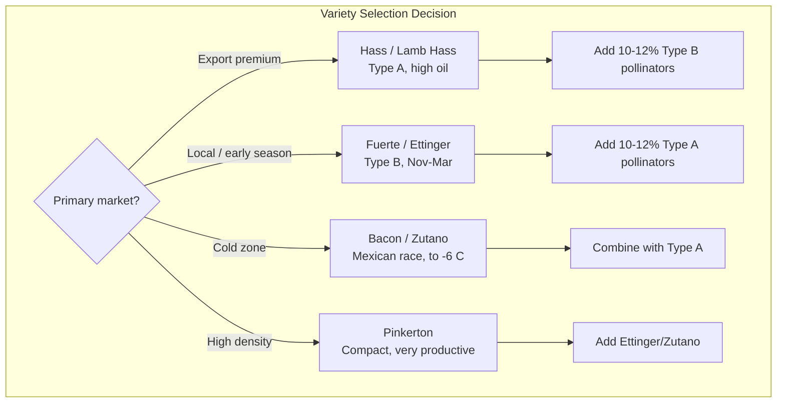

---

## 3. Phenological Cycle

The avocado has an overlapping phenological cycle: fruit from the previous season may still be on the tree while new flowers emerge.

```mermaid
gantt
    title Avocado Phenological Stages (Morocco)
    dateFormat MM
    axisFormat %b

    section Vegetative
    Relative Dormancy           :done, 12, 02
    Vegetative Flush 1          :active, 02, 04
    Vegetative Flush 2          :active, 07, 09

    section Reproductive
    Floral Induction            :crit, 01, 03
    Flower Buds                 :crit, 02, 04
    Flowering                   :crit, 03, 06
    Fruit Set (Nouaison)        :crit, 04, 06

    section Fruit Development
    Physiological Drop          :done, 05, 08
    Fruit Growth (Grossissement):active, 06, 01
    Maturation (var. dependent) :milestone, 10, 10
```

### Phenological Stages Detail

| Stage | Months | Duration | NIRv Coefficient | Key Actions |
|---|---|---|---|---|
| Relative Dormancy | Dec-Jan | 6-8 weeks | 0.70 | Reduce irrigation, phosphonate application |
| Vegetative Flush 1 | Feb-Mar | 4-6 weeks | 1.00 | Zinc foliar, balanced nutrition |
| Floral Induction | Jan-Feb | 4-6 weeks | 0.80 | Moderate water stress, avoid excess N |
| Flower Buds | Feb-Mar | 2-4 weeks | 0.85 | Boron application, seaweed biostimulant |
| Flowering | Mar-Apr-May | 4-8 weeks | 0.90 | Beehives, thrips monitoring, copper if wet |
| Fruit Set | Apr-May | 4-6 weeks | 0.90 | Amino acids, limit stress |
| Physiological Drop | May-Jun-Jul | 8-12 weeks | 0.85 | Humic acids, stable irrigation |
| Fruit Growth | Jun-Dec | 5-8 months | 1.00 | Potassium emphasis, regular irrigation |
| Vegetative Flush 2 | Jul-Aug | 4-6 weeks | 1.00 | Zinc + manganese foliar |
| Maturation | Variable | -- | 0.85 | Dry matter testing, pre-harvest copper |

---

## 4. Satellite Monitoring

Remote sensing thresholds vary by planting system density. Higher-density systems produce denser canopies and therefore higher vegetation index values.

### NDVI Thresholds

| System | Optimal Range | Vigilance | Alert |
|---|---|---|---|
| Traditional (100-150 trees/ha) | 0.55 - 0.75 | below 0.50 | below 0.45 |
| Intensive (200-400 trees/ha) | 0.65 - 0.82 | below 0.60 | below 0.55 |
| Super-intensive (800-1200 trees/ha) | 0.70 - 0.88 | below 0.65 | below 0.60 |

### NIRv Thresholds

| System | Optimal Range | Vigilance | Alert |
|---|---|---|---|
| Traditional | 0.15 - 0.30 | below 0.12 | below 0.10 |
| Intensive | 0.20 - 0.38 | below 0.17 | below 0.15 |
| Super-intensive | 0.25 - 0.45 | below 0.22 | below 0.20 |

### NDMI (Moisture) Thresholds

| System | Optimal Range | Vigilance | Alert |
|---|---|---|---|
| Traditional | 0.20 - 0.40 | below 0.15 | below 0.12 |
| Intensive | 0.25 - 0.45 | below 0.20 | below 0.17 |
| Super-intensive | 0.30 - 0.50 | below 0.25 | below 0.22 |

### NDRE (Red Edge) Thresholds

| System | Optimal Range | Vigilance | Alert |
|---|---|---|---|
| Traditional | 0.20 - 0.35 | below 0.17 | below 0.15 |
| Intensive | 0.25 - 0.40 | below 0.22 | below 0.20 |
| Super-intensive | 0.28 - 0.45 | below 0.25 | below 0.23 |

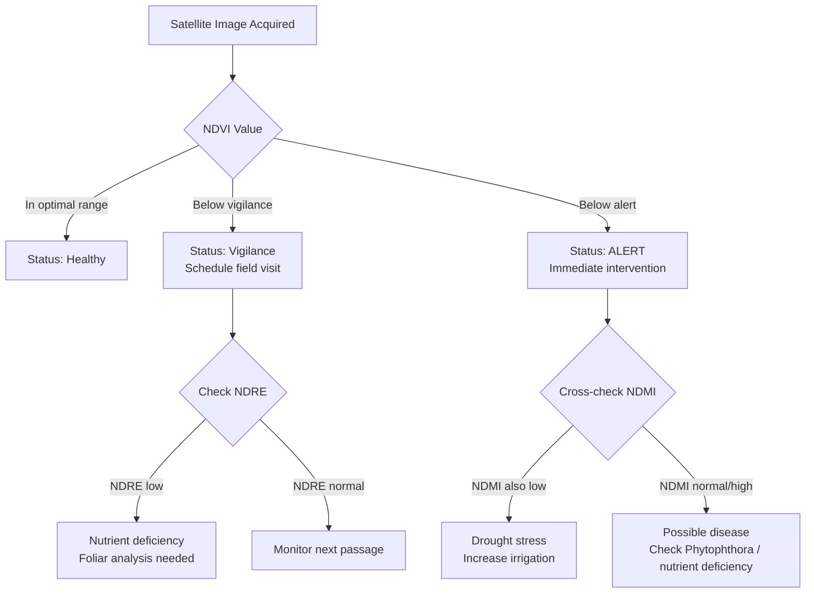

### Planting Systems Comparison

| Parameter | Traditional | Intensive | Super-intensive |
|---|---|---|---|
| Density (trees/ha) | 100-150 | 200-400 | 800-1,200 |
| Spacing (m) | 10x8 to 12x10 | 6x4 to 8x5 | 4x2 to 5x2.5 |
| Irrigation | Gravity or drip | Drip | High-frequency drip |
| First Production (year) | 5-6 | 3-4 | 2-3 |
| Full Production (year) | 10-12 | 6-8 | 4-5 |
| Lifespan (years) | 40-50 | 25-35 | 15-20 |
| Yield at Full Prod. (t/ha) | 8-12 | 12-20 | 18-30 |

---

## 5. Nutrition Program

### Nutrient Export per Ton of Fruit

| Element | Export (kg/ton) |
|---|---|
| N | 2.5 - 3.5 |
| P2O5 | 0.5 - 0.8 |
| K2O | 4.0 - 5.5 |
| CaO | 0.3 - 0.5 |
| MgO | 0.4 - 0.6 |
| S | 0.2 - 0.3 |

Note: Avocado is a potassium-hungry crop. K2O export is nearly double that of nitrogen.

### Nutrition Options A / B / C

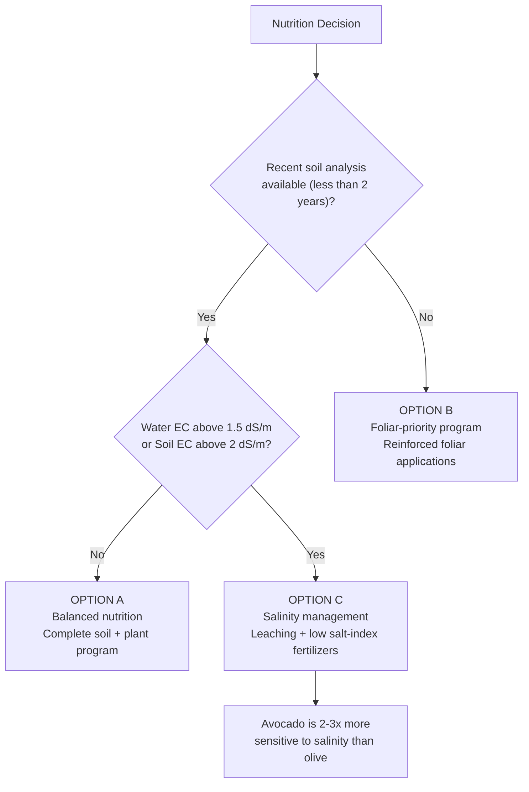

**Option A -- Balanced Nutrition:** Requires soil analysis less than 2 years old plus water analysis. Full soil + foliar program based on actual deficiencies.

**Option B -- Foliar-Priority:** When no recent soil analysis is available. Reinforced foliar feeding to correct deficiencies directly.

**Option C -- Salinity Management:** When water EC exceeds 1.5 dS/m or soil EC exceeds 2 dS/m. Leaching fractions and low salt-index fertilizers only. Note: avocado salinity thresholds are significantly lower than olive.

### NPK Rates by Growth Stage (kg/ha)

| Stage | N | P2O5 | K2O |
|---|---|---|---|
| Young trees (1-3 years) | 30-60 | 15-30 | 20-40 |
| Entering production (4-6 years) | 80-120 | 30-50 | 60-100 |
| Intensive full production | 150-250 | 50-80 | 150-250 |
| Super-intensive | 200-350 | 60-100 | 200-350 |

### Fertilizer Fractioning Schedule (% of annual dose)

| Period | N % | P2O5 % | K2O % | Objective |
|---|---|---|---|---|
| Jan-Feb | 15 | 30 | 10 | Prepare flowering |
| Mar-Apr | 20 | 30 | 15 | Flowering and fruit set |
| May-Jun | 20 | 20 | 20 | Post physiological drop |
| Jul-Aug | 20 | 10 | 25 | Fruit growth, flush 2 |
| Sep-Oct | 15 | 10 | 20 | Maturation |
| Nov-Dec | 10 | 0 | 10 | Reconstitution |

### Fertilizer Forms

**Recommended:**
- N: Calcium nitrate, ammonium nitrate, urea only if pH is below 7
- P: MAP, phosphoric acid
- K: Potassium sulfate

**Prohibited:**
- KCl (potassium chloride) is STRICTLY FORBIDDEN -- avocado is extremely sensitive to chloride
- Urea if pH is above 7 (volatilization losses)
- DAP at high doses

### Microelements -- Iron Focus for Calcareous Soils

Iron chlorosis is the most critical micronutrient disorder for avocado in Morocco, especially on calcareous soils where pH exceeds 7.5 and active lime exceeds 5%.

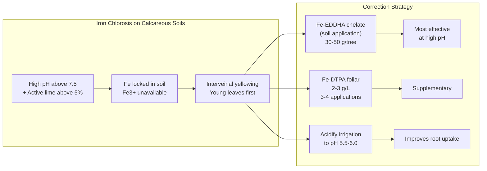

### Foliar Analysis Reference Values (leaves 5-7 months old, Aug-Sep sampling)

| Element | Unit | Deficiency | Sufficient | Optimal | Excess |
|---|---|---|---|---|---|
| N | % | below 1.6 | 1.6-1.8 | 1.8-2.2 | above 2.5 |
| P | % | below 0.08 | 0.08-0.10 | 0.10-0.25 | above 0.30 |
| K | % | below 0.75 | 0.75-1.0 | 1.0-2.0 | above 3.0 |
| Ca | % | below 1.0 | 1.0-1.5 | 1.5-3.0 | above 4.0 |
| Mg | % | below 0.25 | 0.25-0.4 | 0.4-0.8 | above 1.0 |
| Fe | ppm | below 50 | 50-80 | 80-200 | above 300 |
| Zn | ppm | below 30 | 30-50 | 50-100 | above 200 |
| Mn | ppm | below 25 | 25-50 | 50-200 | above 500 |
| B | ppm | below 30 | 30-50 | 50-100 | above 150 |
| Cu | ppm | below 5 | 5-10 | 10-25 | above 40 |
| Cl | % | -- | -- | -- | toxic above 0.25 |
| Na | % | -- | -- | -- | toxic above 0.25 |

---

## 6. Irrigation

Avocado has a paradoxical water sensitivity: it tolerates neither drought stress nor waterlogging. Excess water triggers Phytophthora root rot, while deficit causes fruit drop and reduced sizing.

### Crop Coefficients (Kc)

| Period | Young Trees (1-3 yr) | Adult Trees (6+ yr) |
|---|---|---|
| Jan-Feb | 0.50 | 0.70 |
| Mar-Apr | 0.55 | 0.75 |
| May-Jun | 0.60 | 0.80 |
| Jul-Aug | 0.65 | 0.85 |
| Sep-Oct | 0.60 | 0.80 |
| Nov-Dec | 0.55 | 0.75 |

### Irrigation Management Rules

| Parameter | Light / Sandy Soils | Loamy Soils |
|---|---|---|
| Tensiometer trigger (cbar) | 25-30 | 35-40 |
| Strategy | Frequent, small doses | Moderate frequency |
| Risk | Leaching of nutrients | Waterlogging if over-irrigated |

### Water Quality Thresholds for Avocado

| Parameter | Tolerable | Problematic | Not Recommended |
|---|---|---|---|
| EC (dS/m) | below 1.0 | 1.0-1.5 | above 2.0 |
| Cl (mg/L) | below 50 | 50-100 | above 100 |
| Na (mg/L) | below 50 | 50-100 | above 100 |
| B (mg/L) | below 0.5 | 0.5-1.0 | above 1.0 |
| SAR | below 5 | -- | above 5 |

Note: Avocado is 2-3 times more sensitive to salinity than olive.

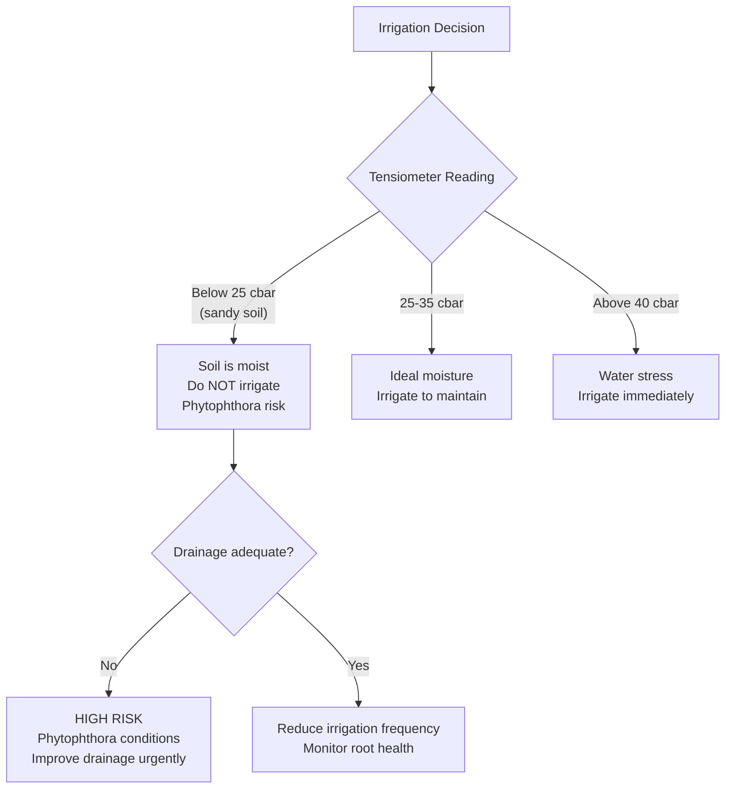

---

## 7. Phytosanitary Management

### Key Diseases

#### Phytophthora Root Rot (Phytophthora cinnamomi) -- DISEASE NUMBER 1

The most devastating avocado disease worldwide. In Morocco, it is the primary cause of tree mortality.

| Aspect | Detail |
|---|---|
| Conditions | Poorly drained soil, waterlogging, temperature 20-30 C |
| Symptoms | Wilting, small pale leaves, branch dieback, root necrosis |
| Prevention | Excellent drainage, tolerant rootstocks, never saturate soil |
| Treatment (injection) | Phosphonate 20-30 mL/L, 2-3 times/year |
| Treatment (foliar) | Phosphonate 5 mL/L, 4-6 times/year |
| Treatment (soil) | Metalaxyl 2-3 g/m2, active infection only |

#### Anthracnose (Colletotrichum gloeosporioides)

| Aspect | Detail |
|---|---|
| Conditions | High humidity, rain, temperature 20-25 C |
| Symptoms | Dark lesions on fruit, post-harvest rot |
| Treatment | Copper 2 kg/ha, DAR 14 days |

#### Cercospora Spot (Cercospora purpurea)

| Aspect | Detail |
|---|---|
| Symptoms | Brown angular spots on fruit, cosmetic damage |
| Treatment | Copper 2-3 kg/ha, 2-3 applications |

### Key Pests

| Pest | Period | Treatment |
|---|---|---|
| Thrips | Flowering | Spinosad 0.2 L/ha |
| Mites | Dry summer | Abamectin 0.5 L/ha |
| Scale insects | Year-round | White oil 15 L/ha |
| Bark beetles (Scolytes) | Stressed trees | Remove affected branches |

### Preventive Phytosanitary Calendar

```mermaid
gantt
    title Preventive Treatment Calendar
    dateFormat MM
    axisFormat %b

    section Phytophthora
    Phosphonate foliar      :crit, 01, 03
    Phosphonate trunk inject:crit, 06, 07
    Phosphonate foliar      :crit, 11, 12

    section Anthracnose
    Copper at flowering     :active, 03, 04
    Copper pre-harvest      :active, 08, 10

    section Pests
    Spinosad if thrips      :done, 04, 06
```

| Period | Target | Product | Dose | Condition |
|---|---|---|---|---|
| Jan-Feb | Phytophthora prevention | Phosphonate K | 5 mL/L foliar | Systematic |
| March | Anthracnose at flowering | Copper | 2 kg/ha | If high humidity |
| Apr-May | Thrips | Spinosad | 0.2 L/ha | If presence detected |
| June | Phytophthora | Phosphonate K | Trunk injection | Systematic |
| Aug-Sep | Anthracnose pre-harvest | Copper | 2 kg/ha | DAR 21 days |
| November | Phytophthora | Phosphonate K | 5 mL/L foliar | Systematic |

---

## 8. Alert System

All alert codes used by the AI engine for avocado monitoring:

### Urgent Alerts (Immediate Action Required)

| Code | Alert Name | Trigger Threshold |
|---|---|---|
| AVO-01 | Water stress | NDMI below P15 (2 consecutive passes) + T above 30 C |
| AVO-02 | Excess water / Phytophthora | NDMI above P95 + rain above 50 mm/week |
| AVO-03 | Frost risk | Tmin forecast below 2 C |
| AVO-04 | Confirmed frost | Tmin measured below 0 C |
| AVO-07 | Phytophthora conditions | Soil saturated above 48h + T 20-28 C |
| AVO-08 | Phytophthora symptoms | NIRv progressive decline + pale leaves |
| AVO-13 | Cl/Na toxicity | Leaf burn + soil EC above 2.5 dS/m |
| AVO-18 | Tree decline | NIRv decline above 20% over 4 passages |
| AVO-19 | Dead tree | NDVI below 0.30 persistent 3 months |

### Priority Alerts (Action Within 48h)

| Code | Alert Name | Trigger Threshold |
|---|---|---|
| AVO-05 | Heat wave | Tmax above 38 C (3 days) + HR below 30% |
| AVO-06 | Hot dry wind | T above 35 C + HR below 25% + wind above 25 km/h |
| AVO-09 | Anthracnose risk | HR above 85% + rain + T 20-25 C (during flowering) |
| AVO-10 | Thrips pressure | Flowering + T 20-28 C + trap captures |
| AVO-14 | Weak flowering | Flowering below 50% of expected |
| AVO-15 | Excessive fruit drop | Fruit load below 30% post fruit-set |
| AVO-17 | Probable OFF year | Previous year very productive + weak flush |

### Vigilance Alerts (Monitor)

| Code | Alert Name | Trigger Threshold |
|---|---|---|
| AVO-11 | Probable Zn deficiency | NDRE below P10 + small round leaves |
| AVO-12 | Fe deficiency | NDRE below P10 + GCI decline + soil pH above 7.5 |
| AVO-16 | Harvest maturity | Dry matter at or above 21% (Hass) |
| AVO-20 | Excessive growth | NDVI increase above 15% + no fruit |

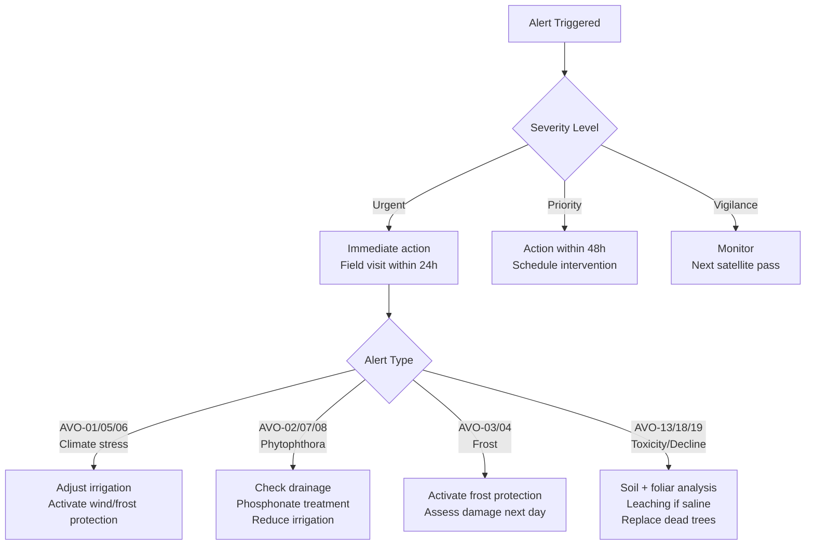

---

## 9. Yield Prediction

Yield prediction for avocado is more challenging than for olive due to several biological factors.

### Model Challenges

- Flowering is difficult to detect by satellite (small flowers, partially hidden by canopy)
- Physiological fruit drop is highly variable (80-99% of flowers drop)
- Fruit remains on the tree for an extended period (6-12 months)
- Strong alternate bearing in many varieties

### Prediction Accuracy by System

| System | R-squared | Mean Absolute Error (%) | Reliability |
|---|---|---|---|
| Traditional | 0.30-0.50 | 35-50% | Low -- high variability |
| Intensive | 0.40-0.60 | 25-40% | Moderate |
| Super-intensive | 0.50-0.70 | 20-35% | Best -- uniform management |

**Recommendation:** Physical fruit counting on a representative sample remains the most reliable method. Satellite-based prediction should be used as a complementary tool, not a replacement.

### Model Variables

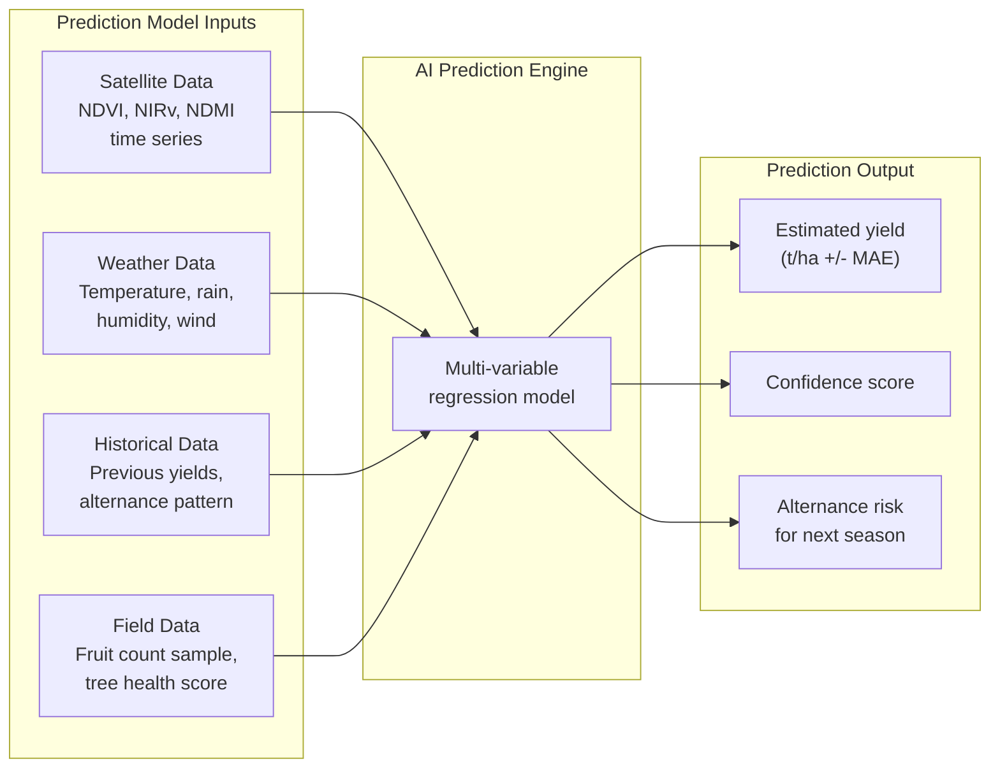

---

## 10. Annual Plan Template

Reference plan for an **intensive Hass orchard targeting 15 t/ha**, with drip irrigation. Adjust doses based on soil analysis, foliar analysis, and actual crop load.

### Monthly Operations Summary

| Month | NPK Fertigation | Micronutrients | Biostimulant | Phytosanitary | Irrigation (L/tree/week) |
|---|---|---|---|---|---|
| Jan | N25 + P15 + K15 | Zn foliar | Seaweed 3 L/ha | Phosphonate foliar | 80 |
| Feb | N25 + K15 | -- | -- | -- | 100 |
| Mar | N30 + P15 + K20 | B (flowering) | Seaweed + Aminos | Copper if rain | 120 |
| Apr | N25 + K20 | Zn foliar | Aminos 4 L/ha | -- | 150 |
| May | N25 + P10 + K25 | -- | -- | Spinosad if thrips | 170 |
| Jun | N25 + K30 | Fe-EDDHA | Humics 4 L/ha | Phosphonate injection | 200 |
| Jul | N20 + K30 | Zn foliar | -- | -- | 200 |
| Aug | N20 + P10 + K25 | -- | Seaweed 3 L/ha | -- | 180 |
| Sep | N15 + K20 | Zn + Mn foliar | Aminos 4 L/ha | Copper pre-harvest | 150 |
| Oct | N15 + K15 | -- | -- | -- | 120 |
| Nov | N10 + K10 | -- | Humics 4 L/ha | Phosphonate foliar | 80 |
| Dec | N10 | -- | Aminos 5 L/ha | -- | 60 |

### Annual Operations Flow

```mermaid
flowchart LR
    subgraph Q1["Q1: Jan-Mar"]
        J["JAN\nPhosphonate\nZn foliar\nSeaweed"]
        F["FEB\nFlush 1 begins\nFloral induction"]
        M["MAR\nFlowering starts\nB + Cu if wet\nBeehives in"]
    end
    subgraph Q2["Q2: Apr-Jun"]
        A["APR\nFruit set\nAmino acids\nZn foliar"]
        MA["MAY\nPhysiol. drop\nThrips control"]
        JU["JUN\nFe-EDDHA\nPhosphonate inject\nPeak irrigation"]
    end
    subgraph Q3["Q3: Jul-Sep"]
        JL["JUL\nFruit growth\nFlush 2\nZn foliar"]
        AU["AUG\nSeaweed\nMaintain irrigation"]
        S["SEP\nZn+Mn foliar\nCu pre-harvest\nStart Hass harvest"]
    end
    subgraph Q4["Q4: Oct-Dec"]
        O["OCT\nHarvest continues\nReduce N"]
        N["NOV\nPhosphonate\nHumics\nReduce irrigation"]
        D["DEC\nDormancy\nAminos\nMinimal irrigation"]
    end
    J --> F --> M --> A --> MA --> JU --> JL --> AU --> S --> O --> N --> D
```

### Harvest Maturity Criteria

| Variety | Min Dry Matter (%) | Min Oil Content (%) | Storage Temp (C) | Storage Duration |
|---|---|---|---|---|
| Hass | 21 | 8 | 5-7 | 2-4 weeks |
| Fuerte | 19 | 8 | 5-7 | 2-3 weeks |

Important: Avocado does NOT ripen on the tree. The fruit reaches physiological maturity (determined by dry matter content) and ripens only after harvest. This allows extended harvest windows by leaving fruit on the tree.

---

## Climate Requirements Summary

| Parameter | Value | Impact |
|---|---|---|
| Optimal temperature | 20-25 C | Maximum productivity |
| Growth range | 15-30 C | Active growth |
| Heat stress | above 35 C | Flower drop, sunburn |
| Cold stress | below 10 C | Metabolic slowdown |
| Leaf damage (Hass) | -2 to -3 C | Foliar injury |
| Lethal frost (Hass) | -4 to -6 C | Tree mortality possible |
| Optimal humidity | 60-80% | Pollination and growth |
| Low humidity stress | below 40% | Foliar water stress |
| Optimal rainfall | 1,200-1,800 mm/year | Well distributed |

## Soil Requirements Summary

| Parameter | Optimal | Tolerance | Risk if Out of Range |
|---|---|---|---|
| pH | 5.5-6.5 | 5.0-7.5 | Fe chlorosis if above 7.5 |
| Active lime | below 5% | below 10% | Severe Fe chlorosis |
| Soil EC | below 1.5 dS/m | below 2.5 dS/m | VERY sensitive to salinity |
| Texture | Sandy-loam | Light, well-drained | Root asphyxia if clay |
| Drainage | EXCELLENT mandatory | Good minimum | Phytophthora if poor |
| Useful depth | above 100 cm | above 60 cm | Root limitation |
| Organic matter | above 3% | above 2% | Structure and drainage |
| Water table | above 150 cm | above 100 cm | Root asphyxia |

---

*Source: DATA_AVOCATIER.json v1.0, February 2026. Based on Whiley et al. 2002, Schaffer et al. 2013, Wolstenholme 2002, MAPM Statistics 2024.*
