# Citrus (Agrumes) -- Referentiel Operationnel Complet

Reference document for the SIMO AI engine covering all operational data needed to manage a citrus parcel from A to Z in Morocco.

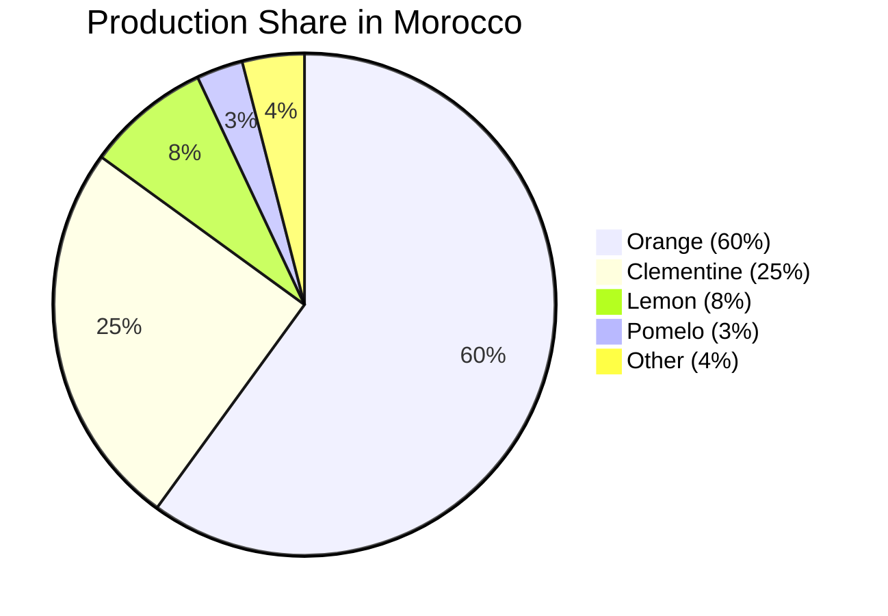

Morocco is the **2nd largest African citrus producer** and the **1st African citrus exporter**, with approximately **130,000 hectares** under cultivation. The major producing regions are Souss-Massa (35%), Gharb-Loukkos (27%), Oriental (14%), Tadla-Azilal (9%), and Marrakech-Haouz (8%).

---

## 1. Species and Varieties

### Species Overview

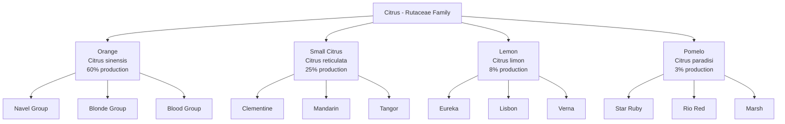

### Orange Varieties (Citrus sinensis)

| Variety | Type | Maturity | Caliber | Quality | Export | Notes |
|---------|------|----------|---------|---------|--------|-------|
| Naveline | Navel | Nov-Jan | Large | Excellent | Yes | Top export variety |
| Washington Navel | Navel | Dec-Feb | Very large | Excellent | Yes | Standard Navel |
| Navelate | Navel | Jan-Mar | Large | Very good | Yes | Late Navel |
| Salustiana | Blonde | Dec-Mar | Medium | Very good | -- | Industrial juice |
| Valencia Late | Blonde | Apr-Jun | Medium | Excellent | Yes | Very late season |
| Maroc Late | Blonde | Mar-Jun | Med-large | Excellent | Yes | Morocco specialty |
| Sanguinelli | Blood | Jan-Mar | Medium | Good | -- | Niche market |

### Small Citrus Varieties (Clementine and Mandarin)

| Variety | Type | Maturity | Seeds | Shelf Life | Notes |
|---------|------|----------|-------|------------|-------|
| Clementine Commune | Clementine | Oct-Dec | 0-2 | Medium | Production base |
| Nules | Clementine | Nov-Dec | 0-1 | Good | Export leader |
| Marisol | Clementine | Sep-Oct | 0-1 | Low | Very early |
| Nour | Clementine | Jan-Mar | 0-2 | Good | Late, Moroccan origin |
| Nadorcott/Afourer | Mandarin | Jan-Apr | 0-3 | Excellent | Premium segment |
| Ortanique | Tangor | Feb-Apr | 5-15 | Very good | Orange x Tangerine hybrid |
| Nova | Mandarin | Nov-Jan | 0-3 | Good | Intense aroma |

### Lemon Varieties (Citrus limon)

| Variety | Type | Maturity | Acidity | Productivity | Notes |
|---------|------|----------|---------|--------------|-------|
| Eureka | Lemon | Year-round | High | Good | World standard |
| Lisbon | Lemon | Nov-May | High | Very good | Rustic, hardy |
| Verna | Lemon | Feb-Jul | Medium | Good | Few seeds |
| Meyer | Lemon | Nov-Mar | Low | Medium | Hybrid, less acidic |

### Pomelo Varieties (Citrus paradisi)

| Variety | Flesh | Maturity | Size | Taste | Notes |
|---------|-------|----------|------|-------|-------|
| Star Ruby | Red | Nov-Mar | Large | Low bitterness | Most planted |
| Rio Red | Red | Nov-Apr | Large | Low bitterness | Star Ruby alternative |
| Marsh | Blonde | Nov-Apr | Very large | Slightly bitter | Classic cultivar |

### Maturity Windows Across the Year

```mermaid
gantt
    title Harvest Calendar by Variety
    dateFormat  MM
    axisFormat  %b

    section Oranges
    Naveline           :01, 03
    Washington Navel   :12, 03
    Navelate           :01, 04
    Salustiana         :12, 04
    Maroc Late         :03, 07
    Valencia Late      :04, 07

    section Clementine
    Marisol            :09, 11
    Clem. Commune      :10, 01
    Nules              :11, 01
    Nour               :01, 04
    Nadorcott          :01, 05

    section Lemon
    Eureka             :01, 13

    section Pomelo
    Star Ruby          :11, 04
```

---

## 2. Rootstock Selection

The rootstock determines roughly 50% of tree behavior: vigor, cold tolerance, salinity tolerance, limestone tolerance, disease resistance, and fruit quality. The choice is **strategic**.

### Rootstock Comparison

| Rootstock | Vigor | Limestone | Salinity | Phytophthora | Tristeza | Fruit Quality |
|-----------|-------|-----------|----------|--------------|----------|---------------|
| Bigaradier | Strong | Excellent | Good | Sensitive | VERY SENSITIVE | Excellent |
| Citrange Carrizo | Med-strong | Medium | Low | Tolerant | Tolerant | Good |
| Citrange Troyer | Strong | Medium | Low | Tolerant | Tolerant | Good |
| Citrumelo | Strong | Low | Medium | Tolerant | Tolerant | Good |
| Volkameriana | Very strong | Good | Good | Medium | Tolerant | Medium |
| Macrophylla | Very strong | Good | Good | Medium | Tolerant | Low |
| M. Cleopatre | Medium | Excellent | Good | Sensitive | Tolerant | Excellent |
| Poncirus trifoliata | Dwarfing | Very low | Low | Very tolerant | Tolerant | Excellent |

> **TRISTEZA WARNING**: The Tristeza virus (CTV) is present in Morocco. Using Bigaradier as rootstock is HIGH RISK for new plantations. Prefer Citrange Carrizo or Volkameriana depending on soil conditions.

### Rootstock Decision Tree

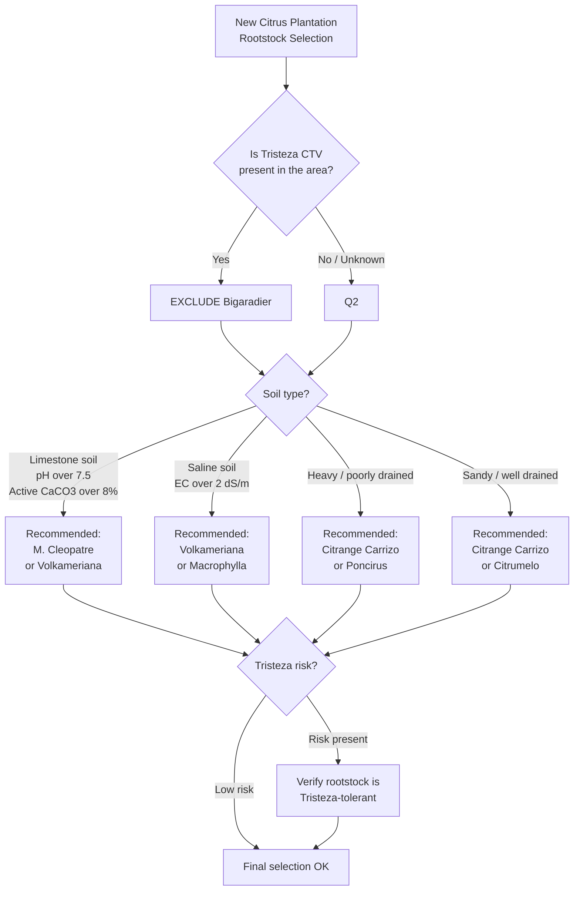

### Rootstock Guide by Soil Type

| Soil Condition | Recommended | Alternative | Avoid |
|----------------|-------------|-------------|-------|
| Limestone (pH over 7.5, CaCO3 over 8%) | Bigaradier, M. Cleopatre | Volkameriana | Poncirus, Citrange |
| Saline (EC over 2 dS/m) | Volkameriana, Macrophylla | Bigaradier | Citrange Carrizo |
| Heavy, poorly drained | Citrange Carrizo | Poncirus | Bigaradier, Volkameriana |
| Sandy, well drained | Citrange, Citrumelo | Volkameriana | -- |
| Tristeza presence | Citrange, Volkameriana | Citrumelo | Bigaradier |

---

## 3. Phenological Cycle

Citrus trees are evergreen with continuous leaf production and, for lemons, multiple flowering periods per year.

### Annual Phenological Stages

```mermaid
gantt
    title Citrus Phenological Cycle (Orange - Morocco)
    dateFormat  MM
    axisFormat  %b

    section Vegetative
    Winter dormancy       :01, 02
    Spring flush          :02, 04
    Summer flush          :07, 09
    Autumn flush          :10, 12

    section Reproductive
    Flower buds           :03, 04
    Flowering             :03, 05
    Fruit set             :04, 06
    June drop             :05, 07
    Fruit growth I        :06, 08
    Fruit growth II       :08, 10
    Color break           :09, 11
    Maturation            :10, 01
```

### Stage Details with Satellite Signals

| Stage | Description | Orange | Clementine | Lemon | Satellite Signal |
|-------|-------------|--------|------------|-------|------------------|
| Winter dormancy | Growth slowdown | Dec-Jan | Dec-Jan | Continuous | NDVI stable |
| Spring flush | Vegetative push | Feb-Mar | Feb-Mar | Feb-Mar | NDVI rising |
| Flower buds | Differentiation | Mar | Mar | Variable | Stable |
| Flowering | Anthesis | Mar-Apr | Mar-Apr | Multiple | NIRv variable |
| Fruit set | Fruit set | Apr-May | Apr-May | Variable | Stable |
| June drop | Physiological drop | May-Jun | May-Jun | Variable | Normal |
| Fruit growth | Fruit expansion | Jun-Oct | Jun-Sep | Continuous | NDVI high stable |
| Color break | Color change | Sep-Oct | Sep-Oct | -- | Slight decrease |
| Maturation | Sugar accumulation | Oct-Dec | Oct-Nov | -- | Stable |

### NIRvP Coefficients by Period

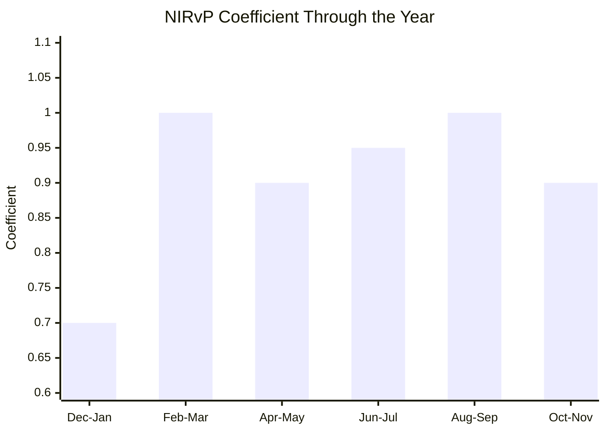

| Period | Activity | NIRvP Coef | Note |
|--------|----------|------------|------|
| Dec-Jan | Relative dormancy | 0.70 | Minimal activity |
| Feb-Mar | Flush + flowering | 1.00 | Maximum activity |
| Apr-May | Fruit set | 0.90 | Transition |
| Jun-Jul | Fruit growth I | 0.95 | High demand |
| Aug-Sep | Fruit growth II + flush | 1.00 | Dual activity |
| Oct-Nov | Maturation + flush | 0.90 | Transition |

### Lemon Specificity -- Remontant Flowering

The lemon tree is remontant: it can flower multiple times per year and carry fruits at different stages simultaneously.

- **Main flowering**: March-April
- **Secondary flowering**: June-July (if irrigated)
- **Autumn flowering**: September-October

---

## 4. Satellite Monitoring

### Vegetation Index Thresholds by System

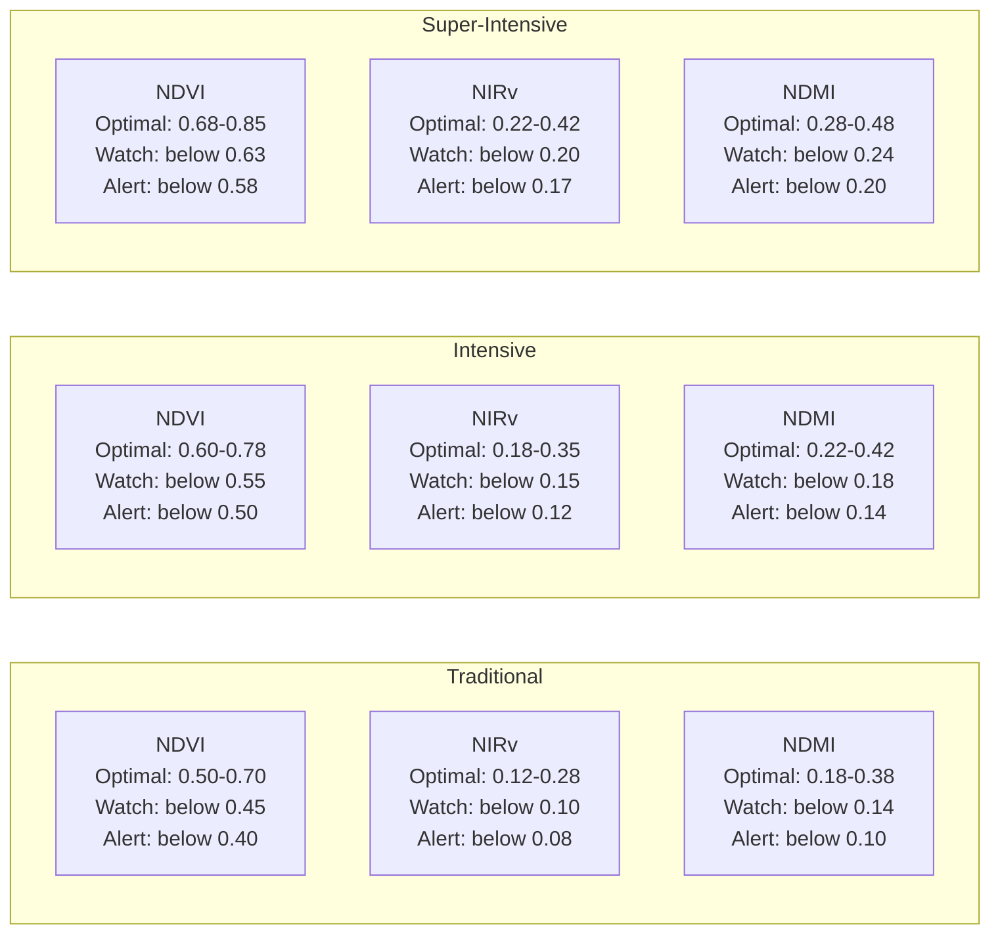

### Complete Threshold Table

| Index | Parameter | Traditional | Intensive | Super-intensive |
|-------|-----------|-------------|-----------|-----------------|
| NDVI | Optimal | 0.50-0.70 | 0.60-0.78 | 0.68-0.85 |
| NDVI | Watch | below 0.45 | below 0.55 | below 0.63 |
| NDVI | Alert | below 0.40 | below 0.50 | below 0.58 |
| NIRv | Optimal | 0.12-0.28 | 0.18-0.35 | 0.22-0.42 |
| NIRv | Watch | below 0.10 | below 0.15 | below 0.20 |
| NIRv | Alert | below 0.08 | below 0.12 | below 0.17 |
| NDMI | Optimal | 0.18-0.38 | 0.22-0.42 | 0.28-0.48 |
| NDMI | Watch | below 0.14 | below 0.18 | below 0.24 |
| NDMI | Alert | below 0.10 | below 0.14 | below 0.20 |

### Plantation System Comparison

| Parameter | Traditional | Intensive | Super-intensive |
|-----------|-------------|-----------|-----------------|
| Density (trees/ha) | 200-300 | 400-600 | 800-1200 |
| Spacing | 7x5 to 8x6 m | 5x3 to 6x4 m | 4x2 to 5x2.5 m |
| Irrigation | Surface | Drip | High-freq drip |
| First production | Year 5-6 | Year 3-4 | Year 2-3 |
| Full production | Year 10-12 | Year 6-8 | Year 5-6 |
| Economic lifespan | 40-50 years | 25-35 years | 15-20 years |
| Yield at full prod. | 20-35 T/ha | 40-60 T/ha | 50-80 T/ha |

### Yield by Species and Age (T/ha, intensive irrigated)

| Species | 3-4 yrs | 5-7 yrs | 8-12 yrs | 13-20 yrs | 20+ yrs |
|---------|---------|---------|----------|-----------|---------|
| Orange Navel | 5-15 | 20-35 | 35-50 | 45-60 | 40-55 |
| Orange Valencia | 5-15 | 25-40 | 40-60 | 55-80 | 50-70 |
| Clementine | 5-12 | 18-30 | 30-45 | 40-55 | 35-50 |
| Mandarin Nadorcott | 8-15 | 25-40 | 40-55 | 50-70 | 45-60 |
| Lemon | 5-10 | 15-30 | 30-50 | 45-70 | 40-60 |
| Pomelo | 5-12 | 20-35 | 40-60 | 55-80 | 50-70 |

---

## 5. Nutrition Program

### NPK Export Coefficients (kg per ton of fruit)

| Element | Orange | Clementine | Lemon | Pomelo | Role |
|---------|--------|------------|-------|--------|------|
| N | 1.8-2.2 | 1.5-2.0 | 2.0-2.5 | 1.5-2.0 | Growth, quality |
| P2O5 | 0.4-0.6 | 0.3-0.5 | 0.4-0.6 | 0.3-0.5 | Flowering, rooting |
| K2O | 2.5-3.5 | 2.0-3.0 | 3.0-4.0 | 2.5-3.5 | Quality, caliber |
| CaO | 0.8-1.2 | 0.6-1.0 | 0.8-1.2 | 0.6-1.0 | Fruit texture |
| MgO | 0.3-0.5 | 0.2-0.4 | 0.3-0.5 | 0.2-0.4 | Chlorophyll |

### Maintenance Requirements (kg/ha)

| System | N | P2O5 | K2O | Note |
|--------|---|------|-----|------|
| Young (1-3 yrs) | 40-80 | 20-40 | 30-60 | Focus on growth |
| Entering prod. (4-6 yrs) | 100-150 | 40-60 | 80-120 | Transition |
| Intensive full prod. | 180-280 | 60-100 | 150-250 | Based on yield |
| Super-intensive | 250-400 | 80-120 | 200-350 | High density |

### Dosage Formula

```
Total_dose = (Target_yield x Export) + Maintenance - Soil_correction - Water_correction
```

**Example: Intensive orange, 50 T/ha target**
- N = (50 x 2.0) + 150 = 250 kg/ha
- P2O5 = (50 x 0.5) + 50 = 75 kg/ha
- K2O = (50 x 3.0) + 100 = 250 kg/ha

### NPK Splitting Schedule

```mermaid
xychart-beta
    title "Annual NPK Distribution (%)"
    x-axis ["Feb", "Mar-Apr", "May-Jun", "Jul-Aug", "Sep-Oct", "Nov"]
    y-axis "Percentage" 0 --> 45
    bar [15, 25, 20, 20, 10, 10]
    bar [40, 30, 15, 10, 5, 0]
    bar [10, 15, 20, 25, 20, 10]
```

| Period | Stage | N (%) | P2O5 (%) | K2O (%) | Objective |
|--------|-------|-------|----------|---------|-----------|
| Feb | Pre-flowering | 15% | 40% | 10% | Prepare flowering |
| Mar-Apr | Flowering-fruit set | 25% | 30% | 15% | Fruit set |
| May-Jun | Post-drop | 20% | 15% | 20% | Growth I |
| Jul-Aug | Fruit growth | 20% | 10% | 25% | Caliber, summer flush |
| Sep-Oct | Maturation | 10% | 5% | 20% | Internal quality |
| Nov | Post-harvest | 10% | 0% | 10% | Recovery |

### Species-Specific Adjustments

| Species | N Factor | K Factor | Specific Note |
|---------|----------|----------|---------------|
| Orange Navel | 1.0x (standard) | 1.0x | Avoid N excess (causes cracking) |
| Orange Valencia | 1.1x (+10%) | 1.0x | Higher production |
| Clementine | 0.9x (-10%) | 1.0x | Avoid excessive caliber |
| Lemon | 1.15x (+15%) | 1.1x (+10%) | Remontant, continuous needs |
| Pomelo | 1.0x (standard) | 1.1x (+10%) | Large fruits |

### Recommended Fertilizer Forms

| Element | Recommended | Conditional | Avoid |
|---------|-------------|-------------|-------|
| N | Calcium nitrate, Ammonium nitrate | Urea if pH below 7 | Urea if pH over 7.5 |
| P | MAP, Phosphoric acid | -- | -- |
| K | Potassium sulfate, Potassium nitrate | KCl if EC below 1.0 dS/m and Cl below 100 mg/L | KCl if EC over 1.5 |

> **CHLORIDE NOTE**: Citrus are chloride-sensitive (less than avocado). Use potassium sulfate by default. KCl is acceptable only when water EC is below 1.0 dS/m and Cl is below 100 mg/L.

### Foliar Reference Thresholds

Sampling: Leaves 4-6 months old on non-fruiting branches, August-September.

| Element | Unit | Deficiency | Sufficient | Optimal | Excess |
|---------|------|------------|------------|---------|--------|
| N | % | below 2.20 | 2.20-2.40 | 2.40-2.70 | over 3.00 |
| P | % | below 0.09 | 0.09-0.11 | 0.12-0.17 | over 0.20 |
| K | % | below 0.70 | 0.70-1.00 | 1.00-1.50 | over 2.00 |
| Ca | % | below 2.00 | 2.00-3.00 | 3.00-5.00 | over 6.00 |
| Mg | % | below 0.20 | 0.20-0.30 | 0.30-0.50 | over 0.70 |
| Fe | ppm | below 35 | 35-60 | 60-120 | over 200 |
| Zn | ppm | below 18 | 18-25 | 25-100 | over 200 |
| Mn | ppm | below 18 | 18-25 | 25-100 | over 500 |
| B | ppm | below 20 | 20-35 | 35-100 | over 150 |
| Cu | ppm | below 3 | 3-5 | 5-15 | over 20 |
| Cl | % | -- | -- | below 0.30 | over 0.70 (toxic) |
| Na | % | -- | -- | below 0.15 | over 0.25 (toxic) |

> **RULE**: On limestone soil (pH over 7.5), the microelement program (Fe, Zn, Mn) is MANDATORY, not optional. Plan 3-4 foliar applications plus 2 Fe-EDDHA soil applications.

---

## 6. Irrigation

### Crop Coefficients (Kc) by Period

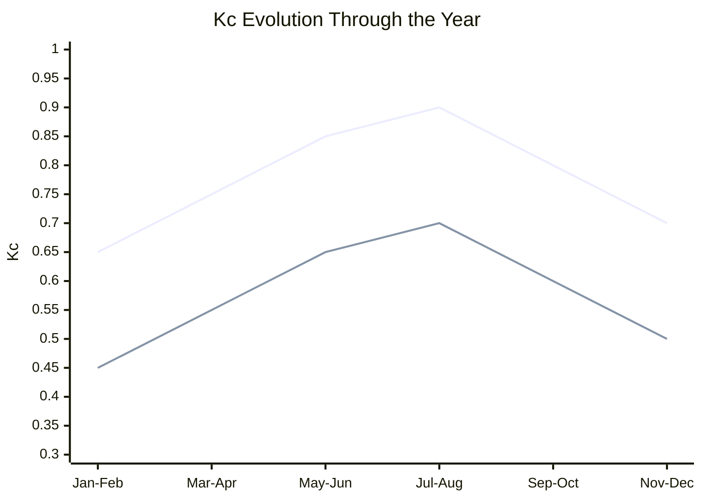

| Period | Stage | Kc Young | Kc Adult | Note |
|--------|-------|----------|----------|------|
| Jan-Feb | Dormancy | 0.45 | 0.65 | Low demand |
| Mar-Apr | Flowering | 0.55 | 0.75 | Increasing |
| May-Jun | Growth I | 0.65 | 0.85 | Rising demand |
| Jul-Aug | Growth II | 0.70 | 0.90 | Peak demand |
| Sep-Oct | Maturation | 0.60 | 0.80 | Slight reduction |
| Nov-Dec | Harvest/dormancy | 0.50 | 0.70 | Reduced demand |

### Reference Volumes

| Month | ETo (mm/d) | ETc Adult | Volume/tree/day (400 trees/ha) | Frequency |
|-------|------------|-----------|-------------------------------|-----------|
| Jan-Feb | 2-3 | 1.5-2.0 | 35-50 L | 2x/week |
| Mar-Apr | 3-5 | 2.5-4.0 | 60-100 L | 3x/week |
| May-Jun | 5-7 | 4.5-6.0 | 110-150 L | 4-5x/week |
| Jul-Aug | 7-9 | 6.0-8.0 | 150-200 L | 5-6x/week |
| Sep-Oct | 4-6 | 3.5-5.0 | 85-125 L | 3-4x/week |
| Nov-Dec | 2-4 | 1.5-3.0 | 35-75 L | 2x/week |

### Salinity Tolerance Comparison

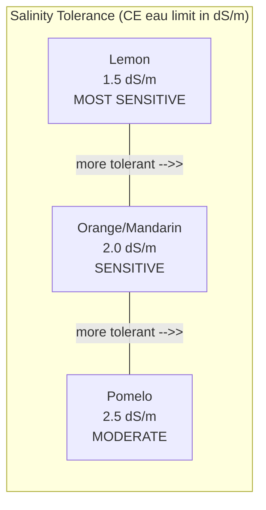

| Parameter | Orange/Mandarin | Lemon | Pomelo |
|-----------|-----------------|-------|--------|
| CE water optimal | below 1.0 dS/m | below 0.8 dS/m | below 1.2 dS/m |
| CE water limit | 2.0 dS/m | 1.5 dS/m | 2.5 dS/m |
| CE soil limit | 2.5 dS/m | 2.0 dS/m | 3.0 dS/m |
| Cl water limit | 150 mg/L | 100 mg/L | 200 mg/L |
| Cl foliar toxic | 0.70% | 0.50% | 0.80% |

### Regulated Deficit Irrigation (RDI)

| Stage | Sensitivity | RDI Possible | Max Reduction |
|-------|-------------|-------------|---------------|
| Flowering | VERY HIGH | No | 0% |
| Fruit set | HIGH | No | 0% |
| Growth I | HIGH | Caution | 0-10% |
| Growth II | MODERATE | Yes | 15-25% |
| Maturation | LOW | Yes | 25-35% |

> **RULE**: Pre-harvest RDI (4-6 weeks before) increases Brix by 0.5-1.0 points but reduces caliber. Use according to commercial objective (juice vs table).

### Rootstock Role in Salinity Management

| Rootstock | Cl Exclusion | Recommendation for Saline Water |
|-----------|-------------|--------------------------------|
| Bigaradier | Good | Recommended |
| Volkameriana | Good | Recommended |
| Macrophylla | Good | Recommended |
| M. Cleopatre | Good | Recommended |
| Citrange Carrizo | Low | Avoid |
| Citrange Troyer | Low | Avoid |

---

## 7. Phytosanitary Management

### Key Diseases

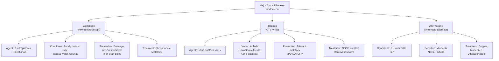

### Main Pests

| Pest | Damage | Period | Threshold | Treatment |
|------|--------|--------|-----------|-----------|
| Mediterranean fruit fly (Ceratitis) | Fruit punctures, maggots | Color break to harvest | 2% fruit damage | Spinosad + trapping |
| Scale insects | Sooty mold, weakening | Year-round | Presence | White oil, Spirotetramat |
| Aphids | Shoot distortion, virus vector | Spring | Colonies | Imidacloprid, Spirotetramat |
| Citrus leafminer | Leaf galleries | Vegetative flush | Presence | Abamectin, Imidacloprid |
| Spider mites | Bronze leaves | Dry summer | Presence | Abamectin, sulfur |
| Thrips | Fruit scarring | Flowering | Presence | Spinosad |

### Preventive Phytosanitary Calendar

```mermaid
gantt
    title Preventive Treatment Calendar
    dateFormat  MM
    axisFormat  %b

    section Fungal
    White oil - Scale        :01, 02
    Phosphonate - Gommose    :02, 04
    Copper - Winter          :11, 12

    section Insects
    Aphid monitoring         :04, 05
    Leafminer monitoring     :05, 06
    Ceratitis - Trapping     :08, 11
```

| Period | Target | Product | Dose | Condition |
|--------|--------|---------|------|-----------|
| Jan | Scale insects (winter) | White oil | 15-20 L/ha | Systematic |
| Feb-Mar | Gommose prevention | Phosphonate | 5 mL/L foliar | Wet soil |
| Apr | Aphids | Imidacloprid | Per label | If colonies present |
| May | Leafminer on flush | Abamectin | 0.5 L/ha | If presence |
| Aug-Oct | Ceratitis | Spinosad + attractant | 0.2 L/ha | Trapping + threshold |
| Nov | Winter copper | Copper | 3 kg/ha | Post-harvest |

---

## 8. Alert System

All alert codes used by the SIMO AI engine for citrus parcels.

### Alert Architecture

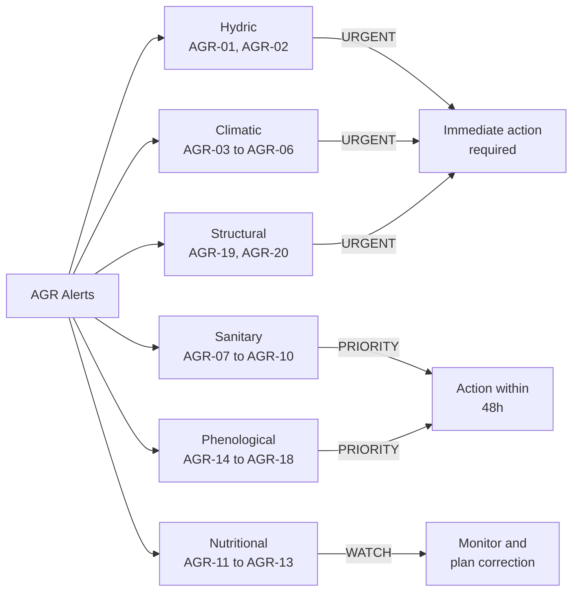

### Hydric Alerts

| Code | Alert | Entry Threshold | Exit Threshold | Priority |
|------|-------|-----------------|----------------|----------|
| AGR-01 | Water stress | NDMI below P15 (2 passes) + T over 30C | NDMI over P30 | URGENT |
| AGR-02 | Water excess / Gommose | NDMI over P95 + rain over 40mm/week | NDMI below P85 | URGENT |

### Climatic Alerts

| Code | Alert | Entry Threshold | Exit Threshold | Priority |
|------|-------|-----------------|----------------|----------|
| AGR-03 | Frost risk | Tmin forecast below 0C | Tmin over 3C (3 days) | URGENT |
| AGR-04 | Confirmed frost | Tmin below -2C (orange) or below 0C (lemon) | -- | URGENT |
| AGR-05 | Heat wave | Tmax over 40C (3 days) + RH below 30% | Tmax below 37C (2 days) | PRIORITY |
| AGR-06 | Hot wind | T over 38C + RH below 25% + wind over 30 km/h | Normal conditions | PRIORITY |

### Sanitary Alerts

| Code | Alert | Entry Threshold | Exit Threshold | Priority |
|------|-------|-----------------|----------------|----------|
| AGR-07 | Gommose conditions | Soil saturated over 48h + T 18-28C | Soil drained | URGENT |
| AGR-08 | Ceratitis risk | Color break + T 20-30C + positive trap | Harvest complete | PRIORITY |
| AGR-09 | Aphid pressure | Flush + T 18-28C + colonies | No colonies | PRIORITY |
| AGR-10 | Alternaria risk | RH over 85% + rain + sensitive variety | 72h dry | PRIORITY |

### Nutritional Alerts

| Code | Alert | Entry Threshold | Exit Threshold | Priority |
|------|-------|-----------------|----------------|----------|
| AGR-11 | Iron chlorosis | NDRE below P10 + GCI decreasing + soil pH over 7.5 | NDRE over P30 | WATCH |
| AGR-12 | Zn deficiency | Small mottled leaves + flush | After treatment | WATCH |
| AGR-13 | Cl toxicity | Foliar burn + water EC over 2.5 | Leaching done | URGENT |

### Phenological Alerts

| Code | Alert | Entry Threshold | Exit Threshold | Priority |
|------|-------|-----------------|----------------|----------|
| AGR-14 | Weak flowering | Detected flowering below 50% expected | -- | PRIORITY |
| AGR-15 | Excessive drop | Estimated load below 40% post-set | -- | PRIORITY |
| AGR-16 | Harvest maturity | Brix/Acidity ratio reached + color | Harvest declared | INFO |
| AGR-17 | Probable OFF year | Year N-1 very productive + weak flush | -- | PRIORITY |
| AGR-18 | Granulation risk | Late harvest + low foliar K | -- | PRIORITY |

### Structural Alerts

| Code | Alert | Entry Threshold | Exit Threshold | Priority |
|------|-------|-----------------|----------------|----------|
| AGR-19 | Tree decline | NIRv decrease over 20% (4 passes) | Stabilization | URGENT |
| AGR-20 | Dead tree / Tristeza | NDVI below 0.35 + Bigaradier rootstock | -- | URGENT |

---

## 9. Harvest and Quality

### Maturity Indices by Species

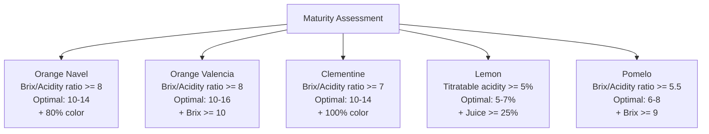

### Measurement Methods

- **Brix**: Refractometer on pressed juice
- **Acidity**: NaOH 0.1N titration, expressed as % citric acid
- **Ratio**: Brix / Acidity (taste maturity index)
- **Color**: Colorimetric index or % colored surface
- **Juice content**: % juice mass / fruit mass

### Optimal Harvest Windows

| Variety | Earliest Start | Optimal | Latest End | Risk if Late |
|---------|---------------|---------|------------|--------------|
| Marisol | Mid-Sep | Oct | Early Nov | Quality loss |
| Clementine Commune | Early Oct | Nov | Early Dec | Granulation |
| Nules | Mid-Oct | Nov | Mid-Dec | -- |
| Nour | Jan | Feb | Mar | -- |
| Naveline | Nov | Dec | Jan | Cracking risk |
| Maroc Late | Mar | Apr-May | Jun | -- |
| Valencia Late | Apr | May | Jun | Regreening |

### Quality Defects to Prevent

| Defect | Cause | Prevention |
|--------|-------|------------|
| Granulation (dryness) | Late harvest, low K | Harvest on time, adequate K |
| Cracking (creasing) | N excess, water stress | N/K balance, regular irrigation |
| Small caliber | Excessive crop load, water stress | Thinning, irrigation |
| Thick peel | N excess | Reduce N |
| Regreening | Late harvest (Valencia) | Ethylene if needed |
| Oleocellosis | Wet harvest, bruising | Harvest dry, gentle handling |

---

## 10. Annual Plan Template

### Monthly Plan -- Intensive Orange (50 T/ha target)

```mermaid
gantt
    title Annual Operations Timeline
    dateFormat  MM
    axisFormat  %b

    section Nutrition
    Fe-EDDHA soil           :01, 02
    Pre-flowering NPK       :02, 03
    Flowering NPK + Zn/Mn   :03, 05
    Growth NPK + Zn         :05, 07
    Fe-EDDHA 2nd            :06, 07
    Growth NPK + Zn/Mn      :07, 09
    Maturation NPK          :09, 11
    Post-harvest N           :11, 12

    section Biostimulants
    Humics + Seaweed         :02, 03
    Seaweed flowering        :03, 04
    Amino acids              :04, 05
    Humics + Amino           :05, 06
    Seaweed heat stress      :07, 08
    Humics maturation        :09, 10
    Granular humics          :11, 12
    Amino acids recovery     :12, 01

    section Phytosanitary
    White oil scales         :01, 02
    Phosphonate gommose      :02, 03
    Aphid monitoring         :04, 05
    Leafminer monitoring     :05, 06
    Ceratitis campaign       :08, 11
    Copper treatment         :11, 12

    section Irrigation
    Low regime               :01, 03
    Increasing regime        :03, 06
    Peak regime              :06, 09
    Decreasing regime        :09, 11
    Low regime end           :11, 01
```

### Detailed Monthly Breakdown

| Month | NPK (kg/ha) | Micronutrients | Biostimulants | Phyto | Irrigation (L/tree/week) |
|-------|-------------|----------------|---------------|-------|--------------------------|
| Jan | N15+P20+K10 | Fe-EDDHA | -- | White oil | 50 |
| Feb | N25+P15+K15 | -- | Humics+Seaweed | Phosphonate | 60 |
| Mar | N30+K20 | Zn+Mn foliar | Seaweed | -- | 80 |
| Apr | N25+P10+K15 | B flowering | Amino acids | Aphids if present | 100 |
| May | N20+K25 | Zn foliar | Humics+Amino | Leafminer if present | 130 |
| Jun | N20+K30 | Fe-EDDHA | -- | -- | 160 |
| Jul | N15+K30 | Zn+Mn foliar | Seaweed | -- | 180 |
| Aug | N15+K25 | -- | -- | Ceratitis start | 180 |
| Sep | N10+K20 | -- | Humics | Ceratitis | 140 |
| Oct | N10+K15 | -- | -- | Ceratitis | 100 |
| Nov | N15 | -- | Granular humics | Copper | 70 |
| Dec | -- | -- | Amino acids | -- | 50 |

**Annual totals**: N approximately 250 kg/ha, K2O approximately 250 kg/ha. Adjust based on soil and foliar analyses.

### Critical Decision Points

1. **February-March**: Prepare flowering, first Fe-EDDHA application, begin biostimulant program
2. **March-April**: Flowering period -- boron is critical, seaweed for fruit set support
3. **May-June**: Post-drop management, Zn on new flush, monitor for leafminer
4. **August-October**: Ceratitis campaign -- trapping and treatment if threshold reached
5. **November**: Post-harvest recovery -- copper treatment, granular humics, begin reconstitution

---

## References

**Scientific publications**: Allen et al. (1998) FAO 56; Alva et al. (2006); Ballester et al. (2011); Castle et al. (2010); Castel (1997); Chapman (1968); Davies and Albrigo (1994); Forner-Giner and Ancillo (2013); Gonzalez-Altozano and Castel (1999); Levy and Syvertsen (2004); Maas (1993); Quaggio et al. (1996, 2005); Spiegel-Roy and Goldschmidt (1996); Storey and Walker (1999).

**Institutions**: MAPM (Ministry of Agriculture, Morocco), ONSSA, ASPAM, Maroc Citrus, INRA Morocco.

---

*Referentiel Operationnel Agrumes v1.0 -- Generated for SIMO AI Engine -- February 2026*
