# Date Palm -- Complete Operational Referential

**Phoenix dactylifera L.** | Family Arecaceae | Operational reference for the SIMO AI engine

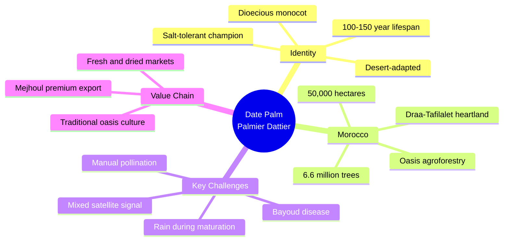

---

## 1. Overview -- Date Palm in Morocco

The date palm is the cornerstone of oasis civilizations across southeastern Morocco. With approximately **6.6 million trees** spread over **50,000 hectares**, it sustains livelihoods in some of the most arid regions on Earth.

### Unique Biological Characteristics

| Parameter | Value | Note |
|---|---|---|
| Scientific name | Phoenix dactylifera L. | Family Arecaceae (Palmae) |
| Plant type | Arborescent monocotyledon | Non-branching stipe |
| Origin | Mesopotamia / Persian Gulf | Domesticated approx. 6,000 years ago |
| Lifespan | 100-150 years | Economic production window: 60-80 years |
| Adult height | 15-25 m | Growth rate approx. 30 cm/year |
| Root system | Fasciculate, deep | Reaches up to 6 m depth |
| Sexuality | Dioecious | Separate male and female trees |
| Pollination | Anemophilous (natural) | Manual in commercial cultivation |
| Heat tolerance | Up to 50 deg C | One of very few crops producing above 45 deg C |
| Salinity tolerance | EC water up to 8-10 dS/m | Most salt-tolerant fruit crop known |

### Climate Requirements

The date palm thrives in **hot desert climates**. It requires very hot, dry summers for proper fruit maturation. Excessive humidity during the ripening phase destroys the harvest.

| Parameter | Value | Impact |
|---|---|---|
| Optimal temperature | 32-38 deg C | Maximum productivity |
| Active growth threshold | above 18 deg C | Growth resumes |
| Maximum tolerated | 50 deg C | Survives extreme heat |
| Frost damage to fronds | -5 to -7 deg C | Foliar injury |
| Lethal frost | -10 to -12 deg C | Tree mortality |
| Thermal requirements (GDD) | above 5,000 deg C.day | Base 18 deg C, flowering to harvest |
| Optimal relative humidity | below 40% | During maturation |
| Critical humidity | above 70% | Fermentation, rot risk |

### Regional Distribution in Morocco

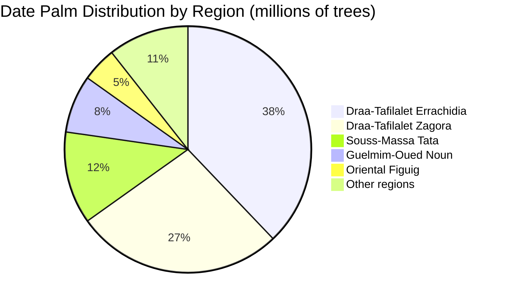

| Region | Trees (millions) | Surface (ha) | Dominant varieties |
|---|---|---|---|
| Draa-Tafilalet (Errachidia) | 2.5 | 20,000 | Mejhoul, Boufeggous, Jihel |
| Draa-Tafilalet (Zagora) | 1.8 | 12,000 | Boufeggous, Jihel, Bouslikhene |
| Souss-Massa (Tata) | 0.8 | 6,000 | Jihel, Bouslikhene |
| Guelmim-Oued Noun | 0.5 | 4,000 | Jihel, Bouskri |
| Oriental (Figuig) | 0.3 | 3,000 | Assiane, Aziza |
| Other | 0.7 | 5,000 | Variable |

*Sources: ANDZOA 2023; MAPM statistics; Zaid and de Wet 2002*

---

## 2. Variety Comparison

### Date Type Classification

Dates are classified into three types based on final moisture content:

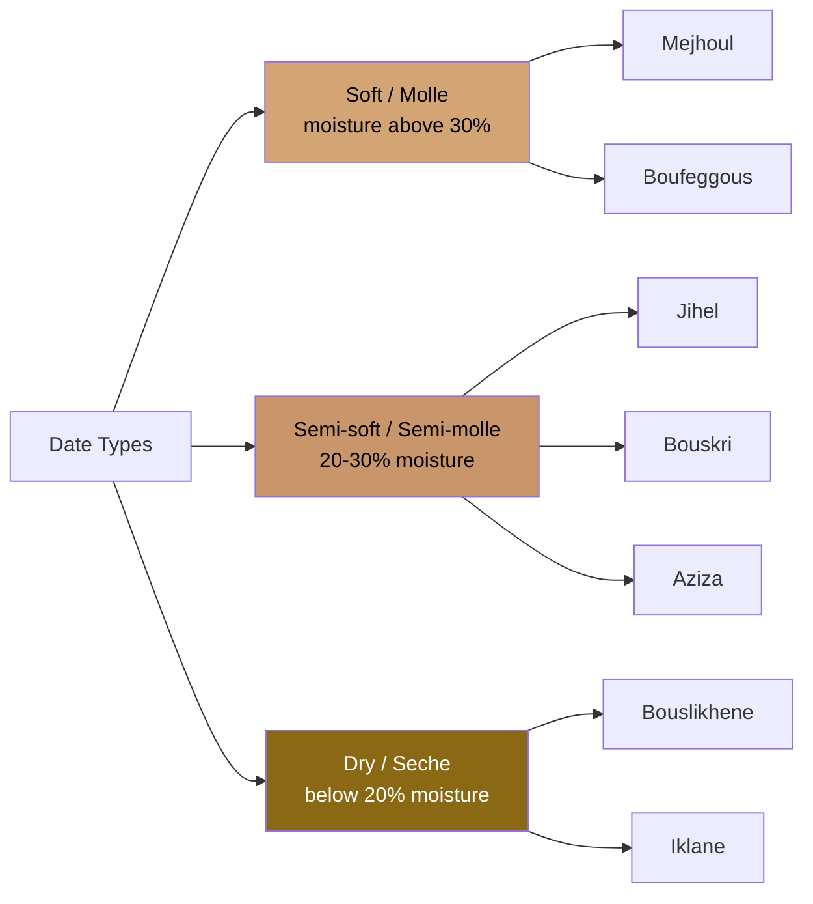

### Principal Varieties

| Variety | Type | Fruit weight (g) | Maturity | Quality | Bayoud resistance | Yield (kg/tree) |
|---|---|---|---|---|---|---|
| **Mejhoul** | Soft | 15-25 | Oct-Nov | Premium export | Susceptible | 80-120 |
| **Boufeggous** | Soft | 8-12 | Oct | Excellent | Susceptible | 60-100 |
| **Jihel** | Semi-soft | 6-10 | Sept-Oct | Good | **Tolerant** | 70-100 |
| **Bouskri** | Semi-soft | 5-8 | Sept | Good | Tolerant | 50-80 |
| **Bouslikhene** | Dry | 4-7 | Oct-Nov | Medium | **Resistant** | 60-90 |
| **Aguellid** | Semi-soft | 7-10 | Oct | Good | Variable | -- |
| **Aziza** | Semi-soft | 6-9 | Sept-Oct | Good | Variable | -- |
| **Assiane** | Semi-soft | 5-8 | Oct | Good | Variable | -- |
| **Khalt** | Variable | Variable | Variable | Variable | Variable | 50-80 |

**Note on Khalt:** "Khalt" refers to seedling-grown (non-clonal) palms with heterogeneous characteristics. They represent a significant portion of traditional oases.

### INRA Hybrid Program

Morocco's INRA has developed hybrid selections combining the fruit quality of Mejhoul/Boufeggous with the Bayoud resistance of Jihel/Bouslikhene. These hybrids are propagated via tissue culture and represent the future of Moroccan date palm cultivation, offering both commercial quality and disease resilience.

### Variety Decision Guide

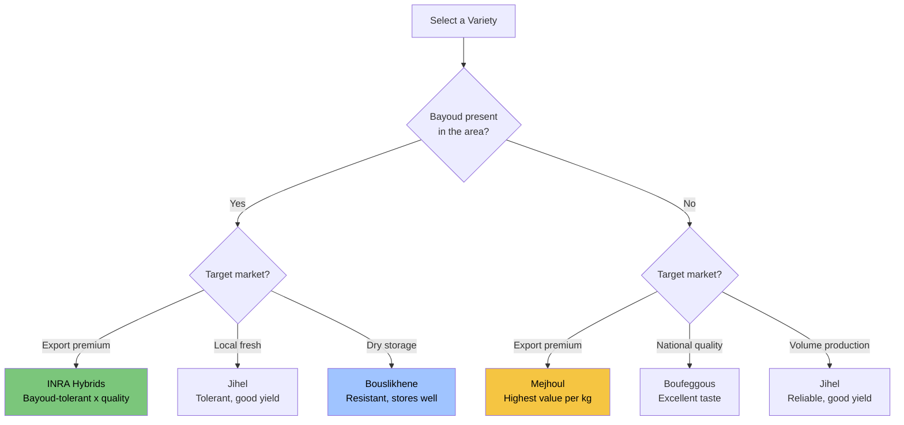

---

## 3. Pollination System

The date palm is **dioecious**: male and female flowers are borne on separate trees. In commercial plantations, only 1-2% of trees are male (dokkars); the rest are female producers. Pollination is **obligatorily manual** to achieve fruit set rates above 70%.

### Pollination Workflow

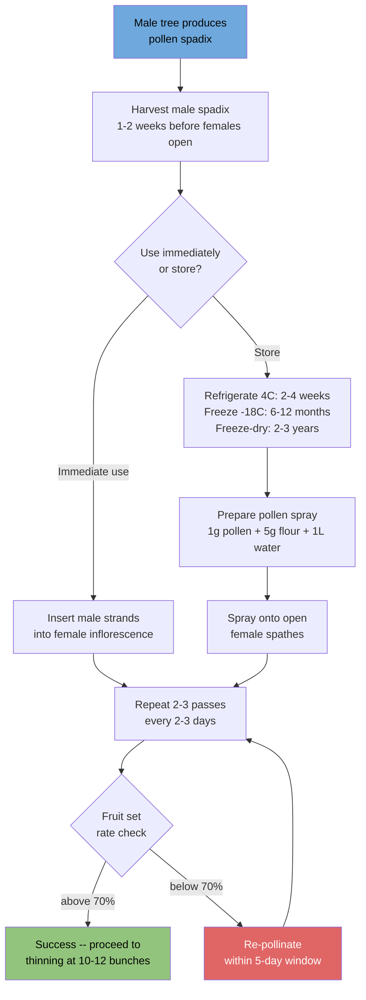

### Pollination Timing Rules

- **Window:** Pollinate within 1-3 days of female spathe opening
- **Late limit:** Beyond 5 days, fruit set drops dramatically (alert PAL-14)
- **Optimal hours:** Morning 8h-11h or late afternoon
- **Avoid:** Strong wind, rain, temperatures above 40 deg C
- **Male-to-female ratio:** Maintain 1-2% male trees in the grove

### Pollen Conservation

| Method | Duration | Viability | Use case |
|---|---|---|---|
| Fresh (ambient) | 1-2 days | above 80% | Immediate use |
| Refrigerated (4 deg C) | 2-4 weeks | above 70% | Short-term |
| Frozen (-18 deg C) | 6-12 months | 50-70% | Seasonal storage |
| Freeze-dried (-20 deg C) | 2-3 years | 40-60% | Pollen bank |

**Critical rule:** Pollen quality (viability and varietal source) directly affects fruit size, shape, and quality. Always use pollen from selected, high-quality dokkars.

---

## 4. Maturity Stages

The date fruit passes through five distinct developmental stages, each with specific characteristics and management implications.

### Stage Progression

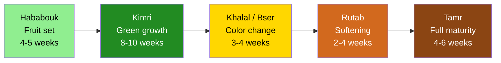

### Detailed Stage Characteristics

| Stage | Arabic name | Duration | Characteristics | Harvestable? |
|---|---|---|---|---|
| 1 | Hababouk | 4-5 weeks | Fruit set, green, 1-2 cm | No |
| 2 | Kimri | 8-10 weeks | Green, active growth, hard, maximum water demand | No (except some Khalt) |
| 3 | Khalal (Bser) | 3-4 weeks | Yellow or red, hard, crunchy, sugar accumulation | Possible (e.g., Barhi type) |
| 4 | Rutab | 2-4 weeks | Partial softening, brown, translucent zones appear | Yes (soft varieties) |
| 5 | Tamr | 4-6 weeks | Full maturity, dark brown, reduced moisture | Yes (all types) |

### Thermal Requirements (GDD, base 18 deg C from flowering)

```mermaid
gantt
    title Thermal Accumulation (GDD base 18C)
    dateFormat X
    axisFormat %s

    section Growth Stages
    Fruit set (Hababouk)    :a1, 0, 200
    Kimri (green growth)    :a2, 200, 2000
    Khalal (color stage)    :a3, 2000, 3000
    Rutab-Tamr (maturity)   :a4, 3000, 5500
```

| Stage | Cumulative GDD | Typical days |
|---|---|---|
| Fruit set (Hababouk) | 100-200 | 15-25 |
| End of Kimri | 1,500-2,000 | 90-110 |
| End of Khalal | 2,500-3,000 | 120-140 |
| Full maturity (Tamr) | 4,000-5,500 | 160-200 |

---

## 5. Satellite Monitoring

### Unique Challenges for Date Palm Remote Sensing

Date palm monitoring via satellite presents distinctive challenges not found in most fruit crops:

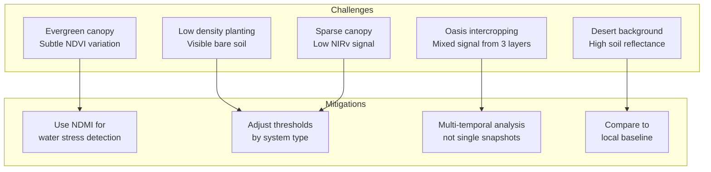

### Traditional Oasis -- Three-Layer System

The traditional oasis is an agroforestry system with three vegetation layers, which creates a **mixed satellite signal**:

1. **Upper canopy:** Date palms (shade providers)
2. **Middle layer:** Fruit trees (olive, fig, pomegranate, citrus)
3. **Ground level:** Vegetables, fodder, cereals (henna, alfalfa, wheat)

### Satellite Index Thresholds

| Index | Parameter | Traditional oasis | Intensive monoculture |
|---|---|---|---|
| NDVI | Optimal | 0.35-0.55 | 0.45-0.65 |
| NDVI | Vigilance | below 0.30 | below 0.40 |
| NDVI | Alert | below 0.25 | below 0.35 |
| NIRv | Optimal | 0.08-0.18 | 0.12-0.25 |
| NIRv | Vigilance | below 0.06 | below 0.10 |
| NDMI | Optimal | 0.05-0.20 | 0.10-0.28 |
| NDMI | Vigilance | below 0.03 | below 0.08 |
| NDMI | Alert | below 0.02 | below 0.05 |

**Important:** In traditional oases with intercropping, the satellite signal is a composite. The thresholds above apply to mono-specific palm groves. Adjust expectations when intercropping is present.

### Satellite Signal by Phenological Stage

| Stage | NDVI | NIRv | NDMI | Note |
|---|---|---|---|---|
| Winter dormancy | Stable medium | Stable | Stable | Little variation (evergreen) |
| Spathe emergence | Stable | Slight rise | Stable | Activity resumes |
| Flowering | Stable | Stable | Stable | Barely visible by satellite |
| Kimri (fruit growth) | Slight rise | Rise | Critical | Maximum water demand |
| Khalal-Rutab | Stable high | Stable | Possible decline | Maturation phase |
| Post-harvest | Stable | Slight decline | Stable | Recovery period |

---

## 6. Nutrition Program

### Nutrient Export per 100 kg of Dates

| Element | Export (kg/100 kg dates) | Primary role | Deficiency symptom |
|---|---|---|---|
| N | 0.8-1.2 | Frond growth, bunch development | Yellow, small fronds |
| P2O5 | 0.2-0.4 | Rooting, flowering | Bronze-colored fronds |
| K2O | 1.5-2.5 | Date quality, sugar content | Tip burn on fronds |
| CaO | 0.3-0.5 | Cell structure | Rare |
| MgO | 0.3-0.5 | Chlorophyll | Chlorosis of old fronds |

**Critical rule:** Potassium (K) is the single most important element for date quality -- it drives sugar content, texture, and storage life. Never neglect K fertilization.

### Annual Nutrient Requirements per Tree (full production)

| System | N (kg/tree) | P2O5 (kg/tree) | K2O (kg/tree) | MgO (kg/tree) |
|---|---|---|---|---|
| Traditional | 0.5-1.0 | 0.2-0.4 | 1.0-1.5 | 0.2-0.3 |
| Semi-intensive | 1.0-1.5 | 0.3-0.5 | 1.5-2.0 | 0.3-0.5 |
| Intensive (Mejhoul) | 1.5-2.5 | 0.5-0.8 | 2.5-4.0 | 0.5-0.8 |

### Fractional Application Schedule

```mermaid
xychart-beta
    title "Nutrient Distribution Throughout the Year (%)"
    x-axis ["Jan-Feb", "Mar-Apr", "May-Jun", "Jul-Aug", "Sep-Oct", "Nov-Dec"]
    y-axis "Percentage of annual dose" 0 --> 45
    bar [20, 25, 25, 15, 5, 10]
    bar [40, 30, 20, 10, 0, 0]
    bar [10, 15, 25, 30, 15, 5]
```

| Period | Stage | N (%) | P2O5 (%) | K2O (%) | Objective |
|---|---|---|---|---|---|
| Jan-Feb | Pre-flowering | 20 | 40 | 10 | Prepare flowering |
| Mar-Apr | Flowering / fruit set | 25 | 30 | 15 | Maximize fruit set |
| May-Jun | Early Kimri | 25 | 20 | 25 | Fruit growth |
| Jul-Aug | Kimri-Khalal | 15 | 10 | 30 | Sugar accumulation |
| Sep-Oct | Maturation | 5 | 0 | 15 | Fruit finishing |
| Nov-Dec | Post-harvest | 10 | 0 | 5 | Tree recovery |

### Nutrition Options

| Option | Name | Condition | Logic |
|---|---|---|---|
| A | Balanced nutrition | Soil analysis within 2 years + water analysis | Complete program |
| B | Simplified nutrition | No soil analysis available | Adjusted standard doses |
| C | Extreme salinity management | EC water above 6 dS/m | Leaching fractions, adapted forms |

Note: The salinity threshold for Option C is higher than for other crops because the date palm tolerates exceptional salinity levels.

### Recommended Fertilizer Forms

| Element | Recommended form | Alternative | Note |
|---|---|---|---|
| N | Ammonium sulfate, Urea | Ammonium nitrate | -- |
| P | TSP, MAP | DAP | -- |
| K | Potassium sulfate | Potassium chloride (tolerated) | Palm tolerates Cl unlike citrus |
| Mg | Magnesium sulfate | Kieserite | -- |
| Fe | Ferrous sulfate | Fe-EDDHA if high pH | -- |

### Foliar Analysis Thresholds

Sampling: Median leaflets from current-year fronds, June-July.

| Element | Unit | Deficiency | Sufficient | Optimal |
|---|---|---|---|---|
| N | % | below 1.8 | 1.8-2.2 | 2.2-2.8 |
| P | % | below 0.10 | 0.10-0.14 | 0.14-0.20 |
| K | % | below 0.8 | 0.8-1.2 | 1.2-1.8 |
| Ca | % | below 0.5 | 0.5-1.0 | 1.0-2.0 |
| Mg | % | below 0.15 | 0.15-0.25 | 0.25-0.50 |
| Fe | ppm | below 50 | 50-100 | 100-250 |
| Mn | ppm | below 20 | 20-50 | 50-150 |
| Zn | ppm | below 15 | 15-25 | 25-80 |
| Cu | ppm | below 3 | 3-6 | 6-15 |
| B | ppm | below 20 | 20-40 | 40-100 |

### Organic Amendments

Organic matter is especially critical in oasis soils, which are typically poor in humus.

| Type | Dose (kg/tree/year) | Timing | Effect |
|---|---|---|---|
| Decomposed manure | 30-50 | Autumn | Structure, CEC, nutrition |
| Compost | 20-40 | Autumn | Stable organic matter |
| Shredded palm debris | 10-20 | After pruning | Biomass recycling |

---

## 7. Irrigation and Salinity Management

### Water Requirements

| System | Needs (m3/tree/year) | Needs (m3/ha/year) | Note |
|---|---|---|---|
| Traditional (seguia) | 15-25 | 1,500-3,000 | Low efficiency |
| Semi-intensive | 18-28 | 2,200-4,200 | Medium efficiency |
| Intensive (drip) | 12-20 | 1,800-3,500 | High efficiency |

### Crop Coefficients (Kc)

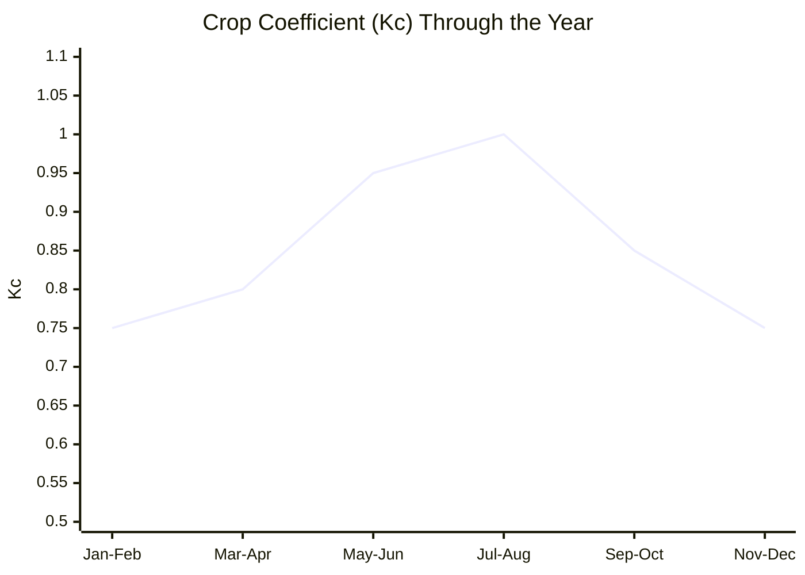

| Period | Stage | Kc | Note |
|---|---|---|---|
| Jan-Feb | Dormancy / pre-flowering | 0.75 | Moderate demand |
| Mar-Apr | Flowering | 0.80 | Increasing |
| May-Jun | Kimri | 0.95 | High demand |
| Jul-Aug | Khalal | 1.00 | Peak (heat + growth) |
| Sep-Oct | Rutab-Tamr | 0.85 | Reducing |
| Nov-Dec | Post-harvest | 0.75 | Recovery |

Annual average Kc: 0.85-0.90

### Irrigation Frequency

| Season | Flood / gravity | Drip irrigation |
|---|---|---|
| Winter (Dec-Feb) | Every 15-20 days | 1-2x per week |
| Spring (Mar-May) | Every 10-12 days | 2-3x per week |
| Summer (Jun-Aug) | Every 7-10 days | 3-4x per week (or daily) |
| Autumn (Sep-Nov) | Every 12-15 days | 2x per week |

**Critical rule:** Do not allow water stress during the Kimri stage (fruit growth). Hydric stress at this stage irreversibly reduces date size.

### Exceptional Salinity Tolerance

The date palm is the **most salt-tolerant fruit crop known**. For comparison, avocado suffers 50% yield loss at EC water = 2 dS/m; the date palm tolerates 8 times more.

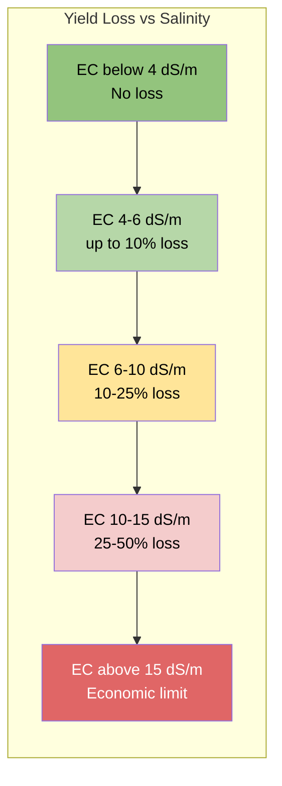

| EC water (dS/m) | Action | Leaching fraction | Note |
|---|---|---|---|
| below 4 | Normal program | Not necessary | Optimal |
| 4-8 | Monitoring | 10-15% | Acceptable |
| 8-12 | Adjustments needed | 15-25% | Slight yield reduction |
| 12-16 | Intensive management | 25-35% | Moderate impact |
| above 16 | Economic limit | above 35% | Not recommended |

### Tolerance Mechanisms

- Partial Na exclusion at root level
- Na compartmentalization in vacuoles
- Synthesis of compatible solutes (proline, sugars)
- Deep root system enabling dilution from lower water table

### Symptoms of Excessive Salt Stress

- Marginal leaf burn (progresses from tip to base)
- Premature yellowing of lower fronds
- Reduced growth of new fronds
- Smaller, less sweet dates
- Apex desiccation (extreme cases)

---

## 8. Phytosanitary Management

### Bayoud Disease -- The Primary Threat

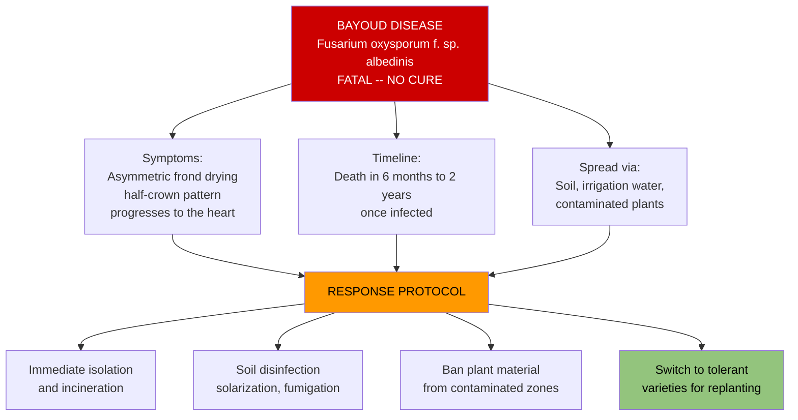

Bayoud has destroyed over **10 million palms** in Morocco and Algeria. There is **no curative treatment**. Prevention is the only strategy.

| Parameter | Detail |
|---|---|
| Causal agent | Fusarium oxysporum f. sp. albedinis |
| Transmission | Soil, irrigation water, contaminated plants |
| Symptoms | Asymmetric frond drying (half-crown), progression toward heart |
| Timeline | Death in 6 months to 2 years |
| Curative treatment | NONE |
| Susceptible varieties | Mejhoul, Boufeggous, Deglet Nour |
| Tolerant varieties | Jihel, Bouslikhene, Iklane, Tadment |

### Other Diseases

| Disease | Agent | Symptoms | Treatment |
|---|---|---|---|
| Khamedj (inflorescence rot) | Mauginiella scaettae | Brown rot of spathes | Copper, hygiene |
| Heart rot | Phytophthora spp. | Terminal bud rot | Drainage, phosphonate |
| Graphiola (false smut) | Graphiola phoenicis | Yellow pustules on fronds | Remove affected fronds |
| Belaat (leaf disease) | Mycosphaerella spp. | Brown spots on leaflets | Copper if severe |

### Pests

| Pest | Damage | Period | Treatment |
|---|---|---|---|
| White scale | Weakening, sooty mold | Year-round | White oil, spirotetramat |
| Boufaroua mite | Date desiccation | Summer | Sulfur, abamectin |
| Date moth | Galleries in fruit | Maturation | Trapping, Bt |
| Red palm weevil | Galleries in stipe | Year-round | Trapping, insecticide injection |
| Apate monachus (bostrichid) | Galleries in rachis | Variable | Remove affected fronds |

**Warning on Red Palm Weevil:** Rhynchophorus ferrugineus is not yet present in Morocco but represents a grave threat. Import surveillance and preventive trapping are strongly recommended.

### Phytosanitary Calendar

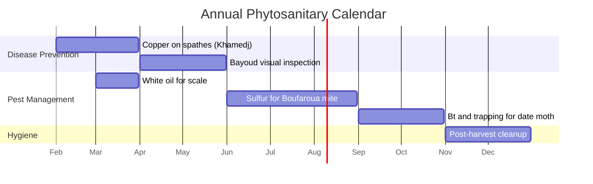

---

## 9. Alert System

All alerts use the prefix **PAL-** followed by a two-digit code.

### Hydric Alerts

| Code | Alert | Entry threshold | Exit threshold | Priority |
|---|---|---|---|---|
| PAL-01 | Water stress | NDMI below P15 (2 passes) + Kimri stage | NDMI above P30 | URGENT |
| PAL-02 | Critical water stress | NDMI below P10 + Kimri-Khalal stage | NDMI above P25 | URGENT |

### Climatic Alerts

| Code | Alert | Entry threshold | Exit threshold | Priority |
|---|---|---|---|---|
| PAL-03 | Frost risk | Tmin forecast below 0 deg C | Tmin above 3 deg C (3 days) | HIGH |
| PAL-04 | Confirmed frost | Tmin below -5 deg C | -- | URGENT |
| PAL-05 | Rain during maturation | Rain above 10 mm + Khalal-Tamr stage | 72h dry | URGENT |
| PAL-06 | Excessive humidity | RH above 70% (3 days) + maturation | RH below 60% | HIGH |
| PAL-07 | Sandstorm (Chergui) | T above 42 + RH below 15% + wind above 40 km/h | Normal conditions | HIGH |

### Sanitary Alerts

| Code | Alert | Entry threshold | Exit threshold | Priority |
|---|---|---|---|---|
| PAL-08 | Bayoud suspicion | Asymmetric frond drying | Negative lab diagnosis | CRITICAL |
| PAL-09 | Bayoud confirmed | Positive lab diagnosis | -- | CRITICAL |
| PAL-10 | Khamedj risk | RH above 80% + flowering | 72h dry | HIGH |
| PAL-11 | Boufaroua pressure | Kimri-Khalal + hot dry summer | Treatment completed | HIGH |
| PAL-12 | Scale insects | Visible presence | Treatment completed | MODERATE |

### Phenological Alerts

| Code | Alert | Entry threshold | Exit threshold | Priority |
|---|---|---|---|---|
| PAL-13 | Pollination required | Female spathes opening | Pollination completed | URGENT |
| PAL-14 | Late pollination | Spathe open more than 5 days | -- | URGENT |
| PAL-15 | Thinning recommended | Load above 15 bunches/tree | Thinning completed | HIGH |
| PAL-16 | Harvest maturity | Rutab stage reached (soft types) | Harvest completed | INFO |

### Structural Alerts

| Code | Alert | Entry threshold | Exit threshold | Priority |
|---|---|---|---|---|
| PAL-17 | Decline | NDVI drop above 20% (4 passes) | Stabilization | URGENT |
| PAL-18 | Dead tree | NDVI below 0.20 persistent | -- | URGENT |
| PAL-19 | Insufficient male ratio | Below 1% males in grove | -- | HIGH |
| PAL-20 | Excessive pruning | Fewer than 30 green fronds/tree | -- | MODERATE |

### Alert Priority Map

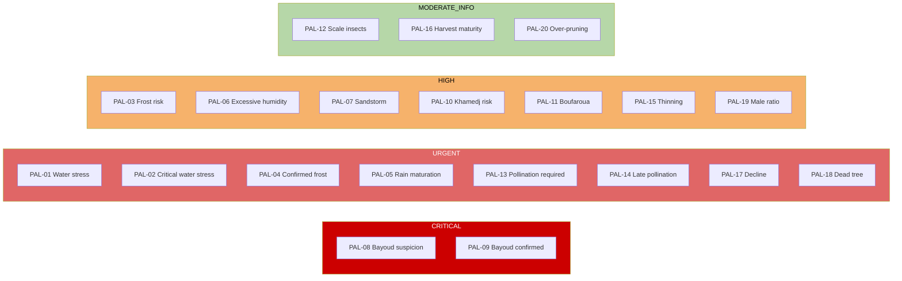

---

## 10. Yield and Quality

### Production by Tree Age

| Age (years) | Stage | Bunches/tree | Yield (kg/tree) | Note |
|---|---|---|---|---|
| 1-4 | Juvenile | 0 | 0 | No production |
| 5-7 | Entry into production | 2-5 | 10-40 | Growing production |
| 8-12 | Young productive | 6-10 | 40-80 | Ramp-up |
| 13-25 | Full production | 10-15 | 80-150 | Maximum |
| 26-50 | Stable production | 10-15 | 70-130 | Plateau |
| 51-80 | Progressive decline | 8-12 | 50-100 | Gradual decrease |
| above 80 | Senescence | below 8 | below 50 | Consider replacement |

### Yield by Variety (full production)

| Variety | Bunches/tree | Bunch weight (kg) | Yield (kg/tree) | Yield (T/ha at 100 trees/ha) |
|---|---|---|---|---|
| Mejhoul | 8-12 | 10-15 | 100-150 | 10-15 |
| Boufeggous | 10-14 | 6-10 | 70-120 | 7-12 |
| Jihel | 10-15 | 6-9 | 70-110 | 7-11 |
| Bouskri | 10-14 | 5-7 | 55-90 | 5.5-9 |
| Khalt (average) | 8-12 | 5-8 | 50-80 | 5-8 |

### Harvest Criteria by Date Type

| Type | Harvest stage | Moisture (%) | Color | Texture |
|---|---|---|---|---|
| Soft (Mejhoul) | Advanced Rutab | 25-35 | Translucent brown | Very tender |
| Semi-soft (Jihel) | Rutab-Tamr | 20-28 | Brown | Tender |
| Dry (Bouslikhene) | Complete Tamr | below 20 | Dark brown | Firm |

### Quality Defects and Prevention

| Defect | Cause | Prevention |
|---|---|---|
| Fermentation | RH above 70%, rain on bunches | Drying, bunch covers |
| Bird damage | No protection | Netting |
| Sunburn | Intense direct exposure | Bunch positioning |
| Small caliber | Water stress, overloading | Irrigation, thinning |
| Low sugar | Early harvest, K deficiency | Proper maturity, K fertilization |
| Excessive wrinkling | Rapid dehydration | Controlled drying conditions |

### Yield-Limiting Factors

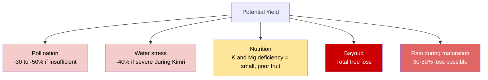

### Predictive Model Accuracy

| System | Expected R-squared | MAE | Conditions |
|---|---|---|---|
| Traditional oasis | 0.25-0.45 | plus/minus 40-55% | Mixed signal, many variables |
| Semi-intensive | 0.40-0.55 | plus/minus 30-45% | Better control |
| Intensive monoculture | 0.50-0.65 | plus/minus 25-35% | Clear signal |

**Major limitation:** The primary error factor is rain during maturation. A single rainfall event can destroy 30-80% of the harvest. This risk is difficult to predict long-term.

---

## 11. Annual Plan Template

### Intensive Mejhoul Calendar (target: 100 kg/tree)

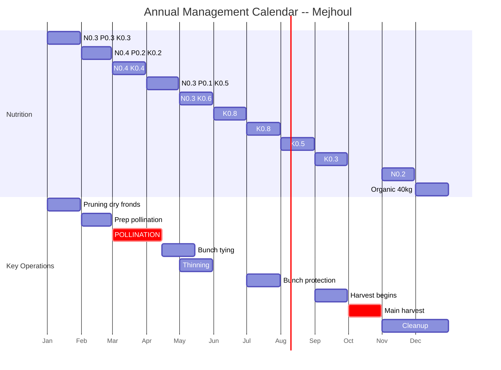

### Monthly Detail

| Month | NPK (kg/tree) | Key operations | Phytosanitary | Irrigation |
|---|---|---|---|---|
| Jan | N:0.3 + P:0.3 + K:0.3 | Prune dry fronds | -- | 1x/15 days |
| Feb | N:0.4 + P:0.2 + K:0.2 | Prepare pollination | Copper on spathes | 1x/12 days |
| Mar | N:0.4 + K:0.4 | **POLLINATION (critical)** | -- | 1x/10 days |
| Apr | N:0.3 + P:0.1 + K:0.5 | Continue pollination, tie bunches | -- | 1x/10 days |
| May | N:0.3 + K:0.6 | Thin bunches (keep 10-12) | -- | 1x/8 days |
| Jun | K:0.8 | Monitor Boufaroua | Sulfur if present | 1x/7 days |
| Jul | K:0.8 | Protect bunches (nets, bags) | Sulfur if needed | 1x/6 days |
| Aug | K:0.5 | Monitor maturation | -- | 1x/7 days |
| Sep | K:0.3 | Begin harvest (Rutab) | -- | 1x/10 days |
| Oct | -- | **Main harvest** | -- | 1x/12 days |
| Nov | N:0.2 | Finish harvest, cleanup | White oil for scale | 1x/15 days |
| Dec | Organic: 40 kg manure | Pruning, maintenance | -- | 1x/20 days |

**Annual totals:** N approx. 2 kg/tree, K2O approx. 4 kg/tree

### Critical Calendar Points

1. **March-April -- POLLINATION:** Do not miss the 3-5 day window after spathe opening
2. **May -- THINNING:** Limit to 10-12 bunches for premium Mejhoul quality
3. **June-August -- WATER MONITORING:** Kimri stage is critical for fruit size
4. **August-October -- WEATHER WATCH:** Monitor rain risk, protect bunches if needed
5. **December -- ORGANIC AMENDMENT:** Essential for oasis soil fertility

### Pruning and Maintenance

| Operation | Period | Frequency | Note |
|---|---|---|---|
| Remove dry fronds | Dec-Feb | Annual | Maintain 30-40 green fronds |
| Remove suckers | Year-round | Ongoing | Unless suckers are desired for propagation |
| Clean stipe | Dec-Jan | Every 2-3 years | Remove old frond bases |
| Tie bunches | Apr-May | After fruit set | Prevent breakage, ease harvest |
| Thin bunches | May | If above 15 bunches | Quality over quantity |

---

## References

**Scientific Publications**

- Allen, R.G., et al. (1998). FAO Irrigation and Drainage Paper 56.
- Ayers, R.S., Westcot, D.W. (1985). Water quality for agriculture. FAO Paper 29.
- Chao, C.T., Krueger, R.R. (2007). The date palm: Overview of biology, uses, and cultivation. HortScience 42(5).
- Djerbi, M. (1988). Les maladies du palmier dattier. FAO, Rome.
- Maas, E.V., Hoffman, G.J. (1977). Crop salt tolerance. J. Irrigation and Drainage Division 103(2).
- Mazahrih, N., et al. (2012). Crop coefficient and water requirement of date palm. Jordan J. Agricultural Sciences 8(3).
- Munier, P. (1973). Le palmier-dattier. Maisonneuve and Larose, Paris.
- Oihabi, A. (1991). Effet du potassium sur le palmier dattier. Al Awamia 72.
- Sedra, M.H. (2003). Le palmier dattier base de la mise en valeur des oasis au Maroc. INRA Editions, Rabat.
- Tripler, E., et al. (2007). Irrigation and fertilization effects on salinity. SSSA Journal 71(5).
- Zaid, A., de Wet, P.F. (2002). Date palm cultivation. FAO Paper 156.

**Institutions**

- ANDZOA -- Agence Nationale pour le Developpement des Zones Oasiennes et de l'Arganier
- MAPM -- Ministere de l'Agriculture et de la Peche Maritime, Maroc
- INRA Maroc -- Institut National de la Recherche Agronomique
- FAO -- Food and Agriculture Organization of the United Nations
