# Olive Tree -- Complete Operational Referential

**Version 4.0 -- February 2026** | Indexed for the SIMO AI Engine

This referential contains all data needed to manage an olive parcel from A to Z: varieties, BBCH phenological stages, satellite thresholds, nutrition options, NPK and microelements, biostimulants, irrigation and salinity, alternance, pruning, phytosanitary, harvest and quality, diagnostics, alerts, predictive model, and annual plan.

---

## 1. Overview -- Olive Cultivation in Morocco

### 1.1 Morocco's Olive Landscape

The olive tree (*Olea europaea* L.) is Morocco's leading tree crop, covering over **1.2 million hectares** with annual production of 1.5 to 2.5 million tonnes (fluctuating due to alternance). The crop is distributed across three main cultivation systems.

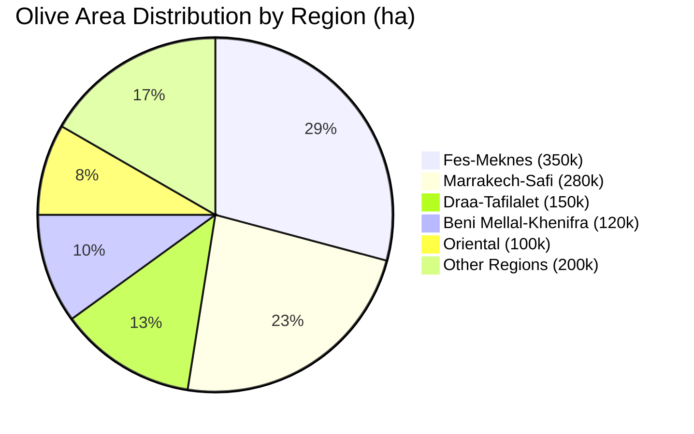

### 1.2 Three Cultivation Systems

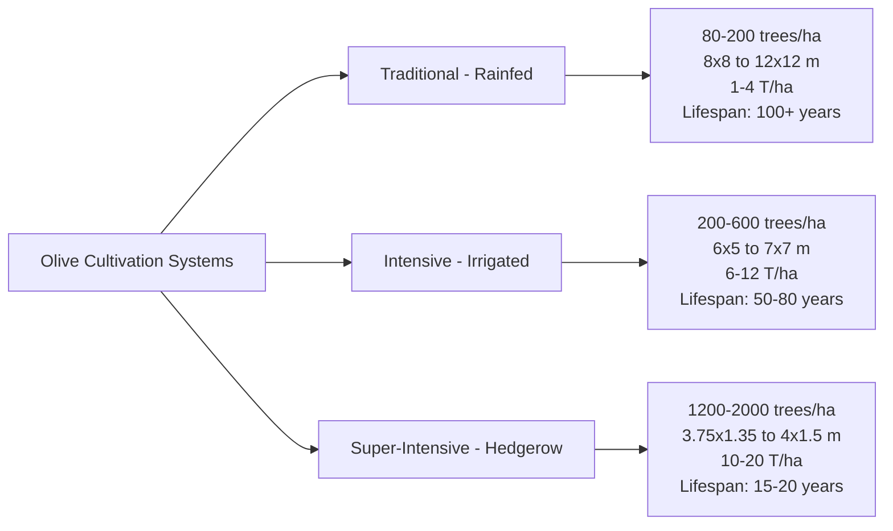

| Parameter | Traditional (Rainfed) | Intensive (Irrigated) | Super-Intensive (Hedgerow) |
|---|---|---|---|
| Density | 80-200 trees/ha | 200-600 trees/ha | 1200-2000 trees/ha |
| Spacing | 8x8 to 12x12 m | 6x5 to 7x7 m | 3.75x1.35 to 4x1.5 m |
| Adapted varieties | PM, Haouzia, Menara | PM, Haouzia, Arbequina | Arbequina, Arbosana, Koroneiki |
| Irrigation | None or supplementary | Drip irrigation | Drip mandatory |
| Harvest | Manual, pole beating | Trunk shaker | Straddle harvester |
| Entry to production | Year 5-7 | Year 4-5 | Year 2-3 |
| Full production | Year 12-20 | Year 7-10 | Year 4-6 |
| Yield at full production | 1-4 T/ha | 6-12 T/ha | 10-20 T/ha |
| Initial investment | Low | Medium | Very high |
| Key satellite index | MSAVI (soil correction) | NIRv | NDVI/EVI |

*Sources: COI, 2018; Tous et al., 2010; Leon et al., 2007*

### 1.3 Climate and Soil Requirements

**Climate parameters:**

| Parameter | Value | Impact |
|---|---|---|
| GDD base temperature (Tbase) | 10 C | Degree-day calculation |
| Optimal growth temperature | 15-30 C | Maximum productivity |
| Moderate heat stress | above 35 C | Reduced photosynthesis |
| Severe heat stress | above 40 C | Stomatal closure, burns |
| Leaf frost threshold | -7 to -12 C | Varies with acclimatization |
| Flower frost threshold | -2 to -3 C | Bloom loss |
| Chilling hours required | 100-400 h below 7.2 C | Varies by variety |
| Minimum rainfall (rainfed) | 350-400 mm/year | Survival without irrigation |

**Soil requirements:**

| Parameter | Optimal | Tolerance | Impact if exceeded |
|---|---|---|---|
| pH | 6.5-8.0 | 5.5-8.5 | Fe, Zn, Mn lockout above 8.2 |
| Active lime | below 10% | Up to 30% | Iron chlorosis above 15% |
| EC soil (saturated extract) | below 2 dS/m | below 4 dS/m | Yield loss above 4 dS/m |
| Texture | Sandy-loam | All except heavy clay | Asphyxia if clay above 50% |
| Organic matter | above 2% | above 1% | Low CEC below 1% |

---

## 2. Variety Comparison

### 2.1 Comparative Overview

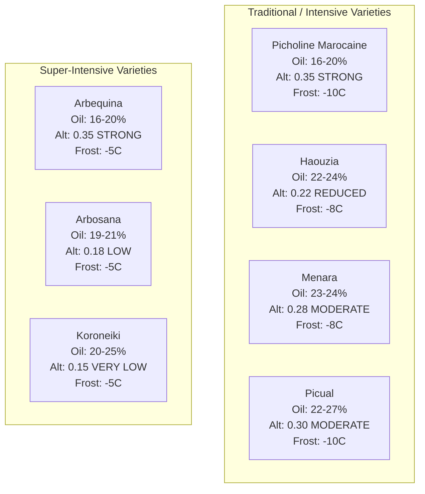

### 2.2 Full Variety Comparison Table

| Variety | Origin | Usage | Fruit (g) | Oil % | Alternance Index | Cold Tolerance | Peacock Eye | Verticillium | Drought | System |
|---|---|---|---|---|---|---|---|---|---|---|
| Picholine Marocaine | Morocco | Dual | 3.5-5.0 | 16-20% | 0.35 (Strong) | Good (-10 C) | Susceptible | Susceptible | Good | Trad/Int |
| Haouzia | INRA Morocco | Dual | 3.5-4.5 | 22-24% | 0.22 (Reduced) | Good (-8 C) | Resistant | Susceptible | Very good | Trad/Int |
| Menara | INRA Morocco | Dual | 2.5-4.0 | 23-24% | 0.28 (Moderate) | Good (-8 C) | Resistant | Susceptible | Very good | Trad/Int |
| Arbequina | Spain | Oil | 1.2-1.8 | 16-20% | 0.35 (Strong) | Weak (-5 C) | Medium | Medium | Medium | Super-int |
| Arbosana | Spain | Oil | 1.5-2.5 | 19-21% | 0.18 (Low) | Weak (-5 C) | Very resistant | Good | Medium | Super-int |
| Koroneiki | Greece | Oil | 0.8-1.5 | 20-25% | 0.15 (V. Low) | Weak (-5 C) | Medium | Medium | Good | Super-int |
| Picual | Spain | Oil | 3.0-4.5 | 22-27% | 0.30 (Moderate) | Good (-10 C) | Susceptible | VERY susceptible | Good | Intensive |

### 2.3 Yield by Variety and Age (kg/tree)

| Variety | System | 3-5 yrs | 6-10 yrs | 11-20 yrs | 21-40 yrs | 40+ yrs |
|---|---|---|---|---|---|---|
| Picholine Marocaine | Traditional | 2-5 | 10-25 | 30-50 | 40-70 | 30-50 |
| Picholine Marocaine | Intensive | 5-10 | 20-40 | 40-60 | 50-70 | 40-55 |
| Haouzia | Intensive | 8-15 | 30-50 | 50-80 | 60-90 | 50-70 |
| Menara | Intensive | 5-12 | 25-45 | 45-65 | 50-70 | 40-55 |
| Arbequina | Super-intensive | 3-6 | 6-10 | 8-12 | Decline | Removal |
| Arbosana | Super-intensive | 4-7 | 7-12 | 10-15 | Decline | Removal |
| Koroneiki | Super-intensive | 3-5 | 5-9 | 7-11 | Decline | Removal |
| Picual | Intensive | 5-12 | 25-45 | 40-60 | 45-65 | 35-50 |

### 2.4 Chilling Hours Requirements

| Variety | Chilling hours required (below 7.2 C) | Consequence if deficit |
|---|---|---|
| Picholine Marocaine | 100-200 h | Heterogeneous flowering |
| Haouzia | 100-150 h | Tolerant to deficit |
| Menara | 100-150 h | Tolerant to deficit |
| Arbequina | 200-400 h | Poor fruit set |
| Arbosana | 200-350 h | Moderate problems |
| Koroneiki | 150-300 h | Moderately tolerant |
| Picual | 400-600 h | Severe problems below 400h |

---

## 3. Phenological Cycle -- BBCH Stages

### 3.1 Annual Cycle Diagram

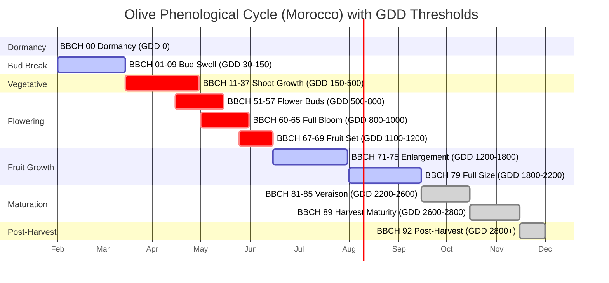

### 3.2 Complete BBCH Scale

| BBCH | Stage | Description | Month (Morocco) | Cumulative GDD | NIRvP Coeff. |
|---|---|---|---|---|---|
| 00 | Dormancy | Closed bud, tight scales | Dec-Jan | 0 | 0.30 |
| 01 | Bud swell start | Bud begins to swell | Feb | 30-50 | 0.30 |
| 09 | Leaves emerging | First leaves visible | Feb-Mar | 80-150 | 0.40 |
| 15 | 5 leaf pairs | Active shoot growth | Mar-Apr | 200-300 | 0.60 |
| 37 | Advanced elongation | Shoot above 10 cm | Apr | 400-500 | 0.60 |
| 51 | Flower buds visible | Inflorescence visible | Apr-May | 500-600 | 0.80 |
| 55 | Separated buds | Individual buds distinct | May | 600-700 | 0.90 |
| 60 | First flowers open | 10% flowers open | May | 800-900 | 1.00 |
| 65 | Full bloom | 50% flowers open | May | 900-1000 | 1.00 |
| 69 | Fruit set | Set fruit visible | Jun | 1100-1200 | 1.00 |
| 75 | Fruit 50% final size | Active enlargement | Jul | 1400-1800 | 1.00 |
| 79 | Fruit final size | End enlargement | Aug-Sep | 1800-2200 | 0.90 |
| 85 | Advanced veraison | 50% fruits colored | Oct | 2400-2600 | 0.80 |
| 89 | Harvest maturity | Physiological maturity | Oct-Nov | 2600-2800 | 0.70 |
| 92 | Post-harvest | End of harvest | Nov-Dec | 2800+ | 0.40 |

### 3.3 Satellite Signals by Phenological Stage

| BBCH Stage | NDVI | NIRv | NDMI | NDRE | Interpretation |
|---|---|---|---|---|---|
| 00-09 (Dormancy) | Stable low | Stable low | Stable | Stable low | Minimal activity |
| 11-37 (Growth) | Progressive rise | Progressive rise | Stable/rise | Progressive rise | Vegetative restart |
| 51-57 (Buds) | Continued rise | Rapid rise | Stable | Strong rise | Bloom preparation |
| 60-65 (Bloom) | Peak or plateau | PEAK MAXIMUM | Stable | Peak | Max photosynthetic activity |
| 67-69 (Fruit set) | Stable high | Stable high | Variable | Stable | Allocation toward fruit |
| 71-79 (Enlargement) | Plateau | Plateau | CRITICAL | Stable/decline | Maximum water demand |
| 81-89 (Maturation) | Slight decline | Progressive decline | Possible decline | Slight decline | Slowdown |
| 92 (Post-harvest) | Stable low | Low | Stable | Low | Recovery |

> **NIRvP usage note:** Cumulative NIRvP from April to September correlates with yield (R-squared = 0.5-0.7). However, it does not capture alternance, pollination quality, or punctual weather events.

---

## 4. Satellite Monitoring Thresholds

> **Critical note:** These thresholds are generic safeguards. Actual parcel thresholds are calculated by IA calibration (P10/P25/P50/P75/P90 percentiles over 12-36 months of history). These values only serve to validate coherence of parcel-level thresholds.

### 4.1 NDVI Thresholds

| Level | Traditional | Intensive | Super-Intensive |
|---|---|---|---|
| Optimal | 0.30-0.50 | 0.40-0.60 | 0.55-0.75 |
| Vigilance | below 0.25 | below 0.35 | below 0.50 |
| Alert | below 0.20 | below 0.30 | below 0.45 |

### 4.2 NIRv Thresholds

| Level | Traditional | Intensive | Super-Intensive |
|---|---|---|---|
| Optimal | 0.05-0.15 | 0.08-0.22 | 0.15-0.35 |
| Vigilance | below 0.04 | below 0.07 | below 0.12 |
| Alert | below 0.03 | below 0.06 | below 0.10 |

### 4.3 NDMI Thresholds (Water Stress Proxy)

| Level | Traditional | Intensive | Super-Intensive |
|---|---|---|---|
| Optimal | 0.05-0.20 | 0.10-0.30 | 0.20-0.40 |
| Vigilance | below 0.04 | below 0.08 | below 0.15 |
| Alert | below 0.03 | below 0.06 | below 0.12 |

### 4.4 NDRE Thresholds (Nitrogen Proxy)

| Level | Traditional | Intensive | Super-Intensive |
|---|---|---|---|
| Optimal | 0.10-0.25 | 0.15-0.30 | 0.20-0.38 |
| Vigilance | below 0.08 | below 0.12 | below 0.17 |
| Alert | below 0.07 | below 0.10 | below 0.15 |

### 4.5 MSI Thresholds (Moisture Stress Index -- higher = drier)

| Level | Traditional | Intensive | Super-Intensive |
|---|---|---|---|
| Optimal | 0.8-1.5 | 0.6-1.2 | 0.4-0.9 |
| Vigilance | above 1.8 | above 1.4 | above 1.1 |
| Alert | above 2.0 | above 1.6 | above 1.3 |

### 4.6 Soil Visibility in Sentinel-2 Pixels

| System | Soil visible % | Recommended index |
|---|---|---|
| Traditional | 60-80% | MSAVI (soil-corrected) |
| Intensive | 40-60% | NIRv |
| Super-Intensive | 20-40% | NDVI/EVI |

---

## 5. Nutrition Program

### 5.1 Nutrition Option Decision Tree

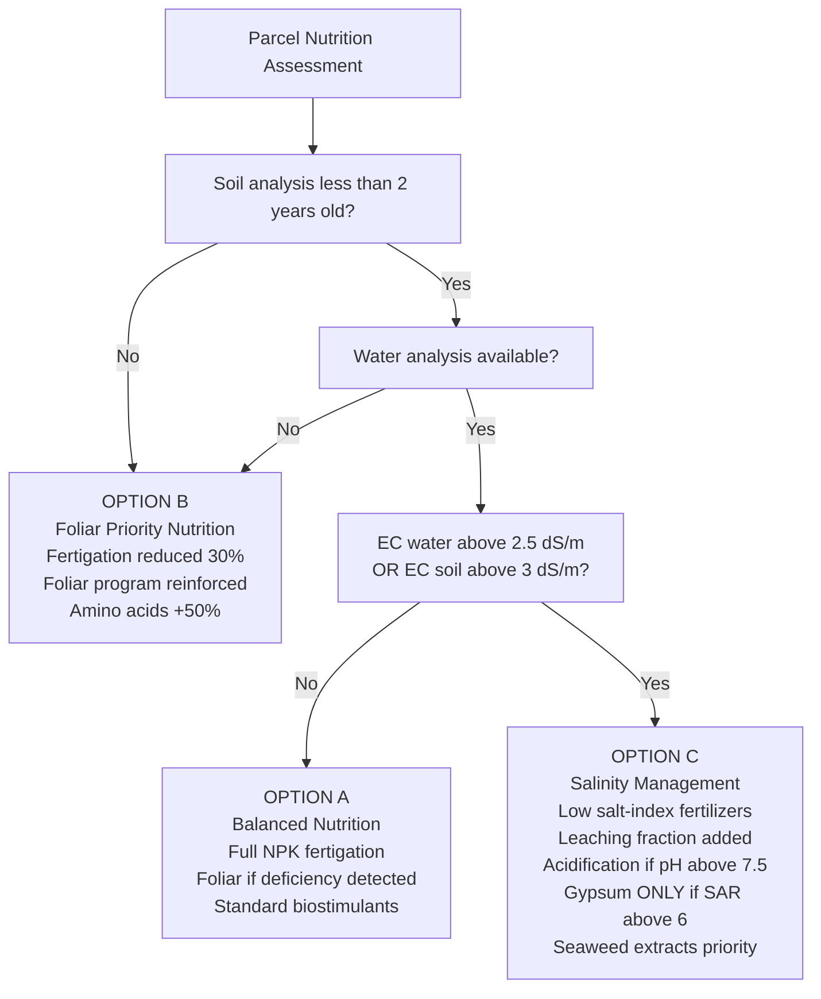

### 5.2 Option Details

| Feature | Option A (Balanced) | Option B (Foliar Priority) | Option C (Salinity) |
|---|---|---|---|
| Condition | Soil analysis under 2 yrs + water analysis | No recent soil analysis (over 3 yrs) | EC water above 2.5 OR EC soil above 3 |
| Fertigation | 100% program | 70% (reduced) | Low salt-index only |
| Foliar | If deficiency detected | REINFORCED program | Standard |
| Humic acids | 100% | 60% | 100% |
| Amino acids | 100% | 150% | 120% |
| Seaweed extracts | 100% | 100% | 150% (priority) |

### 5.3 Nutrient Export Coefficients (kg per tonne of olives)

| Element | Export (kg/T) | Role | Deficiency symptom |
|---|---|---|---|
| N | 3.5 | Vegetative growth, flowering | Pale yellow leaves, small |
| P2O5 | 1.2 | Rooting, fruit set, energy | Purple leaves, few flowers |
| K2O | 6.0 | Fruit enlargement, oil content | Marginal burns, small fruit |
| CaO | 1.5 | Fruit quality, cell wall | Apical necrosis |
| MgO | 2.5 | Photosynthesis (chlorophyll) | Interveinal chlorosis, old leaves |
| S | 0.4 | Proteins, enzymes | Young leaf chlorosis |

### 5.4 Dose Calculation Formula

**Annual dose (kg/ha) = (Target yield x Export) + Maintenance - Soil correction - Water correction**

Maintenance requirements by system:

| System | N (kg/ha) | K2O (kg/ha) | P2O5 (kg/ha) |
|---|---|---|---|
| Traditional rainfed | 15-25 | 15-25 | 10-15 |
| Intensive irrigated | 35-50 | 35-50 | 15-25 |
| Super-intensive | 50-70 | 50-70 | 20-30 |

Water correction for nitrates: N from water (kg/ha) = Irrigation volume (mm) x NO3 concentration (mg/L) x 0.00226

### 5.5 NPK Fractionnement Calendar

```mermaid
graph LR
    subgraph "February-March BBCH 01-15"
        FM["N: 25% | P2O5: 100% | K2O: 15%\nRestart + P base for rooting"]
    end
    subgraph "April BBCH 31-51"
        AV["N: 25% | P2O5: 0% | K2O: 15%\nVegetative growth"]
    end
    subgraph "May BBCH 55-65"
        MA["N: 15% | P2O5: 0% | K2O: 20%\nFlowering, K for fruit set"]
    end
    subgraph "June BBCH 67-71"
        JN["N: 15% | P2O5: 0% | K2O: 25%\nFruit set, early enlargement"]
    end
    subgraph "Jul-Aug BBCH 75-79"
        JA["N: 10% | P2O5: 0% | K2O: 20%\nFruit enlargement"]
    end
    subgraph "Sept BBCH 81-85"
        SE["N: 5% | P2O5: 0% | K2O: 5%\nMaturation, reduce N"]
    end
    subgraph "Oct-Nov BBCH 89-92"
        ON["N: 5% | P2O5: 0% | K2O: 0%\nPost-harvest rebuild"]
    end

    FM --> AV --> MA --> JN --> JA --> SE --> ON
```

### 5.6 Foliar Thresholds (July sampling, non-fruiting shoots)

| Element | Unit | Deficiency | Sufficient | Optimal | Excess |
|---|---|---|---|---|---|
| N | % | below 1.40 | 1.40-1.60 | 1.60-2.00 | above 2.50 |
| P | % | below 0.08 | 0.08-0.10 | 0.10-0.30 | above 0.35 |
| K | % | below 0.40 | 0.40-0.80 | 0.80-1.20 | above 1.50 |
| Ca | % | below 0.50 | 0.50-1.00 | 1.00-2.00 | above 3.00 |
| Mg | % | below 0.08 | 0.08-0.10 | 0.10-0.30 | above 0.50 |
| Fe | ppm | below 40 | 40-60 | 60-150 | above 300 |
| Zn | ppm | below 10 | 10-15 | 15-50 | above 100 |
| Mn | ppm | below 15 | 15-20 | 20-80 | above 200 |
| B | ppm | below 14 | 14-19 | 19-150 | above 200 |
| Cu | ppm | below 4 | 4-6 | 6-15 | above 25 |
| Na | % | -- | -- | below 0.20 | above 0.50 (toxic) |
| Cl | % | -- | -- | below 0.30 | above 0.50 (toxic) |

### 5.7 Fertilizer Compatibility Warning

Never mix in the same tank:
- Calcium nitrate + Phosphate sources (MAP, DAP, H3PO4) -- precipitates calcium phosphate
- Calcium nitrate + Sulfates (MgSO4, SOP) -- precipitates gypsum
- Fe-EDDHA chelate + pH above 7.5 -- chelate degradation

> **Rule for calcareous soil (pH above 7.2):** Urea suffers 50-60% ammonia volatilization losses. Use ONLY nitrate or stabilized ammoniacal forms. KCl is STRICTLY FORBIDDEN on olive trees (chloride toxicity).

---

## 6. Irrigation and Water Management

### 6.1 ETc Formula

**Volume/tree (L/day) = (ETo x Kc x Area/tree x Kr) / Efficiency x (1 + LF)**

Where:
- ETo = Reference evapotranspiration (mm/day) from Open-Meteo
- Kc = Crop coefficient by stage
- Area/tree = Spacing L x W (m2)
- Kr = Reduction coefficient (canopy cover) -- optional
- Efficiency = 0.85-0.95 for drip irrigation
- LF = Leaching fraction (if saline water)

### 6.2 Kc Coefficients by Stage and System

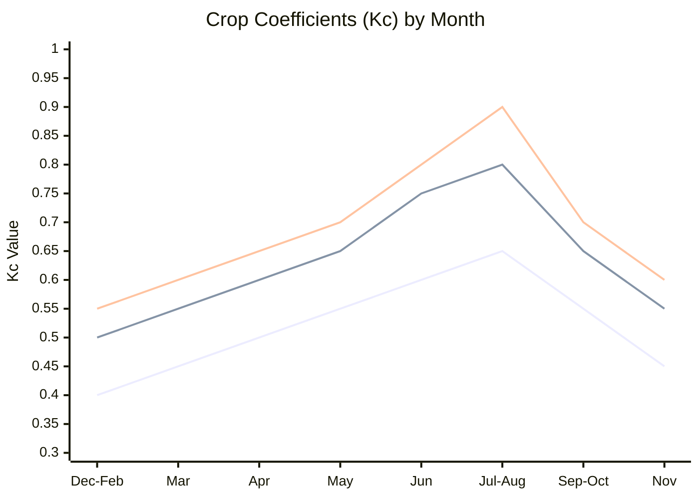

| Stage | Month | Kc Traditional | Kc Intensive | Kc Super-Intensive |
|---|---|---|---|---|
| Winter rest | Dec-Feb | 0.40 | 0.50 | 0.55 |
| Bud break | Mar | 0.45 | 0.55 | 0.60 |
| Vegetative growth | Apr | 0.50 | 0.60 | 0.65 |
| Flowering | May | 0.55 | 0.65 | 0.70 |
| Fruit set | Jun | 0.60 | 0.75 | 0.80 |
| Fruit enlargement | Jul-Aug | 0.65 | 0.80 | 0.90 |
| Maturation | Sep-Oct | 0.55 | 0.65 | 0.70 |
| Post-harvest | Nov | 0.45 | 0.55 | 0.60 |

### 6.3 Salinity Management Flowchart

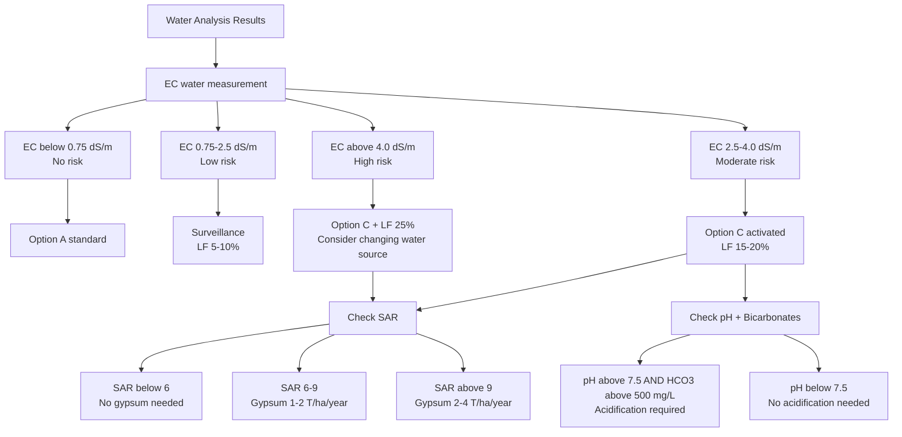

### 6.4 Leaching Fraction Calculation

Formula: LF = EC_water / (5 x EC_soil_threshold - EC_water)

For olive: EC soil threshold = 4 dS/m

| EC water (dS/m) | Leaching fraction | Extra irrigation volume |
|---|---|---|
| 1.5 | 8% | +8% |
| 2.0 | 11% | +11% |
| 2.5 | 14% | +14% |
| 3.0 | 18% | +18% |
| 3.5 | 21% | +21% |
| 4.0 | 25% | +25% |

### 6.5 RDI (Regulated Deficit Irrigation) Strategy

| Stage | Deficit Sensitivity | RDI Possible | Volume Reduction |
|---|---|---|---|
| Flowering | VERY HIGH | NO | 0% |
| Fruit set | HIGH | NO | 0% |
| Enlargement I (Jun-Jul) | HIGH | Caution | 0-15% |
| Enlargement II (Aug) | MODERATE | YES | 20-30% |
| Maturation (Sep) | LOW | YES | 30-40% |
| Pre-harvest (Oct-Nov) | LOW | YES | 40-50% |

> **Warning:** RDI is reserved for parcels with data history and close monitoring (tensiometer or probe). On saline water, RDI is NOT recommended as it concentrates salts in the root zone.

---

## 7. Alternance Management

### 7.1 ON/OFF Year Detection and Dose Adjustment

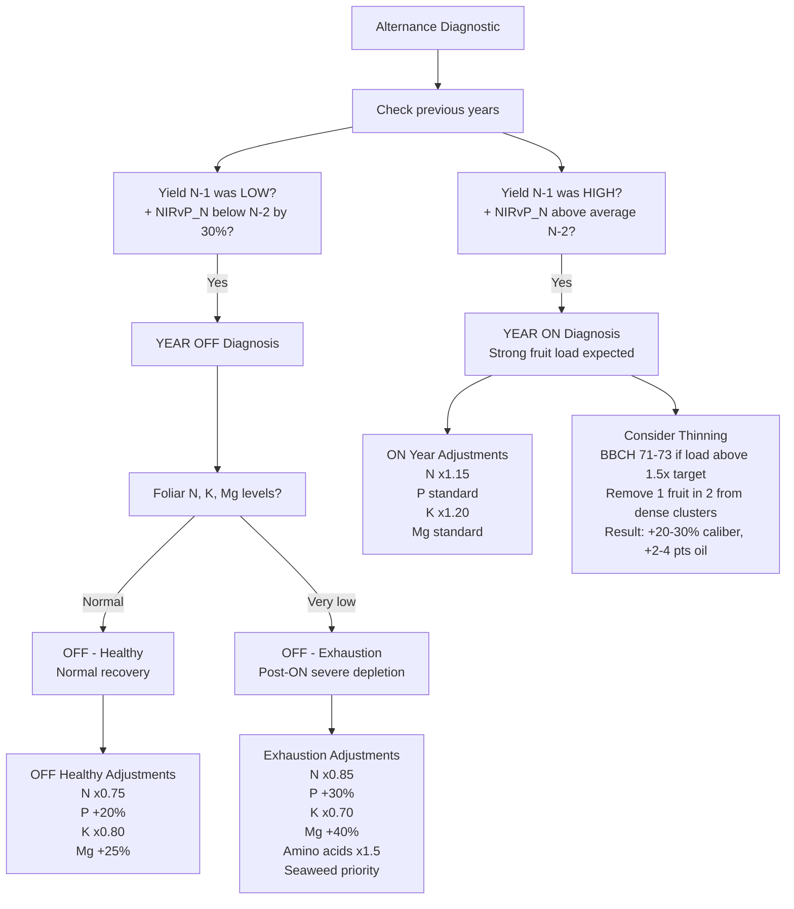

### 7.2 Alternance Index by Variety

| Variety | Alternance Index | Interpretation | Priority Management |
|---|---|---|---|
| Koroneiki | 0.15 | Very low | Standard management |
| Arbosana | 0.18 | Low | Standard management |
| Haouzia | 0.22 | Reduced | Standard management |
| Menara | 0.28 | Moderate | Nutrition attention |
| Picual | 0.30 | Moderate | Nutrition attention |
| Picholine Marocaine | 0.35 | Strong | Thinning ON year, nutrition OFF |
| Arbequina | 0.35 | Strong | Critical thinning |

### 7.3 Satellite-Based Alternance Reading

Inter-annual comparison of NIRvP at the same GDD stage:
- NIRvP_N much above NIRvP_N-1 at same GDD = ON year probable (after OFF)
- NIRvP_N much below NIRvP_N-1 at same GDD = OFF year probable (after ON)
- NIRvP_N approximately equal to NIRvP_N-2 = Normal cycle

Alert OLI-09 triggers when NIRvP_N is below NIRvP_N-2 by more than 30% at the flowering stage.

> **Critical distinction:** A healthy OFF tree responds well to reinforced nutrition. An exhausted tree does not respond -- it must be rebuilt before targeting production.

---

## 8. Phytosanitary Calendar

### 8.1 Annual Disease and Pest Prevention Timeline

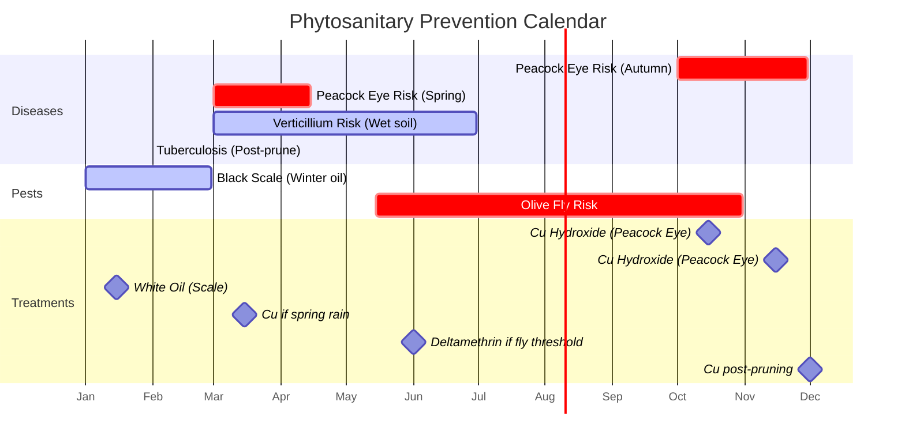

### 8.2 Diseases Reference

| Disease | Agent | Favorable Conditions | Treatment | Prevention |
|---|---|---|---|---|
| Peacock Eye | Spilocaea oleaginea | T 15-20 C, RH above 80%, rain | Cu hydroxide 2-3 kg/ha (DAR 14d) | Resistant varieties (Haouzia, Menara), canopy aeration |
| Verticillium Wilt | Verticillium dahliae | Humid soil, T 20-25 C | NONE -- INCURABLE. Remove affected trees | Certified plants, clean soil, avoid susceptible prior crops |
| Tuberculosis | Pseudomonas savastanoi | Wounds (hail, pruning), humidity | Cu 2-3 kg/ha post-pruning/hail | Tool disinfection between trees |

### 8.3 Pests Reference

| Pest | Agent | Conditions | Threshold | Treatment | Alternative |
|---|---|---|---|---|---|
| Olive Fly | Bactrocera oleae | T 16-28 C, RH above 60% | above 2% stung fruits OR above 5 captures/trap/week | Deltamethrin 0.5 L/ha (DAR 7d) | Mass trapping, kaolin, Spinosad |
| Black Scale | Saissetia oleae | Spring (mobile larvae) | Visual presence | White oil 15-20 L/ha (Jan-Feb, DAR 21d) | -- |

### 8.4 Preventive Treatment Calendar

| Period | Target | Product | Dose | Condition |
|---|---|---|---|---|
| Oct-Nov | Peacock Eye | Cu hydroxide | 2-3 kg/ha | After first autumn rains |
| Jan-Feb | Black Scale | White oil | 15-20 L/ha | No frost, T above 5 C |
| March | Peacock Eye (if risk) | Cu | 2 kg/ha | If spring rains |
| May-June | Olive Fly (if threshold) | Deltamethrin | 0.5 L/ha | Threshold reached |
| Post-pruning | Tuberculosis | Cu | 2-3 kg/ha | Immediately after pruning |

---

## 9. Alert System (OLI-01 to OLI-20)

### 9.1 Complete Alert Table

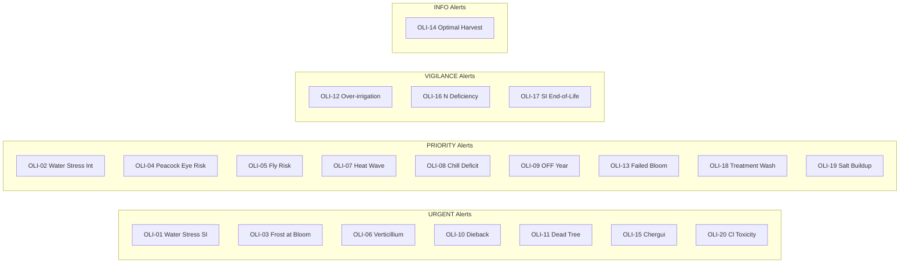

### 9.2 Hydric Alerts

| Code | Alert | Entry Threshold | Exit Threshold | Priority |
|---|---|---|---|---|
| OLI-01 | Water Stress (Super-Intensive) | NDMI below 0.12 AND MSI above 1.3 AND dry above 10d | NDMI above 0.20 (2 passes) | URGENT |
| OLI-02 | Water Stress (Intensive) | NDMI below 0.06 AND MSI above 1.6 AND dry above 15d | NDMI above 0.12 (2 passes) | PRIORITY |
| OLI-12 | Over-irrigation | NDMI above 0.45 AND soil saturated | NDMI below 0.35 | VIGILANCE |

### 9.3 Climatic Alerts

| Code | Alert | Entry Threshold | Exit Threshold | Priority |
|---|---|---|---|---|
| OLI-03 | Frost at Bloom | Tmin below -2 C in BBCH 55-69 | T above 5 C (3 days) | URGENT |
| OLI-07 | Heat Wave | Tmax above 42 C (above 3 days) | Tmax below 38 C (2 days) | PRIORITY |
| OLI-08 | Chill Hour Deficit | Chill hours below 100h by Feb 28 | -- | PRIORITY |
| OLI-15 | Chergui (Hot Wind) | T above 40 AND RH below 20% AND wind above 30 km/h | T below 38 AND RH above 30% | URGENT |

### 9.4 Nutritional and Sanitary Alerts

| Code | Alert | Entry Threshold | Exit Threshold | Priority |
|---|---|---|---|---|
| OLI-04 | Peacock Eye Risk | T 15-20 C AND RH above 80% AND rain | 72h without conditions | PRIORITY |
| OLI-05 | Olive Fly Risk | T 16-28 C AND RH above 60% AND trap captures | T above 35 C (3d) OR harvest | PRIORITY |
| OLI-06 | Verticillium Suspected | NIRv asymmetric progressive decline | Irreversible | URGENT |
| OLI-16 | N Deficiency | NDRE below P10 AND GCI decline | NDRE above P30 (2 passes) | VIGILANCE |
| OLI-18 | Treatment Washoff | Rain within 6h post-application | -- | PRIORITY |

### 9.5 Phenological and Structural Alerts

| Code | Alert | Entry Threshold | Exit Threshold | Priority |
|---|---|---|---|---|
| OLI-09 | OFF Year Probable | NIRvP much below N-2 (-30%) at bloom | -- | PRIORITY |
| OLI-10 | Dieback | NIRv decline above 25% (3 passes) | NIRv stabilized (2 passes) | URGENT |
| OLI-11 | Dead Tree | NIRv below min threshold, persistent | -- | URGENT |
| OLI-13 | Failed Bloom | NIRvP peak below 70% expected AND bad weather | -- | PRIORITY |
| OLI-14 | Optimal Harvest | NIRvP decline AND NDVI stable AND GDD above 2800 | Harvest declared | INFO |
| OLI-17 | SI End-of-Life | NIRv decline 2 consecutive seasons | -- | VIGILANCE |

### 9.6 Salinity Alerts

| Code | Alert | Entry Threshold | Exit Threshold | Priority |
|---|---|---|---|---|
| OLI-19 | Salt Accumulation | EC soil above 4 dS/m | EC soil below 3 dS/m | PRIORITY |
| OLI-20 | Cl Toxicity | Cl foliar above 0.5% AND leaf burns | Cl below 0.3% | URGENT |

---

## 10. Yield Prediction Model

### 10.1 Predictive Variables and Weights

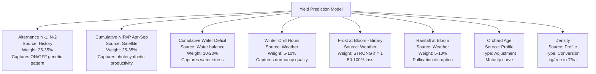

### 10.2 NIRvP: What It Detects vs. What It Misses

| NIRvP Detects | NIRvP Does NOT Detect |
|---|---|
| Overall vegetative vigor | Pollination quality |
| Photosynthetic capacity | Actual fruit set rate |
| Severe stress (if prolonged) | Early root problems |
| Post-intervention recovery | Fruit count (load) |
| Inter-annual trend | Fruit caliber |

> **Fundamental limitation:** A high NIRvP means the tree has the CAPACITY to produce. It does NOT guarantee production, since flowering and fruit set depend on other factors (weather, pollination, alternance).

### 10.3 Expected Precision

| System | R-squared | Mean Absolute Error | Conditions |
|---|---|---|---|
| Traditional rainfed | 0.40-0.60 | +/- 30-40% | Strong alternance, few levers |
| Intensive irrigated | 0.50-0.70 | +/- 20-30% | More control |
| Super-intensive | 0.60-0.80 | +/- 15-25% | Homogeneous, more predictable |

### 10.4 Prediction Timing and Precision

| Moment | BBCH Stage | Precision | Usage |
|---|---|---|---|
| Post-bloom | BBCH 67-69 | +/- 40% | First trend |
| Post-fruit set | BBCH 71 | +/- 25% | Refined estimate |
| Pre-harvest | BBCH 85 | +/- 15-20% | Final estimate |

**Conditions required for prediction:**
- Calibration validated with confidence at least 50%
- At least 1 complete cycle in history
- Season weather data available
- Phenological stage past bloom

> **Mandatory formulation:** Every prediction must be stated as a RANGE, never a single value, with mention of error margin and conditions.

---

## 11. Annual Plan Template

### 11.1 Plan Components

After calibration validation, the AI generates a complete annual plan covering all aspects of orchard management. The plan is then tracked throughout the season -- recommendations ADJUST the plan, they do not replace it.

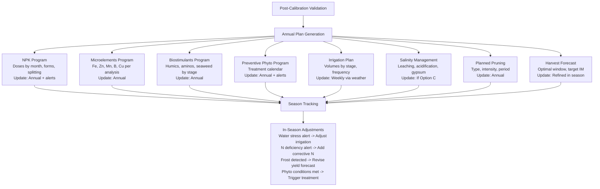

### 11.2 Monthly Calendar -- Intensive System, 10 T/ha Target

| Month | NPK | Microelements | Biostimulants | Phyto | Irrigation |
|---|---|---|---|---|---|
| Jan | -- | -- | -- | White oil (scale) | Low |
| Feb | TSP base + 1st N | Fe-EDDHA | Humics + Aminos | -- | Restart |
| Mar | 2nd N | Zn + Mn foliar | Seaweed | Cu if pruning | Progressive |
| Apr | 3rd N + K | -- | -- | Cu if rain | Increasing |
| May | K | B at bloom | Seaweed + Aminos | Fly if threshold | Increasing |
| Jun | K + N | Fe-EDDHA | Humics | -- | Maximum |
| Jul | K | -- | Seaweed | Fly if threshold | Maximum |
| Aug | K (last) | -- | -- | -- | Maximum / RDI |
| Sep | -- | -- | Humics | -- | Reduction |
| Oct | -- | -- | -- | Cu peacock eye | Reduction |
| Nov | N (rebuild) | -- | Humics granulated | Cu peacock eye | Low |
| Dec | -- | -- | Aminos post-harvest | -- | Very low |

### 11.3 Biostimulant Annual Calendar

| Period | BBCH | Humic Acids | Fulvic Acids | Amino Acids | Seaweed Extracts |
|---|---|---|---|---|---|
| Nov-Dec | Post-harvest | 25 kg/ha granulated | -- | 6 L/ha fertigation | -- |
| Feb-Mar | 00-15 | 4 L/ha fertigation | 1.5 L/ha + Fe | 4 L/ha foliar | 3 L/ha |
| Apr-May | 51-65 | -- | -- | 4 L/ha foliar | 3 L/ha at bloom |
| May-Jun | 69-75 | 4 L/ha fertigation | 1.5 L/ha + Fe | -- | -- |
| July | 75 | -- | -- | -- | 3 L/ha stress |
| Aug-Sep | 79-89 | 3 L/ha fertigation | -- | -- | -- |

---

## Appendix -- Spectral Diagnostic Scenarios

### Differential Diagnosis Matrix

| Scenario | NDVI | NIRv | NDRE | NDMI | Probable Diagnosis |
|---|---|---|---|---|---|
| A | Decline | Decline | Decline | Decline | Severe generalized stress (hydric + nutritional) |
| B | Decline | Decline | Normal | Normal | Low coverage / visible soil |
| C | Normal | Normal | Decline | Normal | Beginning N deficiency |
| D | Normal | Normal | Normal | Decline | Beginning water stress |
| E | Rise | Rise | Rise | Normal | Healthy, well-fed vegetation |
| F | Rise | Decline | Decline | Normal | Strong biomass but chlorosis |
| G | Normal | Decline | Normal | Normal | Reduced productivity despite vigor |
| H | Variable | Variable | Variable | Variable | Localized problem (outbreak) |
| I | Sharp drop | Sharp drop | Decline | Decline | Punctual event (frost, hail, disease) |

> **Fundamental rule:** A single satellite signal can have multiple causes. The AI must always establish a DIFFERENTIAL diagnosis with main hypothesis + alternatives, never a single affirmed cause. Always cross at least 2 spectral indices + 1 contextual factor.

---

## References

**Scientific publications:** Allen et al. (1998) FAO 56; Barranco et al. (2017); Chartzoulakis (2005); Fernandez (2014); Fernandez-Escobar (2017); Ferrara et al. (2018); Gonzalez-Dugo et al. (2013); Gucci and Tattini (1997); Lavee (2007); Maas and Hoffman (1977); Moriana et al. (2003); Orgaz et al. (2006); Rallo et al. (1994); Sanz-Cortes et al. (2002); Trapero et al. (2015).

**Institutions:** COI (International Olive Council), FAO, INRA Morocco, ONSSA Morocco, Open-Meteo.

**Local data:** INRA Meknes experimental stations 2015-2024; Domaine Zniber field data; Plan Maroc Vert national statistics.

*-- End of Olive Tree Operational Referential v4.0 --*
