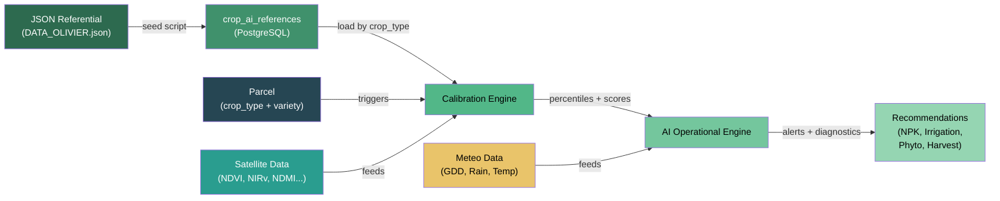
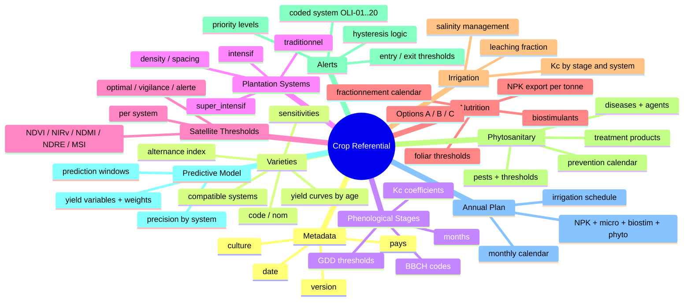
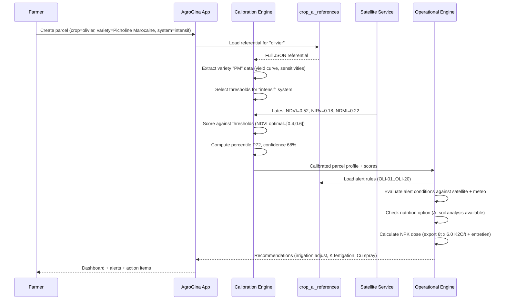
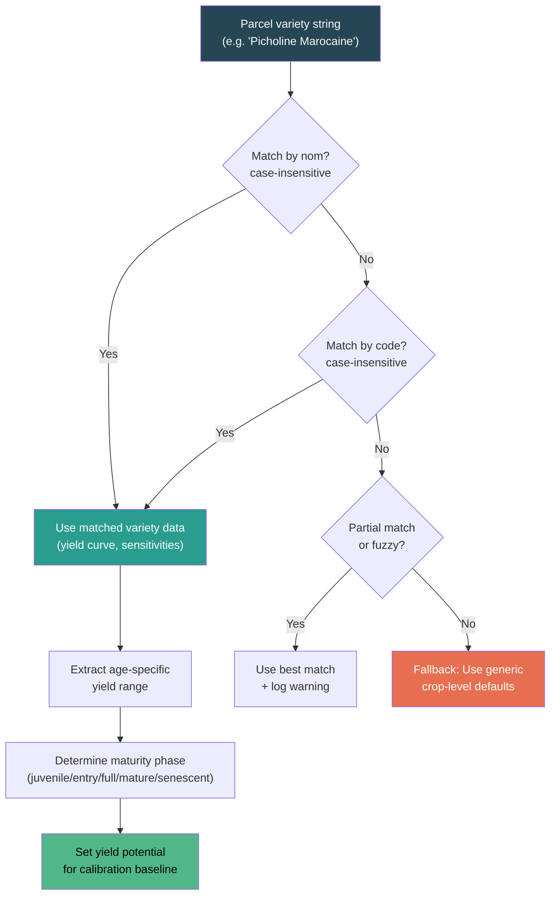
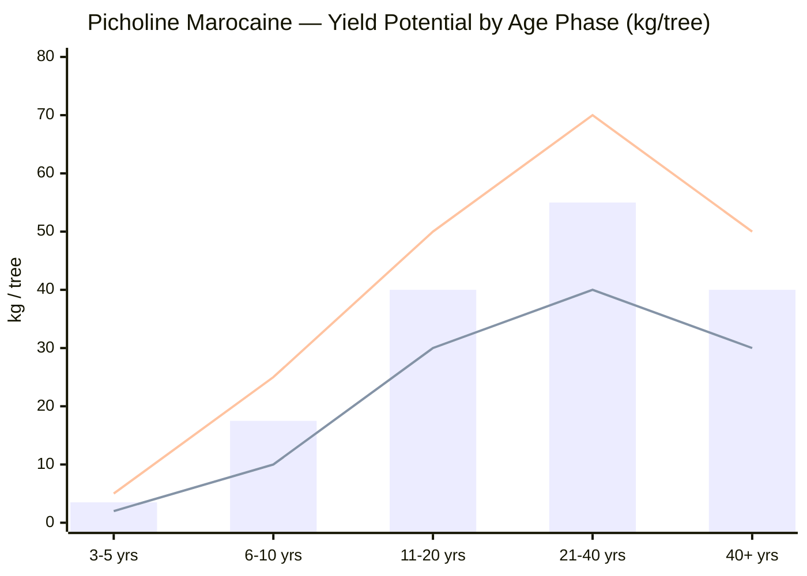
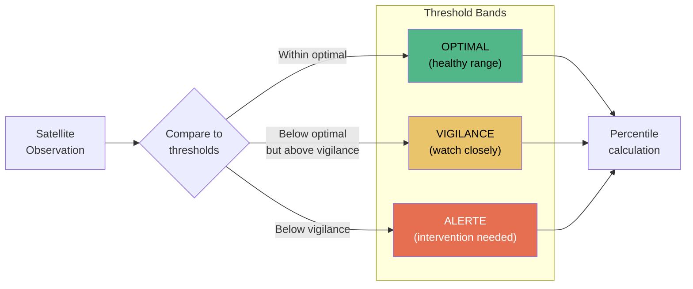
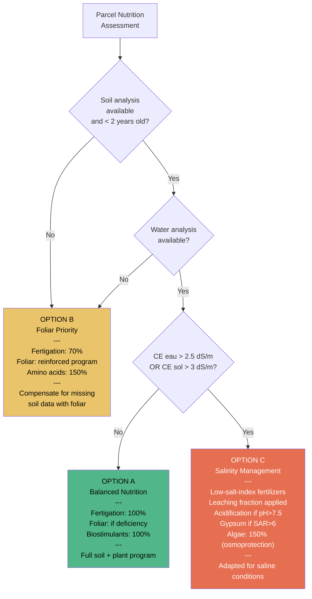
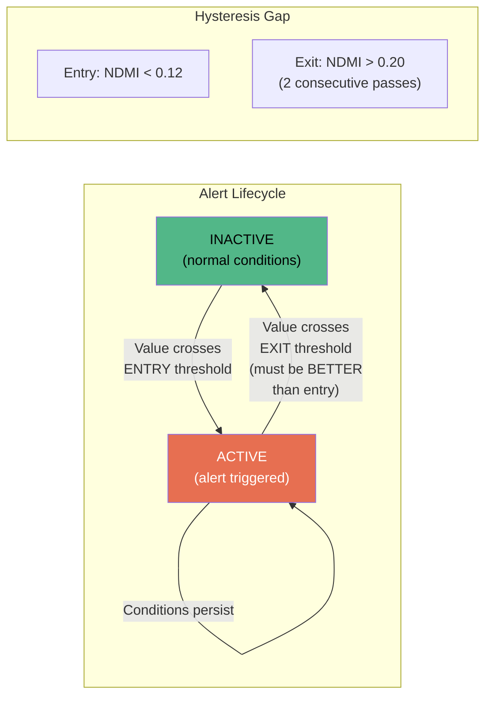
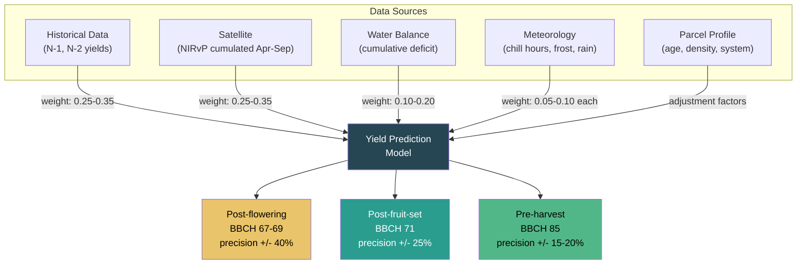

# Crop Referentials — The Agronomic Knowledge Base

## What Are Crop Referentials?

Crop referentials are **machine-readable JSON files** that encode decades of field research, agronomic expertise, and regional best practices into a structured format that powers the AgroGina AI engine. Each referential file (`DATA_<crop_type>.json`) represents the complete agronomic knowledge for a single crop, covering everything from variety characteristics and phenological stages to satellite index thresholds, nutrition programs, pest management calendars, and yield prediction models.

These referentials are not simple lookup tables. They are **decision-support knowledge bases** designed by agronomists, calibrated with satellite remote sensing data, and continuously refined through field validation. They serve three critical purposes:

1. **Calibration** — When a parcel is onboarded, the referential provides the baseline parameters (yield curves, vegetation index thresholds, nutrient requirements) against which satellite observations are compared.
2. **Diagnostics** — The alert system uses coded rules with entry/exit thresholds (hysteresis) to detect stress conditions, disease risk windows, and management issues in near-real-time.
3. **Recommendations** — The operational engine draws on nutrition programs, phytosanitary calendars, and irrigation coefficients to generate actionable, parcel-specific recommendations.

Each JSON file is authored and maintained by agronomists with deep regional expertise (Morocco-focused), then seeded into the database where the AI pipeline consumes it.

---

## Architecture: From JSON to Recommendation

The following diagram shows how a crop referential flows from its source JSON file through the system to produce actionable recommendations for the farmer.



**Flow summary:**

1. Agronomists author/update `DATA_<crop_type>.json` files in the `referentials/` directory.
2. The **seed script** (`pnpm exec ts-node scripts/seed-ai-references.ts`) discovers all `DATA_*.json` files and upserts them into the `crop_ai_references` table.
3. When a farmer creates a parcel and selects a crop type + variety, the **Calibration Engine** loads the matching referential.
4. The engine extracts variety-specific yield curves, satellite thresholds for the plantation system, and phenological stage data.
5. Satellite observations are scored against referential thresholds to compute percentiles and confidence scores.
6. The **AI Operational Engine** uses alert codes, diagnostic scenarios, and nutrition formulas to produce recommendations.

---

## Data Model Overview

Every crop referential follows a common structural pattern, though specific sections vary by crop biology. The diagram below shows the top-level architecture shared across all referential files.



---

## Supported Crops

| Crop | Scientific Name | JSON File | Version | Varieties | Key Sections |
|------|----------------|-----------|---------|-----------|--------------|
| Olive | *Olea europaea* | `DATA_OLIVIER.json` | 4.0 | 7 (PM, HAO, MEN, ARB, ARS, KOR, PIC) | 3 systems, 20 alerts, BBCH stages, Kc, alternance model |
| Citrus | *Citrus* spp. | `DATA_AGRUMES.json` | 1.0 | 21 (oranges, clementines, lemons, pomelos) | 4 species, 6 rootstocks, rootstock selection guide |
| Avocado | *Persea americana* Mill. | `DATA_AVOCATIER.json` | 1.0 | 8 (Hass, Fuerte, Bacon...) | Floral types A/B, maturity indices, cold sensitivity |
| Date Palm | *Phoenix dactylifera* L. | `DATA_PALMIER_DATTIER.json` | 1.0 | 5 (Mejhoul, Boufeggous, Najda...) | Pollination guide, salinity tolerance, maturity stages |

**File naming convention:** `DATA_<CROP_TYPE>.json` where `<CROP_TYPE>` matches `metadata.culture` in uppercase (e.g., `olivier` maps to `DATA_OLIVIER.json`).

---

## How Referentials Feed the AI Pipeline

The sequence below shows the full lifecycle from parcel creation to actionable recommendations.



---

## Variety Selection Logic

When a parcel is calibrated, the system must match the farmer's declared variety to the referential data. The following diagram shows the matching logic.



**Important:** Ensure that the variety stored on the parcel matches one of the `varietes[].nom` or `varietes[].code` values in the referential. Mismatched varieties will fall back to generic defaults, reducing calibration accuracy.

---

## Yield Curve Concept

Each variety defines a **yield curve** — the expected production range (kg per tree) across the tree's life phases. This curve is the foundation for calibration: the AI engine uses it to set the baseline yield potential for a given parcel age.

Here is the yield curve for **Picholine Marocaine** (olive), the most widely planted variety in Morocco:



**Reading the chart:**
- The **bar** shows the midpoint yield potential.
- The **lower line** represents the minimum expected yield (e.g., rainfed, poor soil, OFF year).
- The **upper line** represents the maximum expected yield (e.g., irrigated, good soil, ON year).
- **Juvenile phase** (3-5 years): Low yield, trees establishing. Calibration focuses on vegetative vigor.
- **Entry production** (6-10 years): Rapidly increasing yield. High sensitivity to management.
- **Full production** (11-20 years): Peak yield window. Alternance effects are most visible.
- **Mature** (21-40 years): Stable but slightly declining peak. Management maintains yield.
- **Senescent** (40+ years): Declining yield. For super-intensive varieties like Arbequina, this phase may be marked as `"declin"` or `"arrachage"` (uprooting) rather than a numeric range.

---

## Satellite Threshold System

Satellite vegetation indices are the primary data source for remote parcel monitoring. Each referential defines **threshold bands per plantation system** because canopy density fundamentally changes what "healthy" looks like from space.

### Why Thresholds Vary by System

| System | Density (trees/ha) | Canopy Cover | Key Index | NDVI Optimal Range |
|--------|-------------------|-------------|-----------|-------------------|
| Traditional | 80-200 | 20-40% | MSAVI | 0.30-0.50 |
| Intensive | 200-600 | 40-60% | NIRv | 0.40-0.60 |
| Super-intensive | 1200-2000 | 60-80% | NDVI | 0.55-0.75 |

A traditional orchard with widely spaced trees and bare soil between rows will have a naturally lower NDVI than a super-intensive hedge plantation. Applying the same threshold to both would generate false positives for the traditional system and miss stress in the super-intensive system.

### Threshold Levels

Each index has three threshold levels per system:



**Example (Olive, Intensive, NDVI):**
- Optimal: 0.40-0.60 (healthy vegetation)
- Vigilance: below 0.35 (early stress signal)
- Alerte: below 0.30 (confirmed stress, action required)

### Indices Used

| Index | Full Name | Measures | Primary Use |
|-------|-----------|----------|-------------|
| NDVI | Normalized Difference Vegetation Index | Overall greenness/vigor | General health, dense canopies |
| NIRv | Near-Infrared Reflectance of Vegetation | Photosynthetic capacity | Intensive systems, yield proxy |
| NDMI | Normalized Difference Moisture Index | Canopy water content | Water stress detection |
| NDRE | Normalized Difference Red Edge | Chlorophyll/nitrogen content | Nutrient status |
| MSI | Moisture Stress Index | Leaf water stress | Drought monitoring |
| MSAVI | Modified Soil-Adjusted Vegetation Index | Vegetation with soil correction | Sparse canopy (traditional) |

---

## Nutrition Option System

The referential encodes three nutrition strategies (Options A, B, C) that the AI engine selects based on the farmer's available data and soil/water conditions.



**Option A** is the ideal scenario where complete soil and water analyses allow precise fertigation. **Option B** compensates for missing soil data by shifting emphasis to foliar feeding, which bypasses root-zone unknowns. **Option C** activates when salinity is detected, fundamentally changing the fertilizer selection (low salt index products), adding leaching fractions, and boosting algae-based biostimulants for osmoprotection.

### NPK Calculation Flow

The total nutrient dose combines **export** (nutrients removed by the harvested crop) and **maintenance** (tree and soil requirements):

```
Total N = (Expected yield in T/ha x Export N per T) + Maintenance N for system
        = (8 T/ha x 3.5 kg N/T) + 42.5 kg N/ha
        = 28 + 42.5 = 70.5 kg N/ha
```

This dose is then **fractionated** across the season according to phenological stages (e.g., 25% N at bud break, 25% at shoot growth, 15% at flowering, etc.) and **adjusted** for alternance (ON year: +15% N, +20% K; OFF year: -25% N, +20% P).

---

## Alert Code System

Each crop referential defines a set of **coded alerts** that form a rule-based diagnostic system. Alerts use the **hysteresis pattern** — separate entry and exit thresholds — to prevent oscillation (flickering on/off) when values hover near a boundary.

### Alert Architecture



The gap between entry (0.12) and exit (0.20) prevents the alert from toggling on and off with minor fluctuations. Additionally, many exit conditions require **confirmation over multiple satellite passes** (e.g., "2 passages") to ensure the recovery is genuine.

### Alert Code Naming Convention

Alert codes follow the pattern `<CROP>-<NN>`:

| Code Range | Crop | Example Alerts |
|-----------|------|---------------|
| OLI-01 to OLI-20 | Olive | OLI-01: Water stress (super-intensive), OLI-05: Olive fly risk, OLI-09: OFF year probable |
| AGR-01 to AGR-NN | Citrus | Water stress, frost risk, Tristeza alert |
| AVO-01 to AVO-NN | Avocado | Phytophthora risk, heat stress, salt toxicity |
| PAL-01 to PAL-NN | Date Palm | Bayoud disease, heat excess, pollination window |

### Priority Levels

| Priority | Meaning | Response Time |
|----------|---------|--------------|
| `urgente` | Immediate threat to crop survival or major yield loss | Same day |
| `prioritaire` | Significant risk requiring action within the current week | 2-3 days |
| `vigilance` | Developing situation to monitor closely | Next scheduled visit |
| `info` | Informational (e.g., optimal harvest window) | Advisory |

### Example: Olive Alert Catalog (OLI-01 to OLI-20)

| Code | Name | Entry Condition | Exit Condition | Priority |
|------|------|----------------|----------------|----------|
| OLI-01 | Water stress (SI) | NDMI < 0.12 AND MSI > 1.3 AND dry > 10d | NDMI > 0.20 (2 passes) | urgente |
| OLI-03 | Frost at flowering | Tmin < -2 AND BBCH 55-69 | T > 5 (3 days) | urgente |
| OLI-04 | Peacock eye risk | T 15-20 AND HR > 80% AND rain | 72h without conditions | prioritaire |
| OLI-05 | Olive fly risk | T 16-28 AND HR > 60% AND captures | T > 35 (3d) OR harvest | prioritaire |
| OLI-09 | OFF year probable | NIRvP << N-2 (-30%) at flowering | -- | prioritaire |
| OLI-14 | Optimal harvest | NIRvP decline AND NDVI stable AND GDD > 2800 | Harvest declared | info |
| OLI-15 | Chergui (hot wind) | T > 40 AND HR < 20% AND wind > 30 | T < 38 AND HR > 30% | urgente |
| OLI-19 | Salt accumulation | CE_sol > 4 | CE_sol < 3 | prioritaire |

---

## Predictive Model Variables

The referential defines the variables and their weights used by the yield forecasting model. The olive predictive model illustrates the multi-source approach:



The model's expected precision varies by plantation system:

| System | R-squared | Mean Absolute Error |
|--------|-----------|-------------------|
| Traditional | 0.40-0.60 | 30-40% |
| Intensive | 0.50-0.70 | 20-30% |
| Super-intensive | 0.60-0.80 | 15-25% |

Super-intensive systems are more predictable because they are more uniform, fully irrigated, and have denser satellite signal (more canopy per pixel).

---

## Adding a New Crop

To add a new crop referential to the system, follow these steps.

### Step 1: Create the JSON File

Create `referentials/DATA_<CROP_TYPE>.json` with the following required structure:

```json
{
  "metadata": {
    "version": "1.0",
    "date": "2026-03",
    "culture": "crop_type_lowercase",
    "nom_scientifique": "Genus species",
    "pays": "Maroc"
  },
  "varietes": [
    {
      "code": "VAR1",
      "nom": "Variety Name",
      "rendement_kg_arbre": {
        "3-5_ans": [min, max],
        "6-10_ans": [min, max],
        "11-20_ans": [min, max],
        "21-40_ans": [min, max],
        "plus_40_ans": [min, max]
      }
    }
  ],
  "systemes": {
    "traditionnel": { "densite_arbres_ha": [min, max] },
    "intensif": { "densite_arbres_ha": [min, max] }
  },
  "seuils_satellite": {
    "traditionnel": {
      "NDVI": { "optimal": [low, high], "vigilance": val, "alerte": val },
      "NIRv": { "optimal": [low, high], "vigilance": val, "alerte": val },
      "NDMI": { "optimal": [low, high], "vigilance": val, "alerte": val }
    }
  },
  "options_nutrition": {
    "A": { "nom": "...", "condition": "...", "fertigation": "100%" },
    "B": { "nom": "...", "condition": "...", "fertigation": "70%" },
    "C": { "nom": "...", "condition": "...", "fertigation": "adapted" }
  },
  "export_kg_tonne": { "N": 0, "P2O5": 0, "K2O": 0 },
  "alertes": [
    {
      "code": "CRP-01",
      "nom": "Alert name",
      "seuil_entree": "condition",
      "seuil_sortie": "condition",
      "priorite": "urgente|prioritaire|vigilance|info",
      "systeme": "tous|intensif|super_intensif"
    }
  ],
  "modele_predictif": {
    "variables": [],
    "precision_attendue": {}
  },
  "plan_annuel": {
    "composantes": []
  }
}
```

### Step 2: Validate the Data

Ensure that:
- `metadata.culture` matches the filename (e.g., `grenadier` for `DATA_GRENADIER.json`).
- Every variety has `nom`, `code`, and `rendement_kg_arbre` with age brackets.
- Satellite thresholds are defined for each plantation system present in `systemes`.
- Alert codes follow the `<CROP_PREFIX>-<NN>` convention.
- NPK export values are in kg per tonne of harvested product.

### Step 3: Seed the Database

```bash
# Preview what will be inserted (dry run)
pnpm exec ts-node scripts/seed-ai-references.ts --dry-run

# Actually seed
pnpm exec ts-node scripts/seed-ai-references.ts
```

The seed script automatically discovers all `DATA_*.json` files in the `referentials/` directory and upserts them into the `crop_ai_references` table. Existing entries for the same `crop_type` are updated; new entries are inserted.

### Step 4: Register Crop in the Application

After seeding, ensure the crop type is available in the parcel creation form by adding it to the crop type enum/list in the application configuration.


---

## Section Reference

The table below lists every section found across the four crop referentials, indicating which crops include each section.

| Section | Olive | Citrus | Avocado | Date Palm | Description |
|---------|:-----:|:------:|:-------:|:---------:|-------------|
| `metadata` | x | x | x | x | Version, culture, date, country |
| `varietes` | x | x | x | x | Variety catalog with yield curves |
| `especes` | | x | | | Species breakdown (oranges, lemons...) |
| `porte_greffes` | | x | | | Rootstock catalog and selection guide |
| `systemes` | x | x | x | x | Plantation system definitions |
| `seuils_satellite` | x | x | x | x | Vegetation index thresholds per system |
| `stades_bbch` / `stades_phenologiques` | x | x | x | | BBCH phenological stage calendar |
| `kc` | x | x | x | x | Crop coefficients by stage and system |
| `options_nutrition` | x | x | x | x | Nutrition strategy A/B/C |
| `export_kg_tonne` | x | x | x | x | Nutrient removal per tonne harvested |
| `entretien_kg_ha` | x | x | x | | Maintenance fertilization by system |
| `fractionnement_pct` | x | x | x | | Seasonal NPK fractionation schedule |
| `seuils_foliaires` | x | x | x | x | Leaf analysis interpretation thresholds |
| `seuils_eau` / `salinite` | x | x | x | x | Water quality thresholds |
| `biostimulants` | x | | x | | Biostimulant products and calendars |
| `alertes` | x | x | x | x | Coded alert rules with hysteresis |
| `phytosanitaire` | x | x | x | x | Disease/pest catalog and treatments |
| `calendrier_phyto` | x | x | x | | Preventive phytosanitary calendar |
| `modele_predictif` | x | x | x | x | Yield prediction variables and weights |
| `plan_annuel` | x | x | x | x | Annual management plan template |
| `ajustement_alternance` | x | | | | Alternance year NPK adjustments |
| `ajustement_cible` | x | x | | | Target-specific adjustments (oil/table) |
