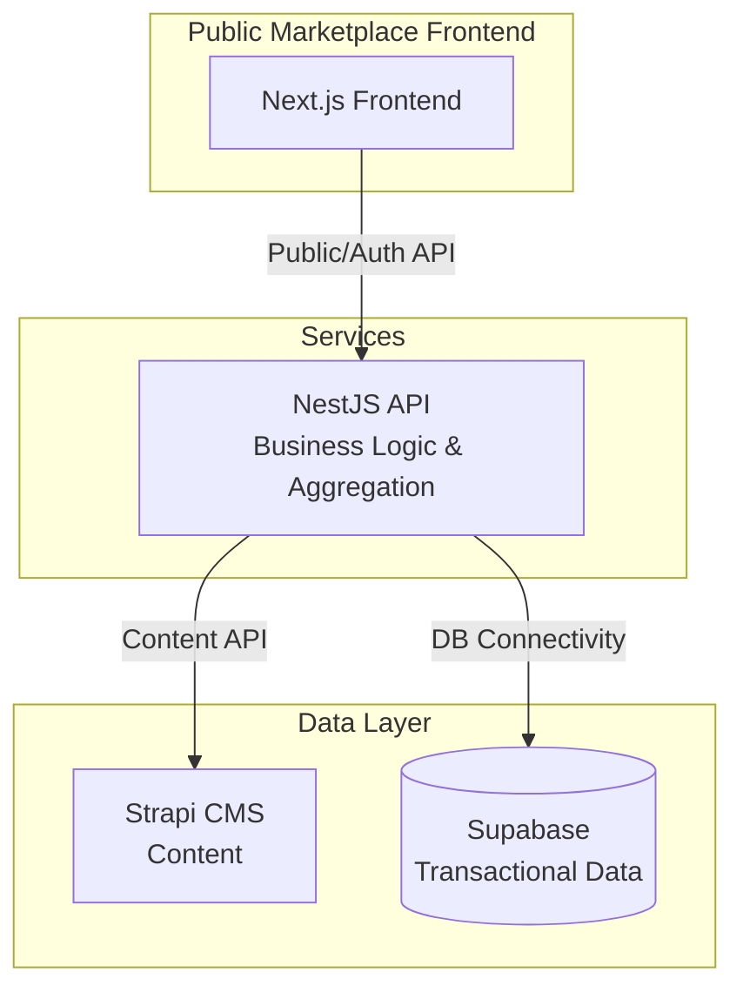

# Marketplace Architecture Plan

## Current Context

Your existing platform:

- **Frontend**: React 19 + TypeScript (Vite) - Single Page Application
- **Backend**: Supabase (PostgreSQL + Auth + Storage + Edge Functions)
- **Multi-tenant**: Organizations → Farms → Parcels hierarchy
- **Additional Services**: NestJS API, FastAPI satellite service

## Recommended Architecture: Hybrid Approach

For a **public marketplace with critical SEO** requirements, use a **hybrid architecture** that separates concerns while leveraging your existing infrastructure.

### Architecture Overview

**Golden Rule:** No direct connection from Frontend to Strapi or Supabase. All traffic flows through NestJS API.



### Updated Integration Pattern

1. **Frontend (Next.js)**
   - Only talks to `https://api.agritech.com` (NestJS).
   - No `@supabase/ssr` or direct `strapi-sdk` for data fetching in client components.
   - Server Components in Next.js *could* theoretically talk to DB securely, but to strictly follow the rule, they should also call the NestJS API.

2. **Backend (NestJS)**
   - **MarketplaceModule**: Handles all marketplace logic.
   - **StrapiService**: Internal service to fetch content from Strapi.
   - **Supabase Integration**: Uses existing Prisma/TypeORM/Supabase client to query `marketplace_listings`.
   - **Endpoints**:
     - `GET /marketplace/products`: Aggregates DB data + Strapi content.
     - `GET /marketplace/dashboard`: Aggregates stats.

## Recommended Solution: Option A (Recommended)

### 1. Separate Public Marketplace Frontend (Next.js)

**Why Next.js:**

- **Server-Side Rendering (SSR)** for dynamic product pages
- **Static Site Generation (SSG)** for category pages, blog
- **Incremental Static Regeneration (ISR)** for product listings
- Built-in SEO optimization (meta tags, sitemaps, robots.txt)
- API routes for server-side logic

**Structure:**

```
marketplace-frontend/          # New Next.js app
├── app/
│   ├── (public)/             # Public routes (no auth)
│   │   ├── products/         # Product listings (SSG)
│   │   ├── categories/       # Category pages (SSG)
│   │   ├── sellers/          # Seller profiles (SSR)
│   │   └── search/           # Search results (SSR)
│   ├── (auth)/               # Protected routes
│   │   ├── dashboard/        # Seller dashboard
│   │   ├── orders/           # Order management
│   │   └── listings/         # Manage products
│   └── api/                  # Next.js API routes
├── components/
├── lib/
│   ├── supabase/            # Supabase client (public + auth)
│   └── strapi/              # Strapi client
└── public/
```

### 2. Strapi CMS for Content Management

**Why Strapi:**

- **Content Management**: Product descriptions, categories, blog posts
- **SEO Metadata**: Title tags, meta descriptions, Open Graph
- **Media Management**: Product images, galleries
- **Content Versioning**: Draft/publish workflow
- **Multi-language**: i18n support (EN, FR, AR)
- **Admin UI**: Non-technical users can manage content

**Strapi Content Types:**

- **Product Content** (descriptions, SEO, images)
- **Category Content** (descriptions, SEO)
- **Blog Posts** (marketing content)
- **Seller Profiles** (public-facing info)
- **Landing Pages** (marketing pages)

**Integration Pattern:**

- Strapi stores **content** (descriptions, SEO, images)
- Supabase stores **transactional data** (inventory, prices, orders)
- Link via `product_id` or `listing_id`

### 3. Supabase for Transactional Data

**Extend existing schema with marketplace tables:**

```sql
-- Marketplace tables in Supabase
CREATE TABLE marketplace_listings (
  id UUID PRIMARY KEY,
  organization_id UUID REFERENCES organizations(id),
  product_id UUID,  -- Links to Strapi content
  title TEXT,
  price NUMERIC,
  quantity_available NUMERIC,
  status TEXT,  -- 'draft', 'active', 'sold_out', 'archived'
  is_public BOOLEAN DEFAULT true,
  created_at TIMESTAMPTZ,
  -- ... other fields
);

CREATE TABLE marketplace_orders (
  id UUID PRIMARY KEY,
  buyer_organization_id UUID,
  seller_organization_id UUID,
  listing_id UUID,
  status TEXT,
  total_amount NUMERIC,
  -- ... other fields
);

-- Public RLS policy for listings
CREATE POLICY "Public can view active listings"
ON marketplace_listings
FOR SELECT
USING (is_public = true AND status = 'active');
```

### 4. Integration Architecture

**Data Flow:**

1. **Product Creation Flow:**
   ```
   Seller (React App) → NestJS API → Supabase (listing data)
                                    → Strapi (content via API)
   ```

2. **Public Product Display:**
   ```
   Visitor → Next.js (SSR/SSG) → Supabase (pricing, availability)
                                → Strapi (descriptions, images, SEO)
   ```

3. **Order Processing:**
   ```
   Buyer → Next.js → Supabase (create order)
                   → Edge Function (notify seller)
                   → NestJS API (update inventory)
   ```


## Alternative: Option B (Simpler, Less SEO-Friendly)

If SEO is less critical or you want to minimize infrastructure:

### Single React App with Public Routes

- **Same React app** with public routes (no auth required)
- **Supabase public RLS policies** for listings
- **Strapi optional** (only if content management needed)
- **SEO limitations**: Client-side rendering, limited SEO

**Trade-offs:**

- ✅ Simpler architecture
- ✅ Single codebase
- ❌ Poor SEO (client-side rendering)
- ❌ Slower initial load for public pages
- ❌ Limited social media previews

## Implementation Plan

### Phase 1: Database Schema Extension

**Files to modify:**

- `project/supabase/migrations/00000000000000_schema.sql` - Add marketplace tables
- Create new migration: `project/supabase/migrations/YYYYMMDD_marketplace.sql`

**Tables to create:**

- `marketplace_listings` - Product listings
- `marketplace_orders` - Orders
- `marketplace_order_items` - Order line items
- `marketplace_reviews` - Product/seller reviews
- `marketplace_categories` - Product categories (or use Strapi)

### Phase 2: Strapi Setup (if using Option A)

**New directory:**

```
strapi-cms/
├── config/
├── src/
│   ├── api/
│   │   ├── product-content/
│   │   ├── category-content/
│   │   └── blog-post/
│   └── components/
└── package.json
```

**Strapi Content Types:**

- Product Content (title, description, images, SEO fields)
- Category Content (name, description, SEO)
- Seller Profile Content (bio, images, SEO)

### Phase 3: Next.js Marketplace Frontend

**New directory:**

```
marketplace-frontend/
├── app/
│   ├── (public)/
│   │   ├── page.tsx              # Homepage (SSG)
│   │   ├── products/
│   │   │   ├── page.tsx          # Product list (ISR)
│   │   │   └── [slug]/
│   │   │       └── page.tsx      # Product detail (SSR)
│   │   ├── categories/
│   │   │   └── [slug]/
│   │   │       └── page.tsx      # Category page (SSG)
│   │   └── sellers/
│   │       └── [id]/
│   │           └── page.tsx      # Seller profile (SSR)
│   ├── (auth)/
│   │   ├── dashboard/
│   │   │   └── page.tsx          # Seller dashboard
│   │   └── listings/
│   │       └── page.tsx          # Manage listings
│   └── api/
│       ├── search/
│       │   └── route.ts          # Search API
│       └── webhooks/
│           └── route.ts          # Strapi webhooks
├── lib/
│   ├── supabase/
│   │   ├── client.ts             # Public Supabase client
│   │   └── server.ts             # Server-side client
│   └── strapi/
│       └── client.ts             # Strapi API client
└── components/
    ├── ProductCard.tsx
    ├── ProductList.tsx
    └── SearchBar.tsx
```

### Phase 4: Integration with Existing Platform

**Modify existing React app:**

- Add "Marketplace" section in navigation
- Seller dashboard for managing listings
- Link marketplace orders to existing accounting system

**Files to modify:**

- `project/src/routes/` - Add marketplace routes
- `agritech-api/src/modules/` - Add marketplace module
- `project/src/lib/api/` - Add marketplace API client

## Key Decisions

### 1. Authentication Strategy

**Option A: Shared Auth (Recommended)**

- Both apps use Supabase Auth
- Same user accounts across platforms
- JWT tokens work in both apps

**Option B: Separate Auth**

- Marketplace has its own auth
- More complex user management
- Not recommended

### 2. Data Synchronization

**Strapi ↔ Supabase Sync:**

- **Option A**: Webhook-based (Strapi → Supabase on publish)
- **Option B**: Polling (Next.js checks for updates)
- **Option C**: Direct Strapi API calls from Supabase Edge Functions

**Recommendation**: Webhook-based for real-time updates

### 3. Search Implementation

**Options:**

- **Supabase Full-Text Search**: Simple, built-in
- **PostgreSQL Trigram**: Better fuzzy search
- **External Service** (Algolia, Meilisearch): Best UX, additional cost

**Recommendation**: Start with Supabase full-text, upgrade if needed

## File Structure Summary

```
agritech/
├── project/                    # Existing React app (farm management)
├── agritech-api/               # Existing NestJS API
├── marketplace-frontend/        # NEW: Next.js marketplace (public)
├── strapi-cms/                  # NEW: Strapi CMS (content)
└── project/supabase/
    └── migrations/
        └── YYYYMMDD_marketplace.sql  # NEW: Marketplace schema
```

## SEO Implementation

### Next.js SEO Features

1. **Metadata API:**
```typescript
// app/products/[slug]/page.tsx
export async function generateMetadata({ params }): Promise<Metadata> {
  const product = await getProduct(params.slug);
  return {
    title: product.title,
    description: product.description,
    openGraph: {
      images: [product.image],
    },
  };
}
```

2. **Sitemap Generation:**
```typescript
// app/sitemap.ts
export default async function sitemap() {
  const products = await getPublicProducts();
  return products.map(product => ({
    url: `https://marketplace.agritech.com/products/${product.slug}`,
    lastModified: product.updated_at,
  }));
}
```

3. **Structured Data (JSON-LD):**
```typescript
// Product schema for Google
{
  "@context": "https://schema.org/",
  "@type": "Product",
  "name": product.title,
  "offers": {
    "@type": "Offer",
    "price": product.price,
  }
}
```


## Cost Considerations

### Option A (Recommended)

- **Next.js**: Free (Vercel hosting or self-hosted)
- **Strapi**: Free (self-hosted) or Strapi Cloud ($99/mo)
- **Supabase**: Existing costs + additional storage/bandwidth
- **Total**: ~$0-100/mo additional

### Option B (Simpler)

- **React App**: Existing costs
- **Strapi**: Optional
- **Supabase**: Existing costs + additional storage
- **Total**: ~$0-50/mo additional

## Recommendation

**Choose Option A (Next.js + Strapi + Supabase)** because:

1. ✅ **Critical SEO requirements** met with SSR/SSG
2. ✅ **Separation of concerns** (content vs. transactional data)
3. ✅ **Scalable architecture** (can handle growth)
4. ✅ **Content management** for non-technical users
5. ✅ **Reuses existing Supabase infrastructure**
6. ✅ **Future-proof** (easy to add features)

**Start with:**

1. Extend Supabase schema with marketplace tables
2. Set up Strapi for content management
3. Build Next.js marketplace frontend
4. Integrate with existing React app for seller dashboard